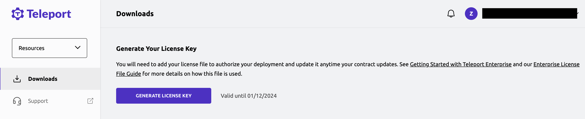

The Teleport Auth Service reads a license file to authenticate your Teleport
Enterprise account.

To obtain your license file navigate to your site and login.
You can start at [teleport.sh](https://teleport.sh) and enter your
Teleport Account name (e.g. my-license). After logging in
you will see the "DOWNLOAD LICENSE KEY" button to download the license file.

