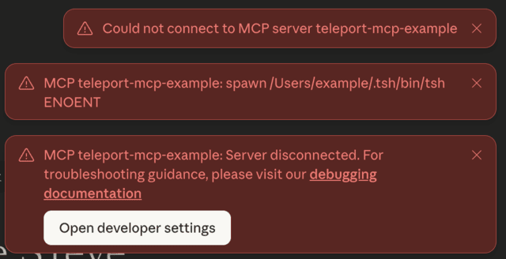

When starting your MCP client, you might see an error such as `spawn <tsh-path>
ENOENT` or `command not found`:



This error indicates the path to the `tsh` binary is misconfigured in the
client’s settings. To fix it, re-run the `tsh mcp config` command to update the
path, or manually correct it in the client’s configuration file. See [connect
MCP clients](../../connect-your-client/model-context-protocol/mcp-access.mdx)
for more details.

This issue can also occur due to a bug from the managed update feature, which
has been fixed in version 18.2.3. If your Teleport cluster has managed update
enabled for tools, check your `tsh` version by:
```code
$ tsh version
Teleport v18.2.3 git:v18.2.3-0-xxxxxxxx go1.24.7
Proxy version: 18.2.0
Proxy: teleport.example.com:443
Re-executed from version: 18.2.0
```

The first line shows the version of the `tsh` binary from the managed update,
and the last line shows the version from your original installation. Both
versions must be at least `18.2.3` to fully resolve this issue.

If the version shown on the first line is outdated, contact your Teleport
administrator to raise the version for tools update. If the version shown in the
"Re-executed from version" is outdated, find the `tsh` binary from your original
installation (e.g. `which tsh`), uninstall it and install a newer release.

Once `tsh` has been updated, re-run the `tsh mcp config` commands to reconfigure
your MCP client.
