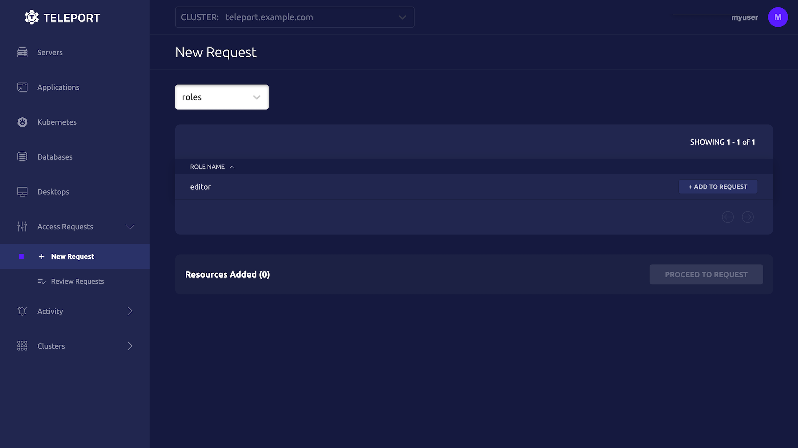

<Tabs>
<TabItem label="As an Admin">
  A Teleport admin can create an Access Request for another user with `tctl`:

  ```code
  $ tctl request create myuser --roles=editor
  ```

</TabItem>
<TabItem label="As a User">

  Users can use `tsh` to create an Access Request and log in with approved roles:
  ```code
  $ tsh request create --roles=editor
  Seeking request approval... (id: 8f77d2d1-2bbf-4031-a300-58926237a807)
  ```

</TabItem>
<TabItem label="From the Web UI">

  Users can request access using the Web UI by visiting "Identity", clicking "Access Requests" and then "New Request":

  

</TabItem>
</Tabs>
