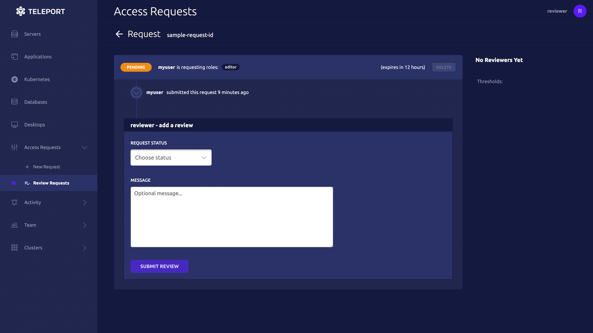

Once you receive an Access Request message, click the link to visit Teleport and
approve or deny the request:



<details>
<summary>Reviewing from the command line</summary>

You can also review an Access Request from the command line:

<Tabs>
<TabItem label="As an Admin">
  ```code
  # Replace REQUEST_ID with the id of the request
  $ tctl request approve REQUEST_ID
  $ tctl request deny REQUEST_ID
  ```
</TabItem>
<TabItem label="As a User">
  ```code
  # Replace REQUEST_ID with the id of the request
  $ tsh request review --approve REQUEST_ID
  $ tsh request review --deny REQUEST_ID
  ```
</TabItem>
</Tabs>

</details>
