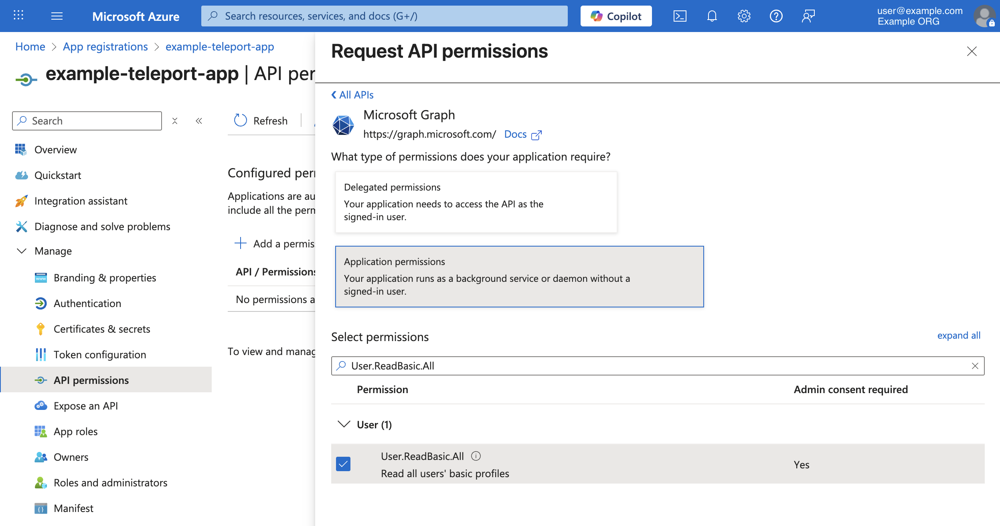

To query user's group membership, Teleport requires `User.ReadBasic.All` permission.
To grant this permission, in the "App registrations" UI for the enterprise 
application, from the "Manage" menu, select "API permissions".

Next, click `+ Add a permission` button and then select "Microsoft APIs > Microsoft Graph >
Application permissions". In the permission filter search bar, type `User.ReadBasic.All`.

Select the permission and add it to the application by clicking on the `Add permissions` button.

Once you add the permission, you will need to grant an admin consent.

In the same "API permissions" UI, click the `Grant admin consent` button.

A consent confirmation prompt will appear, click "Yes" to grant the consent. 
