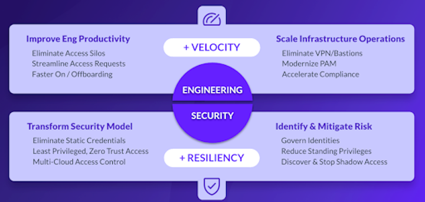
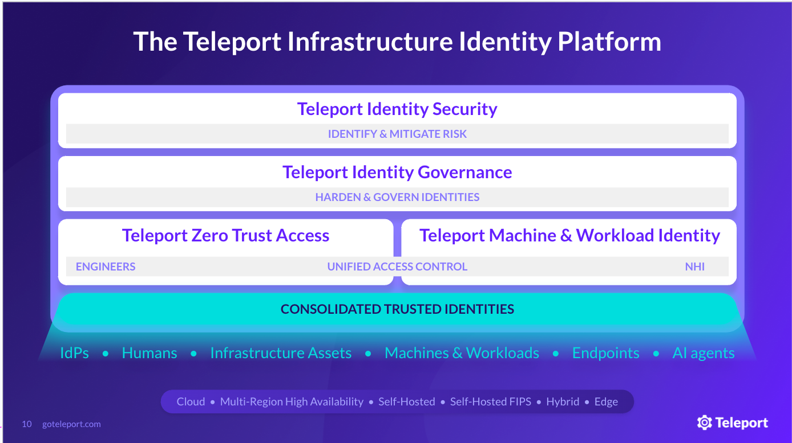

Teleport is the easiest, most secure way to access and protect all your infrastructure.

The Teleport Infrastructure Identity Platform modernizes identity, access, and policy for infrastructure, for both human and non-human identities, 
improving engineering velocity and resiliency of critical infrastructure against human factors and/or compromise. 
Teleport is purpose-built for infrastructure use cases and implements trusted computing at scale, with unified 
cryptographic identities for humans, machines and workloads, endpoints, infrastructure assets, and AI agents. 

Our identity-everywhere approach vertically integrates access management, zero trust networking, identity governance, 
and identity security into a single platform, eliminating overhead and operational silos. 
Teleport improves the velocity of engineering teams, improving engineering productivity, scaling infrastructure operations, 
and protecting time to market. 

## Use cases and benefits

## Products

The **Teleport** Infrastructure Identity **Platform** consists of four products:

- **Teleport Zero Trust Access** provides engineers with just-in-time, least-privileged access 
to applications, servers, databases, Kubernetes clusters, and other resources across distributed infrastructures, improving engineering time to market and strengthening infrastructure resiliency.
- **Teleport Machine & Workload Identity**  provides identity management and access control of 
non-human identities, improving infrastructure resiliency by securing system and data access between machines and workloads.   
- **Teleport Identity Governance** hardens and monitors identities for both human and non-human identities, improving resiliency of infrastructure from compromise due to human factor or identity attacks.
- **Teleport Identity Security** secures identities and access policies across all of your infrastructure. Eliminates shadow access and blind spots.

### Teleport Zero Trust Access

Teleport Zero Trust Access provides engineers with just-in-time, least-privileged access to applications, servers, databases, Kubernetes clusters, and other resources across distributed 
infrastructures, improving engineering time to market and strengthening  infrastructure resiliency.

Built on a foundation of cryptographic identity and purpose-built for infrastructure, Teleport Zero Trust Access transforms security models 
by eliminating static credentials, enforcing granular access policies, leveraging short-lived certificates for ephemeral authorization, and 
enforcing zero trust principles.

Get started with Teleport Zero Trust Access:

- [Enroll resources](enroll-resources/agents/introduction.mdx) to protect with Teleport using
  cryptographic identity.
- [Set up passwordless authentication](admin-guides/access-controls/guides/passwordless.mdx)
  to enable users to access resources with hardware keys, including biometric
  credentials like Touch ID and YubiKey Bio.
- [Integrate your Single Sign-On provider](admin-guides/access-controls/sso/sso.mdx): Allow users
  to access infrastructure resources with IdPs like Okta.
- [Use Teleport as an identity provider](admin-guides/access-controls/idps/saml-guide.mdx) to
  authenticate to external services.

### Teleport Machine & Workload Identity

Teleport Machine & Workload Identity is a solution for non-human identity management and access control, 
improving infrastructure resiliency by securing system and data access between machines and workloads. 
As part  of Teleport's Infrastructure Identity Platform, Teleport Machine & Workload Identity is purpose-built 
for infrastructure and is part of a unified access control strategy for both human and non-human identities.

Get started with Teleport Machine & Workload Identity:

- [Issue and govern identities for automated systems](enroll-resources/machine-id/introduction.mdx) using Teleport Machine Identity.
- Replace long-lived API keys and environment secrets that are vulnerable to breaches, mistakes, and exfiltration with short-lived cryptographic identities using x.509 certificates or JWTs via Teleport Workload Identity.

### Teleport Identity Governance

Teleport Identity Governance hardens and monitors identities for both human and non-human identities, improving resiliency of infrastructure from compromise due to human factor or identity attacks.

Teleport Identity Governance is tightly coupled with Teleport Zero Trust Access and Teleport Machine & Workload Identity, providing companies with a unified governance strategy that improves security posture and is tightly coupled with access control.

Get started with Teleport Identity Governance:

- [Access Requests](admin-guides/access-controls/access-requests/access-requests.mdx): Temporarily
  provision minimal privileges to complete a task.
- [Access Lists](admin-guides/access-controls/access-lists/access-lists.mdx): Regularly audit and
  control membership to specific roles and traits, which then tie easily back
  into Teleport's existing RBAC system.
- [Device Trust](admin-guides/access-controls/device-trust/device-trust.mdx): Require an up-to-date,
  registered device for each authentication by giving every device a
  cryptographic identity. 
- [Session & Identity Locks](admin-guides/access-controls/guides/locking.mdx): Lock
  suspicious or compromised identities and stop all their activity across all
  protocols and services.
- [Access Monitoring](admin-guides/access-controls/access-monitoring.mdx): Detect overly
  broad privileges and inspect sessions that are not using strong protection,
  such as multi-factor authentication and Device Trust.

### Teleport Identity Security

**Teleport Identity Security** secures identities and access policies across all of your infrastructure.  It detects standing privileges and eliminates shadow access and blind spots. 

- Get started with [Teleport Identity Security](admin-guides/teleport-policy/teleport-policy.mdx).
- Define [Crown Jewels](admin-guides/teleport-policy/crown-jewels.mdx) so you can track changes to your most sensitive users and resources.
- Enable [Teleport Identity Security integrations](admin-guides/teleport-policy/integrations/integrations.mdx) so you can identify [insecure SSH key distributions](admin-guides/teleport-policy/integrations/ssh-keys-scan.mdx), and import RBAC rules from AWS, Entra ID, and other sources to visualize your entire RBAC configuration on a single screen. 

## Architecture

The Teleport Infrastructure Identity Platform consists of a certificate authority and
identity-aware access proxy that run either on the Teleport-managed cloud or, in
special cases, a self-hosted private network. 

Teleport Agents, which can run on Linux servers or Kubernetes, proxy access to
infrastructure resources and cloud provider APIs. Users authenticate to
infrastructure resources through Teleport Agents using short-lived certificates.
Teleport Agents enforce role-based access controls by using certificates that embed user attributes.

Learn more:

- [Teleport Core Concepts](./core-concepts.mdx)
- [Architecture Guides](./reference/architecture/architecture.mdx)
