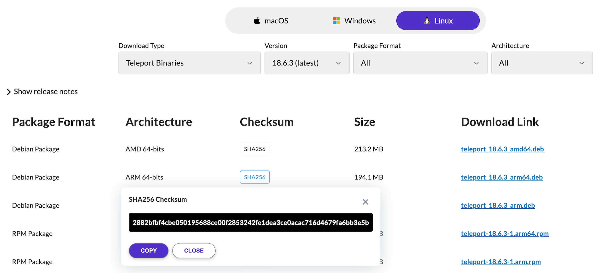

This guide shows you how to install Teleport binaries on your platform,
including:
- `teleport`
- `tsh`
- `tctl`
- `tbot`

If you are new to Teleport, we recommend following our [getting started
guide](./index.mdx).

For best results, Teleport clients (`tsh`, `tctl`, `tbot`) should be the same major
version as the cluster they are connecting to. Teleport servers are compatible
with clients that are on the same major version or one major version older.
Teleport servers do not support clients that are on a newer major version.

See our [Upgrading](./upgrading.mdx) guide for more information.


## Operating system support

Teleport is officially supported on the platforms listed below. It is worth
noting that the open-source community has been successful in building and
running Teleport on UNIX variants other than Linux \[1].

| Operating System | `teleport` Daemon | `tctl` Admin Tool | `tsh` and Teleport Connect User Clients [2] | Web UI (via the browser) | `tbot` Daemon |
| - | - | - | - | - | - |
| Linux v2.6.23+ (RHEL/CentOS 7+, Amazon Linux 2+, Amazon Linux 2023+, Ubuntu 16.04+, Debian 9+, SLES 12 SP 5+, and SLES 15 SP 5+) \[3] | yes | yes | yes | yes | yes |
| macOS v10.13+  (High Sierra)| yes | yes | yes | yes | yes |
| Windows 10+ (rev. 1607) \[4] | no | no | yes | yes | no |

\[1] *Teleport is written in Go and many of these system requirements are due to the requirements
of the [Go toolchain](https://github.com/golang/go/wiki/MinimumRequirements)*.

\[2] *`tsh` is a Command Line Client (CLI) and Teleport Connect is a Graphical User Interface (GUI) desktop client. See
  [Using Teleport Connect](connect-your-client/teleport-connect.mdx) for usage and installation*.

\[3] *Enhanced Session Recording requires Linux kernel v5.8+*.

\[4] *Teleport server does not run on Windows yet, but `tsh` and Teleport Connect (the Teleport desktop clients)
supports most features on Windows 10 and later.*

## Linux

This section shows you how to install Teleport binaries on a single Linux
server.

Teleport maintains DEB and RPM package repositories for different operating
systems, platforms, and Teleport versions. A server that installs Teleport from
a DEB or RPM package must have systemd installed. You can also download TAR
archives containing Teleport binaries. All installations include `teleport`,
`tsh`, `tctl`, and `tbot`.

### Recommended installation steps

If you are starting out with Teleport, we recommend beginning with a [Teleport
Cloud](https://goteleport.com/signup/) account. From there, the only Teleport
components you need to deploy yourself are Teleport agents. You can deploy
agents by:
- Following the instructions in the Teleport Web UI at `/web/discover`, where
  you can select a resource to enroll in your Teleport cluster and retrieve an
  installation script to run on Linux hosts.
- Using the example Terraform module for deploying agents in [Deploy Agents with
  Terraform](agents/deploy-agents-terraform.mdx).
- Running the [one-line installation script](#one-line-installation-script) on
  each Linux server where you want to install a Teleport agent.

If you are running a self-hosted Teleport Enterprise cluster, read our guidance
in [Deploying a High-Availability Teleport
Cluster](./deploy-a-cluster/introduction.mdx), which provides full requirements
and Terraform modules for deploying Teleport Enterprise on your infrastructure.

Self-hosted Teleport Enterprise clusters require a license file. Read [Teleport
Enterprise License File](./choose-an-edition/teleport-enterprise/license.mdx)
for how to manage this.

### One-line installation script

You can run a one-line command to install Teleport binaries on a Linux server.
The command takes the Teleport version and edition to install, then uses
information about the operating system where it runs to choose a package manager
and install Teleport.

First, assign environment variables based on your edition:

<Tabs>
<TabItem label="Teleport Community Edition">

```code
$ TELEPORT_EDITION="oss"
$ TELEPORT_VERSION="(=teleport.version=)"
```

</TabItem>
<TabItem label="Teleport Cloud">

The following commands show you how to determine the Teleport version to install
by querying your Teleport Cloud account. This way, the Teleport installation has
the same major version as the service that manages automatic updates:

```code
$ TELEPORT_EDITION="cloud"
$ TELEPORT_DOMAIN=<Var name="example.teleport.sh" />
$ TELEPORT_VERSION="$(curl https://$TELEPORT_DOMAIN/v1/webapi/automaticupgrades/channel/stable/cloud/version | sed 's/v//')"
```

</TabItem>
<TabItem label="Teleport Enterprise">

```code
$ TELEPORT_EDITION="enterprise"
$ TELEPORT_VERSION="(=teleport.version=)"
```

</TabItem>
</Tabs>

Download and run the installation script on the server where you want to install
Teleport:

```code
$ curl https://goteleport.com/static/install.sh | bash -s ${TELEPORT_VERSION?} ${TELEPORT_EDITION?} 
```

### Package repositories

The [one-line installation script](#one-line-installation-script) automatically
detects a package manager on the local system and uses it to install Teleport
from an upstream repository.

If your system does not support the one-line installation script, read the
instructions in this section for instructions on working with Teleport package
repositories.

1. Assign the following environment variables in the terminal where you will run
   Teleport installation commands, indicating the package and version to
   install:

   <Tabs>
   <TabItem label="Teleport Community Edition">
   
   ```code
   $ export TELEPORT_PKG=teleport
   $ export TELEPORT_VERSION=v(=teleport.major_version=)
   $ export TELEPORT_CHANNEL=stable/${TELEPORT_VERSION?}
   ```
   
   </TabItem>
   <TabItem label="Teleport Cloud">
   
   Teleport Cloud installations must include the automatic agent updater. The
   following commands show you how to determine the Teleport version to install
   by querying your Teleport Cloud account. This way, the Teleport installation
   has the same major version as the service that conducts automatic updates:
   
   ```code
   $ export TELEPORT_DOMAIN=<Var name="example.teleport.com" />
   $ export TELEPORT_VERSION="$(curl https://$TELEPORT_DOMAIN/v1/webapi/automaticupgrades/channel/stable/cloud/version | sed 's/v//')"
   $ export TELEPORT_PKG="teleport-ent-${TELEPORT_VERSION?} teleport-ent-updater"
   $ export TELEPORT_CHANNEL=stable/cloud
   ```

   If you are installing Teleport on Debian or Ubuntu, `TELEPORT_PKG` is
   slightly different:

   ```code
   $ export TELEPORT_PKG="teleport-ent=${TELEPORT_VERSION?} teleport-ent-updater"
   ```

   </TabItem>
   <TabItem label="Teleport Enterprise (Self-Hosted)">
   
   ```code
   $ export TELEPORT_PKG=teleport-ent
   $ export TELEPORT_VERSION=v(=teleport.major_version=)
   $ export TELEPORT_CHANNEL=stable/${TELEPORT_VERSION?}
   ```
   
   For FedRAMP/FIPS-compliant installations, install the `teleport-ent-fips` package instead:
   
   ```code
   $ export TELEPORT_PKG=teleport-ent-fips
   ```
   
   </TabItem>
   </Tabs>

1. Teleport maintains DEB and RPM package repositories for different Linux
   distributions based on variables defined in `/etc/os-release` on Linux
   systems. Source this file to define the variables:

   ```code
   $ source /etc/os-release
   ```

   <Details title="Supported distribution IDs">

   The Teleport DEB and RPM repositories don't expose packages for all
   distribution variants. When installing Teleport using RPM repositories, you
   may need to replace the `ID` variable set in `/etc/os-release` with `ID_LIKE`
   to install packages of the closest supported distribution.
   
   Currently supported distributions (and `ID` values) are:
   
   | Distribution | Version              | `ID` value in `/etc/os-release` |
   |--------------|----------------------|---------------------------------|
   | Amazon Linux | 2 and 2023           | `amzn`                          |
   | CentOS       | >= 7                 | `centos`                        |
   | Debian       | >= 9                 | `debian`                        |
   | RHEL         | >= 7                 | `rhel`                          |
   | SLES         | >= 12 SP5, >= 15 SP5 | `sles`                          |
   | Ubuntu       | >= 16.04             | `ubuntu`                        |
   
   Note that [Enhanced Session
   Recording](./server-access/guides/bpf-session-recording.mdx) requires Linux
   kernel version 5.8+. This means that it requires more recent OS versions than
   other Teleport features:
   
   | Distribution | Version                  |
   |--------------|--------------------------|
   | Amazon Linux | 2 (post 11/2021), 2023   |
   | CentOS/RHEL  | 9+                       |
   | Debian       | 11, or 10 with backports |
   | Ubuntu       | 20.042+                  |

   </Details>

1. Follow the instructions for your package manager:

   <Tabs>
   <TabItem label="apt">
   
   ```code
   # Download the Teleport PGP public key
   $ sudo curl https://apt.releases.teleport.dev/gpg \
   -o /usr/share/keyrings/teleport-archive-keyring.asc
   # Add the Teleport APT repository. You'll need to update this file for each
   # major release of Teleport.
   $ echo "deb [signed-by=/usr/share/keyrings/teleport-archive-keyring.asc] \
   https://apt.releases.teleport.dev/${ID?} ${VERSION_CODENAME?} \
   ${TELEPORT_CHANNEL?}" \
   | sudo tee /etc/apt/sources.list.d/teleport.list > /dev/null
   
   $ sudo apt-get update
   $ sudo apt-get install ${TELEPORT_PKG?}
   ```
   
   </TabItem>
   
   <TabItem label="yum">
   
   ```code
   # Add the Teleport YUM repository. You'll need to update this file for each
   # major release of Teleport.
   # First, get the major version from $VERSION_ID so this fetches the correct
   # package version.
   $ VERSION_ID=$(echo $VERSION_ID | grep -Eo "^[0-9]+")
   $ sudo yum install -y yum-utils
   $ sudo yum-config-manager --add-repo "$(rpm --eval "https://yum.releases.teleport.dev/$ID/$VERSION_ID/Teleport/%{_arch}/${TELEPORT_CHANNEL?}/teleport.repo")"
   $ sudo yum install ${TELEPORT_PKG?}
   #
   # Tip: Add /usr/local/bin to path used by sudo (so 'sudo tctl users add' will work as per the docs)
   # echo "Defaults    secure_path = /sbin:/bin:/usr/sbin:/usr/bin:/usr/local/bin" > /etc/sudoers.d/secure_path
   ```
   
   </TabItem>
   
   <TabItem label="zypper">
   
   ```code
   # Add the Teleport Zypper repository. You'll need to update this file for each
   # major release of Teleport.
   # First, get the OS major version from $VERSION_ID so this fetches the correct
   # package version.
   $ VERSION_ID=$(echo $VERSION_ID | grep -Eo "^[0-9]+")
   # Use zypper to add the teleport RPM repo
   $ sudo zypper addrepo --refresh --repo $(rpm --eval "https://zypper.releases.teleport.dev/$ID/$VERSION_ID/Teleport/%{_arch}/${TELEPORT_CHANNEL?}/teleport-zypper.repo")
   $ sudo zypper --gpg-auto-import-keys refresh teleport
   $ sudo zypper install ${TELEPORT_PKG?}
   #
   # Tip: Add /usr/local/bin to path used by sudo (so 'sudo tctl users add' will work as per the docs)
   # echo "Defaults    secure_path = /sbin:/bin:/usr/sbin:/usr/bin:/usr/local/bin" > /etc/sudoers.d/secure_path
   ```
   
   </TabItem>
   
   <TabItem label="dnf">
   
   ```code
   # Add the Teleport YUM repository for v(=teleport.major_version=). You'll need to update this
   # file for each major release of Teleport.
   # First, get the major version from $VERSION_ID so this fetches the correct
   # package version.
   $ VERSION_ID=$(echo $VERSION_ID | grep -Eo "^[0-9]+")
   # Install dnf config-manager
   $ sudo yum install -y yum-utils
   # Use the dnf config manager plugin to add the teleport RPM repo
   $ sudo dnf config-manager --add-repo "$(rpm --eval "https://yum.releases.teleport.dev/$ID/$VERSION_ID/Teleport/%{_arch}/${TELEPORT_CHANNEL?}/teleport.repo")"
   
   # Install teleport
   $ sudo dnf install ${TELEPORT_PKG}
   
   # Tip: Add /usr/local/bin to path used by sudo (so 'sudo tctl users add' will work as per the docs)
   # echo "Defaults    secure_path = /sbin:/bin:/usr/sbin:/usr/bin:/usr/local/bin" > /etc/sudoers.d/secure_path
   ```
   
   </TabItem>
   </Tabs>

### TAR archives (self-hosted only)

For self-hosted deployments, Teleport maintains TAR archives for
Linux-compatible binaries at `https://cdn.teleport.dev`. This section explains
the Teleport TAR archives and how to use them.

It is not possible to install the automatic agent updater using TAR archives.
Teleport Cloud customers must use the [one-line installation
script](#one-line-installation-script) or manually install Teleport from a
[package repository](#package-repositories) in order to install the updater.

1. In your terminal, assign environment variables that you will use to download
   your intended archive.

   For Teleport Community Edition, the Teleport package is called `teleport`:

   ```code
   $ TELEPORT_PKG=teleport
   ```

   For self-hosted Teleport Enterprise deployments, the package is called
   `teleport-ent`:

   ```code
   $ TELEPORT_PKG=teleport-ent
   ```

1. Specify your system Teleport version and system architecture by assigning an
   environment variable:

   ```code
   $ TELEPORT_VERSION=(=teleport.version=)
   $ SYSTEM_ARCH=""
   ```

   The following architecture values are available:   

   - `amd64`
   - `arm64`
   - `arm`
   - `386`

1. Run the following commands to download the Teleport archive, unpack it, and
   install binaries:

   ```code
   $ curl https://cdn.teleport.dev/${TELEPORT_PKG?}-v${TELEPORT_VERSION?}-linux-${SYSTEM_ARCH?}-bin.tar.gz.sha256
   # <checksum> <filename>
   $ curl -O https://cdn.teleport.dev/${TELEPORT_PKG?}-v${TELEPORT_VERSION?}-linux-${SYSTEM_ARCH?}-bin.tar.gz
   $ shasum -a 256 ${TELEPORT_PKG?}-v${TELEPORT_VERSION?}-linux-${SYSTEM_ARCH?}-bin.tar.gz
   # Verify that the checksums match
   $ tar -xvf ${TELEPORT_PKG?}-v${TELEPORT_VERSION?}-linux-${SYSTEM_ARCH?}-bin.tar.gz
   $ cd ${TELEPORT_PKG?}
   $ sudo ./install
   ```

   For FedRAMP/FIPS-compliant installations of Teleport Enterprise, package URLs
   are slightly different:

   ```code
   $ curl https://cdn.teleport.dev/teleport-ent-v${TELEPORT_VERSION?}-linux-${SYSTEM_ARCH?}-fips-bin.tar.gz.sha256
   # <checksum> <filename>
   $ curl -O https://cdn.teleport.dev/teleport-ent-v${TELEPORT_VERSION?}-linux-${SYSTEM_ARCH?}-fips-bin.tar.gz
   $ shasum -a 256 teleport-ent-v${TELEPORT_VERSION?}-linux-${SYSTEM_ARCH?}-fips-bin.tar.gz
   # Verify that the checksums match
   $ tar -xvf teleport-ent-v${TELEPORT_VERSION?}-linux-${SYSTEM_ARCH?}-fips-bin.tar.gz
   $ cd teleport-ent
   $ sudo ./install
   ```

### From your browser

For Teleport Community Edition, check the
[Downloads](https://goteleport.com/download/) page for the most up-to-date
information.

For Teleport Enterprise Cloud, check the [Cloud
Downloads](./choose-an-edition/teleport-cloud/downloads.mdx) page for the most
up-to-date information on obtaining Teleport binaries compatible with Teleport
Cloud.

## Docker

### Images

We provide a pre-built Docker image for every version of Teleport. This section
describes the available Docker images.

These images are hosted on [Amazon ECR
Public](https://gallery.ecr.aws/gravitational).

#### Image suffixes

For each of the image names listed in this section, you can specify attributes
of the image by appending a suffix to the repository name or tag.

Images with the `-distroless` suffix within the repository name include only the
`teleport` binary and its runtime dependencies, with no shell or utility
applications. An example is `public.ecr.aws/gravitational/teleport-distroless`
for Teleport Community Edition.

Images with the `*-distroless-debug` suffix within the repository name include a
Busybox shell and tool suite in addition to Teleport, and are intended for
troubleshooting deployments only. They are not intended for production use. An
example is `public.ecr.aws/gravitational/teleport-distroless-debug`.

`*-distroless` and `*-distroless-debug` images support multiple architectures
natively, and do not require (or support) image suffixes. You can specify an
architecture using the `--platform` flag of `docker pull` to pull the `arm`,
`arm64` or `amd64` version of an image.

#### Version tags

Images point to a static version of Teleport. Use the image's tag to specify
either:

- The major, minor, and patch version (e.g., `(=teleport.version=)` for the
  latest version of Teleport Community Edition).
- The major version only, which implies the latest minor and patch numbers for
  that major version. For example, `(=teleport.major_version=)` implies
  `(=teleport.version=)`.

<Tabs>
<TabItem label="Teleport Community Edition" scope={["oss"]}>

|Image name|Troubleshooting Tools?|Image base|
|-|-|-|
|`(=teleport.latest_oss_docker_image=)`|No|[Distroless Debian 12](https://github.com/GoogleContainerTools/distroless)|
|`(=teleport.latest_oss_debug_docker_image=)`|Yes|[Distroless Debian 12](https://github.com/GoogleContainerTools/distroless)|

For testing, we always recommend that you use the latest release version of
Teleport, which is currently `(=teleport.latest_oss_docker_image=)`.

</TabItem>
<TabItem label="Teleport Enterprise" scope={["enterprise"]}>

| Image name | Includes troubleshooting tools | Image base |
| - | - | - |
| `(=teleport.latest_ent_docker_image=)` | No | [Distroless Debian 12](https://github.com/GoogleContainerTools/distroless) |
| `(=teleport.latest_ent_debug_docker_image=)` | Yes | [Distroless Debian 12](https://github.com/GoogleContainerTools/distroless) |

We also provide the following images for FIPS builds of Teleport Enterprise:

| Image name | Includes troubleshooting tools | Image base |
| - | - | - |
| `public.ecr.aws/gravitational/teleport-ent-fips-distroless:(=teleport.version=)` | No | [Distroless Debian 12](https://github.com/GoogleContainerTools/distroless) |
| `public.ecr.aws/gravitational/teleport-ent-fips-distroless-debug:(=teleport.version=)` | Yes | [Distroless Debian 12](https://github.com/GoogleContainerTools/distroless) |

For testing, we always recommend that you use the latest release version of
Teleport Enterprise, which is currently `(=teleport.latest_ent_docker_image=)`.

</TabItem>
<TabItem label="Teleport Enterprise Cloud" scope={["team", "cloud"]}>

| Image name | Includes troubleshooting tools | Image base |
| - | - | - |
| `public.ecr.aws/gravitational/teleport-ent-distroless:(=cloud.version=)` | No | [Distroless Debian 12](https://github.com/GoogleContainerTools/distroless) |
| `public.ecr.aws/gravitational/teleport-ent-distroless-debug:(=cloud.version=)` | Yes | [Distroless Debian 12](https://github.com/GoogleContainerTools/distroless) |

For testing, we always recommend that you use the latest Cloud release version of
Teleport Enterprise, which is currently `public.ecr.aws/gravitational/teleport-ent-distroless:(=cloud.version=)`.

</TabItem>
</Tabs>

#### Interacting with distroless images

Since version 15, Teleport images are based on Google's [Distroless](https://github.com/GoogleContainerTools/distroless) images.
Those images don't contain any shell.

To execute Teleport commands on containers based on these images, run commands similar to the following:

```code
# in docker
$ docker run -i my-container tctl status

# in Kubernetes
$ kubectl exec -i my-pod -- tctl status

# sending local files via stdin
$ kubectl exec -i my-pod -- tctl create -f < my-local-file.yaml

# retrieving the teleport service config file from the configmap
$ kubectl get configmap teleport-cluster-auth -o jsonpath="{.data['teleport\.yaml']}"

# retrieving output via stdout and tar
$ kubectl exec -i my-pod -- tctl auth sign --user admin --format tls --ttl 10m --tar -o admin| tar xv -C local
$ ls -l local
total 24
-rw-------  1 trent  staff  1318 Jul 24 15:52 admin.cas
-rw-------  1 trent  staff  1895 Jul 24 15:52 admin.crt
-rw-------  1 trent  staff  1679 Jul 24 15:52 admin.key
```

Alternatively, you can use the debug variant of the image, which contains [busybox](https://www.busybox.net/about.html) and a minimal shell invocable via `busybox sh`:

```code
$ docker run -it --entrypoint="" (=teleport.latest_oss_debug_docker_image=) busybox sh
```

#### Machine ID (tbot)

We also provide a slimmed down distroless image that only contains the `tbot`
binary for use with Teleport Machine ID.

| Image name                                                               | FIPS Support | Image base                                                                 |
|--------------------------------------------------------------------------|--------------|----------------------------------------------------------------------------|
| `public.ecr.aws/gravitational/tbot-distroless:(=teleport.version=)`      | No           | [Distroless Debian 12](https://github.com/GoogleContainerTools/distroless) |
| `public.ecr.aws/gravitational/tbot-fips-distroless:(=teleport.version=)` | Yes          | [Distroless Debian 12](https://github.com/GoogleContainerTools/distroless) |

The version tagging follows the same pattern as the main `teleport-distroless`
image.

Whilst the `teleport-distroless` image also includes `tbot`, using the `tbot`
specific image should be preferred for Machine ID deployments. This image is
smaller, improving pull times, and has a smaller attack surface. In addition,
the image is customized in order to improve the experience of running `tbot` in a
container environment.

To learn more, read the
[Deploying Machine ID on Kubernetes](./machine-id/deployment/kubernetes.mdx)
guide.

### Running Teleport on Docker

When running a container from one of the images listed above, consider the
container equivalent to running the `teleport` binary. The Teleport container
requires access to a file system and network ports.

#### Configuration

Teleport processes read their configuration from a local file path, which is
`/etc/teleport.yaml` by default. Make sure this file path is mounted to your
Teleport container.

#### Data directory

All Teleport processes read from and write to a data directory, which by default
is `/var/lib/teleport`. Make sure the data directory is mounted to your Teleport
container.

#### License file

If your Teleport Enterprise container runs the Auth Service, you will need to
give it access to a license file at the path named in the configuration, which
is `/var/lib/teleport/license.pem` by default. Make sure a license exists at
this location in the Teleport container's data directory.

#### Other file paths

Depending on the configuration settings you assign on your Teleport container,
you will need to make sure that any file paths you name are mounted on the
container.

For example, if you are running the Teleport Proxy Service on a container, you
need to mount the directory containing TLS credentials to your Teleport
container, then assign the following fields in the container's configuration
file to the appropriate paths:

```yaml
proxy_service:
  https_keypairs:
  - key_file: /my/path/key.pem
    cert_file: /my/path/cert.pem
```

See the Teleport [Configuration Reference](reference/config.mdx) for whether a
field you would like to assign requires a file path.

#### Ports

A single Teleport process can run multiple services, each of which listens on a
specific set of ports depending on your configuration. See our [Networking
Reference](reference/networking.mdx#ports) for the ports on your Teleport
container to expose.

#### Extracting certificates from distroless images

Extracting certificates created with `tctl auth sign` from a container running
a distroless image can be tricky due to the absence of a shell and other OS tools.

Where possible you should log into the Teleport cluster using `tsh` and use
`tctl auth sign` locally to generate certificates. This way the action will be
logged against your Teleport user and be subject to all of the usual Teleport
RBAC policies in your cluster.

If this is not possible, use `tctl auth sign --tar` to collect all the files
generated by `tctl auth sign` into a `tar` archive, which is streamed directly
to `stdout`. The resulting certificates are never stored on the container
filesystem. You can either pipe this output directly to `tar`, or redirect it
to a local file for later use.

For example:

```code
$ docker exec ${TELEPORT_CONTAINER} \
  tctl auth sign --user alice --format tls -o alice.local --tar | tar xv
x alice.local.crt
x alice.local.key
x alice.local.cas
```

### Example of running a Teleport container

In this example, we will show you how to run the Teleport Auth Service and Proxy
Service on a local Docker container using Teleport Community Edition.

Since this container uses a self-signed certificate, we do not recommend using
this configuration to protect any infrastructure outside your workstation. You
can, however, join other local Docker containers to it using the [token
method](./agents/join-services-to-your-cluster/join-token.mdx).

First, create directories in your home directory to mount to the container. The
Teleport container will write its configuration and data to these directories:

```code
$ mkdir -p ~/teleport/config ~/teleport/data
```

Run `teleport configure` from the Teleport container to generate a configuration
file. This sets the container's name to `localhost` so your browser can trust
the Proxy Service's self-signed TLS certificate:

```code
$ docker run --hostname localhost --rm \
  --entrypoint=/usr/local/bin/teleport \
  <Var name="(=teleport.latest_oss_docker_image=)" /> configure --roles=proxy,auth > ~/teleport/config/teleport.yaml
```

Start Teleport on your container:

```code
$ docker run --hostname localhost --name teleport \
  -v ~/teleport/config:/etc/teleport \
  -v ~/teleport/data:/var/lib/teleport \
  -p 3025:3025 -p 3080:3080 \
  <Var name="(=teleport.latest_oss_docker_image=)" />
```

From there, open another terminal and make sure your Teleport container's web
API is functioning as intended:

```code
$ curl --insecure https://localhost:3080/webapi/ping
```

You should see JSON output similar to the following:

```json
{
  "auth": {
    "type": "local",
    "second_factor": "otp",
    "preferred_local_mfa": "otp",
    "local": {
      "name": ""
    },
    "private_key_policy": "none",
    "device_trust_disabled": true,
    "has_motd": false
  },
  "proxy": {
    "kube": {
      "enabled": true,
      "listen_addr": "0.0.0.0:3080"
    },
    "ssh": {
      "listen_addr": "0.0.0.0:3080",
      "tunnel_listen_addr": "0.0.0.0:3080",
      "web_listen_addr": "0.0.0.0:3080"
    },
    "db": {
      "postgres_listen_addr": "0.0.0.0:3080",
      "mysql_listen_addr": "0.0.0.0:3080"
    },
    "tls_routing_enabled": true
  },
  "server_version": "12.1.5",
  "min_client_version": "11.0.0",
  "cluster_name": "localhost",
  "automatic_upgrades": false
}
```

We are using the `--insecure` flag to trust Teleport's self-signed certificate.
In production, you will want to provision TLS credentials to the Proxy Service
from a trusted CA, e.g., Let's Encrypt.

### Upgrading Teleport on Docker

To upgrade a Teleport container running on Docker:

1. Leave the container's data directory in place.
1. Stop the container.
1. Run a new container with an image based on a newer Teleport version, mounting
   the data directory as you did while running the container initially. As long
   as the data directory contains the same content as before the upgrade, the
   Teleport container does not need to re-join the cluster.

## Amazon EC2

We provide pre-built `amd64` and `arm64` Amazon Linux 2023 based EC2 AMIs with
Teleport pre-installed.

These images are primarily intended for deploying a Teleport cluster using our
[reference Terraform code](https://github.com/gravitational/teleport/tree/branch/v(=teleport.major_version=)/examples/aws/terraform).

See the [AWS Single-Instance Deployment](deploy-a-cluster/deployments/aws-starter-cluster-terraform.mdx)
and the [Running Teleport Enterprise in High Availability mode on AWS using Terraform](deploy-a-cluster/deployments/aws-ha-autoscale-cluster-terraform.mdx)
guide for detailed usage examples.

In order to use these AMIs outside of the reference Terraform, you can configure
the Teleport installation by setting configuration variables in the
`/etc/teleport.d/conf` file on the EC2 instance. See the [Starter Cluster Configuration Template](https://github.com/gravitational/teleport/tree/branch/v(=teleport.major_version=)/examples/aws/terraform/starter-cluster/data.tpl)
for a list of the available configuration options.

The image names all include the build timestamp (shown as `$TIMESTAMP` in the
table below), and are tagged for easier searching.

| Image name | Edition | Architecture | FIPS support | AMI Tags |
| - | - | - | - | - |
| `teleport-oss-(=teleport.version=)-x86_64-$TIMESTAMP` | OSS | amd64 | No | `TeleportVersion: (=teleport.version=)`, `TeleportEdition: oss`, `TeleportFipsEnabled: false` |
| `teleport-oss-(=teleport.version=)-arm64-$TIMESTAMP` | OSS | arm64 | No | `TeleportVersion: (=teleport.version=)`, `TeleportEdition: oss`, `TeleportFipsEnabled: false` |
| `teleport-ent-(=teleport.version=)-x86_64-$TIMESTAMP` | Enterprise | amd64 | No | `TeleportVersion: (=teleport.version=)`, `TeleportEdition: ent`, `TeleportFipsEnabled: false` |
| `teleport-ent-(=teleport.version=)-arm64-$TIMESTAMP` | Enterprise | arm64 | No | `TeleportVersion: (=teleport.version=)`, `TeleportEdition: ent`, `TeleportFipsEnabled: false` |
| `teleport-ent-(=teleport.version=)-x86_64-fips-$TIMESTAMP` | Enterprise | amd64 | Yes | `TeleportVersion: (=teleport.version=)`, `TeleportEdition: ent`, `TeleportFipsEnabled: true` |
| `teleport-ent-(=teleport.version=)-arm64-fips-$TIMESTAMP` | Enterprise | arm64 | Yes | `TeleportVersion: (=teleport.version=)`, `TeleportEdition: ent`, `TeleportFipsEnabled: true` |

These AMIs are owned by AWS account ID `146628656107`.

All images are based on Amazon Linux 2023 and have been hardened using the
Amazon EC2 ImageBuilder [STIG](https://public.cyber.mil/stigs/) hardening
component.

Teleport AMIs are automatically published to all [non-opt-in AWS regions](https://docs.aws.amazon.com/AWSEC2/latest/UserGuide/using-regions-availability-zones.html#concepts-available-regions).

## Helm

(!docs/pages/kubernetes-access/helm/includes/helm-repo-add.mdx!)

There are two charts available to install. Please see our guide for using each
chart.

|Chart|Included Services|Values Reference|
|-|-|-|
|`teleport-cluster`|Auth Service<br/>Proxy Service<br/>Other Teleport services if using a custom configuration|[Reference](reference/helm-reference/teleport-cluster.mdx)
|`teleport-kube-agent`|Kubernetes Service<br/>Application Service<br/>Database Service|[Reference](reference/helm-reference/teleport-kube-agent.mdx)|

## macOS

<Tabs>
<TabItem label="Community Edition">

You can download one of the following .pkg installers for macOS:

  |Link|Binaries|
  |-|-|
  |[`teleport-(=teleport.version=).pkg`](https://cdn.teleport.dev/teleport-(=teleport.version=).pkg)|`teleport`<br/>`tctl`<br/>`tsh`<br/>`tbot`|
  |[`tsh-(=teleport.version=).pkg`](https://cdn.teleport.dev/tsh-(=teleport.version=).pkg)|`tsh`|

  You can also fetch an installer via the command line:

  ```code
  $ curl -O https://cdn.teleport.dev/teleport-(=teleport.version=).pkg
  # Installs on Macintosh HD
  $ sudo installer -pkg teleport-(=teleport.version=).pkg -target /
  # Password:
  # installer: Package name is teleport-(=teleport.version=)
  # installer: Upgrading at base path /
  # installer: The upgrade was successful.
  $ which teleport
  # /usr/local/bin/teleport
  ```

<Notice type="danger">

We do not recommend using Homebrew to install Teleport.  The Teleport package in
Homebrew is not maintained by Teleport and we can't guarantee its reliability or
security.

</Notice>

</TabItem>
<TabItem label="Self-Hosted Enterprise">

(!docs/pages/includes/enterprise/install-macos.mdx!)

</TabItem>
<TabItem label="Cloud-Hosted Enterprise">

(!docs/pages/includes/cloud/install-macos.mdx!)

</TabItem>
</Tabs>

## Windows (tsh client only)

(!docs/pages/includes/install-windows.mdx!)

## Building from source

Teleport is written in Go, and currently requires **go v(=teleport.golang=)** or
newer. Detailed instructions for building from source are available in the
[README](https://github.com/gravitational/teleport#building-teleport).

## Checksums

If you want to verify the integrity of a Teleport binary, SHA256 checksums are
available for all downloads on our
[downloads page](https://goteleport.com/download/).



If you download Teleport via an automated system, you can programmatically
obtain the checksum by adding `.sha256` to the download link. This is the method
shown in the installation examples.

```code
$ export version=v(=teleport.version=)
# 'darwin' 'linux' or 'windows'
$ export os=linux
# '386' 'arm' on linux or 'amd64' for all distros
$ export arch=amd64
$ curl https://cdn.teleport.dev/teleport-$version-$os-$arch-bin.tar.gz.sha256
# <checksum> <filename>
```

## Uninstalling Teleport

If you wish to uninstall Teleport at any time, see our documentation on [Uninstalling Teleport](./management/admin/uninstall-teleport.mdx).

## Next steps

Now that you know how to install Teleport, you can enable access to all of your
infrastructure. Get started with:

- [Server Access](server-access/introduction.mdx)
- [Kubernetes Access](kubernetes-access/introduction.mdx)
- [Database Access](database-access/introduction.mdx)
- [Application Access](application-access/introduction.mdx)
- [Desktop Access](desktop-access/introduction.mdx)
- [Machine ID](machine-id/introduction.mdx)

