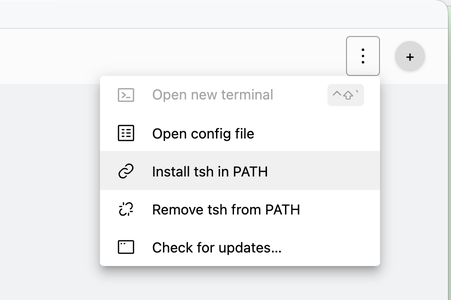

This guide explains how to install Teleport on macOS, including client tools for connecting to an existing Teleport cluster and the Teleport service for running agents.

For an overview of Teleport installation methods and supported platforms, see
[Installation](./installation.mdx).

## Operating system support

Teleport supports macOS 12 (Monterey) and later for both Intel and Apple Silicon Macs.

## Client tools

Most macOS users install Teleport to connect to an existing cluster. Teleport provides several client tools:

| Tool | Description |
| - | - |
| `tsh` | Command-line client for SSH, database access, Kubernetes, and application access |
| `tctl` | Administrative CLI for managing Teleport clusters (cluster administrators only) |
| Teleport Connect | Desktop application with a graphical interface for accessing resources |

### Install client tools

Choose one of the following methods to install the Teleport client tools.

#### Teleport Connect

Teleport Connect is a desktop application that provides a graphical interface for connecting to SSH servers, databases, Kubernetes clusters, and web applications.

Download Teleport Connect from the [Downloads page](https://goteleport.com/download/) or directly:

[Teleport Connect (=teleport.version=)](https://cdn.teleport.dev/Teleport%20Connect-(=teleport.version=).dmg)

Open the `.dmg` file and drag Teleport Connect to your Applications folder.

Teleport Connect includes `tsh` as an installation option:



<Checkpoint
  title="Verify Teleport Connect installation"
  description="Confirm that Teleport Connect is installed and can connect to your cluster."
>

1. Open Teleport Connect from your Applications folder.
2. Click **Connect** and enter your Teleport cluster address (e.g., `example.teleport.sh`).
3. Complete the login flow.
4. Verify you can see available resources in the Teleport Connect window.

Here are some troubleshooting tips:
- If macOS blocks the application, go to **System Settings** > **Privacy & Security** and click **Open Anyway**.
- If you cannot connect, verify the cluster address is correct and that you have network access to the cluster.
- For SSO login issues, ensure your browser is set as the default and allows pop-ups from the Teleport cluster domain.

</Checkpoint>

#### Command-line tools only

If you prefer to use `tsh` and `tctl` without the desktop application, download the PKG installer:

[`teleport-(=teleport.version=).pkg`](https://cdn.teleport.dev/teleport-(=teleport.version=).pkg)

This universal installer works on both Intel and Apple Silicon Macs.

You can also fetch and run the installer via the command line:
```code
$ curl -O https://cdn.teleport.dev/teleport-(=teleport.version=).pkg
$ sudo installer -pkg teleport-(=teleport.version=).pkg -target /
# installer: Package name is teleport-(=teleport.version=)
# installer: Upgrading at base path /
# installer: The upgrade was successful.
```

<Checkpoint
  title="Verify tsh installation"
  description="Confirm that the Teleport client tools are installed and you can log in to your cluster."
>

1. Verify `tsh` is installed:
```code
   $ tsh version
```

2. Log in to your Teleport cluster:
```code
   $ tsh login --proxy=example.teleport.sh
```

   Replace `example.teleport.sh` with your cluster's address.

3. List available resources:
```code
   $ tsh ls
```

Here are some troubleshooting tips:
- If `tsh` is not found, check where it's installed:
```code
  $ which tsh
```
- If you see `installer: must be run as root` when running the installer command, add `sudo` before the `installer` command.
- If login fails with a certificate error, check that your system time is correct.
- For SSO login issues, ensure your default browser allows pop-ups from the Teleport cluster domain.

</Checkpoint>

For more information on using `tsh`, see the [tsh reference](../connect-your-client/teleport-clients/tsh.mdx).

For more information on Teleport Connect, see [Using Teleport Connect](../connect-your-client/teleport-clients/teleport-connect.mdx).

## Running Teleport services on macOS

The client tools above (`tsh`, `tctl`, Teleport Connect) are used to *connect to* a Teleport cluster on demand—you run them when you want to access a resource, 
then they exit when you're done.

Teleport *services* are different: they run continuously as background daemons. The `teleport` daemon can run cluster components (Auth Service, Proxy Service) 
or agent services that enroll resources like servers, databases, or applications into your cluster. The `tbot` daemon provides machine identity for automated workloads.
Most macOS users only need the client tools. You would install Teleport services on macOS primarily for:

- Local development and testing of Teleport configurations
- Running a Teleport Agent to enroll your Mac as a resource in a cluster

| Binary | Description |
| - | - |
| `teleport` | The Teleport daemon for running cluster services or agents |
| `tbot` | Teleport Machine & Workload Identity issues and renews short-lived certificates so your machines can access Teleport protected resources in the same way your engineers do. |

### Install Teleport services

If you haven't already, download and run the PKG installer:

[`teleport-(=teleport.version=).pkg`](https://cdn.teleport.dev/teleport-(=teleport.version=).pkg)
```code
$ curl -O https://cdn.teleport.dev/teleport-(=teleport.version=).pkg
$ sudo installer -pkg teleport-(=teleport.version=).pkg -target /
# Password
# installer: Package name is teleport-(=teleport.version=)
# installer: Upgrading at base path /
# installer: The upgrade was successful.
$ which teleport
# /usr/local/bin/teleport
```

### Verify Teleport is installed
```code
$ teleport version
```
<Admonition type="note">

Running Teleport services in production is typically done on Linux servers. 
macOS is primarily used for client access and local development. For production deployments, see [Installing Teleport on Linux](./linux.mdx).

</Admonition>

For guidance on configuring and running Teleport, see:
- [Teleport daemon on macOS via launchd](../zero-trust-access/deploy-a-cluster/macos-launchd.mdx)
- [Deploy a Cluster](../zero-trust-access/deploy-a-cluster/deploy-a-cluster.mdx) for self-hosted deployments
- [Machine ID Getting Started](../machine-workload-identity/workload-identity/getting-started.mdx) for workload identity

<Admonition type="danger">

We do not recommend using Homebrew to install Teleport. The Teleport package in
Homebrew is not maintained by Teleport and we can't guarantee its reliability or
security.

</Admonition>
