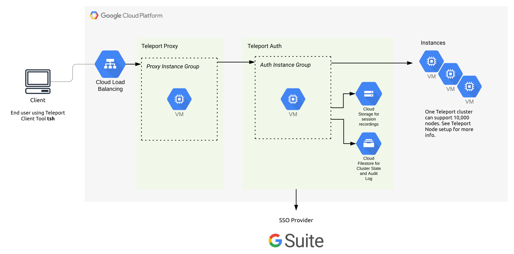
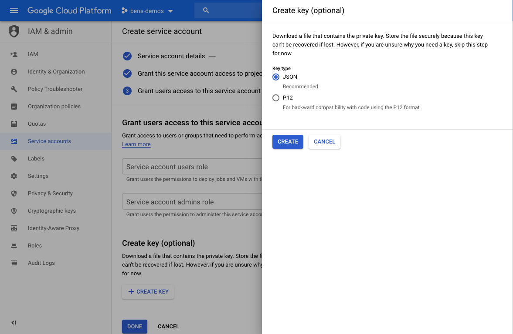

We've created this guide to give customers an overview of how to deploy a
self-hosted Teleport cluster on [Google Cloud](https://cloud.google.com/gcp/)
(GCP). This guide provides a high-level introduction to setting up and running
Teleport in production.

We have split this guide into:

- [GCP Teleport Introduction](#gcp-teleport-introduction)
- [GCP Quickstart](#gcp-quickstart)

(!docs/pages/includes/cloud/call-to-action.mdx!)

## GCP Teleport Introduction

This guide will cover how to set up, configure and run Teleport on GCP.

The following GCP Services are required to run Teleport in high availability mode:

- [Access: Service accounts](#access-service-accounts)
- [Compute Engine: Health Checks](#compute-engine-health-checks)
- [Compute Engine: VM Instances with Instance Groups](#compute-engine-vm-instances-with-instance-groups)
- [Network Services: Firewall Rules](#network-services-firewall-rules)
- [Storage: Cloud Firestore](#storage-cloud-firestore)
- [Storage: Google Cloud Storage](#storage-google-cloud-storage)
- [Network Services: Load Balancing](#network-services-load-balancing)
- [Network Services: Cloud DNS](#network-services-cloud-dns)

Other things needed:

- [SSL Certificate](https://cloud.google.com/load-balancing/docs/ssl-certificates)

Optional:

- Management Tools: Cloud Deployment Manager
- Logging: Stackdriver

We recommend setting up Teleport in high availability mode.
In high availability mode Firestore is used for cluster state and audit logs,
and Google Cloud Storage is used for session recordings.



Throughout this guide, we'll make use of the following placeholder variables.
Please replace them with values appropriate for your environment.

| Name     | Example     | Description |
| -------- | ----------- | ----------- |
| `Example_GCP_PROJECT` | teleport-project | Your GCP project ID |
| `Example_GCP_CREDENTIALS` | /var/lib/teleport/google.json | Path to service account credentials |
| `Example_FIRESTORE_CLUSTER_STATE` | teleport-cluster-state | Name of the Firestore collection for Teleport cluster state |
| `Example_FIRESTORE_AUDIT_LOGS` | teleport-audit-logs | Name of the Firestore collection for Teleport audit logs |
| `Example_BUCKET_NAME` | teleport-session-recordings | Name of the GCS bucket for session recording storage |

To discover your current GCP project ID, run:

```code
$ gcloud config get-value project
```

### Access: Service accounts

The Teleport Auth Service will need to read and write to Firestore and
Google Cloud Storage, and your Compute Engine instances will need this
service account attached to them. For this you will need a Service Account
with the correct permissions, created before any other GCP resources below.

If you want Teleport to be able to create its own GCS bucket, you'll need to
create a role allowing the `storage.buckets.create` permission. You can skip
this step if you choose to create the bucket before installing Teleport.

To create this role, start by defining the role in a YAML file:

```yaml
# teleport_auth_role.yaml
title: teleport_auth_role
description: 'Teleport permissions for GCP'
stage: ALPHA
includedPermissions:
# Allow Teleport to create the GCS bucket for session
# recordings if it doesn't already exist.
- storage.buckets.create
```

**Run on your workstation:**

Create the role using this file:

```code
$ gcloud iam roles create teleport_auth_role \
    --project Example_GCP_PROJECT \
    --file teleport_auth_role.yaml \
    --format yaml
```

Note the `name` field in the output which is the fully qualified name for the
custom role and must be used in later steps.

```code
$ export IAM_ROLE=<role name output from above>
```

If you don't already have a GCP service account for your Teleport Auth Service
you can create one with the following command, otherwise use your existing
service account.

```code
$ gcloud iam service-accounts create teleport-auth-server \
    --description="Service account for Teleport Auth Service" \
    --display-name="Teleport Auth Service" \
    --format=yaml
```

Note the `email` field in the output, this must be used as the identifier for
the service account.

```code
$ export SERVICE_ACCOUNT=<email output from above command>
```

Lastly, bind the required IAM roles to your newly created service account.

```code
# our custom IAM role allows Teleport to create the GCS
# bucket for session recordings if it doesn't already exist
$ gcloud projects add-iam-policy-binding Example_GCP_PROJECT \
    --member=serviceAccount:$SERVICE_ACCOUNT \
    --role=$IAM_ROLE

# datastore.owner grants the required Firestore access
$ gcloud projects add-iam-policy-binding Example_GCP_PROJECT \
    --member=serviceAccount:$SERVICE_ACCOUNT \
    --role=roles/datastore.owner

# storage.objectAdmin is needed to read/write/delete storage objects
$ gcloud projects add-iam-policy-binding Example_GCP_PROJECT \
    --member=serviceAccount:$SERVICE_ACCOUNT \
    --role=roles/storage.objectAdmin
```

<Checkpoint>
Verify the service account has the correct roles:

```code
$ gcloud projects get-iam-policy Example_GCP_PROJECT \
    --flatten="bindings[].members" \
    --filter="bindings.members:serviceAccount:$SERVICE_ACCOUNT" \
    --format="table(bindings.role)"
```

You should see the custom IAM role, `roles/datastore.owner`, and `roles/storage.objectAdmin` listed.
</Checkpoint>

**Credentials for the Auth Service**

If your Auth Service runs on the GCE VM template created in the next section
(with `$SERVICE_ACCOUNT` attached via `--service-account`), Teleport
automatically picks up Application Default Credentials from the instance's
attached identity — **you can skip downloading a JSON key entirely**, and omit
`credentials_path` from the `storage` config shown later in this guide.

<Admonition type="tip" title="When you do need a JSON key">
Only follow the steps below if your Auth Service runs somewhere that can't
have a GCP service account attached directly — for example on-prem, or on
another cloud provider.
</Admonition>

<Tabs>
<TabItem label="Console">



</TabItem>
<TabItem label="gcloud CLI">

**Run on your workstation:**

```code
$ gcloud iam service-accounts keys create teleport-gcp-credentials.json \
    --iam-account=$SERVICE_ACCOUNT
```

This downloads the key to your workstation, not to the Auth Service host.
Securely copy it to each Auth Service instance — for example with
`gcloud compute scp` — to the path you'll reference as `credentials_path`
(`Example_GCP_CREDENTIALS`), then restrict its permissions on that host:

```code
$ gcloud compute scp teleport-gcp-credentials.json INSTANCE_NAME:/tmp/google.json --zone=ZONE
$ gcloud compute ssh INSTANCE_NAME --zone=ZONE --command="sudo mkdir -p /var/lib/teleport && sudo mv /tmp/google.json /var/lib/teleport/google.json && sudo chown root:root /var/lib/teleport/google.json && sudo chmod 600 /var/lib/teleport/google.json"
```

Delete the local copy once it's been distributed to every Auth Service host.

</TabItem>
</Tabs>

<Admonition type="warning" title="Use a separate, least-privileged identity for the Proxy Service">
`$SERVICE_ACCOUNT` above (`teleport-auth-server`) holds `roles/datastore.owner`
and `roles/storage.objectAdmin` — broad read/write/delete access to your
cluster's backend state, audit log, and session recordings. The Proxy Service
is internet-facing and doesn't need any of that access, so attach a separate
service account to Proxy VMs instead of reusing the Auth identity. This limits
the blast radius if a Proxy VM is ever compromised.

```code
$ gcloud iam service-accounts create teleport-proxy-server \
    --description="Service account for Teleport Proxy Service" \
    --display-name="Teleport Proxy Service" \
    --format=yaml

$ export PROXY_SERVICE_ACCOUNT=<email output from above command>
```

No project IAM roles need to be bound to this service account — the Proxy
Service reaches the Auth Service over the network rather than accessing
Firestore or Cloud Storage directly.
</Admonition>

### Compute Engine: Health Checks

GCP relies heavily on [Health Checks](https://cloud.google.com/load-balancing/docs/health-checks),
this is helpful when adding new instances to an instance group.

To enable health checks in Teleport start with `teleport start --diag-addr=0.0.0.0:3000`
see  [Admin Guide: Troubleshooting](../../../zero-trust-access/management/diagnostics/troubleshooting.mdx) for more information.

**Run on your workstation:**

```code
$ gcloud compute health-checks create http teleport-auth-healthcheck \
    --port=3000 \
    --request-path=/healthz \
    --check-interval=10s \
    --timeout=5s \
    --unhealthy-threshold=3 \
    --healthy-threshold=2
```

<Admonition type="warning" title="Target pools require a legacy HTTP health check">
The Proxy load balancer later in this guide uses a target pool
(`gcloud compute target-pools`), and target pools can only reference the
older, deprecated `http-health-checks` resource type — not the modern
`health-checks` resource created above. Create the Proxy health check with
the legacy command instead:

```code
$ gcloud compute http-health-checks create teleport-proxy-healthcheck \
    --port=3000 \
    --request-path=/healthz \
    --check-interval=10s \
    --timeout=5s \
    --unhealthy-threshold=3 \
    --healthy-threshold=2
```
</Admonition>

<Admonition type="note">
Create a separate health check for each instance group. Auth and Proxy
Service instances run on different hosts, so pointing a Proxy backend at the
Auth health check (or vice versa) will cause health checks to fail even when
the service is healthy.
</Admonition>

<Checkpoint>
Verify the health checks were created:

```code
$ gcloud compute health-checks list --format="value(name, type)"
$ gcloud compute http-health-checks list --format="value(name, port)"
```

You should see `teleport-auth-healthcheck` in the first list and
`teleport-proxy-healthcheck` in the second — they're different resource types.
</Checkpoint>

### Compute Engine: VM Instances with Instance Groups

We recommend using `n1-standard-2` instances in production. It's best to separate
Teleport Proxy Service and Auth Service instances using instance groups for each.

<Admonition type="note" title="Distribute across zones for high availability">
Creating a zonal instance group puts every replica in a single zone, which
means a zone outage takes down the whole group. Use **regional** managed
instance groups instead, spreading replicas across multiple zones in the
region, so a single zone failure doesn't remove every Auth or Proxy replica.
</Admonition>

<Admonition type="warning" title="Provision Teleport in the instance template, not manually after boot">
These instance templates boot a bare Ubuntu image. If you configure Teleport
by hand on the first VMs and stop there, the template itself is still blank —
so the next time the managed instance group repairs an unhealthy instance or
resizes the group, it creates a fresh VM from the unmodified template with no
Teleport installed. That silently drops your replica count and defeats the
purpose of using instance groups for HA. Bake installation and configuration
into a startup script (or a custom image) so every VM the group creates is
already running Teleport.

Save the following as `teleport-auth-startup.sh`, filling in your own token
values to match the tokens you configure on the Auth Service in
[GCP Quickstart](#2-install--configure-teleport). Note `diag_addr` — this is
what makes the health check above actually see a live endpoint on port 3000;
without it Teleport's diagnostics listener stays disabled and every health
check fails even though Teleport itself is running fine.

```bash
#!/bin/bash
set -euo pipefail

curl https://goteleport.com/static/install.sh | bash -s -- (=teleport.version=)

cat <<'EOF' > /etc/teleport.yaml
version: v3
teleport:
  nodename: teleport-auth-server
  data_dir: /var/lib/teleport
  pid_file: /run/teleport.pid
  diag_addr: 0.0.0.0:3000
  log:
    output: stderr
    severity: DEBUG
  storage:
    type: firestore
    collection_name: Example_FIRESTORE_CLUSTER_STATE
    project_id: Example_GCP_PROJECT
    audit_events_uri: 'firestore://Example_FIRESTORE_AUDIT_LOGS?projectID=Example_GCP_PROJECT'
    audit_sessions_uri: 'gs://Example_BUCKET_NAME?projectID=Example_GCP_PROJECT'
auth_service:
  enabled: true
  tokens:
    - "proxy:REPLACE_WITH_PROXY_TOKEN"
    - "node:REPLACE_WITH_NODE_TOKEN"
proxy_service:
  enabled: false
ssh_service:
  enabled: false
EOF

systemctl enable teleport
systemctl restart teleport
```

Save an equivalent `teleport-proxy-startup.sh` using the Proxy `teleport.yaml`
shown in [GCP Quickstart](#2-install--configure-teleport), with the same
`diag_addr: 0.0.0.0:3000` line added and `auth_server` set to
`$AUTH_LB_IP:3025` (the internal load balancer created below — do **not** use
the placeholder `auth.example.com` from that sample as-is, since this guide
never creates a DNS record or public endpoint for it). Since the storage
config above omits `credentials_path`, it relies on the attached service
account for Application Default Credentials — see the note on this in
[Access: Service accounts](#access-service-accounts).
</Admonition>

**Run on your workstation:**

```code
$ gcloud compute instance-templates create teleport-auth-template \
    --machine-type=n1-standard-2 \
    --image-family=ubuntu-2204-lts \
    --image-project=ubuntu-os-cloud \
    --boot-disk-size=20GB \
    --service-account=$SERVICE_ACCOUNT \
    --scopes=cloud-platform \
    --tags=teleport-auth \
    --metadata-from-file=startup-script=teleport-auth-startup.sh

$ gcloud compute instance-groups managed create teleport-auth-group \
    --template=teleport-auth-template \
    --size=2 \
    --region=us-central1 \
    --zones=us-central1-a,us-central1-b,us-central1-c
```

<Admonition type="warning" title="Give the Proxy Service a reachable Auth endpoint">
The Proxy config later in this guide points `auth_server` at
`auth.example.com:3025`, but nothing in this guide creates that DNS record,
an Auth-facing load balancer, or a firewall rule allowing port 3025 traffic —
so a freshly provisioned Proxy has no way to reach Auth and can't join.
Set up an **internal** passthrough load balancer in front of the Auth group
before creating the Proxy template:

```code
$ gcloud compute backend-services create teleport-auth-backend \
    --region=us-central1 \
    --load-balancing-scheme=INTERNAL \
    --protocol=TCP \
    --health-checks=teleport-auth-healthcheck

$ gcloud compute backend-services add-backend teleport-auth-backend \
    --region=us-central1 \
    --instance-group=teleport-auth-group \
    --instance-group-region=us-central1

$ gcloud compute forwarding-rules create teleport-auth-internal-lb \
    --region=us-central1 \
    --load-balancing-scheme=INTERNAL \
    --network=default \
    --subnet=default \
    --ports=3025 \
    --backend-service=teleport-auth-backend

$ export AUTH_LB_IP=$(gcloud compute forwarding-rules describe teleport-auth-internal-lb --region=us-central1 --format="value(IPAddress)")
```

This uses the `default` VPC network and subnet — substitute your own if
you're not using GCP's default network. Use `$AUTH_LB_IP` (not
`auth.example.com`) as the `auth_server` value in `teleport-proxy-startup.sh`.
</Admonition>

```code
$ gcloud compute instance-templates create teleport-proxy-template \
    --machine-type=n1-standard-2 \
    --image-family=ubuntu-2204-lts \
    --image-project=ubuntu-os-cloud \
    --boot-disk-size=20GB \
    --service-account=$PROXY_SERVICE_ACCOUNT \
    --scopes=cloud-platform \
    --tags=teleport-proxy \
    --metadata-from-file=startup-script=teleport-proxy-startup.sh

$ gcloud compute instance-groups managed create teleport-proxy-group \
    --template=teleport-proxy-template \
    --size=2 \
    --region=us-central1 \
    --zones=us-central1-a,us-central1-b,us-central1-c
```

### Network Services: Firewall Rules

GCP denies all ingress traffic by default outside of a few built-in rules
(SSH, RDP, ICMP on the `default` network). Without explicit firewall rules,
GCP's health check probes can't reach your instances — leaving every backend
`UNHEALTHY` — and client traffic to the Proxy is dropped entirely.

**Run on your workstation:**

```code
# Allow GCP's health check probes to reach the diagnostics port on Auth and
# Proxy instances (and the internal Auth load balancer). These are Google's
# documented health-checker ranges.
$ gcloud compute firewall-rules create teleport-allow-health-checks \
    --direction=INGRESS \
    --action=ALLOW \
    --rules=tcp:3000 \
    --source-ranges=130.211.0.0/22,35.191.0.0/16 \
    --target-tags=teleport-auth,teleport-proxy

# Allow client traffic to reach the Proxy on its public ports. Narrow
# --source-ranges to your known client CIDRs where possible instead of
# opening it to the internet. Port 3025 (the Auth Service's own port) is
# deliberately not included here — Proxy instances don't listen on it, and
# it shouldn't be reachable from the public internet.
$ gcloud compute firewall-rules create teleport-allow-proxy-clients \
    --direction=INGRESS \
    --action=ALLOW \
    --rules=tcp:443,tcp:3023,tcp:3024,tcp:3026,tcp:3036 \
    --source-ranges=0.0.0.0/0 \
    --target-tags=teleport-proxy

# Allow Proxy instances to reach the Auth Service internally on 3025.
# Scoped to traffic that originates from tagged Proxy instances only, not
# the public internet.
$ gcloud compute firewall-rules create teleport-allow-proxy-to-auth \
    --direction=INGRESS \
    --action=ALLOW \
    --rules=tcp:3025 \
    --source-tags=teleport-proxy \
    --target-tags=teleport-auth
```

<Checkpoint>
Verify the firewall rules were created:

```code
$ gcloud compute firewall-rules list --filter="name~teleport-allow" --format="table(name, sourceRanges.list(), allowed[].map().firewall_rule().list())"
```

You should see all three rules listed with the expected source ranges and ports.
Once instances are running, confirm health checks are passing with
`gcloud compute target-pools get-health teleport-proxy-pool --region=us-central1`
(covered in [Network Services: Load Balancing](#network-services-load-balancing)).
</Checkpoint>

### Storage: Cloud Firestore

The [Firestore](https://cloud.google.com/firestore/) backend uses real-time
updates to keep individual Auth Service instances in sync, and requires Firestore configured
in native mode.

**Run on your workstation to create a Firestore database in native mode:**

```code
$ gcloud firestore databases create \
    --location=us-central1 \
    --type=firestore-native \
    --project=Example_GCP_PROJECT
```

To configure Teleport to store audit events in Firestore, add the following to
the teleport section of your Auth Service's config file (by default it's `/etc/teleport.yaml`):

```yaml
teleport:
  storage:
    type: firestore
    collection_name: Example_FIRESTORE_CLUSTER_STATE
    project_id: Example_GCP_PROJECT
    credentials_path: Example_GCP_CREDENTIALS
    audit_events_uri: [ 'firestore://Example_FIRESTORE_AUDIT_LOGS?projectID=Example_GCP_PROJECT&credentialsPath=Example_GCP_CREDENTIALS' ]
```

<Admonition type="tip">
Omit `credentials_path` (and `credentialsPath` in the URIs) entirely if your
Auth Service runs on a GCE VM with `$SERVICE_ACCOUNT` attached — Teleport will
use Application Default Credentials automatically. See
[Access: Service accounts](#access-service-accounts) for details.
</Admonition>

<Admonition type="warning" title="Table Names">
Be careful to ensure that `Example_FIRESTORE_CLUSTER_STATE` and `Example_FIRESTORE_AUDIT_LOGS`
refer to *different* Firestore collections. The schema is different for each, and using the same
collection for both types of data will result in errors.
</Admonition>

<Checkpoint>
Verify Firestore is available:

```code
$ gcloud firestore databases describe --project=Example_GCP_PROJECT --format="value(name, type)"
```

You should see a database name and the type `FIRESTORE_NATIVE`.
</Checkpoint>

### Storage: Google Cloud Storage

The Google Cloud Storage backend is used for Teleport session recordings.
Teleport will try to create the bucket on startup if it doesn't already exist.
If you prefer, you can create the bucket ahead of time. In this case, Teleport
does not need permissions to create buckets.

**Run on your workstation to create the bucket:**

```code
$ gcloud storage buckets create gs://Example_BUCKET_NAME \
    --project=Example_GCP_PROJECT \
    --location=us-central1 \
    --default-storage-class=Standard \
    --uniform-bucket-level-access
```

When creating the Bucket, we recommend setting it up as `Dual-region` with
the `Standard` storage class. Provide access using a `Uniform` access control
with a Google-managed key.

When setting up `audit_sessions_uri` use the `gs://` prefix.

```yaml
storage:
    ...
    audit_sessions_uri: 'gs://Example_BUCKET_NAME?projectID=Example_GCP_PROJECT&credentialsPath=Example_GCP_CREDENTIALS'
    ...
```

<Checkpoint>
Verify the bucket was created:

```code
$ gcloud storage buckets describe gs://Example_BUCKET_NAME --format="value(name, location)"
```

You should see your bucket name and its location.
</Checkpoint>

### Network Services: Load Balancing

Load Balancing is required for Proxy and SSH traffic. Use `TCP Load Balancing` as
Teleport requires custom ports for SSH and Web Traffic.

<Admonition type="warning" title="Use passthrough Network Load Balancing, not TCP Proxy Load Balancing">
GCP's Target TCP Proxy load balancer (`gcloud compute target-tcp-proxies`) only
forwards traffic on a small fixed set of ports (25, 43, 110, 143, 195, 443,
465, 587, 700, 993, 995, 1883, and 5222) — it does not support Teleport's
ports (443, 3023, 3024, 3026, 3036). Use a regional external passthrough
**Network** Load Balancer instead, which supports any combination of ports.
</Admonition>

**Run on your workstation:**

```code
$ gcloud compute target-pools create teleport-proxy-pool \
    --region=us-central1 \
    --health-check=teleport-proxy-healthcheck

$ gcloud compute instance-groups managed set-target-pools teleport-proxy-group \
    --target-pools=teleport-proxy-pool \
    --region=us-central1

$ gcloud compute addresses create teleport-lb-ip \
    --region=us-central1

$ export LB_IP=$(gcloud compute addresses describe teleport-lb-ip --region=us-central1 --format="value(address)")

$ gcloud compute forwarding-rules create teleport-forwarding-rule \
    --region=us-central1 \
    --address=$LB_IP \
    --ip-protocol=TCP \
    --ports=443,3023,3024,3026,3036 \
    --target-pool=teleport-proxy-pool
```

<Admonition type="note">
Port 3025 (the Auth Service's own port) is intentionally excluded here —
Proxy instances don't serve it, and Proxy-to-Auth traffic goes over the
internal load balancer set up in
[Compute Engine: VM Instances with Instance Groups](#compute-engine-vm-instances-with-instance-groups)
instead.
</Admonition>

<Admonition type="note">
Reserving a static external IP address (`teleport-lb-ip` above) before creating
the forwarding rule means your Teleport Proxy's public address won't change if
you ever need to recreate the forwarding rule. If you're fine with an
ephemeral address instead, you can omit the `addresses create` step and the
`--address` flag.
</Admonition>

<Admonition type="tip">
The `--ports` list above has six entries. GCP's five-port cap on forwarding
rules applies only to *internal* passthrough load balancers — a target
pool-based regional *external* passthrough Network Load Balancer (used here)
supports any number of ports, so this is not a limit you need to work around.
</Admonition>

<Checkpoint>
Verify the load balancer was created and its target pool has healthy members:

```code
$ gcloud compute forwarding-rules describe teleport-forwarding-rule --region=us-central1 --format="value(IPAddress)"
$ gcloud compute target-pools get-health teleport-proxy-pool --region=us-central1
```

The first command should return the same IP as `$LB_IP`. The second should show `HEALTHY` for each Proxy instance — if an instance shows `UNHEALTHY`, confirm Teleport is running with `--diag-addr=0.0.0.0:3000` on that host.
</Checkpoint>

### Network Services: Cloud DNS

Cloud DNS is used to set up the public URL of the Teleport Proxy.

**Run on your workstation:**

```code
# Create a DNS managed zone (if you don't already have one)
$ gcloud dns managed-zones create teleport-zone \
    --dns-name="example.com." \
    --description="DNS zone for Teleport"

# Re-fetch the reserved load balancer IP if you're in a new shell session
$ export LB_IP=$(gcloud compute addresses describe teleport-lb-ip --region=us-central1 --format="value(address)")

# Create an A record pointing to the load balancer
$ gcloud dns record-sets create teleport.example.com. \
    --zone=teleport-zone \
    --type=A \
    --ttl=300 \
    --rrdatas=$LB_IP
```

## GCP Quickstart

### 1. Create Resources

We recommend starting by creating the resources. We highly recommend creating these using
an infrastructure automation tool such as [Cloud Deployment Manager](https://cloud.google.com/deployment-manager/) or Terraform.

<Checkpoint>
Verify all required GCP resources are ready before proceeding:

```code
# Verify Firestore database exists
$ gcloud firestore databases describe --project=Example_GCP_PROJECT --format="value(type)"

# Verify GCS bucket exists
$ gcloud storage buckets describe gs://Example_BUCKET_NAME --format="value(name)"

# Verify service account exists
$ gcloud iam service-accounts describe $SERVICE_ACCOUNT --format="value(email)"
```

All three commands should return valid output without errors.
</Checkpoint>

### 2. Install & Configure Teleport

Follow install instructions from our [installation page](../../../installation/single-machine/single-machine.mdx).

We recommend configuring Teleport as per the below steps:

<Tabs>
	<TabItem label="Teleport Community Edition" scope="oss">
**1. Configure Teleport Auth Service** using the below example `teleport.yaml`, and start it
using [systemd](../../../reference/cli/teleport.mdx#teleport-install-systemd). The DEB/RPM installations will
automatically include the `systemd` configuration.

```yaml
#
# Sample Teleport configuration teleport.yaml file for Auth Service
#
teleport:
  nodename: teleport-auth-server
  data_dir: /var/lib/teleport
  pid_file: /run/teleport.pid
  log:
    output: stderr
    severity: DEBUG
  storage:
    type: firestore
    collection_name: Example_FIRESTORE_CLUSTER_STATE
    # Credentials: Path to google service account file, used for Firestore and Google Storage.
    credentials_path: Example_GCP_CREDENTIALS
    project_id: Example_GCP_PROJECT
    audit_events_uri: 'firestore://Example_FIRESTORE_AUDIT_LOGS?projectID=Example_GCP_PROJECT&credentialsPath=Example_GCP_CREDENTIALS'
    audit_sessions_uri: 'gs://Example_BUCKET_NAME?projectID=Example_GCP_PROJECT&credentialsPath=Example_GCP_CREDENTIALS'
auth_service:
  enabled: true
  tokens:
    - "proxy:(= presets.tokens.first =)"
    - "node:(= presets.tokens.second =)"
proxy_service:
  enabled: false
ssh_service:
  enabled: false
```
	</TabItem>
	<TabItem label="Enterprise" label="Enterprise" scope={["enterprise"]}>
**1. Configure Teleport Auth Service** using the below example `teleport.yaml`, and start it
using [systemd](../../../reference/cli/teleport.mdx#teleport-install-systemd). The DEB/RPM installations will
automatically include the `systemd` configuration.

```yaml
#
# Sample Teleport configuration teleport.yaml file for Auth Service
#
teleport:
  nodename: teleport-auth-server
  data_dir: /var/lib/teleport
  pid_file: /run/teleport.pid
  log:
    output: stderr
    severity: DEBUG
  storage:
    type: firestore
    collection_name: Example_FIRESTORE_CLUSTER_STATE
    # Credentials: Path to google service account file, used for Firestore and Google Storage.
    credentials_path: Example_GCP_CREDENTIALS
    project_id: Example_GCP_PROJECT
    audit_events_uri: 'firestore://Example_FIRESTORE_AUDIT_LOGS?projectID=Example_GCP_PROJECT&credentialsPath=Example_GCP_CREDENTIALS'
    audit_sessions_uri: 'gs://Example_BUCKET_NAME?projectID=Example_GCP_PROJECT&credentialsPath=Example_GCP_CREDENTIALS'
auth_service:
  enabled: true
  license_file: /var/lib/teleport/license.pem
  tokens:
    - "proxy:(= presets.tokens.first =)"
    - "node:(= presets.tokens.second =)"
proxy_service:
  enabled: false
ssh_service:
  enabled: false
```

(!docs/pages/includes/enterprise/obtainlicense.mdx!)

Save your license file on the Auth Service instances at the path,
`/var/lib/teleport/license.pem`.
	</TabItem>
</Tabs>

**2. Set up Proxy**

Save the following configuration file as `/etc/teleport.yaml` on the Proxy Server:

```yaml
# enable multiplexing all traffic on TCP port 443
version: v3
teleport:
  auth_token: (= presets.tokens.first =)
  # We recommend using a TCP load balancer pointed to the auth servers when
  # setting up in High Availability mode. Replace auth.example.com with the
  # address of that load balancer (if following the HA instance-group setup
  # above, this is $AUTH_LB_IP from the internal load balancer) — this
  # placeholder alone does not resolve to anything.
  auth_server: auth.example.com:3025
  # Uncomment to enable the diagnostics endpoint the Proxy health check
  # (Compute Engine: Health Checks) probes:
  # diag_addr: 0.0.0.0:3000
# enable proxy service, disable auth and ssh
ssh_service:
  enabled: false
auth_service:
  enabled: false
proxy_service:
  enabled: true
  web_listen_addr: 0.0.0.0:443
  public_addr: teleport.example.com:443
  # automatically get an ACME certificate for teleport.example.com (works for a single proxy)
  acme:
    enabled: true
    email: example@email.com
```

**3. Set up Teleport Nodes**

Save the following configuration file as `/etc/teleport.yaml` on the Node:

```yaml
version: v3
teleport:
  auth_token: (= presets.tokens.second =)
  # Teleport Agents can be joined to the cluster via the Proxy Service's
  # public address. This will establish a reverse tunnel between the Proxy
  # Service and the agent that is used for all traffic.
  proxy_server: teleport.example.com:443
# enable the SSH Service and disable the Auth and Proxy Services
ssh_service:
  enabled: true
auth_service:
  enabled: false
proxy_service:
  enabled: false
```

**4. Start services and verify**

**Run on each Teleport host:**

```code
$ sudo systemctl enable teleport
$ sudo systemctl start teleport
$ sudo systemctl status teleport
```

<Checkpoint>
Verify the Teleport Auth Service is running and connected to its backend:

```code
$ sudo journalctl -u teleport --no-pager -n 20 | grep -i "started\|error\|firestore"
```

You should see log lines indicating the Auth Service has started and connected to Firestore without errors.
</Checkpoint>

**5. Add Users**

Follow our [Local Users](../../../zero-trust-access/rbac-get-started/users.mdx) guide or integrate
with [Google Workspace](../../../zero-trust-access/sso/integrate-idp/google-workspace.mdx) to
provide SSO access.
