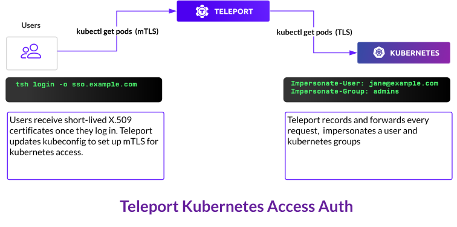

# Single Sign-On and Kubernetes RBAC

Teleport issues short-lived X.509 certs and updates Kubernetes clients to talk to Teleport proxy using mutual TLS.
It then intercepts every request and adds [impersonation headers](https://kubernetes.io/docs/reference/access-authn-authz/authentication/#user-impersonation)
to map users to Kubernetes users and groups.



Teleport's connectors configure single sign-on for OIDC, OAuth, or SAML providers.
Here are examples of connectors that map SSO users to Kubernetes groups in the Teleport Open Source Edition and Teleport's roles in the Enterprise Edition:

<Tabs>
  <TabItem label="Open Source">
    Github's `teams_to_logins` section maps users to roles based on users' teams.

    ```yaml
    kind: github
    version: v3
    metadata:
      # Connector name that will be used with `tsh --auth=github login`
      name: github
    spec:
      # Client ID of Github OAuth app
      client_id: client-id
      # Client secret of Github OAuth app
      client_secret: client-secret
      # This name will be shown on UI login screen
      display: Github
      # Change tele.example.com to your domain name
      redirect_url: https://tele.example.com:443/v1/webapi/github/callback
      # Map github teams to teleport roles
      teams_to_logins:
        - organization: octocats # Github organization name
          team: admin            # Github team name within that organization
          # keep this field as is for now
          logins: ["admin"]
    ```
  </TabItem>

  <TabItem label="Enterprise">
    OIDC and SAML connectors `claims_to_roles` and `attributes_to_roles` sections map
    attribute statements and claims received from identity providers to Teleport's roles.

    ```yaml
    kind: saml
    version: v2
    metadata:
      name: okta
    spec:
      acs: https://tele.example.com/v1/webapi/saml/acs
      attributes_to_roles:
      # Any user who has SAML `groups` atrribute with value `okta-admin`
      # will be given the Teleport `admin` role.
      - {name: "groups", value: "okta-admin", roles: ["admin"]}
      entity_descriptor: |
        <?xml !!! Make sure to shift all lines in XML descriptor
        with 4 spaces, otherwise things will not work
    ```

    Members of the role `admin` have a property `kubernetes_groups` that assigns them to [Kubernetes groups](https://kubernetes.io/docs/reference/access-authn-authz/rbac/#referring-to-subjects)

    ```yaml
    kind: role
    version: v3
    metadata:
      name: admin
    spec:
      allow:
        # If kubernetes integration is enabled, this setting configures which
        # kubernetes groups the users of this role will be assigned to.
        # Note that you can refer to a SAML/OIDC trait named 'property' via the "{{external.property}}" template variable,
        # this allows you to specify Kubernetes group membership via your identity provider:
        kubernetes_groups: ["system:masters"]
    ```
  </TabItem>
</Tabs>

## Mapping OIDC claims and SAML attributes to Kubernetes groups

Identity provider admins can assign metadata to a user, such as
group membership or access permissions. Administrators configure what metadata
is shared with Teleport. Teleport receives user metadata keys and values as OIDC claims or SAML
attributes during [signle sign-on redirect flow](https://goteleport.com/blog/how-oidc-authentication-works/):

```yaml
# Alice has an email alice@example.com. Email is a standard OIDC claim.
email: "alice@example.com"
# Alice is a member of groups admins and devs
groups: ["admins", "devs"]
# She can access prod and staging environments
access: {"env": ["prod", "staging"]}
```

Teleport's roles map OIDC claims or SAML attributes using template variables.
Template variable `{{external.groups}}` will
be substituted to the users' group list in the role definition.

```yaml
kind: role
version: v4
metadata:
  name: group-member
spec:
  allow:
    # For Alice, will be substituted with the list ["admins", "devs"]
    kubernetes_groups: ["{{external.groups}}"]
    # For Alice, will be substituted with ["alice@example.com"]
    kubernetes_users: ["{{external.email}}"]
```

(!docs/pages/includes/permission-warning.mdx!)

Create or update this role using `tctl`:

```code
$ tctl create -f member.yaml
```

Assign this role to a user in OIDC or SAML connector:

<Tabs>
  <TabItem label="Github (OSS)">
    ```yaml
    kind: github
    version: v3
    metadata:
      # Connector name that will be used with `tsh --auth=github login`
      name: github
    spec:
      # Client ID of Github OAuth app
      client_id: client-id
      # Client secret of Github OAuth app
      client_secret: client-secret
      # This name will be shown on UI login screen
      display: Github
      # Change tele.example.com to your domain name
      redirect_url: https://tele.example.com:443/v1/webapi/github/callback
      # Map github teams to kubernetes groups
      teams_to_logins:
        - organization: octocats # Github organization name
          team: admin            # Github team name within that organization
          # List of Kubernetes groups this Github team is allowed to connect to
          # Keep this field as is for now
          logins: ["admins"]
    ```
  </TabItem>

  <TabItem label="OIDC (Enterprise)">
    ```yaml
    kind: oidc
    version: v2
    metadata:
      name: auth0
    spec:
      redirect_url: https://tele.example.com/v1/webapi/oidc/callback
      client_id: client-id-here
      client_secret: client-secret-here
      issuer_url: https://idp.example.com/
      # request groups scope from OIDC provider
      # read more about scopes here https://auth0.com/docs/scopes/openid-connect-scopes
      scope: [groups]
      claims_to_roles:
        - {claim: "groups", value: "*", roles: ["group-member"]}
    ```
  </TabItem>

  <TabItem label="SAML (Enterprise)">
    ```yaml
    kind: saml
    version: v2
    metadata:
      name: okta
    spec:
      acs: https://tele.example.com/v1/webapi/saml/acs
      attributes_to_roles:
      - {name: "groups", value: "*", roles: ["group-member"]}
      entity_descriptor: |
        <?xml !!! Make sure to indent all lines in XML descriptor
        with 4 spaces, otherwise things will not work
    ```
  </TabItem>
</Tabs>

## Local Users

Local users are mapped to Kubernetes groups using roles:

```code
# Specify `kubernetes_groups` property in a role "admins" and
# create a user assigned to the role.
$ tctl users add joe --roles="admins"
```

## Kubernetes labels

Label each cluster with key-value pairs describing the cluster:

<Tabs>
  <TabItem label="Helm">
    ```code
    # Install or upgrade the agent or cluster and set labels:
    $ helm upgrade teleport-agent teleport-kube-agent --set kubeClusterName={CLUSTER?}\
      --set proxyAddr=${PROXY?} --set authToken=${TOKEN?} --create-namespace --namespace=teleport-agent\
      --set labels.env=prod --set labels.region=us-west-1
    ```
  </TabItem>

  <TabItem label="Config">
    ```yaml
    kubernetes_service:
      enabled: true
      kube_cluster_name: cookie
      labels:
        env: prod
        region: us-west-1
    ```
  </TabItem>
</Tabs>

Limit access to cluster based on the label:

```yaml
kind: role
version: v4
metadata:
  name: group-member
spec:
  allow:
    # Allow access to kubernetes clusters in production environment
    kubernetes_labels:
      'env': 'prod'
```

## Impersonation

Teleport uses [Kubernetes impersonation](https://kubernetes.io/docs/reference/access-authn-authz/authentication/#user-impersonation)
to map OIDC and SAML users to Kubernetes users and groups.

Here is an example of Kubernetes `ClusterRole` and `ClusterRoleBinding`
allowing Teleport's `ServiceAccount` to impersonate users and groups:

```yaml
apiVersion: rbac.authorization.k8s.io/v1
kind: ClusterRole
metadata:
  name: teleport-impersonation
rules:
- apiGroups:
  - ""
  resources:
  - users
  - groups
  - serviceaccounts
  verbs:
  - impersonate
- apiGroups:
  - ""
  resources:
  - pods
  verbs:
  - get
- apiGroups:
  - "authorization.k8s.io"
  resources:
  - selfsubjectaccessreviews
  verbs:
  - create
---
apiVersion: rbac.authorization.k8s.io/v1
kind: ClusterRoleBinding
metadata:
  name: teleport
roleRef:
  apiGroup: rbac.authorization.k8s.io
  kind: ClusterRole
  name: teleport-impersonation
subjects:
- kind: ServiceAccount
  # this should be changed to the name of the Kubernetes ServiceAccount being used
  name: teleport-serviceaccount
  namespace: default
```

Take a look at the example usage in a [Teleport Helm chart](https://github.com/gravitational/teleport/blob/v\(=teleport.version=\)/examples/chart/teleport-cluster/templates/clusterrole.yaml)

## Next steps

Integrate with your identity provider:

- [OIDC guide](../enterprise/sso/oidc.mdx)
- [ADFS guide](../enterprise/sso/adfs.mdx)
- [Azure AD guide](../enterprise/sso/azuread.mdx)
- [Google Workspace guide](../enterprise/sso/google-workspace.mdx)
- [Onelogin guide](../enterprise/sso/one-login.mdx)
- [Okta guide](../enterprise/sso/okta.mdx)
