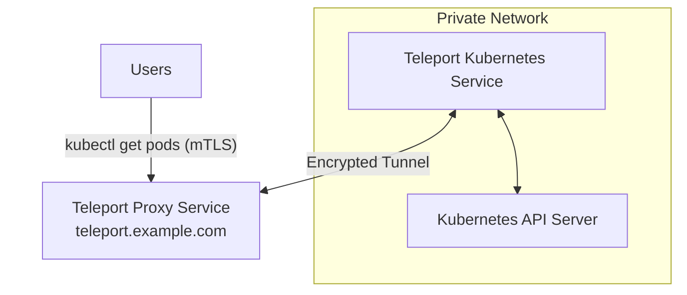

In this guide, we will show you how to register a Kubernetes cluster with
Teleport by deploying the Teleport Kubernetes Service on the Kubernetes cluster
you want to register.

In this setup, the Teleport Kubernetes Service pod detects that it is running on
Kubernetes and registers the cluster automatically.

<Notice type="tip">

You can also run the Teleport Kubernetes Service on a Linux host in a separate
network from your Kubernetes cluster. Learn how in [Kubernetes Access from a
Standalone Teleport Cluster](./guides/standalone-teleport.mdx).

</Notice>

## Prerequisites

(!docs/pages/includes/edition-prereqs-tabs.mdx!)

(!docs/pages/includes/kubernetes-access/helm-k8s.mdx!)

(!docs/pages/includes/tctl.mdx!)

## Deployment overview

In this guide, we deploy the Teleport Kubernetes Service, which connects a
Kubernetes cluster to a Teleport cluster:

<Notice type="tip" scope={["cloud"]}>

In your Teleport Cloud account, the name of your cluster will be your tenant
domain name, e.g., `mytenant.teleport.sh`, rather than `teleport.example.com`.

</Notice>



## Step 1/3. Get a join token

In order to start the Teleport Kubernetes Service, we will need to request a
join token from the Teleport Auth Service:

```code
# Create a join token for the Teleport Kubernetes Service to authenticate
$ TOKEN=$(tctl tokens add --type=kube --ttl=10000h --format=text)
$ echo $TOKEN
```

## Step 2/3. Deploy teleport-kube-agent

<Notice type="tip" >

The Teleport Kubernetes Service version should be the same as the Teleport Cluster version 
or up to one major version back. You can set the version override with the override variable, ex: `--set teleportVersionOverride=(=teleport.version=)`.

</Notice>

(!docs/pages/kubernetes-access/helm/includes/helm-repo-add.mdx!)

<Tabs>
<TabItem scope={["oss","team"]} label="Teleport Team/Community Edition">

Switch `kubectl` to the Kubernetes cluster `cookie` and run the following
commands, assigning `PROXY_ADDR` to the address of your Auth Service or Proxy
Service.

```code
$ PROXY_ADDR=teleport.example.com:443
$ CLUSTER=cookie
# Create the values.yaml file
$ cat > values.yaml << EOF
authToken: "${TOKEN}"
proxyAddr: "${PROXY_ADDR}"
roles: "kube"
joinParams:
  method: "token"
  tokenName: "${TOKEN}"
kubeClusterName: "${CLUSTER}"
EOF
# Install the helm chart with the values.yaml setting
$ helm install teleport-agent teleport/teleport-kube-agent \
  -f values.yaml \
  --create-namespace \
  --namespace=teleport-agent \
  --version (=teleport.version=)
```

</TabItem>
<TabItem scope={["enterprise"]} label="Enterprise">

Switch `kubectl` to the Kubernetes cluster `cookie` and run the following
commands, assigning `PROXY_ADDR` to the address of your Auth Service or Proxy
Service.

```code
$ PROXY_ADDR=teleport.example.com:443
$ CLUSTER=cookie
# Create the values.yaml file
$ cat > values.yaml << EOF
authToken: "${TOKEN}"
proxyAddr: "${PROXY_ADDR}"
roles: "kube"
joinParams:
  method: "token"
  tokenName: "${TOKEN}"
kubeClusterName: "${CLUSTER}"
enterprise: true
EOF
# Install the helm chart with the values.yaml setting
$ helm install teleport-agent teleport/teleport-kube-agent \
  -f values.yaml \
  --create-namespace \
  --namespace=teleport-agent \
  --version (=teleport.version=) 
```

</TabItem>
<TabItem scope={["cloud"]} label="Teleport Cloud">

Switch `kubectl` to the Kubernetes cluster `cookie` and run the following
commands, assigning `PROXY_ADDR` to the address of your Teleport Cloud tenant.

```code
$ PROXY_ADDR=mytenant.teleport.sh:443

# Install Kubernetes agent. It dials back to the Teleport cluster at $PROXY_ADDR
$ CLUSTER=cookie
# Create the values.yaml file
$ cat > values.yaml << EOF
authToken: "${TOKEN}"
proxyAddr: "${PROXY_ADDR}"
roles: "kube"
joinParams:
  method: "token"
  tokenName: "${TOKEN}"
kubeClusterName: "${CLUSTER}"
enterprise: true
EOF
# Run the helm install specifying to match to the Teleport Cloud version of Teleport
$ helm install teleport-agent teleport/teleport-kube-agent \
  -f values.yaml \
  --create-namespace \
  --namespace=teleport-agent \
  --version (=cloud.version=)
```

</TabItem>
</Tabs>

## Step 3/3 Access your Kubernetes cluster

(!docs/pages/includes/kubernetes-access/rbac.mdx!)

### View pods in your cluster

List connected clusters using `tsh kube ls` and switch between
them using `tsh kube login`:

```code
$ tsh kube ls

# Kube Cluster Name Selected 
# ----------------- -------- 
# cookie

# kubeconfig now points to the cookie cluster
$ tsh kube login cookie
# Logged into kubernetes cluster "cookie". Try 'kubectl version' to test the connection.

# kubectl command executed on `cookie` but is routed through the Teleport cluster.
$ kubectl get pods
```

## Next Steps

- Take a look at a [kube-agent helm chart reference](../reference/helm-reference/teleport-kube-agent.mdx) for a full list of parameters.
