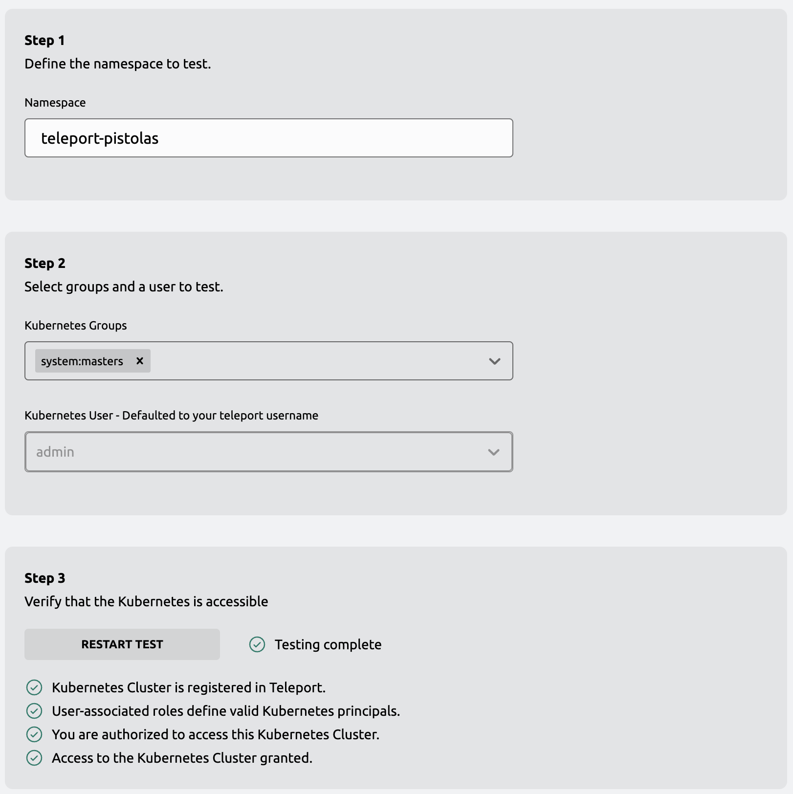

This guide demonstrates how to enroll a Kubernetes cluster as a resource by deploying the 
Teleport Kubernetes Service on the Kubernetes cluster you want to protect. In this scenario, 
the Teleport Kubernetes Service pod detects that it is running on Kubernetes and enrolls the 
Kubernetes cluster automatically. The following diagram provides a simplified overview of 
this deployment scenario with the Teleport Kubernetes Service running on the Kubernetes cluster:


You can also run the Teleport Kubernetes Service on a Linux host in a separate
network from your Kubernetes cluster. For more information about protecting access to a
Kubernetes cluster from a separate host, see [Kubernetes Access from a Standalone 
Teleport Cluster](./register-clusters/static-kubeconfig.mdx).

## Prerequisites

- Access to a running Teleport cluster, `tctl` admin tool, and `tsh` client tool, 
  version >= (=teleport.version=). 
  
  For Teleport Enterprise, Teleport Team, and Teleport Enterprise Cloud, you should
  use the Enterprise version of `tctl`. 
  You can verify the tools you have installed by running the following commands:

  ```code
  $ tctl version
  # Teleport Enterprise v(=teleport.version=) go(=teleport.golang=)
  
  $ tsh version
  # Teleport v(=teleport.version=) go(=teleport.golang=)
  ```

  You can download these tools by following the appropriate [Installation 
  instructions](../installation.mdx#installation-instructions) for your environment.

(!docs/pages/includes/kubernetes-access/helm-k8s.mdx!)

- (!docs/pages/includes/tctl.mdx!)

## Step 1/4. Select guided or manual enrollment

There are two options for enrolling a Kubernetes cluster as a resource:

- You can follow the guided enrollment steps in the Teleport Web UI.
- You run commands and edit files manually in a terminal.

The guided enrollment simplifies the deployment process by pre-populating commands
and files with required information—for example, the token used to provision the
Kubernetes cluster—and information you specify, such as the Kubernetes namespace,
users, and groups to grant access to.

For information about other ways to enroll and discover Kubernetes clusters, see
[Registering Kubernetes Clusters with Teleport](./register-clusters.mdx).

## Step 2/4. Follow guided enrollment

To enroll a Kubernetes cluster using the Teleport Web UI:

1. Open the Teleport Web UI and sign in using your administrative account.

1. Click **Enroll New Resources**.

1. Type all or part of **Kubernetes** in the Search field to filter the resource types 
   displayed, then click **Kubernetes**.

1. Copy the command to add the `teleport-agent` chart repository and paste 
   it in a terminal on a workstation where `kubectl` is installed.

1. Type the Teleport service namespace and the display name to use when connecting to 
   this cluster namespace, then click **Next**.

   After you click Next, Teleport generates a script to configure and enroll the 
   Kubernetes cluster as a resource in the Teleport cluster.

1. Copy the command displayed in the Teleport Web UI and run it in a terminal with access
   to your Kubernetes cluster.

   The Teleport Web UI displays "Successfully detected your new Kubernetes cluster" as 
   confirmation that your cluster is enrolled. When you see this message, click **Next**
   to continue.

## Step 3/4. Test Kubernetes access

You can now set up access for specific Kubernetes groups and users to test access to
the Kubernetes cluster you just enrolled.

To set up and test access:

1. Type a Kubernetes group name and, optionally, one or more Kubernetes user names that should 
   have access to Kubernetes resources, then click **Next**.

   You must specify at least one Kubernetes group. If you don't specify a Kubernetes user, you can
   connect to the cluster using your Teleport user by default.

1. (Optional) Specify the namespace, a Kubernetes group from the previous step, and 
   either your Teleport user or a Kubernetes user, then click **Test Connection**.
   
   

1. (Optional) Copy and run the commands displayed in the Teleport Web UI to interact with the
   Kubernetes cluster to verify access through Teleport.
   
   ```code
   $ tsh login --proxy=<Var name="teleport.example.com"/>:443 --auth=local --user=<Var name="admin@example.com"/> <Var name="teleport.example.com"/>
   $ tsh kube login <Var name="Kubernetes-cluster-name"/>
   $ tsh kubectl get pods
   ```

1. Click **Finish**.

1. Click **Browse Existing Resources** to see your Kubernetes cluster and discovered 
   applications.

## Step 4/4. Configure roles and authorize access

To authenticate to a Kubernetes cluster using Teleport, you must have a
Teleport role that grants access to the cluster you plan to interact with
through at least one Kubernetes user or group.

The following example illustrates how to configure a `kube-access` role for 
one Kubernetes group named `viewers` and one Kubernetes user.

1. Create a file called `kube-access.yaml` with the following content:
   
   ```yaml
   kind: role
   metadata:
     name: kube-access
   version: v7
   spec:
     allow:
       kubernetes_labels:
         '*': '*'
       kubernetes_resources:
         - kind: '*'
           namespace: '*'
           name: '*'
           verbs: ['*']
       kubernetes_groups:
       - viewers
       kubernetes_users:
       - <Var name="myuser"/>
     deny: {}
   ```

1. Apply your changes:

   ```code
   $ tctl create -f kube-access.yaml
   ```

1. (!docs/pages/includes/add-role-to-user.mdx role="kube-access"!)

   You now have a Teleport tole that enables a Teleport user with the `kube-access` role
   to authenticate to the Kubernetes cluster using Teleport credentials. To interact with 
   the Kubernetes cluster, you also need to configure authorization within Kubernetes.
   
   To configure authorization within your Kubernetes cluster, you must create a Kubernetes 
   `RoleBinding` or `ClusterRoleBindings` that grants permission to the `kubernetes_users` 
   and `kubernetes_groups` you specified in the `kube-access` role.
   
   For this example, you grant read-only permissions to the `viewers` group specified in 
   the `kube-access` role.

1. Create a file called `viewers-bind.yaml` with the following contents:

   ```yaml
   apiVersion: rbac.authorization.k8s.io/v1
   kind: ClusterRoleBinding
   metadata:
     name: viewers-crb
   subjects:
   - kind: Group
     # Bind the group "viewers" to the kubernetes_groups assigned in the "kube-access" role
     name: viewers
     apiGroup: rbac.authorization.k8s.io
   roleRef:
     kind: ClusterRole
     # "view" is a default ClusterRole that grants read-only access to resources
     # See: https://kubernetes.io/docs/reference/access-authn-authz/rbac/#user-facing-roles
     name: view
     apiGroup: rbac.authorization.k8s.io
   ```

1. Apply the `ClusterRoleBinding` with `kubectl`:
   
   ```code
   $ tsh kubectl apply -f viewers-bind.yaml
   ```

1. Log out of Teleport and log in again.

1. List connected clusters using `tsh kube ls`:

   ```code
   $ tsh kube ls
   ```

   The command displays current Kubernetes clusters.

   ```
   tsh kube ls
   Kube Cluster Name Labels Selected 
   ----------------- ------ -------- 
   example-minikube        *        
   ```
   
   If you have more than one cluster enrolled, you can switch between clusters 
   by running a `tsh kube login <Var name="cluster-name"/>` command.
  
1. View pods using the `kubectl` command routed through the Teleport cluster:
   
   ```code
   $ tsh kubectl get pods 
   ```

   The command displays output similar to the following:

   ```
   NAME                              READY   STATUS    RESTARTS   AGE
   balanced-567b5f87b5-abcde         1/1     Running   0          143m
   hello-minikube-59d4768566-abcde   1/1     Running   0          144m
   ```

## Next steps

This guide demonstrated how to enroll a Kubernetes cluster by running te=he Teleport
Kubernetes Service directly on a member of the Kubernetes cluster. 

- For information about discovering Kubernetes clusters hosted on cloud providers, see 
[Kubernetes Cluster Discovery](./discovery.mdx). 
- To learn about other ways you can register a Kubernetes cluster with Teleport, see 
[Registering Kubernetes Clusters with Teleport](./register-clusters.mdx).
- For a complete list of the parameters you can configure in the `teleport-kube-agent` 
helm chart, see the [Chart Reference](../reference/helm-reference/teleport-kube-agent.mdx).
