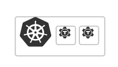
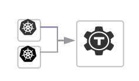

<TileSet>
  <Tile title="Try Teleport on a Local Kubernetes Cluster" href="./getting-started/local.mdx">
    
    Quickly see how Teleport works with Kubernetes on your laptop.
  </Tile>
  <Tile title="Teleport Cluster in Kubernetes" href="./getting-started/cluster.mdx">
    
    Deploy a standalone Teleport cluster in a Kubernetes cluster.
  </Tile>
  <Tile title="Teleport Kubernetes Agent" href="./getting-started/agent.mdx">
    
    Connect a Kubernetes cluster to an existing Teleport cluster.
  </Tile>
</TileSet>
