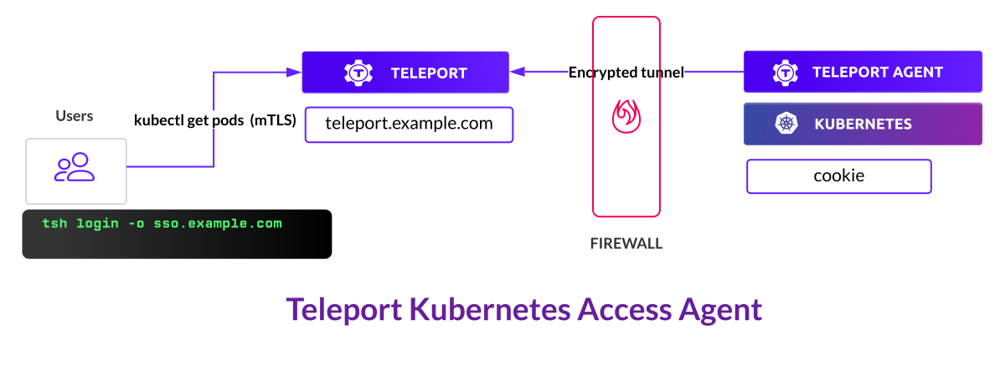

## Prerequisites

<Tabs>
<TabItem scope={["oss"]} label="Open Source">

- A running Teleport cluster. For details on how to set this up, see one of our
  [Getting Started](../../getting-started.mdx) guides. 

- The `jq` tool to process `JSON` output. This is available via common package managers.

- The `tctl` admin tool version >= (=teleport.version=).

  ```code
  $ tctl version
  # Teleport v(=teleport.version=) go(=teleport.golang=)
  ```

  See [Installation](../../installation.mdx) for details.

  (!docs/pages/includes/tctl.mdx!)

</TabItem>
<TabItem
  scope={["enterprise"]} label="Enterprise">

- A running Teleport cluster. For details on how to set this up, see one of our
  [Getting Started](../../getting-started.mdx) guides.

- The `jq` tool to process `JSON` output. This is available via common package managers.

- The `tctl` admin tool version >= (=teleport.version=), which you can download
  by visiting the
  [customer portal](https://dashboard.gravitational.com/web/login).

  ```code
  $ tctl version
  # Teleport Enterprise v(=teleport.version=) go(=teleport.golang=)
  ```

  (!docs/pages/includes/tctl.mdx!)

</TabItem>
<TabItem scope={["cloud"]}
  label="Teleport Cloud">

- A Teleport Cloud account. If you do not have one, visit the
  [sign up page](https://goteleport.com/signup/) to begin your free trial.

- The `jq` tool to process `JSON` output. This is available via common package
  managers.

- The Enterprise version of the `tctl` admin tool. To download this, visit
the [customer portal](https://dashboard.gravitational.com/web/login).

  ```code
  $ tctl version
  # Teleport v(=teleport.version=) go(=teleport.golang=)
  ```

  (!docs/pages/includes/tctl.mdx!)

</TabItem>
</Tabs>


(!docs/pages/includes/kubernetes-access/helm-k8s.mdx!)

(!docs/pages/includes/tctl.mdx!)

## Deployment overview

In this guide, we deploy the Teleport Kubernetes Service, which connects
Kubernetes cluster `cookie` to Teleport cluster `tele.example.com`:

<Notice type="tip" scope={["cloud"]}>

In your Teleport Cloud account, the name of your cluster will be your tenant
domain name, e.g., `mytenant.teleport.sh`, rather than `teleport.example.com`.

</Notice>

<Figure align="left" bordered caption="Kubernetes agent dialing back to Teleport cluster">
  
</Figure>

## Step 1/2. Get a join token

In order to start the Teleport Kubernetes Service, we will need to request a
join token from the Teleport Auth Service:

```code
# Create a join token for the Teleport Kubernetes Service to authenticate
$ TOKEN=$(tctl nodes add --roles=kube --ttl=10000h --format=json | jq -r '.[0]')
$ echo $TOKEN
```

## Step 2/2. Deploy teleport-kube-agent


<Tabs>
<TabItem scope={["oss", "enterprise"]} label="Self-Hosted">

Switch `kubectl` to the Kubernetes cluster `cookie` and run the following
commands, assigning `PROXY_ADDR` to the address of your Auth Service or Proxy
Service.

```code
# Add teleport-agent chart to charts repository
$ PROXY_ADDR=tele.example.com:443
$ helm repo add teleport https://charts.releases.teleport.dev
$ helm repo update

# Install Kubernetes agent. It dials back to the Teleport cluster at $PROXY_ADDR
$ CLUSTER='cookie'
$ helm install teleport-agent teleport/teleport-kube-agent --set kubeClusterName=${CLUSTER?} \
  --set proxyAddr=${PROXY_ADDR?} --set authToken=${TOKEN?} --create-namespace --namespace=teleport-agent
```

</TabItem>
<TabItem scope={["cloud"]} label="Teleport Cloud">

Switch `kubectl` to the Kubernetes cluster `cookie` and run the following
commands, assigning `PROXY_ADDR` to the address of your Teleport Cloud tenant.

```code
# Add teleport-agent chart to charts repository
$ PROXY_ADDR=mytenant.teleport.sh
$ helm repo add teleport https://charts.releases.teleport.dev
$ helm repo update

# Install Kubernetes agent. It dials back to the Teleport cluster at $PROXY_ADDR
$ CLUSTER='cookie'
$ helm install teleport-agent teleport/teleport-kube-agent --set kubeClusterName=${CLUSTER?} \
  --set proxyAddr=${PROXY_ADDR?} --set authToken=${TOKEN?} --create-namespace --namespace=teleport-agent
```

</TabItem>
</Tabs>

List connected clusters using `tsh kube ls` and switch between
them using `tsh kube login`:

```code
$ tsh kube ls

# Kube Cluster Name Selected 
# ----------------- -------- 
# cookie

# kubeconfig now points to the cookie cluster
$ tsh kube login cookie
# Logged into kubernetes cluster "cookie"

# kubectl command executed on `cookie` but is routed through the Teleport cluster.
$ kubectl get pods
```

## Next Steps

- Take a look at a [kube-agent helm chart reference](../helm/reference/teleport-kube-agent.mdx) for a full list of parameters.
