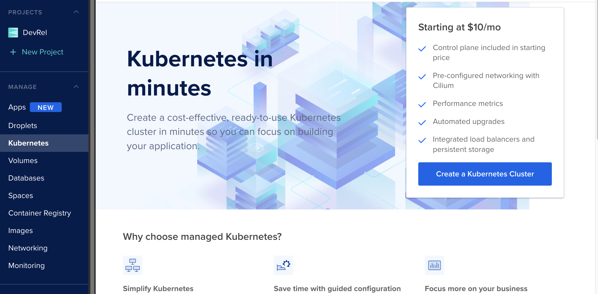
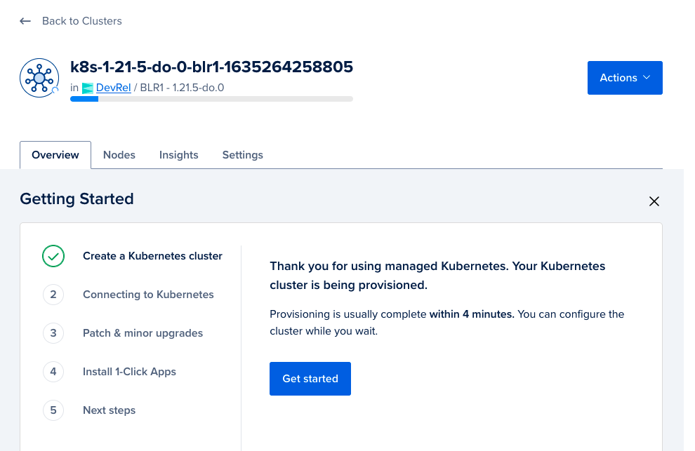
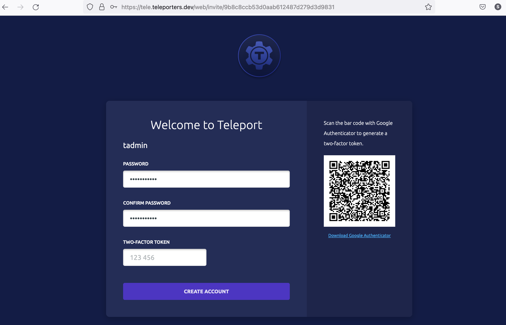
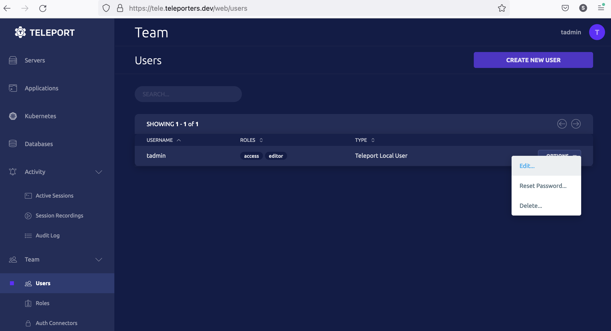
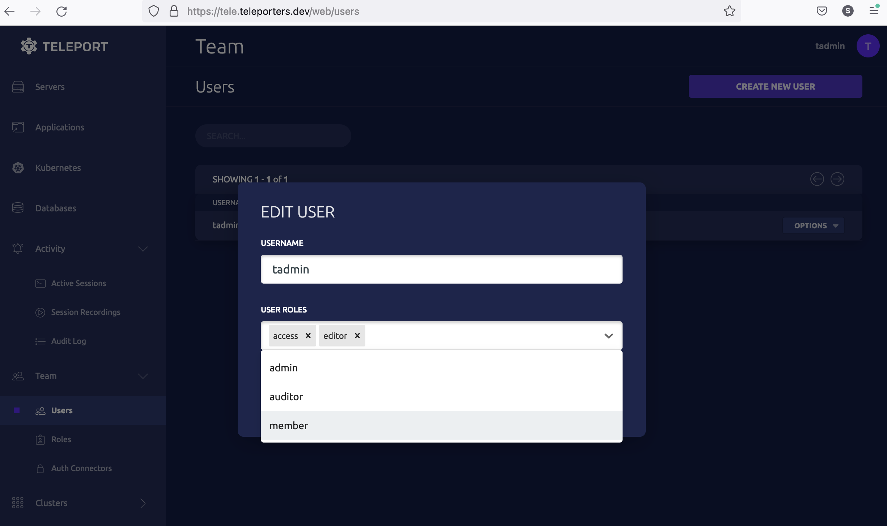

This guide will show you how to get started with Teleport on DigitalOcean managed Kubernetes cluster.  Specifically, we will 
1. Create a DigitalOcean Kubernetes cluster, 
2. Install Teleport in this cluster with helm, 
3. Create a Teleport user, create a Kubernetes role and assign a Teleport user with a Kubernetes role.
4. Log in to `tsh` client and access the Kubernetes cluster. 

## Prerequisites
1. DigitalOcean account.
2. Your workstation setup with [Kubectl](https://kubernetes.io/docs/tasks/tools/), [Helm](https://helm.sh/docs/intro/install/), [Doctl](https://docs.digitalocean.com/reference/doctl/how-to/install/), and Teleport [tsh](https://goteleport.com/docs/installation/) client.

<Admonition
  type="note"
  title="Note"
>
Throughout this tutorial, we are using a domain name `tele.teleporters.dev` as a `clusterName`. By default, Teleport auth and proxy server's address are also configured with the value of a `clusterName`. Therefore, make sure to replace this domain with a domain name you manage.  
</Admonition>

## Step 1/4. Setup DigitalOcean Kubernetes Cluster 
Create a new [DigitalOcean Kubernetes Cluster](https://cloud.digitalocean.com/kubernetes/clusters/)



While the Kubernetes cluster is being provisioned, set up your kubectl client with reference to getting started guide available in DigitalOcean:




## Step 2/4. Install Teleport 

Add Teleport repository to helm.

```code
$ helm repo add teleport https://charts.releases.teleport.dev
```

Install Teleport in Kubernetes cluster using helm chart.
```code
$ helm install teleport-cluster teleport/teleport-cluster --create-namespace --namespace=teleport-cluster \
  --set clusterName=tele.teleporters.dev(replace with your preferred domain name) \
  --set acme=true \
  --set acmeEmail=dodemo@goteleport.com(replace with your email)
NAME: teleport-cluster
LAST DEPLOYED: Tue Oct 26 17:01:21 2021
NAMESPACE: teleport-cluster
STATUS: deployed
REVISION: 1
TEST SUITE: None
```

### Update DNS for `clusterName`
First, get external IP for the Kubernetes cluster. The `EXTERNAL-IP` field may take a few minutes to show a public IP address, so continue trying this command until you see a public IP address.

```code

$ kubectl --namespace=teleport-cluster get services
NAME               TYPE           CLUSTER-IP      EXTERNAL-IP       PORT(S)          AGE
# teleport-cluster   LoadBalancer   10.245.163.12   144.126.252.144   443:31959/TCP,3023:30525/TCP,3026:30079/TCP,3024:32437/TCP   19m

```

Once you can see the value for `EXTERNAL-IP`(public IP address), update your DNS record such that the clusterName's A record points to this IP address. For example `144.126.252.144` is the public IP in the above case.

## Step 3/4. Create Teleport User
Now we create a Teleport user by executing the `tctl` command with `kubectl`.

```code
$ kubectl --namespace teleport-cluster exec deploy/teleport-cluster -- tctl users add tadmin --roles=access,editor --logins=root,ubuntu
# User "tadmin" has been created but requires a password. Share this URL with the user to complete user setup, link is valid for 1h:
# https://tele.teleporters.dev:443/web/invite/9b8c8ccb53d0aab612487d279d3d9831

# NOTE: Make sure tele.teleporters.dev:443 points at a Teleport proxy which users can access.
```

Copy the link shown after executing the above command and open the link in a web browser to complete user registration process (the link is `https://tele.teleporters.dev:443/web/invite/9b8c8ccb53d0aab612487d279d3d9831` in the above case).


After you complete the registration process by setting up a password and enrolling in two-factor authentication, you will be logged in to Teleport WebUI. 

In this step, we created a user **tadmin** with roles `access, edit`. These are the default roles available in Teleport. However, to allow this user to access the Kubernetes cluster, we will need to assign **tadmin** a role authorized to access the Kubernetes cluster. So first, let's create a role named **member** with the Kubernetes privilege `system:master`.

#### Create a new Kubernetes Role name "member"
Create a file name `member.yaml` with the following spec:
```code
$ vi member.yaml
kind: role
version: v4
metadata:
  name: member
spec:
  allow:
    kubernetes_groups: ["system:masters"]

```
<Admonition
  type="warning"
  title="Warning"
>
`system:masters` is a Kubernetes built-in role that is similar to `sudo` permissions in Linux systems. It is used here for demonstration purposes and should be sparingly used in production.
</Admonition>

Next, create this role in Kubernetes with the command:

```code

$ POD=$(kubectl --namespace=teleport-cluster get pod -l app=teleport-cluster -o jsonpath='{.items[0].metadata.name}')
$ kubectl --namespace=teleport-cluster exec -i ${POD?} -- tctl create -f < member.yaml
```

#### Assign "member" role to user "tadmin"
Now we will assign Teleport user **tadmin** with this role. The example below shows a process using Teleport WebUI:
First, lets select user edit menu:


Second, update user role to assign **member** role:


We've update user **tadmin** with a role **member** whish is allowed to access Kubernetes cluster with privilege `system:master`.

## Step 4/4. Connect to Kubernetes cluster using Teleport

The following steps show how to access the Kubernetes cluster using `tsh`.

**Login to Teleport:**
First, login to Teleport using `tsh`.
```code 
$ tsh login --proxy=tele.teleporters.dev:443 --auth=local --user=tadmin(we created this user earlier)
Enter password for Teleport user tadmin:
Enter your OTP token:
540255
> Profile URL:        https://tele.teleporters.dev:443
  Logged in as:       tadmin
  Cluster:            tele.teleporters.dev
  Roles:              access, editor
  Logins:             root, ubuntu
  Kubernetes:         enabled
  Valid until:        2021-10-27 06:37:15 +0000 UTC [valid for 12h0m0s]
  Extensions:         permit-agent-forwarding, permit-port-forwarding, permit-pty
```
To write kubectl configuration to a separate file instead of having your global kubectl configuration modified, run the following command:
```code
$ export KUBECONFIG=${HOME?}/teleport-kubeconfig.yaml
```

**Select the Kubernetes cluster:**
```code
$ tsh kube login tele.teleporters.dev
Logged into kubernetes cluster "tele.teleporters.dev"
```


**Connect to the Kubernetes cluster:**
```code
$ kubectl --namespace=teleport-cluster get pods
NAME                                READY   STATUS    RESTARTS   AGE
teleport-cluster-6cc679b6f6-7xr5h   1/1     Running   0          14h
```
Voila! User **tadmin** was able to list pod in DigitalOcean Kubernetes cluster. 

Teleport keeps an audit log of access made by users. The below image shows a screenshot of the Teleport WebUI audit log page showing user **tadmin** access to the Kubernetes cluster.


## Next steps
- [Connect Multiple Kubernetes Clusters](../../guides/multiple-clusters.mdx)
- [Setup CI/CD Access with Teleport](../../guides/cicd.mdx)
- [Federated Access using Trusted Clusters](../../guides/federation.mdx)
- [Single-Sign On and Kubernetes Access Control](../../controls.mdx)