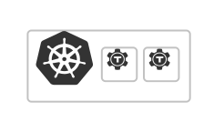

<TileSet>
<ScopedBlock scope={["oss", "enterprise"]}>
    <Tile href="./reference/teleport-cluster.mdx" icon="kubernetes" title="teleport-cluster">
    

    Deploy the Teleport Auth Service and Proxy Service on Kubernetes.

    </Tile>
</ScopedBlock>
<Tile href="./reference/teleport-kube-agent.mdx" icon="kubernetes" title="teleport-kube-agent">

Deploy the Teleport Kubernetes Service, Application Service, or Database Service on Kubernetes.

</Tile>
</TileSet>
