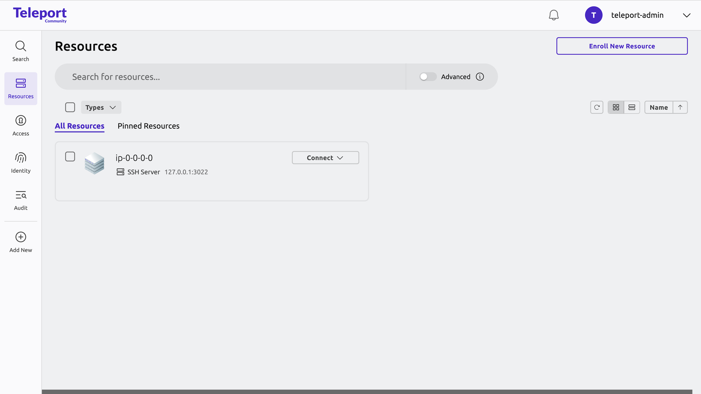

See how a self-hosted Teleport deployment works by completing the tutorial
below. This shows you how to spin up a single-instance Teleport cluster on a
Linux server (or a Linux container running locally) using Teleport Community
Edition. Once you deploy the cluster, you can configure RBAC, register
resources, and protect your small-scale demo environments or home lab.

You can also get started right away with a production-ready Teleport cluster by
signing up for a [free trial of Teleport Enterprise
Cloud](https://goteleport.com/signup/).

## How it works

In this guide, we show you how to run the following Teleport services on a
single Linux server:

- **Teleport Auth Service:** The certificate authority for your cluster. It
  issues certificates and conducts authentication challenges. The Auth Service
  is typically inaccessible outside your private network.
- **Teleport Proxy Service:** The cluster frontend, which handles user requests,
  forwards user credentials to the Auth Service, and communicates with Teleport
  instances that enable access to specific resources in your infrastructure.
- **Teleport SSH Service:** An SSH server implementation that takes advantage of
  Teleport's short-lived certificates, sophisticated RBAC, session recording,
  and other features.


## Prerequisites

You will need the following to deploy a demo Teleport cluster. If your
environment doesn't meet the prerequisites, you can get started with Teleport by
signing up for a [free trial of Teleport Enterprise
Cloud](https://goteleport.com/signup/).

If you want to get a feel for Teleport commands and capabilities without setting
up any infrastructure, take a look at the browser-based [Teleport
Labs](https://goteleport.com/labs).

You can follow this guide with either a remote virtual machine (e.g., an Amazon
EC2 instance) or a local Docker container. Make sure you have met the following
requirements for your platform:

<Tabs>
<TabItem label="Remote virtual machine">

- A Linux host with only port `443` open to ingress traffic. You must be able to
  install and run software on the host. Either configure access to the host via
  SSH for the initial setup (and open an SSH port in addition to port `443`) or
  enter the commands in this guide into an Amazon EC2 [user data
  script](https://docs.aws.amazon.com/AWSEC2/latest/UserGuide/user-data.html),
  Google Compute Engine [startup
  script](https://cloud.google.com/compute/docs/instances/startup-scripts), or
  similar.

You must also have **one** of the following:
- A registered domain name.
- An authoritative DNS nameserver managed by your organization, plus an existing
  certificate authority. If using this approach, ensure that your browser is
  configured to use your organization's nameserver.
</TabItem>
<TabItem label="Local Docker container">

1. Install [mkcert](https://github.com/FiloSottile/mkcert) so you can set up a
   local certificate authority and create a certificate for running the Teleport
   Web UI with HTTPS.

1. Install the mkcert CA:

   ```code
   $ mkcert -install
   ```

1. Create a directory on your workstation in which to place TLS credentials for
   Teleport:

   ```code
   $ mkdir teleport-tls
   ```

1. Generate a certificate and private key for Teleport:

   ```code
   $ cd teleport-tls
   $ mkcert localhost
   ```

1. Add the mkcert CA certificate to the `teleport-tls` directory so your Docker
   container can access it:

   ```code
   $ cp "$(mkcert -CAROOT)/rootCA.pem" .
   ```

1. Start a local Docker container where you can follow the remaining
   instructions in this guide:

   ```code
   $ docker run -it -v .:/etc/teleport-tls -p 3080:443 ubuntu:22.04
   ```

1. Make sure `curl` is installed on your container:

   ```code
   $ apt-get update && apt-get install -y curl
   ```

1. On the container, move the mkcert CA certificate into the directory where
   your container stores CA certs (installing `curl` sets this up for you). When
   starting, Teleport verifies its TLS certificate against the CA:

   ```code
   $ cp /etc/teleport-tls/rootCA.pem /etc/ssl/certs/mkcertCA.pem
   ```

</TabItem>
</Tabs>

Finally, you will need a multi-factor authenticator app such as
[Authy](https://authy.com/download/), [Google
Authenticator](https://www.google.com/landing/2step/), or
[1Password](https://support.1password.com/one-time-passwords/).

## Step 1/4. Configure DNS

If you are following this guide with a local Docker container, you can skip to
[Step 2](#step-24-set-up-teleport-on-your-linux-host).

If you are following this guide with a virtual machine, set up two DNS `A`
records, each pointing to the IP address of your Linux host. Assuming
`teleport.example.com` is your domain name, set up records for:

|Domain|Reason|
|---|---|
|`teleport.example.com`|Traffic to the Proxy Service from users and services.|
|`*.teleport.example.com`|Traffic to web applications registered with Teleport. Teleport issues a subdomain of your cluster's domain name to each application.|

## Step 2/4. Set up Teleport on your Linux host

In this step, you will log into your Linux host, download the Teleport binary,
generate a Teleport configuration file, and start the Teleport Auth Service,
Proxy Service, and SSH Service on the host.

### Install Teleport

On your Linux host or container, run the following command to install the
Teleport binary:

```code
$ curl (=teleport.teleport_install_script_url=) | bash -s (=teleport.version=)
```

### Configure Teleport

Generate a configuration file for Teleport using the `teleport configure` command.
This command requires information about a TLS certificate and private key.

The instructions depend on whether you are running Teleport on the public
internet, a local container, or a private network:

<Tabs>

  <TabItem label="Public internet deployment with Let's Encrypt">
    Let's Encrypt verifies that you control the domain name of your Teleport cluster
    by communicating with the HTTPS server listening on port 443 of your Teleport
    Proxy Service.

    You can configure the Teleport Proxy Service to complete the Let's Encrypt
    verification process when it starts up.

    On the host where you will start the Teleport Auth Service and Proxy Service,
    run the following `teleport configure` command. Assign 
    <Var name="teleport.example.com" /> to the
    domain name of your Teleport cluster and <Var name="user@example.com" /> to
    an email address used for notifications (you can use any domain):

    ```code
    $ sudo teleport configure -o file \
        --acme --acme-email=<Var name="user@example.com" description="Your email address to register with Let's Encrypt for TLS certificates" /> \
        --cluster-name=<Var name="teleport.example.com" description="The domain name of your Teleport cluster" />
    ```

    Port 443 on your Teleport Proxy Service host must allow traffic from all sources.
  </TabItem>
  <TabItem label="Docker container">

  The Docker container you started while beginning this guide mounts the
  `teleport-tls` directory in `/etc/`, including a TLS certificate and private
  key for Teleport.

  On the container, run the following `teleport configure` command: 

  ```code
  $ teleport configure -o file \
      --cluster-name=localhost \
      --public-addr=localhost:443 \
      --cert-file=/etc/teleport-tls/localhost.pem \
      --key-file=/etc/teleport-tls/localhost-key.pem
  ```
  </TabItem>
  <TabItem label="Private network deployment">
  On your Teleport host, place a valid private key and a certificate chain in `/var/lib/teleport/privkey.pem`
  and `/var/lib/teleport/fullchain.pem` respectively.

  The leaf certificate must have a subject that corresponds to the domain of your Teleport host, e.g., `*.teleport.example.com`.

  On the host where you will start the Teleport Auth Service and Proxy Service,
  run the following `teleport configure` command. Assign <Var
  name="teleport.example.com" /> to the domain name of your Teleport cluster.

  ```code
  $ sudo teleport configure -o file \
      --cluster-name=<Var name="teleport.example.com" /> \
      --public-addr=<Var name="teleport.example.com" />:443 \
      --cert-file=/var/lib/teleport/fullchain.pem \
      --key-file=/var/lib/teleport/privkey.pem
  ```
  </TabItem>
</Tabs>

### Start Teleport

1. Start Teleport on your virtual machine or container by following the
   instructions below:

   <Tabs>
   <TabItem label="Virtual machine">
   
   Enable and start the Teleport systemd service:
   
   ```code
   $ sudo systemctl enable teleport
   $ sudo systemctl start teleport
   ```
   
   </TabItem>
   <TabItem label="Local container">
   
   Run the following command:
   
   ```code
   $ teleport start --config="/etc/teleport.yaml"
   ```
   
   </TabItem>
   </Tabs>

1. Access the Teleport Web UI via HTTPS at the domain you created earlier at
   <Var name="teleport.example.com" /> and accept the terms of using Teleport
   Community Edition.

   If you are running Teleport on a local Docker container, visit
   https://localhost:3080.

   You should see a welcome screen similar to the following:

   

## Step 3/4. Create a Teleport user and set up multi-factor authentication

In this step, we'll create a new Teleport user, `teleport-admin`, which is
allowed to log into SSH hosts as any of the principals `root`, `ubuntu`, or
`ec2-user`.

1. If you following this guide on a local container, open another terminal and
   access your container:

   ```code
   $ docker exec -it <CONTAINER_ID> /bin/bash
   ```

1. On your VM or container, run the following command (remove `sudo` if using a
   local container). `tctl` is a client tool for configuring the Teleport Auth
   Service:

   ```code
   $ sudo tctl users add teleport-admin --roles=editor,access --logins=root,ubuntu,ec2-user
   ```

   The command prints a message similar to the following:
   
   ```text
   User "teleport-admin" has been created but requires a password. Share this URL with the user to complete user setup, link is valid for 1h:
   https://teleport.example.com:443/web/invite/123abc456def789ghi123abc456def78
   
   NOTE: Make sure teleport.example.com:443 points at a Teleport proxy which users can access.
   ```

   If using a local container, replace the host and port with `localhost:3080`.

1. Visit the provided URL in order to create your Teleport user.

   <Admonition
     type="tip"
     title="OS User Mappings"
   >
   
     The users that you specify in the `logins` flag (e.g., `root`, `ubuntu` and
     `ec2-user` in our examples) must exist on your Linux host. Otherwise, you
     will get authentication errors later in this tutorial.
   
     If a user does not already exist, you can create it with `adduser <login>` or
     use [host user creation](enroll-resources/server-access/guides/host-user-creation.mdx).
   
     If you do not have the permission to create new users on the Linux host, run
     `tctl users add teleport $(whoami)` to explicitly allow Teleport to
     authenticate as the user that you have currently logged in as.
   
   </Admonition>

1. Teleport enforces the use of multi-factor authentication by default. It
   supports one-time passwords (OTP) and multi-factor authenticators (WebAuthn).
   In this guide, you will need to enroll an OTP authenticator application using
   the QR code on the Teleport welcome screen.

<details>
<summary>Logging in via the CLI</summary>

In addition to Teleport's Web UI, you can access resources in your
infrastructure via the `tsh` client tool.

Install `tsh` on your local workstation:

(!docs/pages/includes/install-tsh.mdx!)

Log in to receive short-lived certificates from Teleport. Replace 
<Var name="teleport.example.com" /> with your Teleport cluster's public address
as configured above:

```code
$ tsh login --proxy=<Var name="teleport.example.com" /> --user=teleport-admin
> Profile URL:        https://teleport.example.com:443
  Logged in as:       teleport-admin
  Cluster:            teleport.example.com
  Roles:              access, editor
  Logins:             root, ubuntu, ec2-user
  Kubernetes:         enabled
  Valid until:        2022-04-26 03:04:46 -0400 EDT [valid for 12h0m0s]
  Extensions:         permit-agent-forwarding, permit-port-forwarding, permit-pty
```

</details>

## Step 4/4. Enroll your infrastructure

Once you finish setting up your user, you will see your SSH server in the
Teleport Web UI:



With Teleport, you can protect all of the resources in your infrastructure
behind a single identity-aware access proxy, including servers, databases,
applications, Kubernetes clusters, Windows desktops, and cloud provider APIs.

To enroll a resource with Teleport, visit the Web UI and click **Enroll New
Resource**. The Web UI will show you the steps you can take to enroll your new
resource.

## Next step: deploy Teleport Agents

Teleport **Agents** proxy traffic to infrastructure resources like servers,
databases, Kubernetes clusters, cloud provider APIs, and Windows desktops. 

Step 4 showed you how to install agents manually, and you can also launch agents
and enroll resources with them using infrastructure-as-code tools. For example,
you can use Terraform to declare a pool of Teleport Agents and configure them to
proxy your infrastructure. Read [Protect Infrastructure with Teleport](enroll-resources/agents/agents.mdx) to get started.
