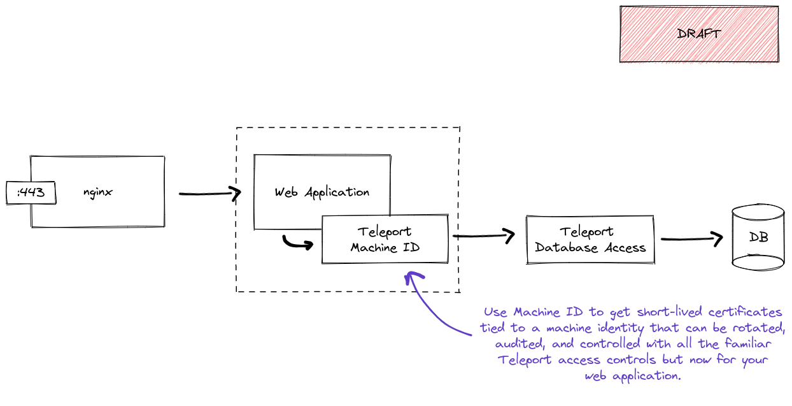

In this guide, we will demonstrate how to use Machine ID to access a database
protected by Teleport from a custom application.

You may already be using Teleport Database Access to protect your database
when humans access it. Machine ID can be used to protect your data when
machines, like web applications, access your data as well. With Machine ID you
will be able to get the same short-lived certificates tied to a machine
identity that can be rotated, audited, and controlled with all the familiar
Teleport access controls.

<Figure align="left" bordered caption="Machine ID and Database Access Deployment">
  
</Figure>

## Prerequisites

You will need [Teleport Enterprise](../../enterprise/introduction.mdx) or
[Teleport Cloud](../../cloud/introduction.mdx) >= 9.3.0 

If you have not already put your database behind Teleport Database Access,
follow the [Database Access Getting Started Guide](../../docs/pages/database-access/getting-started.mdx).
Database Access supports databases like PostgreSQL, MongoDB, Redis, and much
more. See our [Database Access Guides](../../docs/database-access/guides/) for
a complete list.

If you have not already setup Machine ID, follow the
[Machine ID Getting Started Guide](../../docs/pages/machine-id/getting-started.mdx)
to familiarize yourself with Machine ID.

Lastly, ensure both the `tbot` and `tsh` executables are available on your
desired client system.

## Step 1/3. Create a Machine ID bot and assign permissions

In the example below, you will create a bot user named `app` and assign
this bot user the `machine-id-db` role.

First, create a role that Machine ID can use to access your database:

```yaml
kind: role
version: v5
metadata:
  name: machine-id-db
spec:
  allow:
    db_labels:
      '*': '*'
    db_names: [example]
    db_users: [alice]
    rules:
      - resources: [db_server, db]
        verbs: [read, list]
```

This role allows Machine ID bots to do two things:
 1. Access the database `example` on any database server (due to the `'*': '*'`
    label selector) as the user `alice`. You may restrict access to the bot
    using a more specific label selector; see the [Database Access RBAC 
    guide](../../database-access/rbac.mdx) for more info.
 2. Discover information about databases in Teleport.

Write this to `role.yaml` and run the following to create the role in Teleport:

```code
$ tctl create -f role.yaml
```

With the role created, create a new bot and allow it to assume the new role.

<Details scope={["cloud"]} scopeOnly={true}>
On your client machine, log in to Teleport using `tsh` before using `tctl` to
create the bot:

```code
$ tctl bots add app --roles=machine-id-db
```
</Details>
<Details scope={["oss","enterprise"]} scopeOnly={true}>
Connect to the Teleport Auth Server and use `tctl` to create the bot:

```code
$ tctl bots add app --roles=machine-id-db
```
</Details>

## Step 2/3. Configure and start Machine ID

Next, we'll run Machine ID alongside our database client app to begin fetching
credentials.

Start by creating a configuration file for Machine ID at `/etc/tbot.yaml`:

<Details scope={["cloud"]} scopeOnly={true}>
```yaml
auth_server: "example.teleport.sh:443"
onboarding:
  join_method: "token"
  token: "00000000000000000000000000000000"
  ca_pins:
  - "sha256:1111111111111111111111111111111111111111111111111111111111111111"
storage:
  directory: /var/lib/teleport/bot
destinations:
  - directory: /opt/machine-id

    database:
      service: example-server
      username: alice
      database: example

    # If using MongoDB, be sure to include the Mongo-formatted certificates:
    configs:
      - mongo
```
</Details>
<Details scope={["oss","enterprise"]} scopeOnly={true}>
```yaml
auth_server: "auth.example.com:3025"
onboarding:
  join_method: "token"
  token: "00000000000000000000000000000000"
  ca_pins:
  - "sha256:1111111111111111111111111111111111111111111111111111111111111111"
storage:
  directory: /var/lib/teleport/bot
destinations:
  - directory: /opt/machine-id
    
    database:
      service: example-server
      username: alice
      database: example
    
    # If using MongoDB, be sure to include the Mongo-formatted certificates:
    configs:
      - mongo
```
</Details>

Be sure to configure the `token` and `ca_pins` fields to match the output from
`tctl bots add ...`.

Machine ID also allows you to use Linux ACLs to control access to certificates
on disk. You will use this to ensure only your application has access to the
short-lived certificates Machine ID uses.

We'll work with the assumption you will be running Machine ID as the Linux user
`teleport` and your application as the Linux user `app`. Create and initialize
the destination directory by running this `tbot init` command either as `root`
or as the `teleport` user:

```code
$ tbot init \
    -c /etc/tbot.yaml \
    --init-dir=/opt/machine-id \
    --bot-user=teleport \
    --owner=teleport:teleport \
    --reader-user=app
```

<Admonition type="note" title="`tbot init` Note">
Be sure to re-run `tbot init ...` as shown here if config templates are added
or removed from `tbot.yaml`. You may run into permissions errors if `tbot init`
is not run for new files.
</Admonition>

Next, you will use systemd to run Machine ID in the background on your
application node. Create a systemd.unit file at
`/etc/systemd/system/machine-id.service`:

```systemd
[Unit]
Description=Teleport Machine ID Service
After=network.target

[Service]
Type=simple
User=teleport
Group=teleport
Restart=on-failure
ExecStart=/usr/local/bin/tbot start -c /etc/tbot.yaml
ExecReload=/bin/kill -HUP $MAINPID
PIDFile=/run/machine-id.pid
LimitNOFILE=8192

[Install]
WantedBy=multi-user.target
```

Additionally, we'll need to create a secondary service to manage the database
proxy. Create another unit file at `/etc/systemd/system/machine-id-proxy.service`:

```systemd
[Unit]
Description=Teleport Machine ID Proxy Service
After=network.target
Requires=machine-id.service

[Service]
Type=simple
User=teleport
Group=teleport
Restart=on-failure
ExecStart=/usr/local/bin/tbot -c /etc/tbot.yaml proxy --proxy=proxy.example.com:3080 --destination-dir=/opt/machine-id db --port=12345 example-server
ExecReload=/bin/kill -HUP $MAINPID
PIDFile=/run/machine-id-proxy.pid
LimitNOFILE=8192

[Install]
WantedBy=multi-user.target
```

This will start a local proxy on port `12345` at which you may connect to the
`example-server` database server. Be sure to customize the `tbot` parameters as
necessary for your local setup.

Finally, run the following commands to start Machine ID:

```code
$ sudo systemctl daemon-reload 
$ sudo systemctl start machine-id machine-id-proxy
$ sudo systemctl status machine-id machine-id-proxy
```

## Step 3/3. Update and run your application

In the default proxy mode, database clients must also be configured to use
`tbot`'s generated TLS certificates. This ensures no other users of the system
can access the database via the local proxy, and ensures the connection between
your database client and server is never unencrypted, even over localhost.

The standard TLS credentials may be found in your configured destination
directory which in this example is `/opt/machine-id`. The certificate may be
found at `/opt/machine-id/tlscert` along with the private key
`/opt/machine-id/key` and CA at `/opt/machine-id/teleport-database-ca.crt`.
These are compatible with most database clients.

Certain databases may require specially-formatted certificates; where
supported, `tbot` provides configuration templates you may configure via the
`tbot.yaml` config file on a per-destination basis:

| Database Type | Template Name | Description                          |
|---------------|---------------|--------------------------------------|
| MongoDB       | `mongo`       | Provides `mongo.crt` and `mongo.cas` |
| CockroachDB   | `cockroach`   | Provides `cockroach/node.key`, `cockroach/node.crt`, and `cockroach/ca.crt` |
| Generic TLS   | `tls`         | Provides `tls.key`, `tls.crt`, and `tls.cas` (for generic clients that require specific file extensions.) |

The `mongo` template is enabled in the example `tbot.yaml` shown
above. If config template changes are needed, be sure to re-run `tbot init ...`
to configure the new output files, then restart `tbot` with
`systemctl restart machine-id machine-id-proxy`.

<Admonition type="note" title="TLS Configuration Note">
If desired, the `--tunnel` flag may be passed to `tbot proxy db ...` to
authenticate automatically at the proxy level, however this will decrease
security as all users of the system will be able to connect to the database
without any additional authentication.
</Admonition>

Once the necessary credentials for your database are ready to use, refer to
these sample Go programs to test connectivity to your database.

<Tabs>
  <TabItem label="Self-Hosted PostgreSQL">
  ```go
  (!docs/pages/includes/machine-id/postgresql/postgresql.go!)
  ```
  </TabItem>
  <TabItem label="Self-Hosted MongoDB">
  ```go
  (!docs/pages/includes/machine-id/mongodb/mongodb.go!)
  ```
  </TabItem>
</Tabs>

You are all set. You have provided your application with short-lived
certificates tied to a machine identity that can be used to access your
database that can be rotated, audited, and controlled with all the familiar
Teleport access controls.
