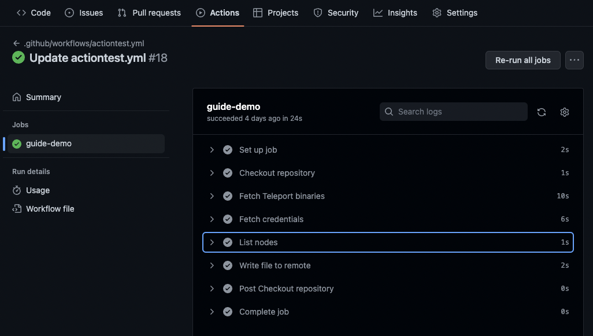

<Details
  title="Version warning"
  opened={true}
  scope={["oss", "enterprise"]}
  scopeOnly={true}
  min="11.0"
>
  Machine ID for GitHub Actions is available starting from Teleport `v11.0`.
</Details>

GitHub Actions is a popular CI/CD platform that works as a part of the larger GitHub
ecosystem. Teleport, with the help of Machine ID, allows for GitHub Actions to
securely interact with Teleport protected resources without the need for long lived
credentials. By ensuring that rotated Machine ID credentials are additionally limited by RBAC,
GitHub Actions with Teleport can be applied as both a viable and secure solution whenever a
CI/CD platform is needed.

Teleport supports secure joining on both GitHub-hosted and self-hosted GitHub
Actions runners as well as GitHub Enterprise Server.

## Prerequisites

(!docs/pages/includes/edition-prereqs-tabs.mdx!)

(!docs/pages/includes/tctl.mdx!)

- A node that is a part of the Teleport cluster with [Server Access](../../server-access/introduction.mdx).
- Your user should have the privileges to create token resources.
- A GitHub repository with GitHub Actions enabled. This guide uses the example `gravitational/example`
repo, however this value should be replaced with your own unique repo.

## Step 1/3. Create a join token for GitHub Actions

(!docs/pages/includes/machine-id/github-actions-create-token.mdx!)

## Step 2/3. Create your Machine ID bot

With the join token for GitHub Actions created, the next step is to create the Machine ID bot,
and ensure that it is configured to use the newly created token.

The Machine ID bot created in this example will be used to access a specific node on the cluster
via `tsh ssh`, and will therefore require a role that can access the cluster as needed. This example
configuration will apply the `access` role, however care should be taken to either create or apply
a role according to the principle of least privilege in production environments. Additionally, it
should have explicit access to the cluster using a username created specifically for the bot user alone.

Enter the following command from your workstation with `tsh` access, replacing the `username` value with
a Linux user on the host that you want your GitHub Actions flow to be able to connect to:

```code
$ tctl bots add github-demo --roles=access --token=github-token --logins=username
```

## Step 3/3. Configure GitHub Actions

Now that the bot has been successfully created, GitHub Actions can authenticate with the Teleport cluster using their GitHub-provided identity.

In the GitHub workflows directory of your repo (`.github/workflows/`) create a new workflow YAML file,
in this case `actionstest.yml`, that will reflect the action you'd like to configure. This guide will create an action that
will both list nodes within the cluster using `tsh ls`, as well as write the commit SHA that triggered the workflow to
a file on a node. To create this configuration, use the following YAML file:

```yaml
# This is a basic workflow to help you get started.
# It will take the following action whenever a push is made to the "main" branch.
on:
  push:
    branches:
      - main
jobs:
  demo:
    permissions:
      # The "id-token: write" permission is required or Machine ID will not be able to authenticate with the cluster.
      id-token: write
      contents: read
    # The name of the workflow, and the Linux distro to be used to perform the required steps.
    name: guide-demo
    runs-on: ubuntu-latest
    steps:
      - name: Checkout repository
        uses: actions/checkout@v3
      - name: Fetch Teleport binaries
        uses: teleport-actions/setup@v1
        with:
          version: (=teleport.version=)
      - name: Fetch credentials using Machine ID
        id: auth
        uses: teleport-actions/auth@v1
        with:
          # Use the address of the auth/proxy server for your own cluster.
          proxy: example.domain:443
          # Use the name of the join token resource you created in step 1.
          token: github-token
          # Specify the length of time that the generated credentials should be
          # valid for. This is optional and defaults to "1h"
          certificate-ttl: 1h
      - name: List nodes
        # Enters a command from the cluster, in this case "tsh ls" using Machine ID credentials to list remote SSH nodes.
        run: tsh -i ${{ steps.auth.outputs.identity-file }} ls
      - name: Write file to remote
        # Enters a command from the cluster, in this case "tsh ssh" using Machine ID credentials to gain SSH access to an SSH node, and then write the commit hash to the "github_run_log" file.
        # Ensure that that `username` matches the username of a remote SSH username, and that hostname matches an SSH host name that is a part of the Teleport cluster configured for access.
        run: tsh -i ${{ steps.auth.outputs.identity-file }} ssh username@hostname "echo $GITHUB_SHA >> ~/github_run_log"
```

From Teleport 11.1.0, the `-i` parameter for configuring the identity file of
`tsh` is not necessary and `-i ${{ steps.auth.outputs.identity-file }}` can be
omitted.

Add, commit, and push your changes to the `main` branch of the repository.

Navigate to the **Actions** tab of your GitHub repository in your web browser.
Select the **Workflow** that has now been created and triggered by the change,
and select the `guide-demo` job. The GitHub Actions workflow may take some time
to complete, and will resemble the following once successful.



Expand the **List nodes** step of the action, and the output will
list all nodes in the cluster, from the perspective of the
Machine ID bot using the command `tsh ls`.

## A note on security implications and risk

Once `teleport-actions/auth` has been used in a workflow job, all successive
steps in that job will have access to the credentials which grant access to your
Teleport cluster as the bot. Where possible, run as few steps as necessary after
this action has been used. It may be a good idea to break your workflow up into
multiple jobs in order to segregate these credentials from other code running in
your CI/CD pipeline.

Most importantly, ensure that the role you assign to your GitHub Actions bot has
access to only the resources in your Teleport cluster that your CI/CD needs to
interact with.

## Next steps

You can find out more about the `teleport-action/setup` and
`teleport-actions/auth` actions on their GitHub repositories:

- [https://github.com/teleport-actions/setup](https://github.com/teleport-actions/setup)
- [https://github.com/teleport-actions/auth](https://github.com/teleport-actions/auth)

For more information about GitHub Actions itself, read
[their documentation](https://docs.github.com/en/actions).
