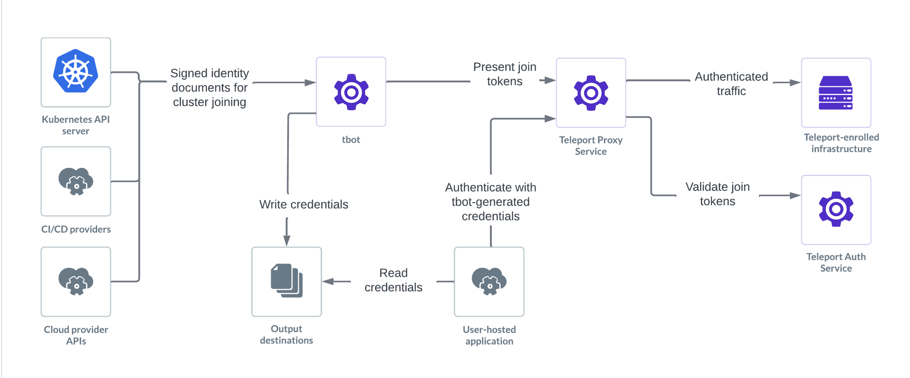

Teleport Machine ID enables machines, such as CI/CD workflows, to securely
authenticate with your Teleport cluster in order to connect to resources and
configure the cluster itself. This is sometimes referred to as
machine-to-machine access.

Machine ID supports a number of use cases and platforms, but is commonly used
for:

- Granting CI/CD workflows access to resources such as SSH servers,
  Kubernetes clusters, databases and applications that are protected by Teleport
  in order to deploy changes.
- Granting SecOps tooling access to resources in order to run security analysis
  against them.
- Creating and renewing credentials for custom scripts that use `tctl` or
  the Teleport API in order to control Teleport configuration.

## Concepts

Read this section to understand the high-level architecture of a Machine ID
setup. For a more in-depth overview, check out the [architecture
page](./architecture.mdx).

### Bots

Machine ID provides machines with an identity that can authenticate to the
Teleport cluster. This identity is known as a **bot**. Bots share a number of
similarities with human users:

- Access controlled by roles assigned to them in Teleport
- Access to resources recorded in audit logs
- Identity encoded in an x.509 client certificate which is signed by the
  Teleport Auth Service and which can then be used for access.

### Join tokens

Unlike a human Teleport user, a bot does not "log in" using a static username
and password. Instead, a bot authenticates to Teleport with a **join token**,
which is configured within Teleport and specifies which bot user it grants
access to and what sort of proof (known as the **join method**) is needed to use
this join token. This proof is typically an identity issued to the machine by
the platform it runs on (e.g. AWS IAM).

### tbot

Machine ID is used through an agent called `tbot`. `tbot` authenticates with the
Teleport Cluster and then generates credentials and configuration files for
other tools to use to connect to Teleport resources using the bot's identity.

### Artifacts

The files generated by `tbot` are referred to as its **artifacts**. Artifacts
can be a number of things from credentials, such as signed certificates, to
configuration files that will automatically configure a tool (such as `kubectl`)
to use Teleport. This behaviour is controlled by configuring `tbot`'s
**outputs**. An output specifies what should be generated and where it should be
saved.

## Get started

For a quickstart non-production introduction to Machine ID, read the
[Getting Started Guide](./getting-started.mdx).

## Deploy to production

Production-ready guidance on deploying Machine ID is broken out into two parts:

- [Deploying Machine ID](./deployment.mdx): How to install and configure
  Machine ID for a specific platform.
- [Access your Infrastructure with Machine ID](./access-guides.mdx): How to use Machine ID to access
  Teleport and Teleport resources.

## Further reading

- [Workload Identity](./workload-identity.mdx): Information on Teleport Workload
  Identity for SPIFFE, a feature for issuing short-lived identities intended
  for workload to workload communication.
- [Frequently Asked Questions](./faq.mdx): Commonly asked questions.
- [Troubleshooting Guide](./troubleshooting.mdx): Common issues and how to solve
  them.
- [Architecture](./architecture.mdx): A technical deep-dive into how Machine ID
  works.
- [Reference](./reference.mdx): Complete documentation of available
  configuration options.
- [Manifesto](./manifesto.mdx): Our vision for Machine Identity and the
  direction Machine ID and Workload ID are heading in.
