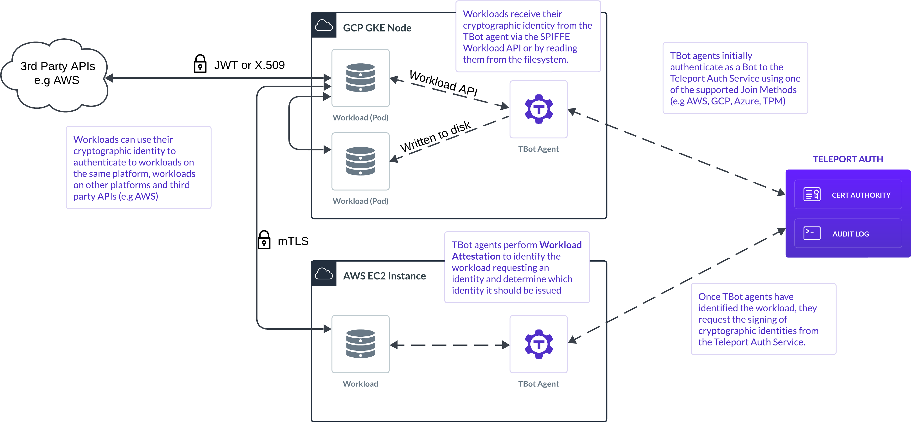

Teleport offers two complementary identity solutions for non-human entities in your infrastructure: **Secure Access for machines** and **Universal Identities**. 
Together, they provide a secure, scalable foundation for automated systems, workloads, and services to authenticate and interact across your environment without relying on long-lived secrets.

## Secure Access for machines

**Teleport Machine ID** enables machines such as CI/CD workflows, automation scripts, and SecOps tools to securely authenticate with your Teleport cluster. 
Once authenticated, they can access protected infrastructure (like SSH servers, Kubernetes clusters, databases, and web applications) or configure the cluster itself.

### How Secure Access works

Machines are assigned a Teleport identity known as a **bot**, which behaves similarly to a human user:

- Access is controlled by roles in Teleport.
- Activity is recorded in the audit log.
- Credentials are short-lived X.509 certificates signed by the Teleport Auth Service.

Bots authenticate using **join tokens**, which specify the bot identity and the required **join method** (e.g., AWS IAM). Each instance of a bot that joins using `tbot` creates a server-side **Bot Instance**, which tracks authentication attempts and renewals.

### tbot and artifacts

The `tbot` agent manages authentication with the cluster and generates **artifacts**—credentials and configuration files used by the machine to interact with Teleport resources. 
These artifacts can include:

- SSH certificates
- Kubernetes configuration
- Teleport configuration for CLI tools

Artifacts are generated based on configured `outputs`, which define what to generate and where to save them.

## Universal Identities

**Teleport Universal Identity** issues short-lived cryptographic identities (SPIFFE Verifiable Identity Documents or SVIDs) to workloads such as microservices or containerized applications. These identities can be used for:

- Mutual TLS between services
- Authentication to third-party APIs (e.g., AWS, GCP)
- Internal workload-to-workload authentication

### How Universal Identity works

Teleport establishes a root certificate authority that issues these identities. The `tbot` agent is deployed alongside the workload and handles:

- Requesting and renewing identities
- Delivering them to the workload via filesystem or Kubernetes secrets
- Optionally exposing the [SPIFFE Workload API](https://github.com/spiffe/spiffe/blob/main/standards/SPIFFE_Workload_API.md)

You can also enable **Workload Attestation** to restrict identity issuance to specific workloads (e.g., based on UID, GID, or Kubernetes pod metadata), eliminating the need for bootstrapping secrets.

### Standards-based and interoperable

Teleport Universal Identity is compatible with the [SPIFFE](../../machine-workload-identity/quick-links/spiffe.mdx) standard, allowing you to use a wide range of existing tools and SDKs. The identity includes a URI-based **SPIFFE ID** and is delivered as a short-lived X.509 certificate or JWT.

## Unified use cases

Secure Access and Universal Identity can be used together to support advanced automation and microservice architectures:

### CI/CD pipelines with secure deployment

A pipeline authenticates to Teleport via the Proxy to deploy workloads to Kubernetes, while also pushing images to a cloud registry. Services deployed by the pipeline receive SPIFFE identities for secure internal communication.

### Cloud-native app with third-party API access

A Kubernetes-based app uses Universal Identity for internal mTLS communication and JWTs for secure third-party API access. Automation tools configure the cluster via Machine ID.

### Secure Access implementation

- Automation scripts authenticate via short-lived credentials
- Workloads receive cryptographically verifiable identities
- All identity usage is logged in Teleport’s unified audit log

## Key differences

| Feature | Universal Identity | Secure Access |
|---------|------------------------------|--------------------------------|
| Purpose | Authenticate workloads to other workloads or third-party APIs | Authenticate bots to Teleport to access infrastructure |
| Standards | SPIFFE (SVIDs, Workload API, mTLS, JWT) | Teleport-native X.509 credentials |
| Proxy Usage | No Teleport Proxy involved | Access goes through the Teleport Proxy |
| Credential Delivery | Filesystem or SPIFFE API via tbot | Artifacts written to disk via tbot |
| Use Case Focus | Service-to-service authentication | Infrastructure and configuration access |

## Learn More

- [Getting Started with Machine ID](./getting-started.mdx)
- [Deploying Machine ID to Production](../../machine-workload-identity/guides/deployment/deployment.mdx)
- [Access Guides for Machine ID](../guides/access-guides/access-guides.mdx)
- [Universal Identity Overview](../../machine-workload-identity/workload-identity/getting-started.mdx)
- [Machine ID Architecture](../../reference/architecture/machine-id-architecture.mdx)
- [What is SPIFFE?](../../machine-workload-identity/quick-links/spiffe.mdx)
