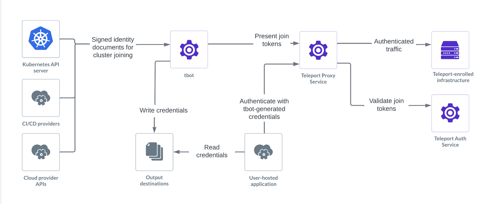

Teleport Machine & Workload Identity offers two complementary sets of capabilities for non-human entities in your infrastructure:

- **Zero Trust Access for machines**: 
Enables machines (like CI/CD pipelines) to securely authenticate with your Teleport cluster to access protected resources and configure the cluster itself.
- **Flexible Workload Identities**: 
Issues short-lived cryptographic identities to workloads, compatible with the SPIFFE standard, enabling secure workload-to-workload communication and third-party API authentication.

## Secure service-to-service authentication

Establish a root certificate authority within your Teleport cluster that issues short-lived JWTs and X509 certificates to workloads. These identities ([SPIFFE](../machine-workload-identity/workload-identity/spiffe.mdx) Verifiable Identity Documents or SVIDs) contain the workload's identity encoded as a URI (SPIFFE ID).

Key benefits:

- Eliminates long-lived shared secrets
- Establishes a universal form of identity for workloads
- Simplifies infrastructure by reducing authentication methods

The tbot agent manages identity requests and renewals, authenticating to the Teleport cluster using supported join methods. Workloads receive identities either through filesystem/Kubernetes secrets or via the SPIFFE Workload API.

## Zero Trust Access for machines

Teleport provides machines with an identity ("bot") that can authenticate to the Teleport cluster. Bots are similar to human users with access controlled by roles and activities recorded in audit logs.

Bots authenticate using join tokens that specify which bot user they grant access to and what proof (join method) is needed. Each tbot client connection creates a server-side Bot Instance to track installations over time.

## Integrated use cases

Zero Trust Access & Flexible Workload Identity can work together to create a comprehensive security model. Machines can securely access resources while workloads communicate securely with each other and external services, all managed through Teleport's unified access plane.

### CI/CD pipeline with end-to-end authentication

A [CI/CD system](./use-cases/mwi-ci-cd.mdx) securely deploys services to Kubernetes and establishes secure communication channels between them:

- The pipeline authenticates through the proxy to deploy to Kubernetes and receives credentials to interact with cloud APIs (e.g., to push container images)
- Services deployed by the pipeline receive SPIFFE identities for mutual TLS. The pipeline manages the identity lifecycle for the services it deploys

### Cloud-native application with third-party API access

A Kubernetes-based application needs access to both internal services and external APIs:

- Automation tools authenticate to configure the cluster securely
- Application components are issued SPIFFE identities
- Identities authenticate to internal services via mTLS
- JWT-based authentication is used for external API access

### Zero Trust security implementation

A [Zero Trust strategy](../machine-workload-identity/workload-identity/getting-started.mdx) is applied across workloads and automation:

- Automation scripts authenticate through the proxy to perform infrastructure tasks
- Workloads authenticate using short-lived, cryptographically verifiable identities
- Security teams use Teleport’s unified audit logs to trace all identity activity

### Identity-based communication without shared secrets

Zero-trust, identity-based communication without shared secrets are rotated automatically without human involvement.

Instead of managing static credentials (e.g., API keys, database passwords), workloads authenticate using short-lived X.509 certificates or JWTs compatible with the SPIFFE/SPIRE standard.

- The service issues new identities to workloads on a regular schedule, dynamically issued by Teleport’s Auth Service and rotate automatically
- All identity issuance and usage is recorded in audit logs

## Key differences

**Flexible Workload Identities**: Issues SPIFFE-compatible identities for various authentication purposes; doesn't use Teleport Proxy for workload-to-workload communication

**Zero Trust Access for machines**: Issues Teleport-specific credentials for accessing resources secured by Teleport; requires using the Teleport Proxy

| Feature | Flexible Workload Identities | Zero Trust Access for machines |
|---------|------------------------------|--------------------------------|
| Purpose | Authenticate workloads to other workloads or third-party APIs | Authenticate bots to Teleport to access infrastructure |
| Standards | SPIFFE (SVIDs, Workload API, mTLS, JWT) | Teleport-native X.509 credentials |
| Proxy Usage | No Teleport Proxy involved | Access goes through the Teleport Proxy |
| Use Case Focus | Service-to-service authentication | Infrastructure and configuration access |
| Credential Delivery | Filesystem or SPIFFE API via tbot | Artifacts written to disk via tbot |

## Concepts

Read this section to understand the high-level architecture of a Machine &
Workload Identity setup. For a more in-depth overview, check out the [architecture
page](../reference/architecture/machine-id-architecture.mdx).

### Bots

Machine & Workload Identity provides machines with an identity that can
authenticate to the Teleport cluster. This identity is known as a **bot**. Bots
share a number of similarities with human users:

- Access controlled by roles assigned to them in Teleport
- Access to resources recorded in audit logs
- Identity encoded in an x.509 client certificate which is signed by the
Teleport Auth Service and which can then be used for access.

### Join tokens

Unlike a human Teleport user, a bot does not "log in" using a static username
and password. Instead, a bot authenticates to Teleport with a **join token**,
which is configured within Teleport and specifies which bot user it grants
access to and what sort of proof (known as the **join method**) is needed to use
this join token. This proof is typically an identity issued to the machine by
the platform it runs on (e.g. AWS IAM).

Multiple join tokens may be created for a single bot to allow joining with
different join methods.

### Bot Instances

Each time a new `tbot` client joins from scratch, it creates a new server-side
Bot Instance. Bot Instances keep track of individual `tbot` installations over
time, even as they renew their certificates or rejoin. These server-side
resources also record the most recent authentication attempts, as well as
bot heartbeats.

Many Bot Instances can exist concurrently for a given Bot, regardless of their
join method.

Bot Instances can be inspected with:
- `tctl get bot_instance` to list all instances
- `tctl get bot_instance/$botName` to list all instances associated with a
particular Bot
- `tctl get bot_instance/$botName/$id` to show a single bot instance by its bot
name and ID

### tbot

Machine & Workload Identity is used through an agent called `tbot`. `tbot`
authenticates with the Teleport Cluster and then generates credentials and
configuration files for other tools to use to connect to Teleport resources
using the bot's identity.

### Artifacts

The files generated by `tbot` are referred to as its **artifacts**. Artifacts
can be a number of things from credentials, such as signed certificates, to
configuration files that will automatically configure a tool (such as `kubectl`)
to use Teleport. This behaviour is controlled by configuring `tbot`'s
**services**. A service specifies what should be generated and where it should
be saved.

## Further reading

For a quickstart non-production introduction to Machine & Workload Identity, read the
[Getting Started Guide](./getting-started.mdx).

Production-ready guidance on deploying Machine & Workload Identity is broken out into two parts:

- [Deploying `tbot`](./deployment/deployment.mdx): How to install and configure
`tbot` on specific platforms.
- [Access your Infrastructure using `tbot`](./access-guides/access-guides.mdx):
How to use `tbot` to access Infrastructure through Teleport.

Reference information:

- [Workload Identity](./workload-identity/introduction.mdx): Information on Teleport Workload
Identity for SPIFFE, a feature for issuing short-lived identities intended
for workload to workload communication.
- [Frequently Asked Questions](./faq.mdx): Commonly asked questions.
- [Troubleshooting Guide](./troubleshooting.mdx): Common issues and how to solve
them.
- [Architecture](../reference/architecture/machine-id-architecture.mdx): A technical deep-dive into how Machine &
Workload Identity works.
- [Reference](../reference/machine-workload-identity/machine-workload-identity.mdx): Complete documentation of available
configuration options.
- [Manifesto](./manifesto.mdx): Our vision for Machine & Workload Identity.
