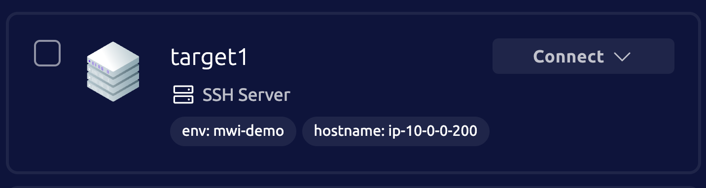
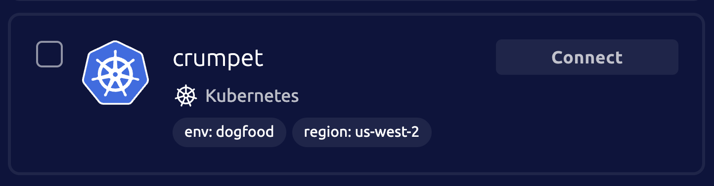

{/* lint disable page-structure remark-lint */}

Teleport Machine and Workload Identity (MWI) provides secure access across multiple platforms and resource types,
supporting everything from [Infrastructure-as-Code](../iac-mwi.mdx) workflows to [AI agent](../ai-agents-mwi.mdx)
operations. This guide focuses on a popular implementation: executing commands on deployment targets through CI/CD
pipelines. Even if your specific use case differs, this guide covers the fundamental MWI setup process, after which you
can reference our dedicated use case pages for tool-specific guidance.

Here's an overview of what you will do:

- Choose a Linux server or Kubernetes cluster as your target resource.
- Create a Role for your Bot, or choose an existing one.
- Create a Bot in Teleport with a role allowing it to access your target resource.
- Create a GitHub join token for the Bot.
- Set up a GitHub Actions workflow that authenticates and issues a command using the `tbot` binary.

This guide covers configuring MWI for development and learning purposes.
For a production-ready configuration of MWI, visit the [Deploying Machine
ID](deployment/deployment.mdx) guides.

## Prerequisites

In this getting started guide, you will configure MWI to issue commands to a Linux
server or Kubernetes cluster from a GitHub Actions workflow. Linux servers
and Kubernetes clusters are the most common targets in Teleport, so you don't need to set up new
infrastructure. If you need a new target resource in Teleport, create an SSH server
or Kubernetes cluster you can let the bot access before starting.

- A GitHub repository where you have permissions to create a GitHub Actions workflows.
  - You can fork the [example repository for this guide](https://github.com/asteroid-earth/mwi-getting-started-guide) to go faster.
- A target resource enrolled in Teleport, either:
  - A Linux server
  - A Kubernetes cluster

If you don't have a target resource that you can use, follow one of the [guides](../../enroll-resources/enroll-resources.mdx)
for enrolling a new resource.

(!docs/pages/includes/edition-prereqs-tabs.mdx!)

(!/docs/pages/includes/tctl.mdx!)

## Step 1/5. Choose a target resource

First choose a target resource that you want to access using Machine and Workload Identity. We will
use the labels for this resource in the Role that we assign to the bot so it can access the resource.

Here are example resources with labels we can reference:

<Tabs>
<TabItem label="Server">



You can also find your nodes with the following command:

```code
$ tctl nodes ls --format=text

Host    UUID                                 Public Address Labels                              Version
------- ------------------------------------ -------------- ----------------------------------- -------
target1 8a50c8aa-c45f-403c-95ff-83f50561d64c                env=mwi-demo,hostname=ip-10-0-0-200 18.1.5
```
</TabItem>
<TabItem label="Kubernetes">


You can also find your clusters with the following command:

```code
$ tctl kube ls --format=text

Cluster  Labels                        Version
-------- ----------------------------- -------
crumpet  env=dogfood,region=us-west-2  18.1.5
```
</TabItem>
</Tabs>

## Step 2/5. Choose or create a role

If you have an existing role that allows access to your target resource, you can skip this step.
Every Teleport cluster has a default `access` role that allows access to all nodes and clusters,
but if you cannot use that one for this guide, we can quickly make a new, more restrictive role.

<Tabs>
<TabItem label="Server">

Copy the following into a file called `github-bot-role.yaml`, and edit the `node_labels`
field to match the labels on your target resource. You can also change the `logins` field to match the user
you want to log in as on your target resource.

```yaml
kind: role
version: v7
metadata:
  name: github-bot
spec:
  allow:
    logins:
    - ubuntu
    - root
  node_labels:
    env: mwi-demo
```

</TabItem>
<TabItem label="Kubernetes">

Copy the following into a file called `github-bot-role.yaml`, and edit the `kubernetes_labels`
fields to match the labels on your target resource. To make going through this guide more secure,
this role only allows the bot to take actions in the `default` namespace.

```yaml
kind: role
version: v7
metadata:
  name: github-bot
spec:
  allow:
    kubernetes_labels:
      env: dogfood
    kubernetes_groups:
    - system:masters
    kubernetes_resources:
    - kind: '*'
      name: '*'
      namespace: default
      verbs:
      - '*'
```

</TabItem>
</Tabs>

Now run `tctl create` with the file:

```code
$ tctl create -f github-bot-role.yaml
```

## Step 3/5. Create a bot

In Teleport, a **Bot** represents an identity for a machine. This is similar to
how a user represents the identity of a human. Like users, bots are assigned
roles to manage their access to resources.

Use `tctl bots add` to create our bot:

```code
$ tctl bots add github-bot --roles=github-bot
```

## Step 4/5 Create a join token
Unlike users, bots do not authenticate using a username and password or SSO.
Instead, they initially authenticate in a process called joining. Teleport
uses metadata about the platform the bot is running on, such as OIDC endpoints for CI pipelines,
or the Assumed Role of an AWS EC2 Instance, to ensure that only authorized bots can join the cluster.
This means the bot has a verified <i>identity</i>, rather than just a shared secret.

Teleport supports a number of secure [join methods](../../../reference/join-methods/#delegated-join-methods)
specific to the platform the bot is running on. Since we are using GitHub Actions,
we will use the `github` join method.

Copy the following into a file called `github-bot-token.yaml`, and edit the `repository`
field to match the GitHub repository where you will run the GitHub Actions workflow.
When a bot attempts to join from that GitHub organization and repository, Teleport
will identify it as your `github-bot` and assign it the correct role. If a bot attempts
to join from any other repository, it will be rejected.

```yaml
version: v2
metadata:
  name: github-bot
spec:
  join_method: github
  roles:
  - Bot
  bot_name: github-bot
  github:
    allows:
    - repository: "your-github-username/mwi-getting-started-guide" # if you cloned the example repo, if not, use your repo name
```

Now run `tctl create` with the file:

```code
$ tctl create -f github-bot-token.yaml
```


## Step 5/5 Access a resource from GitHub Actions

You can find the files you'll need in the
[example repository](https://github.com/asteroid-earth/mwi-getting-started-guide) for this guide.
We'll examine the files here, but you can fork that repository, or clone it and copy the files to your own.

We have several published [Actions](../../../reference/machine-id/github-actions/#github-actions-helpers)
for convenience, but for this guide we will look at things explicitly to aid understanding.

<Tabs>
<TabItem label="Server">

Our config file for `tbot` is at `action_support/server_bot.yaml`:

```yaml
version: v2
proxy_server: my.cluster.com:443
onboarding:
  join_method: github
  token: github-bot
certificate_ttl: 5m
storage:
  type: memory
outputs:
- type: identity
  destination:
    type: directory
    path: ./ssh-out
```

- Replace the `proxy_server` address with your Teleport Proxy address.
- The `token` value matches the name of the token we created in Step 4/5.
- The certificate_ttl is set to 5 minutes. In production you can make this slightly longer than the runtime of your job, so the identity expires when its purpose is complete.
- The output path is set to `./ssh-out`. This is where `tbot` will output the SSH configuration and credentials that our command will use.

Our workflow is at `.github/workflows/server.yaml`:

```yaml
on:
  workflow_dispatch:

jobs:
  check_resource_usage:
    permissions:
      # The "id-token: write" permission is required, or MWI will not be
      # able to authenticate with the cluster.
      id-token: write
      contents: read
    name: Check resource usage
    runs-on: ubuntu-latest
    steps:
    - name: Checkout repository
      uses: actions/checkout@v3
    - name: Fetch Teleport binaries
      uses: teleport-actions/setup@v1
      with:
        version: auto
    - name: Export ssh config
      run: tbot start --oneshot -c ./action_support/server_bot.yaml
    - name: Run mpstat
      run: |
        ssh -f ./ssh_out/ssh_config ubuntu@target1.my.cluster.com mpstat
```

- In our second step, we use one of the published Actions, which installs the `tbot` binary into the runner.
- Then we run `tbot start` in one-shot mode with our config file. This authenticates the bot, and writes the SSH configuration and credentials to `./ssh_out`, without starting a long-running process.
- Finally we run an ssh command using our new identity. No certificates need to be distributed to the target server, or stored as secrets in the Action.

This kind of workflow can be used with Ansible or any other kind of SSH-based automation.
</TabItem>
<TabItem label="Kubernetes">

Our config file for `tbot` is at `action_support/k8s_bot.yaml`:

```yaml
version: v2
proxy_server: my.cluster.com:443
onboarding:
join_method: github
token: github-bot
certificate_ttl: 5m
storage:
type: memory
outputs:
- type: kubernetes/v2
  selectors:
  - env: myenvlabel
  destination:
    type: directory
    path: ./k8s-out
```

- Replace the `proxy_server` address with your Teleport Proxy address.
- Replace the label selector with your Kubernetes cluster label.
- The `token` value matches the name of the token we created in Step 4/5.
- The certificate_ttl is set to 5 minutes. In production you can make this slightly longer than the runtime of your job, so the identity expires when its purpose is complete.
- The output path is set to `./k8s-out`. This is where `tbot` will output the kubeconfig that our command will use.

Our workflow is at `.github/workflows/k8s.yaml`:

```yaml
on:
  workflow_dispatch:

jobs:
  list_pods:
    permissions:
      # The "id-token: write" permission is required, or MWI will not be
      # able to authenticate with the cluster.
      id-token: write
      contents: read
    name: Run ssh command
    runs-on: ubuntu-latest
    steps:
    - name: Checkout repository
      uses: actions/checkout@v3
    - name: Fetch kubectl
      uses: azure/setup-kubectl@v3
    - name: Fetch Teleport binaries
      uses: teleport-actions/setup@v1
      with:
        version: auto
    - name: Export ssh config
      run: tbot start --oneshot -c ./action_support/server_bot.yaml
    - name: Get pods in default namespace
      run: |
        kubectl --kubeconfig=./k8s_out/config get pods -n default
```

- In our third step, we use one of the published Actions, which installs the `tbot` binary into the runner.
- Then we run `tbot start` in one-shot mode with our config file. This authenticates the bot, and writes the kubeconfig to `./k8s_out`, without starting a long-running process.
- Finally we run a kubectl command using our new identity. No certificates need to be distributed to the target server, or stored as secrets in the Action.

This kind of workflow can be used with Helm to deploy apps, or any other kind of automation that relies on kubeconfig.

</TabItem>
</Tabs>

## Summary

You've successfully set up a workflow in GitHub Actions that can access your resources securely through the Teleport proxy,
without distributing long-lived credentials, making the process more secure and efficient for development teams.

## Next Steps

- Check out the [deployment guides](deployment/deployment.mdx) to learn about
  configuring `tbot` in a production-ready way for your platform.
- Check out the [access guides](access-guides/access-guides.mdx) to learn about configuring
  `tbot` for other use cases than SSH and Kubernetes.
- Read the [configuration reference](../../reference/machine-id/configuration.mdx) to explore
  all the available configuration options.
- Learn how [Workload Identities](../workload-identity/introduction.mdx) enable the same capabilities
  for resources like cloud APIs that can't be protected with the Teleport proxy.
- [More information about `TELEPORT_ANONYMOUS_TELEMETRY`.](../../reference/machine-id/telemetry.mdx)

