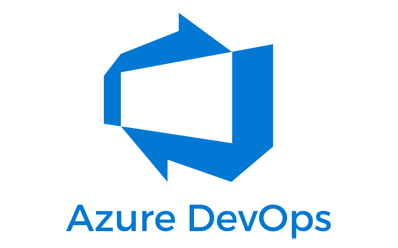
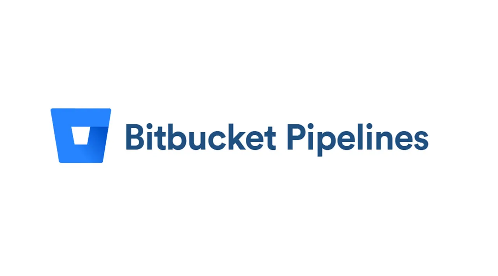

## Choose your CI/CD platform

  <a href="../machine-id/deployment/azure-devops.mdx" style={{ textAlign: "center", textDecoration: "none" }}>
    
    
Azure DevOps

  </a>

  <a href="../machine-id/deployment/bitbucket.mdx" style={{ textAlign: "center", textDecoration: "none" }}>
    
    
BitBucket

  </a>

  <a href="../machine-id/deployment/circleci.mdx" style={{ textAlign: "center", textDecoration: "none" }}>
    
    
CircleCI

  </a>

  <a href="../machine-id/deployment/gitlab.mdx" style={{ textAlign: "center", textDecoration: "none" }}>
    
    
GitLab CI

  </a>

  <a href="../machine-id/deployment/jenkins.mdx" style={{ textAlign: "center", textDecoration: "none" }}>
    
    
Jenkins

  </a>

Teleport Machine & Workload Identity eliminates the need for long-lived static secrets in CI/CD pipelines by issuing short-lived, automatically generated certificates at runtime.
Teleport natively integrates with many CI/CD providers and deployment targets. Refer to the links at the bottom of this page for instructions on using Machine & Workload Identity with your preferred tools.

## Eliminate secrets from your CI/CD pipeline

In a typical CI/CD setup, a pipeline—such as one running in GitHub Actions on GitHub's infrastructure outside the corporate network—builds a container, 
pushes it to AWS Elastic Container Registry (ECR), and updates a Kubernetes deployment using Helm. This workflow requires two sensitive credentials stored 
in the GitHub Actions configuration:

- An AWS keypair
- A Kubernetes config file

Best practices recommend rotating these secrets every six months. The platform team generates new credentials and shares them with the development team, 
who must manually update the repository. Although the credential generation process emits a security log, teams often lack a reliable way to correlate 
it with GitHub's audit logs to verify timely rotation. Sharing credentials via Slack, email, file drops, or password managers adds further risk. 
Moreover, exposing the Kubernetes API to the internet introduces unnecessary surface area for attack.

## Secure and auditable access with ephemeral credentials

Teleport solves these problems by generating two ephemeral credentials at job start:

- A [SPIFFE Verifiable Identity Document (SVID)](https://spiffe.io/spiffe/) used with [AWS IAM Roles Anywhere](https://docs.aws.amazon.com/rolesanywhere/latest/userguide/introduction.html) to authenticate with AWS ECR
- A Kubernetes config file

Both credentials are issued as short-lived X.509 certificates that expire automatically when the job completes. This reduces operational overhead for 
platform and development teams while improving security posture. Teleport logs credential issuance, usage, and all actions executed against the Kubernetes cluster. 
CI/CD processes route Kubernetes commands through the Teleport Proxy, enabling private Kubernetes API endpoints and enhancing cluster security.

Teleport authenticates the CI/CD pipeline using GitHub's OIDC provider, verifying the organization, repository, and Git ref before issuing credentials. 
Because no static secrets reside in the CI/CD system, attackers have nothing to exfiltrate.

### Further reading

- [Architecture](../../reference/architecture/machine-id-architecture.mdx): A technical deep-dive into how Machine ID
  works.
- [Reference](../../reference/machine-id/machine-id.mdx): Complete documentation of available
  configuration options.
