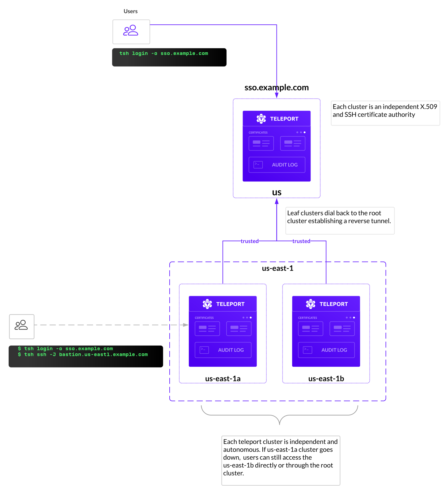

Teleport can partition compute infrastructure into multiple clusters. A cluster
is a group of resources connected to a Teleport Auth Server. Each cluster
manages a separate certificate authority (CA) for all users and resources.

Trusted Clusters allow the users of one cluster, the **root cluster**, to
seamlessly connect to resources in another cluster, the **leaf cluster**, while
remaining authenticated with only a single Auth Service. The leaf cluster can
run behind a firewall without any ingress ports open.

Uses for Trusted Clusters include:

- Managed service providers (MSP) remotely managing the infrastructure of their clients.
- Device manufacturers remotely maintaining computing appliances deployed on premises.
- Large cloud software vendors managing multiple data centers using a common proxy.

Here is an example of an MSP using Trusted Clusters to obtain access to client clusters:


A leaf cluster always creates an outbound reverse SSH tunnel to the root cluster and keeps the tunnel open.

<Notice type="tip">
Individual nodes and proxies can create reverse tunnels to proxy services without creating a new cluster.
You don't need to set up a trusted cluster just to connect a couple of servers, kubernetes clusters or
databases behind a firewall. For more information, see [Adding Nodes to the Cluster](../join-services-to-your-cluster/join-token.mdx).
</Notice>

When a user tries to connect to any resource inside the leaf cluster using the root's proxy
the connection goes through the reverse tunnel.

This guide will explain how to:

- Add and remove Trusted Clusters using CLI commands.
- Enable/disable trust between clusters.
- Establish permission mapping between clusters using Teleport roles.

## Prerequisites

<Tabs>
<TabItem scope={["oss"]} label="Open Source">

- Two running Teleport clusters. For details on how to set up your clusters, see
  our [Getting Started](../../get-started.mdx) guide.

- (!docs/pages/includes/tctl-tsh-prerequisite.mdx!)

  See [Installation](../../installation.mdx) for details.

- A Teleport Node that is joined to one of your clusters. We will refer to this
  cluster as the **leaf cluster** throughout this guide.

  See [Joining Services to your Cluster](../join-services-to-your-cluster.mdx) for how to launch a
  Teleport agent in your cluster.

</TabItem>
<TabItem
  scope={["enterprise"]} label="Enterprise">

- Two running Teleport clusters. For details on how to set up your clusters, see
  our Enterprise [Getting
  Started](../../choose-an-edition/teleport-enterprise/introduction.mdx) guide.

- (!docs/pages/includes/enterprise/tctl-tsh-prerequisite.mdx!)

- A Teleport Node that is joined to one of your clusters. We will refer to this
  cluster as the **leaf cluster** throughout this guide.

  See [Adding Nodes](../join-services-to-your-cluster.mdx) for how to launch a Teleport Node in
  your cluster.

</TabItem>
<TabItem scope={["cloud"]}
  label="Teleport Cloud">

- A Teleport Cloud account. If you do not have one, visit the
  [sign up page](https://goteleport.com/signup/) to begin your free trial.

- A second Teleport cluster, which will act as the leaf cluster. For details on
how to set up this cluster, see our
[Getting Started](../../get-started.mdx) guide.

  As an alternative, you can set up a second Teleport Cloud account.

- (!docs/pages/includes/cloud/tctl-tsh-prerequisite.mdx!)

- A Teleport Node that is joined to one of your clusters. We will refer to this
  cluster as the **leaf cluster** throughout this guide.

  See [Adding Nodes](../join-services-to-your-cluster.mdx) for how to launch a
  Teleport Node in your cluster.

</TabItem>
</Tabs>

(!docs/pages/includes/permission-warning.mdx!)

## Step 1/5. Prepare your environment

In this guide, we will enable users of your root cluster to SSH into the
Teleport Node in your leaf cluster as the user `visitor`. First, we will create
the `visitor` user and a Teleport role that can assume this username when
logging in to your Node.

### Add a user to your Node

On your Node, run the following command to add the `visitor` user:

```code
$ sudo useradd --create-home visitor
```

<Notice type="warning">

This command also creates a home directory for the `visitor` user, which is
required for accessing a shell on the Node.

</Notice>

### Create a role to access your Node

On your local machine, log in to your leaf cluster using your Teleport username:

<ScopedBlock scope="cloud">

```code
# Log out of all clusters to begin this guide from a clean state
$ tsh logout
$ tsh login --proxy=leafcluster.teleport.sh --user=myuser
```

</ScopedBlock>
<ScopedBlock scope={["oss", "enterprise"]}>

```code
# Log out of all clusters to begin this guide from a clean state
$ tsh logout
$ tsh login --proxy=leafcluster.example.com --user=myuser
```

</ScopedBlock>

Create a file called `visitor.yaml` with the
following content:

```yaml
kind: role
version: v5
metadata:
  name: visitor
spec:
  allow:
    logins:
      - visitor
    # In case your Node is labeled, you will need to explicitly allow access
    # to Nodes with labels in order to SSH into your Node.
    node_labels:
      '*': '*'
```

Create the role:

```code
$ tctl create visitor.yaml
role 'visitor' has been created
```

Now you have a `visitor` role on your leaf cluster that enables users to assume
the `visitor` login on your Node.

### Add a login to your root cluster user

The `visitor` role allows users with the `visitor` login to access Nodes in the
leaf cluster. In the next step, we will add the `visitor` login to your user so
you can satisfy the conditions of the role and access the Node.

Make sure that you are logged in to your root cluster.

<ScopedBlock scope={["oss", "enterprise"]}>

```code
$ tsh logout
$ tsh login --proxy=rootcluster.example.com --user=myuser
```

</ScopedBlock>
<ScopedBlock scope={["cloud"]}>

```code
$ tsh logout
$ tsh login --proxy=rootcluster.teleport.sh --user=myuser
```

</ScopedBlock>

Create a file called `user.yaml` with your current user configuration. Replace
`myuser` with your Teleport username:

```code
$ tctl get user/myuser > user.yaml
```

Make the following change to `user.yaml`:

```diff
   traits:
     logins:
+    - visitor
     - ubuntu
     - root
```

Apply your changes:

```code
$ tctl create -f user.yaml
```

In the next section, we will allow users on the root cluster to access your Node
while assuming the `visitor` role.

## Step 2/5. Establish trust between clusters

Teleport establishes trust between the root cluster and a leaf cluster using
a **join token**.

To set up trust between clusters, you will first create a join token via the
root cluster's Auth Service. You will then use the Auth Service on the leaf
cluster to create a `trusted_cluster` resource.

The `trusted_cluster` resource will include the join token, proving to the root
cluster that the leaf cluster is the one you expected to register.

### Create a join token

You can create a join token using the `tctl` tool.

First, log out of all clusters and log in to the root cluster.

<ScopedBlock scope={["oss", "enterprise"]}>

```code
$ tsh logout
$ tsh login --user=myuser --proxy=rootcluster.example.com
> Profile URL:        https://rootcluster.example.com:443
  Logged in as:       myuser
  Cluster:            rootcluster.example.com
  Roles:              access, auditor, editor
  Logins:             root
  Kubernetes:         enabled
  Valid until:        2022-04-29 03:07:22 -0400 EDT [valid for 12h0m0s]
  Extensions:         permit-agent-forwarding, permit-port-forwarding, permit-pty
```

</ScopedBlock>
<ScopedBlock scope={["cloud"]}>

```code
$ tsh login --user=myuser --proxy=myrootclustertenant.teleport.sh
> Profile URL:        https://rootcluster.teleport.sh:443
  Logged in as:       myuser
  Cluster:            rootcluster.teleport.sh
  Roles:              access, auditor, editor
  Logins:             root
  Kubernetes:         enabled
  Valid until:        2022-04-29 03:07:22 -0400 EDT [valid for 12h0m0s]
  Extensions:         permit-agent-forwarding, permit-port-forwarding, permit-pty
```

</ScopedBlock>

Execute the following command on your development machine:

```code
# Generates a Trusted Cluster token to allow an inbound connection from a leaf cluster:
$ tctl tokens add --type=trusted_cluster --ttl=5m
The cluster invite token: (=presets.tokens.first=)
This token will expire in 5 minutes

Use this token when defining a trusted cluster resource on a remote cluster.
```

This command generates a Trusted Cluster join token. The token can be used
multiple times and has an expiration time of 5 minutes.

<Details title="Optional: Add labels">
The `--labels` flag will add labels to the trusted cluster. This lets teams use
the same RBAC controls used on individual resources to approve or deny access
to clusters.
</Details>

Copy the join token for later use. If you need to display your join token again,
run the following command against your root cluster:

```code
$ tctl tokens ls
Token                                                            Type            Labels   Expiry Time (UTC)
---------------------------------------------------------------- --------------- -------- ---------------------------
(=presets.tokens.first=)                                 trusted_cluster          28 Apr 22 19:19 UTC (4m48s)
```

<Details title="Revoking join tokens">

You can revoke a join token with the following command:

```code
$ tctl tokens rm (=presets.tokens.first=)
```

</Details>

<Notice
  type="tip"
>

  It's important to note that join tokens are only used to establish a
  connection for the first time. Clusters will exchange certificates and
  won't use tokens to re-establish their connection afterward.

</Notice>

### Define a Trusted Cluster resource

On your local machine, create a file called `trusted_cluster.yaml` with the
following content:

```yaml
# trusted_cluster.yaml
kind: trusted_cluster
version: v2
metadata:
  name: rootcluster.example.com
spec:
  enabled: true
  token: (=presets.tokens.first=)
  tunnel_addr: rootcluster.example.com:11106
  web_proxy_addr: rootcluster.example.com:443
  role_map:
    - remote: "access"
      local: ["visitor"]
```

Change the fields of `trusted_cluster.yaml` as follows:

#### `metadata.name`

Use the name of your root cluster, e.g., <ScopedBlock
scope={["oss", "enterprise"]}>`teleport.example.com`</ScopedBlock><ScopedBlock scope="cloud">`mytenant.teleport.sh`</ScopedBlock>.

#### `spec.token`

This is join token you created earlier.

#### `spec.tunnel_addr`

This is the reverse tunnel address of the Proxy Service in the root cluster. Run
the following command to retrieve the value you should use:

<ScopedBlock scope={["oss", "enterprise"]}>

```code
$ PROXY=rootcluster.example.com
$ curl https://${PROXY?}/webapi/ping | jq 'if .proxy.tls_routing_enabled == true then .proxy.ssh.public_addr else .proxy.ssh.ssh_tunnel_public_addr end'
"rootcluster.example.com:443"
```

</ScopedBlock>
<ScopedBlock scope={["cloud"]}>

```code
$ PROXY=rootcluster.teleport.sh
$ curl https://${PROXY?}/webapi/ping | jq 'if .proxy.tls_routing_enabled == true then .proxy.ssh.public_addr else .proxy.ssh.ssh_tunnel_public_addr end'
"rootcluster.teleport.sh:443"
```

</ScopedBlock>

#### `web_proxy_addr`

This is the address of the Proxy Service on the root cluster. Obtain this with the
following command:

<ScopedBlock scope={["oss", "enterprise"]}>

```code
$ curl https://${PROXY?}/webapi/ping | jq .proxy.ssh.public_addr
"teleport.example.com:443"
```

</ScopedBlock>
<ScopedBlock scope={["cloud"]}>

```code
$ curl https://${PROXY?}/webapi/ping | jq .proxy.ssh.public_addr
"mytenant.teleport.sh:443"
```

</ScopedBlock>

#### `spec.role_map`

When a leaf cluster establishes trust with a root cluster, it needs a way to
configure access from users in the root cluster. Teleport enables you to limit
access to Trusted Clusters by mapping Teleport roles to cluster labels.

When creating a `trusted_cluster` resource, the administrator of the leaf
cluster must define how roles from the root cluster map to roles on the leaf
cluster.

`trusted_cluster.yaml` uses the following configuration:

```yaml
  role_map:
    - remote: "access"
      local: ["visitor"]
```

Here, if a user has the `access` role on the root cluster, the leaf cluster will grant
them the `visitor` role when they attempt to log in to a Node.

If your user on the root cluster has the `access` role, leave this as it is. If
not, change `access` to one of your user's roles.

<Details title="Role mapping syntax">

### Wildcard characters

In role mappings, the wildcard character `*` is used to match any number of
characters in a string.

For example, if we wanted to let *any* user from the root cluster connect to the
leaf cluster, we can use a wildcard `*` in the `role_map` like this:

```yaml
role_map:
  - remote: "*"
    local: [access]
```

In this example, we are mapping any roles on the root cluster that begin with
`cluster-` to the role `clusteradmin` on the leaf cluster.

```yaml
role_map:
   - remote: 'cluster-*'
     local: [clusteradmin]
```

### Regular expressions

You can also use regular expressions to map user roles from one cluster to
another. Our regular expression syntax enables you to use capture groups to
reference part of an remote role name that matches a regular expression in the
corresponding local role:

```yaml
  # In this example, remote users with a remote role called 'remote-one' will be
  # mapped to a local role called 'local-one', and `remote-two` becomes `local-two`, etc:
  - remote: "^remote-(.*)$"
    local: [local-$1]
```

Regular expression matching is activated only when the expression starts
with `^` and ends with `$`.

Regular expressions use Google's re2 syntax, which you can read about in the re2 [syntax guide](https://github.com/google/re2/wiki/Syntax).

</Details>

<Details title="Sharing user traits between Trusted Clusters">

You can share user SSH logins, Kubernetes users/groups, and database users/names between Trusted Clusters.

Suppose you have a root cluster with a role named `root` and the following
allow rules:

```yaml
logins: ["root"]
kubernetes_groups: ["system:masters"]
kubernetes_users: ["alice"]
db_users: ["postgres"]
db_names: ["dev", "metrics"]
```

When setting up the Trusted Cluster relationship, the leaf cluster can choose
to map this `root` cluster role to its own `admin` role:

```yaml
role_map:
- remote: "root"
  local: ["admin"]
```

The role `admin` of the leaf cluster can now be set up to use the root cluster's
role logins, Kubernetes groups and other traits using the following variables:

```yaml
logins: ["{{internal.logins}}"]
kubernetes_groups: ["{{internal.kubernetes_groups}}"]
kubernetes_users: ["{{internal.kubernetes_users}}"]
db_users: ["{{internal.db_users}}"]
db_names: ["{{internal.db_names}}"]
```

User traits that come from the identity provider (such as OIDC claims or SAML
attributes) are also passed to the leaf clusters and can be access in the role
templates using `external` variable prefix:

```yaml
logins: ["{{internal.logins}}", "{{external.logins_from_okta}}"]
node_labels:
  env: "{{external.env_from_okta}}"
```

</Details>

### Create your Trusted Cluster resource

Log out of the root cluster.

```code
$ tsh logout
```

Log in to the leaf cluster:

<ScopedBlock scope={["oss", "enterprise"]}>

```code
$ tsh login --user=myuser --proxy=leafcluster.example.com
```

</ScopedBlock>
<ScopedBlock scope={["cloud"]}>

```code
$ tsh login --user=myuser --proxy=leafcluster.teleport.sh
```

</ScopedBlock>

Create the Trusted Cluster:

```code
$ tctl create trusted_cluster.yaml
```

<Details title="Creating Trusted Clusters via the Web UI">

You can easily configure leaf nodes using the Teleport Web UI.

Here is an example of creating trust between a leaf and a root node.

</Details>

<Details
  type="tip"
  title="Update role mappings"
>

You can update the role mappings within the `trusted_cluster` resource we created earlier by modifying the resource definition (`trusted_cluster.yaml`) to indicate the new role mappings in the `role_map` field.

Then, update the trusted cluster resource on the leaf cluster side:

```code
$ tctl create --force trusted_cluster.yaml
```

</Details>

Log out of the leaf cluster and log back in to the root cluster. When you run
`tsh clusters`, you should see listings for both the root cluster and the leaf
cluster:

<ScopedBlock scope={["oss", "enterprise"]}>

```code
$ tsh clusters
tsh clusters
Cluster Name                                          Status Cluster Type Selected
----------------------------------------------------- ------ ------------ --------
rootcluster.example.com                               online root         *
leafcluster.example.com                               online leaf
```
</ScopedBlock>
<ScopedBlock scope={["cloud"]}>

```code
$ tsh clusters
Cluster Name                                          Status Cluster Type Selected
----------------------------------------------------- ------ ------------ --------
rootcluster.teleport.sh                               online root         *
leafcluster.teleport.sh                               online leaf
```
</ScopedBlock>

## Step 3/5. Manage access to your Trusted Cluster

### Apply labels

When you created a `trusted_cluster` resource on the leaf cluster, the leaf
cluster's Auth Service sent a request to the root cluster's Proxy Service to
validate the Trusted Cluster. After validating the request, the root cluster's
Auth Service created a `remote_cluster` resource to represent the Trusted
Cluster.

By applying labels to the `remote_cluster` resource on the root cluster, you can
manage access to the leaf cluster. It is not possible to manage labels on the
leaf cluster—allowing leaf clusters to propagate their own labels could create a
problem with rogue clusters updating their labels to unexpected values.

To retrieve a `remote_cluster`, make sure you are logged in to the root cluster
and run the following command:

```code
$ tctl get rc

kind: remote_cluster
metadata:
  id: 1651261581522597792
  name: leafcluster.teleport.sh
status:
  connection: online
  last_heartbeat: "2022-04-29T19:45:35.052864534Z"
version: v3
```

Still logged in to the root cluster, use `tctl` to update the labels on the leaf
cluster:

<ScopedBlock scope="cloud">

```code
$ tctl update rc/leafcluster.teleport.sh --set-labels=env=demo

# Cluster leafcluster.teleport.sh has been updated
```

</ScopedBlock>
<ScopedBlock scope={["oss", "enterprise"]}>

```code
$ tctl update rc/leafcluster.example.com --set-labels=env=demo

# Cluster leafcluster.example.com has been updated
```

</ScopedBlock>

### Change cluster access privileges

At this point, the `tctl get rc` command may return an empty result, and
`tsh clusters` may only display the root cluster.

This is because, if a Trusted Cluster has a label, a user must have explicit
permission to access clusters with that label. Otherwise, the Auth Service will
not return information about that cluster when a user runs `tctl get rc` or
`tsh clusters`.

While logged in to the root cluster, create a role that allows access to your
Trusted Cluster by adding the following content to a file called
`demo-cluster-access.yaml`:

```yaml
kind: role
metadata:
  name: demo-cluster-access
spec:
  allow:
    cluster_labels:
      'env': 'demo'
version: v5
```

Create the role:

```code
$ tctl create demo-cluster-access.yaml
role 'demo-cluster-access' has been created
```

(!docs/pages/includes/add-role-to-user.mdx role="demo-cluster-access"!)

Confirm that the updated labels have been set:

```code
$ tctl get rc

$ sudo tctl get rc
kind: remote_cluster
metadata:
  id: 1651262381521336026
  labels:
    env: demo
  name: rootcluster.example.com
status:
  connection: online
  last_heartbeat: "2022-04-29T19:55:35.053054594Z"
version: v3
```

## Step 4/5. Access a Node in your remote cluster

With the `trusted_cluster` resource you created earlier, you can log in to the
Node in your leaf cluster as a user of your root cluster.

First, make sure that you are logged in to root cluster:

<ScopedBlock scope={["oss", "enterprise"]}>

```code
$ tsh logout
$ tsh --proxy=rootcluster.example.com --user=myuser login
```

</ScopedBlock>
<ScopedBlock scope="cloud">

```code
$ tsh logout
$ tsh --proxy=rootcluster.teleport.sh --user=myuser login
```

</ScopedBlock>

To log in to your Node, confirm that your Node is joined to your leaf cluster:

```code
$ tsh ls --cluster=leafcluster.example.com

Node Name       Address        Labels
--------------- -------------- ------------------------------------
mynode          127.0.0.1:3022 env=demo,hostname=ip-172-30-13-38
```

SSH into your Node:

```code
$ tsh ssh --cluster=leafcluster.example.com visitor@mynode
```

<Details title="How does this work?">

The Teleport Auth Service on the leaf cluster checks the permissions of users in
remote clusters similarly to how it checks permissions for users in the same
cluster: using certificate-based SSH authentication.

You can think of an SSH certificate as a "permit" issued and time-stamped by a
certificate authority. A certificate contains four important pieces of data:

- List of allowed Unix logins a user can use. They are called "principals" in
  the certificate.
- Signature of the certificate authority that issued it (the Teleport Auth Service)
- Metadata (certificate extensions): additional data protected by the signature
  above. Teleport uses the metadata to store the list of user roles and SSH
  options like "permit-agent-forwarding".
- The expiration date, or time-to-live (**TTL**).

When a user from the root cluster attempts to access a Node in the leaf cluster,
the leaf cluster's Auth Service authenticates the user's certificate and reads
these pieces of data from it. It then performs the following actions:

- Checks that the certificate signature matches one of its Trusted Clusters.
- Applies role mapping (as discussed earlier) to associate a role on the leaf
  cluster with one of the remote user's roles.
- Checks if the local role allows the requested identity (Unix login) to have
  access.
- Checks that the certificate has not expired. The TTL is set by the root cluster.

</Details>

<Details
  type="tip"
  title="What if you're using a load balancer?"
>

  The leaf cluster establishes a reverse tunnel to the root cluster even if the
  root cluster uses multiple proxies behind a load balancer (LB) or a DNS entry
  with multiple values. In this case, the leaf cluster establishes a tunnel to
  *every* proxy in the root cluster.

  This requires that an LB use a round-robin or a similar balancing algorithm.
  Do not use sticky load balancing algorithms (i.e., "session affinity" or
  "sticky sessions") with Teleport Proxies.

</Details>

<Admonition
  type="tip"
  title="Note"
>

  Trusted Clusters work only in one direction. In the example above, users from
  the leaf cluster cannot see or connect to Nodes in the root cluster.

</Admonition>

## Step 5/5. Remove trust between your clusters

### Temporarily disable a Trusted Cluster

You can temporarily disable the trust relationship by logging in to the leaf
cluster and editing the `trusted_cluster` resource you created earlier.

Retrieve the Trusted Cluster resource you created earlier:

<ScopedBlock scope={["oss", "enterprise"]}>

```code
$ tctl get trusted_cluster/rootcluster.example.com > trusted_cluster.yaml
```

</ScopedBlock>
<ScopedBlock scope={["cloud"]}>

```code
$ tctl get trusted_cluster/rootcluster.teleport.sh > trusted_cluster.yaml
```

</ScopedBlock>

Make the following change to the resource:

```diff
 spec:
-  enabled: true
+  enabled: false
   role_map:
   - local:
     - visitor
```

Update the Trusted Cluster:

```code
$ tctl create --force trusted_cluster.yaml
```

This closes the reverse tunnel between your leaf cluster and your root cluster.
It also deactivates the root cluster's certificate authority on
the leaf cluster.

You can enable the trust relationship again by setting `enabled` to `true`.

### Remove a leaf cluster relationship from both sides

If you want to remove a trust relationship without the possibility of restoring
it later, you can take the following steps.

On the leaf cluster, run the following command. This performs the same tasks as
setting `enabled` to `false` in a `trusted_cluster` resource, but also removes
the Trusted Cluster resource from the Auth Service backend:

<ScopedBlock scope={["oss", "enterprise"]}>

```code
$ tctl rm trusted_cluster/rootcluster.example.com
```

</ScopedBlock>
<ScopedBlock scope={["cloud"]}>

```code
$ tctl rm trusted_cluster/rootcluster.teleport.sh
```

</ScopedBlock>

Next, run the following command on the root cluster. This command deletes the
certificate authorities associated with the remote cluster and removes the
`remote_cluster` resource from the root cluster's Auth Service backend.

<ScopedBlock scope={["oss", "enterprise"]}>

```code
$ tctl rm rc/leafcluster.example.com
```

</ScopedBlock>
<ScopedBlock scope={["cloud"]}>

```code
$ tctl rm rc/leafcluster.teleport.sh
```

</ScopedBlock>

<Admonition type="Removing the relationship from the root side only">

  You can remove the relationship by running only `tctl rm rc/leaf.example.com`.

  The leaf cluster will continue to try and ping the root cluster, but will not
  be able to connect. To re-establish the Trusted Cluster relationship, the
  Trusted Cluster has to be created again from the leaf cluster.

</Admonition>

## Troubleshooting

<Tabs>
<TabItem scope={["oss", "enterprise"]} label="Self-Hosted">
There are three common types of problems Teleport administrators can run into when configuring
trust between two clusters:

- **HTTPS configuration**: when the root cluster uses a self-signed or invalid HTTPS certificate.
- **Connectivity problems**: when a leaf cluster does not show up in the output
  of `tsh clusters` on the root cluster.
- **Access problems**: when users from the root cluster get "access denied" error messages
  trying to connect to nodes on the leaf cluster.

### HTTPS configuration

If the `web_proxy_addr` endpoint of the root cluster uses a self-signed or
invalid HTTPS certificate, you will get an error: "the trusted cluster uses
misconfigured HTTP/TLS certificate". For ease of testing, the `teleport` daemon
on the leaf cluster can be started with the `--insecure` CLI flag to accept
self-signed certificates. Make sure to configure HTTPS properly and remove the
insecure flag for production use.

### Connectivity problems

To troubleshoot connectivity problems, enable verbose output for the Auth
Servers on both clusters. Usually this can be done by adding `--debug` flag to
`teleport start --debug`. You can also do this by updating the configuration
file for both Auth Servers:

```yaml
# Snippet from /etc/teleport.yaml
teleport:
  log:
    output: stderr
    severity: DEBUG
```

On systemd-based distributions, you can watch the log output via:

```code
$ journalctl -fu teleport
```

Most of the time you will find out that either a join token is
mismatched/expired, or the network addresses for `tunnel_addr` or
`web_proxy_addr` cannot be reached due to pre-existing firewall rules or
how your network security groups are configured on AWS.

### Access problems

Troubleshooting access denied messages can be challenging. A Teleport administrator
should check to see the following:

- Which roles a user is assigned on the root cluster when they retrieve their SSH
  certificate via `tsh login`. You can inspect the retrieved certificate with the
  `tsh status` command on the client-side.
- Which roles a user is assigned on the leaf cluster when the role mapping takes
  place. The role mapping result is reflected in the Teleport audit log. By
  default, it is stored in `/var/lib/teleport/log` on the Auth Server of a
  cluster. Check the audit log messages on both clusters to get answers for the
  questions above.
</TabItem>
<TabItem scope={["cloud"]} label="Teleport Cloud">
Troubleshooting "access denied" messages can be challenging. A Teleport administrator
should check to see the following:

- Which roles a user is assigned on the root cluster when they retrieve their SSH
  certificate via `tsh login`. You can inspect the retrieved certificate with the
  `tsh status` command on the client-side.
- Which roles a user is assigned on the leaf cluster when the role mapping takes
  place. The role mapping result is reflected in the Teleport audit log, which
  you can access via the Teleport Web UI.
</TabItem>
</Tabs>

## Further reading
- Read more about how Trusted Clusters fit into Teleport's overall architecture:
  [Architecture Introduction](../../architecture/trustedclusters.mdx).

