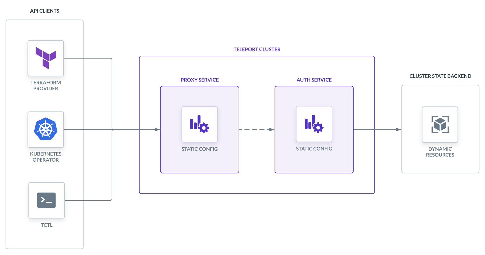

This section explains how to manage Teleport's **dynamic resources**, which make
it possible to adjust the behavior of your Teleport cluster as your
infrastructure changes.

## What is a dynamic resource?

There are two ways to configure a Teleport cluster:

- **Static configuration file:** At startup, a Teleport process reads a
  configuration file from the local filesystem (the default path is
  `/etc/teleport.yaml`). Static configuration settings control aspects of a
  cluster that are not expected to change frequently, like the ports that
  services listen on.
- **Dynamic resources:** Dynamic resources control aspects of your cluster that
  are likely to change over time, such as roles, local users, and registered
  infrastructure resources.

This approach makes it possible to incrementally adjust your Teleport
configuration without restarting Teleport instances.



A cluster is composed of different objects (i.e., resources) and there are three
common operations that can be performed on them: `get` , `create` , and `remove`
.

Every resource in Teleport has three required fields:

- `kind`: The type of resource
- `name`: A required field in the `metadata` to uniquely identify the resource
- `version`: The version of the resource format

All other fields are specific to a resource.

While Teleport Enterprise Cloud does not expose the static configuration file to
operators, they do use a static configuration file for certain settings. Read
how Teleport [reconciles static and dynamic
resources](#reconciling-the-configuration-file-with-dynamic-resources) to
understand how to see the values of static configuration settings that also
appear in dynamic resources.

When examining a dynamic resource, note that some of the fields you will see are
used only internally and are not meant to be changed. Others are reserved for
future use.

## Managing dynamic resources

Teleport provides three methods for applying dynamic resources: the `tctl`
client tool, Teleport Terraform provider, and Kubernetes Operator.

All three methods connect to the Teleport Auth Service's gRPC endpoint in order
to manipulate cluster resources stored on the Auth Service backend. The design
of Teleport's configuration interface makes it well suited for
infrastructure-as-code and GitOps approaches.

You can get started with `tctl`, the Terraform Provider, and the Kubernetes
Operator by following: 
- the ["Managing Users and Roles with IaC" guide](./dynamic-resources/user-and-role.mdx)
- the ["Creating Access Lists with IaC" guide](./dynamic-resources/access-list.mdx)
- the ["Registering Agentless OpenSSH Servers with IaC" guide](./dynamic-resources/agentless-ssh-servers.mdx)

For more information on Teleport roles, including the `internal.logins`
trait we use in these example roles, see the [Teleport Access
Controls Reference](../access-controls/reference.mdx).

### YAML documents with `tctl`

You can define resources as YAML documents and apply them using the `tctl`
client tool. Here is an example of a `role` resource that allows access to
servers with the label `env:test`:

```yaml
kind: role
version: v7
metadata:
  name: developer
spec:
  allow:
    logins: ['ubuntu', 'debian', '{{internal.logins}}']
    node_labels:
      'env': 'test'
```

Since `tctl` works from the local filesystem, you can write commands that apply
all configuration documents in a directory tree. See the [CLI
reference](../reference/cli/tctl.mdx) for more information on `tctl`.

### Teleport Terraform provider

Teleport's Terraform provider lets you manage your Teleport resources within the
same infrastructure-as-code source as the rest of your infrastructure. There is
a Terraform resource for each Teleport configuration resource. For example:

```hcl
resource "teleport_role" "developer" {
  version = "v7"
  metadata = {
    name = "developer"
  }

  spec = {
    allow = {
      logins = ["ubuntu", "debian", "{{internal.logins}}"]

      node_labels = {
        key   = ["env"]
        value = ["test"]
      }
    }
  }
}
```

[Get started with the Terraform
provider](./dynamic-resources/terraform-provider.mdx).

### Teleport Kubernetes Operator

The Teleport Kubernetes Operator lets you apply Teleport resources as Kubernetes
resources so you can manage your Teleport settings alongside the rest of your
Kubernetes infrastructure. Here is an example of a `TeleportRoleV7` resource,
which is equivalent to the two roles shown above:

```yaml
apiVersion: resources.teleport.dev/v1
kind: TeleportRoleV7
metadata:
  name: developer
spec:
  allow:
    logins: ['ubuntu', 'debian', '{{internal.logins}}']
    node_labels:
      'env': 'test'
```

[Get started with the Kubernetes Operator](dynamic-resources/teleport-operator.mdx).

## Reconciling the configuration file with dynamic resources

Some dynamic resources assign the same settings as fields within
Teleport's static configuration file. For these fields, the Teleport Auth
Service reconciles static and dynamic configurations on startup and when you
create or remove a Teleport resource.

### Configuration resources that apply to static configuration fields

There are four dynamic resources that share fields with the
static configuration file:

- `session_recording_config`
- `cluster_auth_preference`
- `cluster_networking_config`
- `ui_config`

#### `session_recording_config`

|Dynamic resource field|Static configuration field|
|---|---|
|`spec.mode`|`auth_service.session_recording`|
|`spec.proxy_checks_host_keys`|`auth_service.proxy_checks_host_keys`|

#### `cluster_auth_preference`

|Dynamic resource field|Static configuration field|
|---|---|
|`spec.type`|`auth_service.authentication.type`|
|`spec.second_factor`|`auth_service.authentication.second_factor`|
|`spec.connector_name`|`auth_service.authentication.connector_name`
|`spec.u2f`|`auth_service.authentication.u2f`|
|`spec.disconnect_expired_cert`|`auth_service.disconnect_expired_cert`|
|`spec.allow_local_auth`|`auth_service.authentication.local_auth`|
|`spec.message_of_the_day`|`auth_service.message_of_the_day`|
|`spec.locking_mode`|`auth_service.authentication.locking_mode`|
|`spec.webauthn`|`auth_service.authentication.webauthn`|
|`spec.require_session_mfa`|`auth_service.authentication.require_session_mfa`|
|`spec.allow_passwordless`|`auth_service.authentication.passwordless`|
|`spec.device_trust`|`auth_service.authentication.device_trust`|
|`spec.idp`|`proxy_service.idp`|
|`spec.allow_headless`|`auth_service.authentication.headless`|

#### `cluster_networking_config`

|Dynamic resource field|Static configuration field|
|---|---|
|`spec.client_idle_timeout`|`auth_service.client_idle_timeout`|
|`spec.keep_alive_interval`|`auth_service.keep_alive_interval`|
|`spec.keep_alive_count_max`|`auth_service.keep_alive_count_max`|
|`spec.session_control_timeout`|`auth_service.session_control_timeout`|
|`spec.idle_timeout_message`|`auth_service.client_idle_timeout_message`|
|`spec.web_idle_timeout`|`auth_service.web_idle_timeout`|
|`spec.proxy_listener_mode`|`auth_service.proxy_listener_mode`|
|`spec.routing_strategy`|`auth_service.routing_strategy`|
|`spec.tunnel_strategy`|`auth_service.tunnel_strategy`|
|`spec.proxy_ping_interval`|`auth_service.proxy_ping_interval`|
|`spec.case_insensitive_routing`|`auth_service.case_insensitive_routing`|

#### `ui_config`

|Dynamic resource field|Static configuration field|
|---|---|
|`spec.scrollback_lines`|`proxy_service.ui.scrollback_lines`|

### Origin labels

The Teleport Auth Service applies the `teleport.dev/origin` label to
configuration resources to indicate whether they originated from the static
configuration file, a dynamic configuration resource, or the default value.

Here are possible values of the `teleport.dev/origin` label:

- `defaults`
- `config-file`
- `dynamic`
- `terraform`
- `kubernetes`

When the Auth Service starts up, it looks up the values of static configuration
fields that correspond to fields in dynamic configuration resources. If any of
these have values, it creates the corresponding dynamic configuration resources
and stores them in its backend.

For any static configuration fields without a value, the Auth Service checks
whether the backend contains the corresponding dynamic configuration resource.
If not, it creates one with default values and the
`teleport.dev/origin=defaults` label.

If you attempt to create a dynamic configuration resource after the Auth Service
has already loaded the configuration from a static configuration file, the Auth
Service will return an error.

If you remove a dynamic configuration resource, the Auth Service will restore
its configuration fields to the default values and add the
`teleport.dev/origin=defaults` label.

<Notice type="tip">

Cloud-hosted Teleport deployments use configuration files, but these are not
available for operators to modify. Users of Teleport Enterprise Cloud may see
configuration resources with the `teleport.dev/origin=config-file` label.

</Notice>

## Further reading

### Configuration references

- For a comprehensive reference of Teleport's static configuration options, read
  the [Configuration Reference](../reference/config.mdx).
- To see the dynamic configuration resources available to apply, read the
  [Configuration Resource Reference](../reference/resources.mdx). There are also
  dedicated configuration resource references for
  [applications](../application-access/reference.mdx#application-resource) and
  [databases](../database-access/reference/configuration.mdx#database-resource).

### Other ways to use the Teleport API

The Teleport Kubernetes Operator, Terraform provider, and `tctl` are all clients
of the Teleport Auth Service's gRPC API. To build your own API client to extend
Teleport for your organization's needs, read our [API
guides](../api/introduction.mdx).
