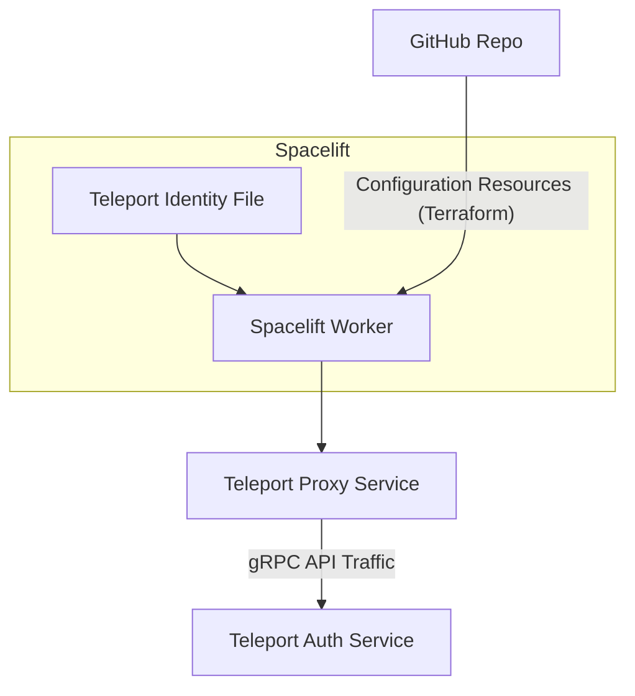
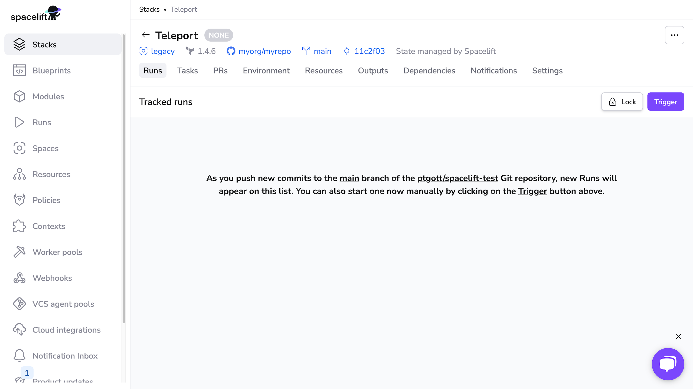
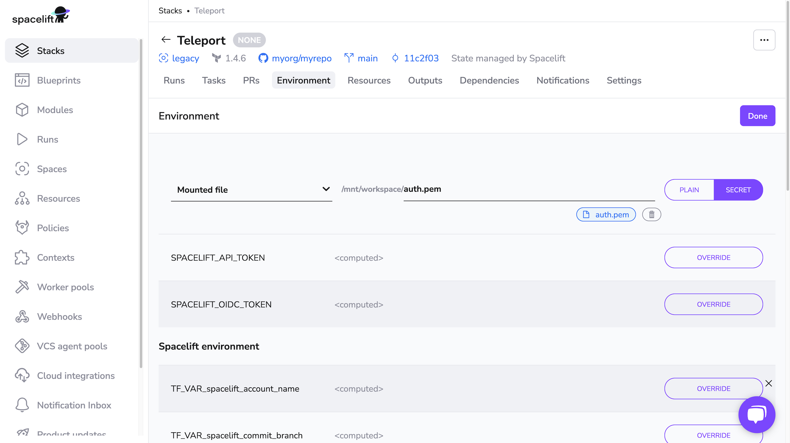

You can use Spacelift with Teleport's Terraform provider to manage dynamic
configuration resources via GitOps and infrastructure as code. This gives you an
audit trail of changes to your Teleport configuration and a single source of
truth for operators to examine.



This guide will show you how to set up the GitOps platform Spacelift with the
Teleport Terraform provider. While following this guide, you will create a
Teleport user and role with no privileges in order to demonstrate using
Spacelift to create dynamic resources. 

If you are using another GitOps platform, the setup should be similar:

- Create a Teleport user and role for the GitOps platform with permissions to
  manage configuration resources.
- Upload a Teleport identify file to the GitOps platform that it will use to
  authenticate as the Teleport user and role you created.
- Configure the GitOps platform to read from a GitHub repository with a
  Terraform configuration that tells the Teleport provider where to find your
  identity file and Teleport Proxy Service.
- Define Teleport configuration resources as Terraform resources within the
  GitHub repository, prompting the GitOps platform to apply your Terraform
  configuration.

## Prerequisites

(!docs/pages/includes/edition-prereqs-tabs.mdx!)
- A Spacelift account with permissions to create stacks.
- A GitHub repository where you will store your Terraform configuration. For the
  purpose of the demo project we show in this guide, the repository should be
  empty, though you can use an existing repository connected to Spacelift as
  well.
- The GitHub app for Spacelift installed for your GitHub repository. Install
  this app by visiting its [page on
  GitHub](https://github.com/apps/spacelift-io/).
- (!docs/pages/includes/tctl.mdx!)

<Admonition type="tip" title="Using identify files">

For simplicity, the identify file we will export in this guide will have a long
time to live. In a production environment, you will want to provision
short-lived identify files via Machine ID.

After getting familiar with this guide, read our [Machine ID Getting Started
Guide](../../machine-id/getting-started.mdx) to get started with Machine ID. You
will need to run your own compute workload to upload Teleport identity files to
Spacelift using the `spacectl stack environment mount` command of the
[`spacectl`](https://github.com/spacelift-io/spacectl) CLI (or another method
that takes advantage of Spacelift's GraphQL API).

</Admonition>

## Step 1/4. Add a Terraform configuration to your repository

Clone your GitHub repository. Add the following to a file called `main.tf`,
which configures the Teleport Terraform provider:

```text
terraform {
  required_providers {
    teleport = {
      source  = "terraform.releases.teleport.dev/gravitational/teleport"
      version = ">= (=teleport.plugin.version=)"
    }
  }
}

provider "teleport" {
  addr               = "proxy.example.com:443"
  identity_file_path = "/mnt/workspace/auth.pem"
}
```

Change `proxy.example.com:443` to the host and HTTPS port of your Teleport Proxy
Service.

Commit the change, merge it to your `main` branch, and push to your remote
repository (or use a pull request).

## Step 2/4. Create a Spacelift stack

From the Spacelift web UI, click **Stacks > Add stack**.

In the **NAME STACK** tab, for "Name", use "Teleport" and click **CONTINUE**. 

In the **INTEGRATE VCS** tab, make sure the **Repository** field points to the
repository you chose for this guide.  Select your GitHub repository and the
branch you plan to use as the base branch for pull requests. Click **CONTINUE**.

In the **CONFIGURE BACKEND** tab, leave all settings at their defaults and click
**CONTINUE**. Do the same with the **DEFINE BEHAVIOR** tab and click **SAVE
STACK**.

Your new stack should resemble the following:



## Step 3/4. Grant Teleport permissions to Spacelift

In this section, you will create a Teleport user and role for Spacelift, plus a
role that can *impersonate* the Spacelift user in order to export an identity
file. You will then export an identity file and upload it to Spacelift.

Since Teleport manages RBAC permissions via configuration resources, and you
have not set up Spacelift yet, you must create the resources in this section
outside of Spacelift. After that, Spacelift can manage all of your Teleport
configuration resources.

### Create a Spacelift user and role

Create a local Teleport user named `spacelift` and a matching role granting the
necessary permissions for Terraform to manage resources in your cluster.

On your workstation, _outside_ the git repository you connected to Spacelift,
add the following content to a file called `spacelift.yaml`:

```yaml
kind: role
metadata:
  name: spacelift
spec:
  allow:
    rules:
      - resources:
        - role
        - user
        verbs: ['list','create','read','update','delete']
version: v6
---
kind: user
metadata:
  name: spacelift
spec:
  roles: ['spacelift']
version: v2
```

This is a minimal version of the configuration you will need to provide to
Spacelift, and is only permitted to manage Teleport roles. 

Create the `spacelift` user and role.

```code
$ tctl create spacelift.yaml
role 'spacelift' has been created
user "spacelift" has been created
```

### Enable impersonation

The `spacelift` user cannot log in to Teleport to retreive credentials, so
another user must **impersonate** this user in order to request credentials on
`spacelift`'s behalf.

Create a role that enables your user to impersonate the Terraform user. Paste
the following YAML document into a file called `spacelift-impersonator.yaml`:

```yaml
kind: role
version: v6
metadata:
  name: spacelift-impersonator
spec:
  allow:
    impersonate:
      users: ['spacelift']
      roles: ['spacelift']
```

Next, create the role:

```code
$ tctl create spacelift-impersonator.yaml
```

(!docs/pages/includes/add-role-to-user.mdx role="spacelift-impersonator"!)

### Export an identity file

(!docs/pages/includes/plugins/identity-export.mdx user="spacelift" client="Spacelift"!)

### Provide an identity file to Spacelift

In the Spacelift web UI, click **Stacks > Teleport**. Click the **Environment**
tab, then **Edit**. Set the dropdown menu that follows to **Mounted file**, and
the path to `/mnt/workspace/auth.pem`.

Click **Upload file** and select the file called `auth.pem` that you exported
earlier.

Make sure you click **Secret** next to the entry for the mounted file:



## Step 4/4. Declare configuration resources

In a clone of your GitHub repository, check out a branch from your main branch
and add the following to `main.tf`:

```text
resource "teleport_role" "terraform_test" {
  metadata = {
    name        = "terraform-test"
    description = "Terraform test role"
    labels = {
      example = "yes"
    }
  }
}

resource "teleport_user" "terraform-test" {
  metadata = {
    name        = "terraform-test"
    description = "Terraform test user"

    labels = {
      test = "true"
    }
  }

  spec = {
    roles = [teleport_role.terraform_test.id]
  }
}
```

Commit your changes and push the branch to GitHub, then open a pull request
against the `main` branch. (Do not merge it just yet.)

In the Spacelift UI, click **Stacks > Teleport > PRs**, then click the name of
the PR you opened.

You should see a Terraform plan that includes the user and role you defined
above:


When running `terraform plan`, Spacelift uses the identity file you mounted
earlier to authenticate to Teleport.

Merge the PR, then click **Stacks > Teleport > Runs**. Click the status of the
first run, which corresponds to merging your PR, to visit the page for the run.
Click **Confirm** to begin applying your Terraform plan.

You should see output indicating success:


Verify that Spacelift has created the new user and role by running the following
commands, which should return YAML data for each resource:

```code
$ tctl get roles/terraform-test
$ tctl get users/terraform-test
```

## Next steps

- If you plan to configure Spacelift to manage dynamic configuration resources
  besides users and roles, you will need to grant additional permissions to the
  Teleport role you assigned to Spacelift.  See the [Teleport Role
  Reference](../../access-controls/reference.mdx#teleport-resources) for the
  resources you can allow access to in a Teleport role.
- Now that you know how to manage Teleport configuration resources with
  Terraform and Spacelift, read our [Terraform resource
  reference](../../reference/terraform-provider.mdx) so you can flesh out your
  configuration.
- The Teleport Terraform provider is an example of a Teleport API client. Other
  API clients include Teleport's [Access Request
  plugins](../../access-controls/access-request-plugins.mdx) and the [Event
  Handler](../export-audit-events.mdx). Learn how to [build your own API
  client](../../api/introduction.mdx) so you can manage Teleport configuration
  resources via your organization's unique workflows.
