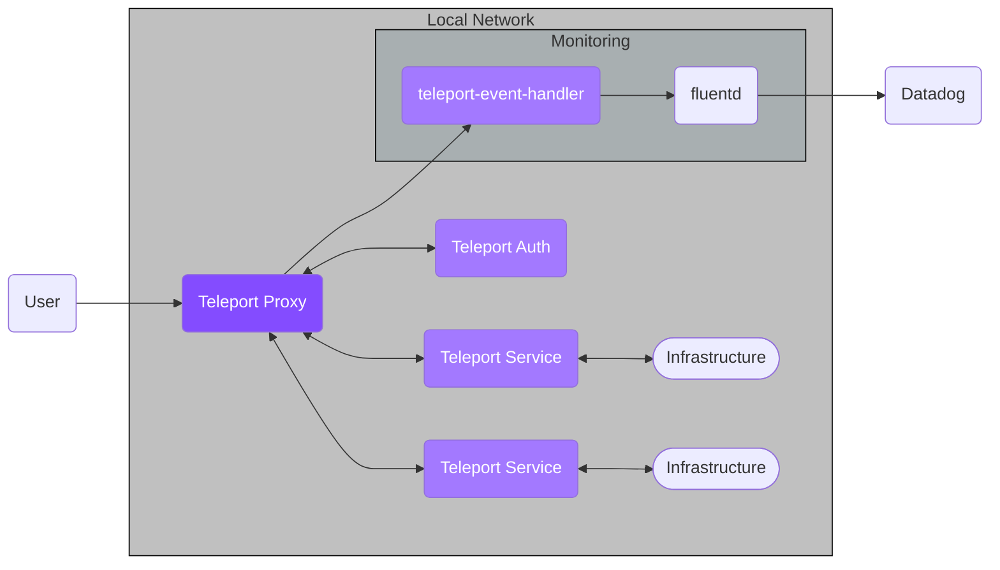

Datadog is a SAAS monitoring and security platform. In this guide, we'll explain
how to forward Teleport audit events to Datadog using Fluentd.

The Teleport Event Handler is designed to communicate with Fluentd using mTLS
to establish a secure channel. In this setup, the Event Handler sends events to Fluentd, which forwards them to Datadog using an API key to authenticate.



## Prerequisites

(!docs/pages/includes/edition-prereqs-tabs.mdx!)

- A [Datadog](https://www.datadoghq.com/) account.
- A server, virtual machine, Kubernetes cluster, or Docker environment to run the
  Event Handler. The instructions below assume a local Docker container for testing.
- Fluentd version v(=fluentd.version=) or greater. The Teleport Event Handler
  will create a new `fluent.conf` file you can integrate into an existing Fluentd
  system, or use with a fresh setup.

The instructions below demonstrate a local test of the Event Handler plugin on your
workstation. You will need to adjust paths, ports, and domains for other environments.

- (!docs/pages/includes/tctl.mdx!)

## Step 1/6. Install the Event Handler plugin

The Teleport event handler runs alongside the Fluentd forwarder, receives events
from Teleport's events API, and forwards them to Fluentd.

(!docs/pages/includes/install-event-handler.mdx!)

## Step 2/6. Configure the plugin

(!docs/pages/includes/configure-event-handler.mdx!)

## Step 3/6. Create a user and role for reading audit events

(!docs/pages/includes/plugins/event-handler-role-user.mdx!)

## Step 4/6. Create teleport-event-handler credentials

### Enable impersonation of the Event Handler user

In order for the Teleport Event Handler plugin to forward events from your Teleport
cluster, it needs a signed identity file from the cluster's certificate authority.
The `teleport-event-handler` user cannot request this itself, and requires another
user to **impersonate** this account in order to request a certificate.

Create a role that enables your user to impersonate the Fluentd user. First,
paste the following YAML document into a file called
`teleport-event-handler-impersonator.yaml`:

```yaml
kind: role
version: v5
metadata:
  name: teleport-event-handler-impersonator
spec:
  # SSH options used for user sessions
  options:
    # max_session_ttl defines the TTL (time to live) of SSH certificates
    # issued to the users with this role.
    max_session_ttl: 10h

  # allow section declares a list of resource/verb combinations that are
  # allowed for the users of this role. by default nothing is allowed.
  allow:
    impersonate:
      users: ["teleport-event-handler"]
      roles: ["teleport-event-handler"]
```

Next, create the role:

```code
$ tctl create -f teleport-event-handler-impersonator.yaml
```

(!docs/pages/includes/add-role-to-user.mdx role="teleport-event-handler-impersonator"!)

### Export an identity file for the Event Handler plugin user

The Teleport Event Handler plugin uses the `teleport-event-handler` role and user to
read events. We export an identity file for the user with the `tctl auth sign`
command.

<Tabs>
<TabItem label="Executable">

(!docs/pages/includes/plugins/identity-export.mdx user="teleport-event-handler"!)

</TabItem>
<TabItem label="Helm Chart">

(!docs/pages/includes/plugins/identity-export.mdx user="teleport-event-handler"!)

Next, create a Kubernetes secret for the Teleport identity file:

```code
$ kubectl create secret generic teleport-event-handler-identity --from-file=auth_id=identity
```

These commands should result in a PEM-encoded file, `identity`, and a secret
in Kubernetes with the name `teleport-event-handler-identity`.

</TabItem>
</Tabs>

## Step 5/6. Install Fluentd output plugin for Datadog

In order for Fluentd to communicate with Datadog, it requires the [Fluentd output
plugin for Datadog](https://github.com/DataDog/fluent-plugin-datadog). Install
the plugin on your Fluentd host using either `gem` or the `td-agent`, if installed:

```code
# Using Gem
$ gem install fluent-plugin-datadog

# Using td-agent
$ /usr/sbin/td-agent-gem install fluent-plugin-datadog
```

<Admonition type="tip" title="Testing Locally?">

If you're running Fluentd in a local Docker container for testing, you can adjust
the entrypoint to an interactive shell as the root user, so you can install the
plugin before starting Fluentd:

```code
$ docker run -u $(id -u root):$(id -g root) -p 8888:8888 -v $(pwd):/keys -v \
$(pwd)/fluent.conf:/fluentd/etc/fluent.conf --entrypoint=/bin/sh -i --tty  fluent/fluentd:edge
# From the container shell:
$ gem install fluent-plugin-datadog
$ fluentd -c /fluentd/etc/fluent.conf
```

</Admonition>

### Configure Fluentd for Datadog

From the Datadog web UI, generate an API key for Fluentd. From **Organization Settings** -> Access -> **API Keys**, click on **+ New Key**:


Copy the API key, and use it to add a new `<match>` block to `fluent.conf`:

```ini
<match test.log>

  @type datadog
  @id awesome_agent
  api_key (=presets.tokens.first=)

  host http-intake.logs.us5.datadoghq.com

  # Optional parameters
  dd_source teleport

</match>
```

- Add your API key to the `api_key` field.
- Adjust the `host` value to match your Datadog site. See their [Log Collection
  and Integrations](https://docs.datadoghq.com/logs/log_collection/?tab=host) guide
  to determine the correct value.
- `dd_source` is an optional field you can use to filter these logs in the
  Datadog UI.
- Adjust `ca_path`, `cert_path` and `private_key_path` to point to the credential
  files generated earlier. If you're testing locally, the Docker command above
  already mounted the current working directory to `keys/` in the container.

Restart Fluentd after saving the changes to `fluent.conf`.

## Step 6/6. Start the event handler plugin

Earlier, we generated a file called `teleport-event-handler.toml` to configure
the Fluentd event handler. This file includes setting similar to the following:

<Tabs>
<TabItem scope={["cloud","team"]} label="Cloud-Hosted">

```toml
storage = "./storage"
timeout = "10s"
batch = 20
namespace = "default"

[forward.fluentd]
ca = "/home/sasha/scripts/event-handler/ca.crt"
cert = "/home/sasha/scripts/event-handler/client.crt"
key = "/home/sasha/scripts/event-handler/client.key"
url = "https://localhost:8888/test.log"

[teleport]
addr = "mytenant.teleport.sh:443"
identity = "identity"
```

To start the event handler, run the following command:

```code
$ ./teleport-event-handler start --config teleport-event-handler.toml
```

</TabItem>
<TabItem scope={["oss", "enterprise"]} label="Self-Hosted">

```toml
storage = "./storage"
timeout = "10s"
batch = 20
namespace = "default"

[forward.fluentd]
ca = "/home/sasha/scripts/event-handler/ca.crt"
cert = "/home/sasha/scripts/event-handler/client.crt"
key = "/home/sasha/scripts/event-handler/client.key"
url = "https://localhost:8888/test.log"

[teleport]
addr = "teleport.example.com:443"
identity = "identity"
```

To start the event handler, run the following command:

```code
$ ./teleport-event-handler start --config teleport-event-handler.toml
```

</TabItem>
<TabItem scope={["oss", "enterprise"]} label="Helm Chart">

Use the following template to create `teleport-plugin-event-handler-values.yaml`:

```yaml
eventHandler:
  storagePath: "./storage"
  timeout: "10s"
  batch: 20
  namespace: "default"

teleport:
  address: "example.teleport.com:443"
  identitySecretName: teleport-event-handler-identity

fluentd:
  url: "https://fluentd.fluentd.svc.cluster.local/events.log"
  sessionUrl: "https://fluentd.fluentd.svc.cluster.local/session.log"
  certificate:
    secretName: "teleport-event-handler-client-tls"
    caPath: "ca.crt"
    certPath: "client.crt"
    keyPath: "client.key"

persistentVolumeClaim:
  enabled: true
```

To start the event handler in Kubernetes, run the following command:

```code
$ helm install teleport-plugin-event-handler teleport/teleport-plugin-event-handler \
  --values teleport-plugin-event-handler-values.yaml \
  --version (=teleport.plugin.version=)
```

</TabItem>
</Tabs>

<Admonition type="note">

This example will start exporting from `May 5th 2021`:

```code
$ ./teleport-event-handler start --config teleport-event-handler.toml --start-time "2022-02-02T00:00:00Z"
```

The start time can be set only once, on the first run of the tool.

If you want to change the time frame later, remove the plugin state directory
that you specified in the `storage` field of the handler's configuration file.

</Admonition>

Once the handler starts, you will see notifications in Fluentd about scanned and forwarded events:

```txt
INFO[0046] Event sent id=0b5f2a3e-faa5-4d77-ab6e-362bca0994fc ts="2021-06-08 11:00:56.034 +0000 UTC" type=user.login
...
```

The Logs view in Datadog should now report your Teleport cluster events:


## Troubleshooting connection issues

If the Teleport Event Handler is displaying error logs while connecting to your
Teleport Cluster, ensure that:

- The certificate the Teleport Event Handler is using to connect to your
  Teleport cluster is not past its expiration date. This is the value of the
  `--ttl` flag in the `tctl auth sign` command, which is 12 hours by default.
- Ensure that in your Teleport Event Handler configuration file
  (`teleport-event-handler.toml`), you have provided the correct host *and* port
  for the Teleport Proxy Service.

## Next steps

- Read more about
[impersonation](../../access-controls/guides/impersonation.mdx)
here.
- While this guide uses the `tctl auth sign` command to issue credentials for the
Teleport Event Handler, production clusters should use Machine ID for safer,
more reliable renewals. Read [our guide](../../machine-id/getting-started.mdx)
to getting started with Machine ID.
- To see all of the options you can set in the values file for the
`teleport-plugin-event-handler` Helm chart, consult our [reference
guide](../../reference/helm-reference/teleport-plugin-event-handler.mdx).
- Review the Fluentd output plugin for Datadog [README
file](https://github.com/DataDog/fluent-plugin-datadog/blob/master/README.md)
to learn how to customize the log format entering Datadog.
