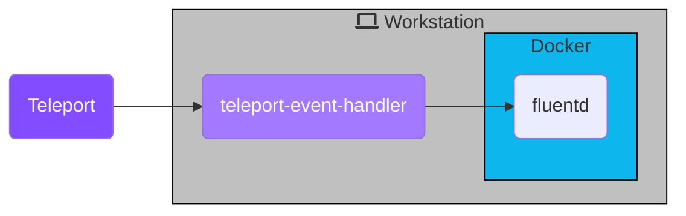

Fluentd is an open-source data collector for a unified logging layer. In this
guide, we will:

- Set up Teleport's Event Handler plugin.
- Forward events with Fluentd.

This guide also serves as an explanation for the Teleport Event Handler plugin,
using Fluentd as the target service. We'll create a local Docker container as a
destination for the Event Handler:



You can follow the instructions below for a local proof-of-concept demo, or use any
of the additional installation instructions to configure the Teleport Event Handler
to integrate with your infrastructure.

## Prerequisites

(!docs/pages/includes/edition-prereqs-tabs.mdx!)

- Fluentd version v(=fluentd.version=) or greater.

- Docker version v(=docker.version=).

- (!docs/pages/includes/tctl.mdx!)

- On your workstation, create a folder called `event-handler`, to hold configuration files and plugin state:

  ```code
  $ mkdir -p event-handler
  $ cd event-handler
  ```

## Step 1/6. Install the event handler plugin

The Teleport event handler runs alongside the Fluentd forwarder, receives events
from Teleport's events API, and forwards them to Fluentd.

(!docs/pages/includes/install-event-handler.mdx!)

## Step 2/6. Configure the plugin

(!docs/pages/includes/configure-event-handler.mdx!)

If you have an existing Fluentd setup with TLS, issue a client certificate and
key from the same certificate authority for the Teleport Event Handler to use.

## Step 3/6. Create a user and role for reading audit events

(!docs/pages/includes/plugins/event-handler-role-user.mdx!)

## Step 4/6. Create teleport-event-handler credentials

### Enable impersonation of the Fluentd plugin user

In order for the Fluentd plugin to forward events from your Teleport cluster, it
needs a signed identity file from the cluster's certificate authority. The
Fluentd user cannot request this itself, and requires another user to
**impersonate** this account in order to request a certificate.

Create a role that enables your user to impersonate the Fluentd user. First,
paste the following YAML document into a file called
`teleport-event-handler-impersonator.yaml`:

```yaml
kind: role
version: v5
metadata:
  name: teleport-event-handler-impersonator
spec:
  # SSH options used for user sessions
  options:
    # max_session_ttl defines the TTL (time to live) of SSH certificates
    # issued to the users with this role.
    max_session_ttl: 10h

  # allow section declares a list of resource/verb combinations that are
  # allowed for the users of this role. by default nothing is allowed.
  allow:
    impersonate:
      users: ["teleport-event-handler"]
      roles: ["teleport-event-handler"]
```

Next, create the role:

```code
$ tctl create -f teleport-event-handler-impersonator.yaml
```

(!docs/pages/includes/add-role-to-user.mdx role="teleport-event-handler-impersonator"!)

### Export an identity file for the Fluentd plugin user

The Fluentd Teleport plugin uses the `teleport-event-handler` role and user to
read events. We export an identity file for the user with the `tctl auth sign`
command.

<Tabs>
<TabItem label="Self-Hosted" scope={["oss","enterprise"]}>
```code
$ tctl auth sign --user=teleport-event-handler --out=identity
```

This command creates one PEM-encoded file, `identity`. The identity file
includes both TLS and SSH credentials. The Event Handler plugin uses the SSH
credentials to connect to the Proxy Service, which establishes a reverse tunnel
connection to the Auth Service. The plugin uses this reverse tunnel, along with
your TLS credentials, to connect to the Auth Service's gRPC endpoint.

</TabItem>
<TabItem label="Teleport Cloud" scope={["cloud"]}>
```code
$ tctl auth sign --user=teleport-event-handler --out=identity
```

This command creates one PEM-encoded file, `identity`. The identity file
includes both TLS and SSH credentials. Your Event Handler plugin uses the SSH
credentials to connect to the Proxy Service, which establishes a reverse tunnel
connection to the Auth Service. The plugin uses this reverse tunnel, along with
your TLS credentials, to connect to the Auth Service's gRPC endpoint.

</TabItem>
<TabItem label="Helm Chart" scope={["cloud"]}>

If you are planning to use the Helm Chart, you'll need to generate the keys
with the `file` format, then create a secret in Kubernetes.

Create the identity using the following command:

```code
$ tctl auth sign --format=file --user=teleport-event-handler --out=identity
```

Then create the Kubernetes secret:

```code
$ kubectl create secret generic teleport-event-handler-identity --from-file=auth_id=identity
```

These commands should result in a PEM-encoded file, `identity`, and a secret
in Kubernetes with the name `teleport-event-handler-identity`.

</TabItem>
</Tabs>

## Step 5/6. Start the Fluentd forwarder

The Fluentd plugin will send events to your Fluentd instance using keys
generated on the previous step.

The `fluent.conf` file generated earlier configures your Fluentd instance to
accept events using TLS and print them:

```
<source>
    @type http
    port 8888

    <transport tls>
        client_cert_auth true

        # We are going to run fluentd in Docker. /keys will be mounted from the host file system.
        ca_path /keys/ca.crt
        cert_path /keys/server.crt
        private_key_path /keys/server.key
        private_key_passphrase ********** # Passphrase generated along with the keys
    </transport>

    <parse>
      @type json
      json_parser oj

      # This time format is used by the plugin. This field is required.
      time_type string
      time_format %Y-%m-%dT%H:%M:%S
    </parse>

    # If the number of events is high, fluentd will start failing the ingestion
    # with the following error message: buffer space has too many data errors.
    # The following configuration prevents data loss in case of a restart and
    # overcomes the limitations of the default fluentd buffer configuration.
    # This configuration is optional.
    # See https://docs.fluentd.org/configuration/buffer-section for more details.
    <buffer>
      @type file
      flush_thread_count 8
      flush_interval 1s
      chunk_limit_size 10M
      queue_limit_length 16
      retry_max_interval 30
      retry_forever true
    </buffer>
</source>

# Events sent to test.log will be dumped to STDOUT.
<match test.log>
  @type stdout
</match>
```

To try out this Fluentd configuration, start your fluentd instance:

```code
$ docker run -u $(id -u ${USER}):$(id -g ${USER}) -p 8888:8888 -v $(pwd):/keys -v $(pwd)/fluent.conf:/fluentd/etc/fluent.conf fluent/fluentd:edge
```

This will consume your current terminal, so open a new one to continue following along.

## Step 6/6. Start the event handler plugin

Earlier, we generated a file called `teleport-event-handler.toml` to configure
the Fluentd event handler. This file includes setting similar to the following:

<Tabs>
<TabItem scope={["cloud"]} label="Teleport Cloud">

```toml
storage = "./storage"
timeout = "10s"
batch = 20
namespace = "default"

[forward.fluentd]
ca = "/home/bob/event-handler/ca.crt"
cert = "/home/bob/event-handler/client.crt"
key = "/home/bob/event-handler/client.key"
url = "https://localhost:8888/test.log"

[teleport]
addr = "example.teleport.com:443"
identity = "identity"
```

To start the event handler, run the following command:

```code
$ teleport-event-handler start --config teleport-event-handler.toml
```

</TabItem>
<TabItem scope={["oss", "enterprise"]} label="Self-Hosted">

```toml
storage = "./storage"
timeout = "10s"
batch = 20
namespace = "default"

[forward.fluentd]
ca = "/home/bob/event-handler/ca.crt"
cert = "/home/bob/event-handler/client.crt"
key = "/home/bob/event-handler/client.key"
url = "https://localhost:8888/test.log"

[teleport]
addr = "example.teleport.com:443"
identity = "identity"
```

To start the Event Handler, run the following command:

```code
$ teleport-event-handler start --config teleport-event-handler.toml
```

</TabItem>
<TabItem scope={["oss", "enterprise"]} label="Helm Chart">

Use the following template to create `teleport-plugin-event-handler-values.yaml`:

```yaml
eventHandler:
  storagePath: "./storage"
  timeout: "10s"
  batch: 20
  namespace: "default"

teleport:
  address: "example.teleport.com:443"
  identitySecretName: teleport-event-handler-identity

fluentd:
  url: "https://fluentd.fluentd.svc.cluster.local/events.log"
  sessionUrl: "https://fluentd.fluentd.svc.cluster.local/session.log"
  certificate:
    secretName: "teleport-event-handler-client-tls"
    caPath: "ca.crt"
    certPath: "client.crt"
    keyPath: "client.key"

persistentVolumeClaim:
  enabled: true
```

To start the event handler in Kubernetes, run the following command:

```code
$ helm install teleport-plugin-event-handler teleport/teleport-plugin-event-handler \
  --values teleport-plugin-event-handler-values.yaml \
  --version (=teleport.plugin.version=)
```

</TabItem>
</Tabs>

<Admonition type="note">

This example will start exporting from `May 5th 2021`:

```code
$ teleport-event-handler start --config teleport-event-handler.toml --start-time "2021-05-05T00:00:00Z"
```

The start time can be set only once, on the first run of the tool.

If you want to change the time frame later, remove the plugin state directory
that you specified in the `storage` field of the handler's configuration file.

</Admonition>

Once the handler starts, you will see notifications about scanned and forwarded events:

```txt
INFO[0046] Event sent id=0b5f2a3e-faa5-4d77-ab6e-362bca0994fc ts="2021-06-08 11:00:56.034 +0000 UTC" type=user.login
...
```

## Troubleshooting connection issues

If the Teleport Event Handler is displaying error logs while connecting to your
Teleport Cluster, ensure that:

- The certificate the Teleport Event Handler is using to connect to your
  Teleport cluster is not past its expiration date. This is the value of the
  `--ttl` flag in the `tctl auth sign` command, which is 12 hours by default.
- Ensure that in your Teleport Event Handler configuration file
  (`teleport-event-handler.toml`), you have provided the correct host *and* port
  for the Teleport Proxy Service or Auth Service.

## Next Steps

Read more about
[impersonation](../../access-controls/guides/impersonation.mdx)
here.

While this guide uses the `tctl auth sign` command to issue credentials for the
Teleport Event Handler, production clusters should use Machine ID for safer,
more reliable renewals. Read [our guide](../../machine-id/getting-started.mdx)
to getting started with Machine ID.

To see all of the options you can set in the values file for the
`teleport-plugin-event-handler` Helm chart, consult our [reference
guide](../../reference/helm-reference/teleport-plugin-event-handler.mdx).

