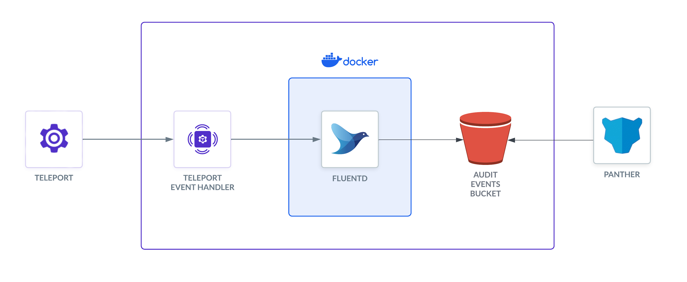

Panther is a cloud-native security analytics platform. In this guide, we'll explain
how to forward Teleport audit events to Panther using Fluentd.

The Teleport Event Handler is designed to communicate with Fluentd using mTLS
to establish a secure channel. In this setup, the Event Handler sends events to Fluentd, which forwards them to S3 to be ingested by Panther.



## Prerequisites

(!docs/pages/includes/edition-prereqs-tabs.mdx!)

(!docs/pages/includes/machine-id/plugin-prerequisites.mdx!)

- A [Panther](https://panther.com/product/request-a-demo/) account.
- A server, virtual machine, Kubernetes cluster, or Docker environment to run the
  Event Handler. The instructions below assume a local Docker container for testing.
- Fluentd version v(=fluentd.version=) or greater. The Teleport Event Handler
  will create a new `fluent.conf` file you can integrate into an existing Fluentd
  system, or use with a fresh setup.
- An S3 bucket to store the logs. Panther will ingest the logs from this bucket.

The instructions below demonstrate a local test of the Event Handler plugin on
VM. You will need to adjust paths, ports, and domains for other environments.

- (!docs/pages/includes/tctl.mdx!)

## Step 1/6. Install the Event Handler plugin

The Teleport event handler runs alongside the Fluentd forwarder, receives events
from Teleport's events API, and forwards them to Fluentd.

(!docs/pages/includes/install-event-handler.mdx!)

## Step 2/6. Generate a plugin configuration

(!docs/pages/includes/configure-event-handler.mdx!)

## Step 3/6. Create a user and role for reading audit events

(!docs/pages/includes/plugins/event-handler-role-user.mdx!)

## Step 4/6. Create teleport-event-handler credentials

### Enable impersonation of the Event Handler user

(!docs/pages/includes/plugins/rbac-impersonate-event-handler.mdx!)

### Export an identity file for the Event Handler plugin user

Give the plugin access to a Teleport identity file. We recommend using Machine
ID for this in order to produce short-lived identity files that are less
dangerous if exfiltrated, though in demo deployments, you can generate
longer-lived identity files with `tctl`:

<Tabs>
<TabItem label="Machine ID">
(!docs/pages/includes/plugins/tbot-identity.mdx secret="teleport-event-handler-identity"!)
</TabItem>
<TabItem label="Long-lived identity files">
(!docs/pages/includes/plugins/identity-export.mdx user="teleport-event-handler" secret="teleport-event-handler-identity"!)
</TabItem>
</Tabs>

## Step 5/6. Create a Dockerfile with Fluentd and the S3 plugin

To send logs to Panther, you need to use the Fluentd output plugin for S3. Create
a `Dockerfile` with the following content:

```code
FROM fluent/fluentd:edge
USER root
RUN fluent-gem install fluent-plugin-s3
USER fluent
```

Build the Docker image:
```shell
$ docker build -t fluentd-s3 .
```

<Admonition type="tip" title="Testing Locally?">

If you're running Fluentd in a local Docker container for testing, you can adjust
the entrypoint to an interactive shell as the root user, so you can install the
plugin before starting Fluentd:

```code
$ docker run -u $(id -u root):$(id -g root) -p 8888:8888 -v $(pwd):/keys -v \
$(pwd)/fluent.conf:/fluentd/etc/fluent.conf --entrypoint=/bin/sh -i --tty  fluentd-s3
```

</Admonition>

### Configure Fluentd for Panter

```xml
 <filter test.log>
          @type record_transformer
          enable_ruby true
          <record>
            time $${time.utc.strftime(\"%Y-%m-%dT%H:%M:%SZ\")}
          </record>
        </filter>
        <match test.log>
          @type s3
          aws_key_id xxx
          aws_sec_key xxx
          s3_bucket xxx
          s3_region us-west-2
          path teleport/logs
          <buffer>
            @type file
            path /var/log/fluent/buffer/s3-events
            timekey 60
            timekey_wait 0
            timekey_use_utc true
            chunk_limit_size 256m
          </buffer>
          time_slice_format %Y%m%d%H%M%S
          <format>
            @type json
            </format>
        </match>
        <match session.*>
          @type stdout
        </match>
```

## Step 6/6. Run the Teleport Event Handler plugin

### Configure the Event Handler

In this section, you will configure the Teleport Event Handler for your
environment.

(!docs/pages/includes/plugins/finish-event-handler-config.mdx!)

Next, modify the configuration file as follows:

(!docs/pages/includes/plugins/config-toml-teleport.mdx!)

(!docs/pages/includes/plugins/machine-id-exporter-config.mdx!)

### Start the Teleport Event Handler

(!docs/pages/includes/start-event-handler.mdx!)

The Logs view in Panter should now report your Teleport cluster events. 

## Troubleshooting connection issues

If the Teleport Event Handler is displaying error logs while connecting to your
Teleport Cluster, ensure that:

- The certificate the Teleport Event Handler is using to connect to your
  Teleport cluster is not past its expiration date. This is the value of the
  `--ttl` flag in the `tctl auth sign` command, which is 12 hours by default.
- Ensure that in your Teleport Event Handler configuration file
  (`teleport-event-handler.toml`), you have provided the correct host *and* port
  for the Teleport Proxy Service.

## Next steps

- Read more about
[impersonation](../../access-controls/guides/impersonation.mdx)
here.
- While this guide uses the `tctl auth sign` command to issue credentials for the
Teleport Event Handler, production clusters should use Machine ID for safer,
more reliable renewals. Read [our guide](../../machine-id/getting-started.mdx)
to getting started with Machine ID.
- To see all of the options you can set in the values file for the
`teleport-plugin-event-handler` Helm chart, consult our [reference
guide](../../reference/helm-reference/teleport-plugin-event-handler.mdx).
