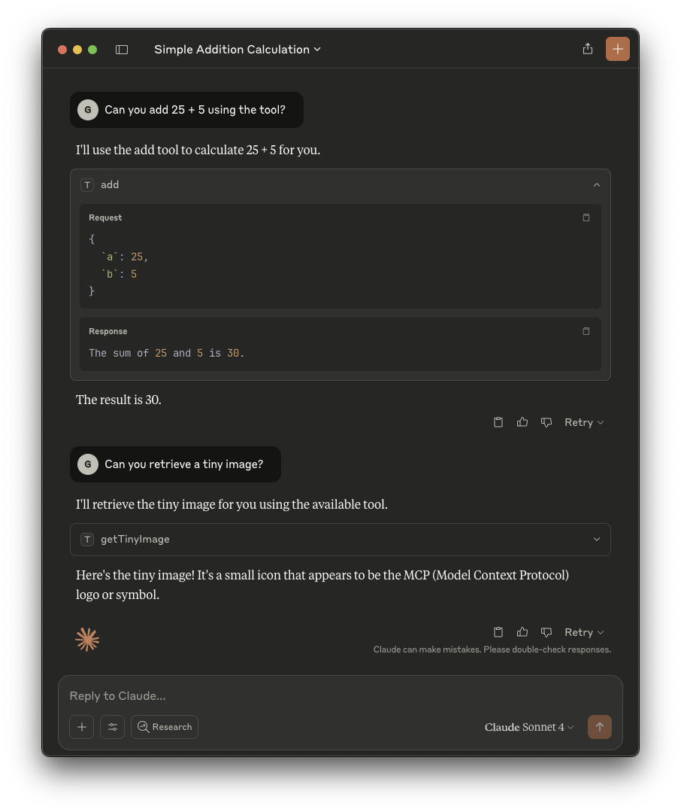

This guide explains how to configure MCP clients to access MCP servers resources.

### Prerequisites

- A running Teleport cluster. If you want to get started with Teleport, [sign
  up](https://goteleport.com/signup) for a free trial or [set up a demo
  environment](../linux-demo.mdx).

- The `tsh` client tool. Visit [Installation](../installation/installation.mdx) for instructions
  on downloading `tsh`. See the [Using Teleport Connect](../connect-your-client/teleport-connect.mdx)
  guide for a graphical desktop client that includes `tsh`.

- The Teleport MCP Access configured. See our guides for how to set up the MCP
  Access.

### Step 1/2. Installation

First, sign in into your Teleport cluster using `tsh login`:

```code
$ tsh login --proxy=<Var name="teleport.example.com:443" /> --user=myuser@example.com
```

You can now list the available MCP servers that you can use:

```code
$ tsh mcp ls
Name           Description                                Type  Labels
-------------- ------------------------------------------ ----- --------------------
fs             Filesystem MCP Server                      stdio env=prod
mcp-everything This MCP server attempts to exercise al... stdio env=dev,sandbox=true
```

The MCP clients configuration can be generated using `tsh mcp login` command. You can select which servers to configure by using the `--labels` flag to filter by labels or by providing `--all` which will configure all MCP servers you have access to.

This command can either generate a configuration file (using the `mcpServers`
format) for manual MCP client updates or automatically update the MCP client
configuration.

<Tabs>
<TabItem label="Claude Desktop">
`tsh` can automatically update the Claude Desktop MCP configuration file to
include Teleport's configuration:

```code
$ tsh mcp login --all --config-client=claude
Found MCP servers:
fs
mcp-everything

Updated client configuration at:
/path/to/Claude/claude_desktop_config.json

Teleport MCP servers will be prefixed with "teleport-mcp-" in this
configuration.

You may need to restart your client to reload these new configurations. If you
encounter a "disconnected" error when tsh session expires, you may also need to
restart your client after logging in a new tsh session.
```

You can also provide a custom path for your Claude Desktop MCPs configuration:
```code
$ tsh mcp login --all --config-client=/path/to/config.json
```

After updating the configuration, you need to restart the Claude Desktop app
before using the newly added MCPs.
</TabItem>

<TabItem label="Cursor">
`tsh` can automatically update the Global Cursor MCP servers to include
Teleport's configuration:

```code
$ tsh mcp login --all --config-client=claude
Found MCP servers:
fs
mcp-everything

Updated client configuration at:
/your/home/path/.cursor/mcp.json

Teleport MCP servers will be prefixed with "teleport-mcp-" in this
configuration.

You may need to restart your client to reload these new configurations. If you
encounter a "disconnected" error when tsh session expires, you may also need to
restart your client after logging in a new tsh session.
```

You can also update a Cursor project MCP servers by providing the path to the
file:
```code
$ tsh mcp db config --db-user=postgres --db-name=employees --config-client=/path/to/project/.cursor/mcp.json postgres-dev
```
</TabItem>


<TabItem label="VS Code">
Currently, `tsh` doesn't support generating the configuration for VS Code.
However, you can still use the config command to create the command and update
it to match VS Code format.

First, generate the configuration example for your MCP servers:

```code
$ tsh mcp login --all
Found MCP servers:
fs
mcp-everything

Here is a sample JSON configuration for launching Teleport MCP servers:
{
  "mcpServers": {
    "teleport-mcp-fs": {
      "command": "/path/to/tsh",
      "args": ["mcp", "connect", "fs"]
    },
    "teleport-mcp-mcp-everything": {
      "command": "/path/to/tsh",
      "args": ["mcp", "connect", "mcp-everything"]
    }
  }
}
```

With that, you can access your MCP server configuration within your project,
usually found at `/path/to/project/.vscode/mcp.json`, and copy the
`teleport-` servers definitions.

```diff
{
  "mcp": {
    "servers": {
+     "teleport-mcp-fs": {
+       "command": "/path/to/tsh",
+       "args": ["mcp", "connect", "fs"]
+     },
+     "teleport-mcp-mcp-everything": {
+       "command": "/path/to/tsh",
+       "args": ["mcp", "connect", "mcp-everything"]
+     }
    }
  }
}
```
</TabItem>

<TabItem label="Others">
Currently, `tsh` only supports generating the `mcpServers` format and some
client-specific formats. Running the config command without any specific options
will output configuration used to start Teleport's STDIO MCP server. You can use
this as a base and modify it to suit your MCP client needs.

```code
$ tsh mcp login --all
Found MCP servers:
fs
mcp-everything

Here is a sample JSON configuration for launching Teleport MCP servers:
{
  "mcpServers": {
    "teleport-mcp-fs": {
      "command": "/path/to/tsh",
      "args": ["mcp", "connect", "fs"]
    },
    "teleport-mcp-mcp-everything": {
      "command": "/path/to/tsh",
      "args": ["mcp", "connect", "mcp-everything"]
    }
  }
}
```
</TabItem>
</Tabs>

### Step 2/2. Usage

After configuring your MCP client, the MCP tools and resources should be
available.

You can now use the MCP servers as usual. Here is an example of using the
`mcp-everything` server through Teleport with Claude Desktop:



### Troubleshooting

#### Server is running but it has an empty list of tools

Ensure your user has permissions to the exposed MCP tools.

#### Expired `tsh` session

There must be a valid `tsh` session during the MCP server startup, or it won't
start.

If your session expires while the MCP server is running, the next tool calls
will fail. You need to run `tsh login` again and retry the failed requests. In
such cases, you don't have to restart the MCP client or the MCP server.
