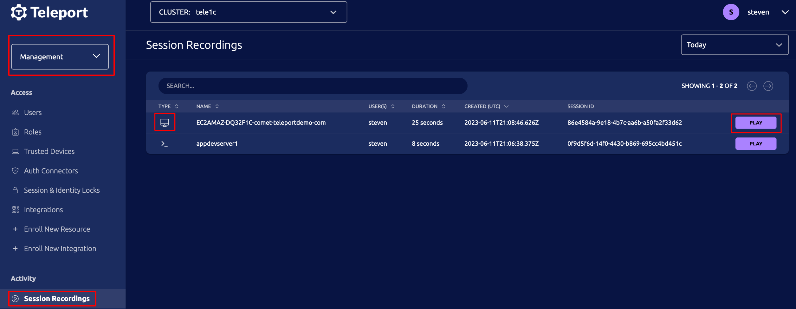

Teleport supports recording and playback of desktop sessions.

## Disabling session recording

Session recording is enabled by default, and can be disabled in one of two ways:

### Disable session recording at the cluster level

To disable session recording at the cluster level, edit your `teleport.yaml`
configuration file.

```yaml
auth_service:
  session_recording: off
```

<Admonition type="warning">
Disabling session recording at the cluster level applies to all types of
recordings. For example, this configuration would prevent Teleport from
recording SSH sessions as well as desktop sessions.
</Admonition>

The `session_recording` property can also be configured dynamically by using
`tctl` to edit the cluster's `session_recording_config` resource. This is the
required approach for Teleport Cloud users.

### Disable session recording via RBAC

Teleport's RBAC system allows more fine-grained control over which sessions are
recorded. By default, desktop session recording is enabled. To disable desktop
session recording for a particular user, add the following role option to all of
the user's roles:

```yaml
kind: role
version: v4
metadata:
  name: no_desktop_recording
spec:
  options:
    record_session:
      desktop: false
```

Because recording can be important for auditing and compliance concerns, the
presence of a single role with recording enabled will result in the session
being recorded. In other words, *all* of the roles applied to a user must
explicitly disable recording to prevent the session from being recorded.

See the
[Teleport Access Controls Reference](../../access-controls/roles.mdx)
for all possible settings in the `record_session` section.

## Playback

Recorded sessions can be viewed in the *Session Recordings* page under the
*Activity* section in the *Management* area. Desktop recordings show a
desktop icon in the first column to distinguish them from SSH recordings.



Click the play button to open the player in a new tab.

## Storage

Be aware, desktop session recordings save PNGs of changing sections of the
screen, which means they take up significantly more disk space than SSH or
Kubernetes session recordings. When using async recording modes, ensure that the
host running Teleport's Desktop Service has sufficient disk space to store
recordings that are in progress.

As a point of reference, when a full 1080p screen is redrawn (for example when
opening a new full-sized application window), you can expect about 250kb to be
saved to disk. If disk space is a concern, we recommend using sync recording and
configuring a cloud storage solution such as S3.

Refer to the `storage` section of the [Teleport Configuration
Reference](../../../reference/config.mdx) for more information on session
logging and recording management.
