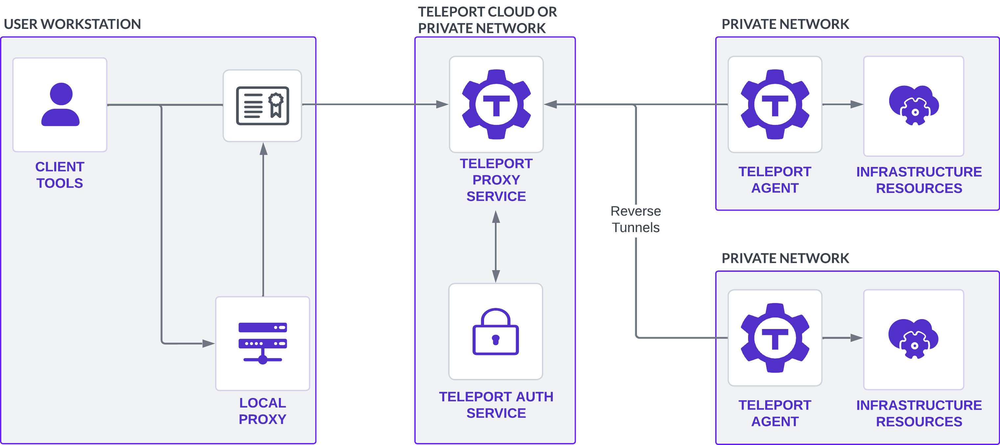
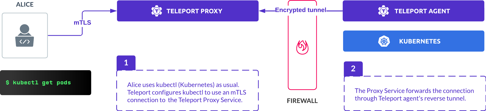

**Teleport Agents** route traffic to and from resources in your infrastructure.
This guide describes the architecture that enables Teleport to securely manage
traffic through this pathway.

Teleport Agents are running instances of the `teleport` binary, and can run on
any Linux platform (e.g., bare-metal, a Linux VM, a Docker container, or a pod
in a Kubernetes cluster). It is up to Teleport administrators to deploy and
manage agents, including on managed Teleport Enterprise accounts. 

A single agent can run multiple services, and each service can connect to
multiple target resources. For example, a single `teleport` process running on a
Linux VM might run both the Teleport SSH Service and Teleport Kubernetes
Service, which can connect to multiple terminal sessions and Kubernetes
clusters, respectively.

## Services

An agent can run one or more services. The following agent services are
available:

| Service | Traffic it proxies |
|-------|--------------------|
| SSH Service | SSH traffic to the host where the service runs.|
| Teleport Kubernetes Service  | HTTPS traffic to and from Kubernetes API servers.|
| Teleport Database Service    | Database-native wire protocols such as Postgres and MySQL, plus HTTP-based database protocols such as DynamoDB.|
| Teleport Application Service | HTTPS and TCP forwarding for internal web applications, with optional JSON web tokens. Signed HTTPS messages for cloud provider APIs.|
| Teleport Desktop Service     | Remote Desktop Protocol traffic to and from RDP servers.|

Agents can also run the Teleport Discovery Service. The Discovery Service
queries service discovery endpoints to list resources in your infrastructure,
and configures your Teleport cluster to route traffic to these resources by
creating dynamic configurations on the Auth Service backend. Agent services
listed above can then proxy resources enrolled by the Discovery Service.

## Components

A Teleport cluster where an administrator has enrolled resources involves the
following components:

- **[Teleport Proxy Service](../architecture/proxy.mdx):** A stateless service
  that performs the function of an authentication gateway, serves the Web UI,
  and accepts client connections. On managed Teleport Enterprise accounts, this
  service is accessible at your Teleport account URL, e.g.,
  `example.teleport.sh`.
- **[Teleport Auth Service](../architecture/authentication.mdx):** Serves as the
  cluster's certificate authority, handles user authentication/authorization and
  issues short-lived client certificates.
- **Teleport Agents:** Agents perform authentication against infrastructure
  resources, route user traffic to those resources, and perform protocol
  parsing.
- **Teleport client tools (`tsh`, Teleport Connect, and the Teleport Web UI):**
  Connect to resources in your infrastructure through Teleport Agents and the
  Teleport Proxy Service.
- **Local proxies:** In some cases, `tsh` spins up local proxy servers that
  authenticate to Teleport and forward traffic from client tools (e.g., database
  clients and AWS SDK applications).
- **Infrastructure resources:** Teleport can protect access to self-hosted
  infrastructure as well as infrastructure managed by a cloud provider.

## Teleport Agents to the Teleport Auth Service

The Teleport Auth Service runs a certificate authority that issues a host
certificate to an agent when it joins the cluster for the first time. Read [Join
Services to your Teleport Cluster](../../enroll-resources/agents/join-services-to-your-cluster/join-services-to-your-cluster.mdx)
for the available methods you can use to join an agent to your Teleport cluster.

All agents in a Teleport cluster keep the Auth Service updated on their status
with periodic ping messages. Clients can access the list of all agent instances
in their cluster via the Auth Service API or CLI.

An agent's identity is represented by SSH host certificate it receives after
registering withing the cluster:

This certificate contains information about the agent, including:

- The **host ID**, a generated UUID unique to an agent.
- A **hostname**, which defaults to the return value of the `hostname` command
  on the agent host, but can be configured.
- The **cluster name**. On cloud-hosted Teleport Enterprise clusters, this is a
  subdomain of `teleport.sh`. On self-hosted clusters, the default value is the
  `hostname` of the Teleport Auth Service, and users can configure this.
- The agent's **role** encoded as a certificate extension. For example, the
  `app,db` role would authorize the agent to run the Application Service and
  Database Service.
- The **expiry time** of the certificate.

The Auth Service also generates a short-lived X.509 certificate signed by the
cluster's host CA, with the client's identity and routing information for an
infrastructure resource encoded in it.

## Teleport Agents to the Teleport Proxy Service

In most cases, when an agent joins a Teleport cluster, it establishes an SSH
reverse tunnel to the Proxy Service. As such, users do not need to have direct
connectivity to agents or the resources they are connected to. As long as an
agent can dial back to the cluster's Proxy Service, it can be located behind a
firewall.

When an agent establishes a reverse SSH tunnel to the Proxy Service, the Proxy
Service identifies the agent based on its certificate. The certificate encodes
the agent's system role (e.g., `node,app,kube`) and a UUID for the agent. When a
dial request from a Teleport user reaches the Proxy Service, the Proxy Service
uses the address of the destination resource to locate the appropriate agent,
then proxies the user connection through the reverse tunnel associated with the
agent.

Connecting to agents without reverse tunnels

It is possible to join Teleport Agents to a cluster [through the Teleport Auth
Service](../../enroll-resources/agents/join-services-to-your-cluster/join-token.mdx).
Once an agent joins a cluster through the Teleport Auth Service, the Teleport
Proxy Service dials the agent directly, without creating a reverse tunnel. This
mode supports the following services:

- Teleport SSH Service
- Teleport Desktop Service
- Teleport Kubernetes Service
- Teleport Discovery Service

In direct mode, SSH Service instances act like OpenSSH servers that only accept
client SSH certificates. Users can connect to SSH servers through the Teleport
Proxy Service as a jump-host or directly:

Direct mode is designed for legacy use cases and only supports self-hosted
Teleport clusters. We recommend joining agents through the Teleport Proxy
Service and the reverse tunnel system unless this is not possible for your
self-hosted Teleport deployment.

## Agents to infrastructure resources

Teleport Agents route user traffic to and from resources in your infrastructure.
Agents authenticate with infrastructure resources using a technique available to
the target resource, often using a form of public key cryptography. A
non-exhaustive list of examples is below:

- **SSH servers:** The Teleport Proxy Service presents a certificate signed by
  the Teleport Auth Service, which the Teleport SSH Service instance running on
  the target host verifies.
- **Kubernetes clusters:** If the Teleport Kubernetes Service runs as a pod in
  the target cluster, the service uses the pod's service account credentials to
  authenticate. The Kubernetes Service can also use a kubeconfig that contains
  service account credentials or authenticate to Amazon Elastic Kubernetes
  Service clusters using AWS credentials. 
- **Databases:** For self-hosted databases, administrators must distribute
  mutual TLS credentials to database instances. For resources managed by cloud
  providers, Teleport takes advantage of identity and access management (IAM)
  solutions available through the cloud provider. 
- **Windows desktops:** The Teleport Desktop Service uses smart cards to
  authenticate to Windows desktops over RDP.
- **Applications:** The Teleport Application Service forwards HTTP requests and
  TCP streams to target applications, with optional Teleport-signed JSON web
  tokens added to HTTP request headers. It is up to the target application to
  authenticate Teleport-signed JWTs.

To learn more about the mechanism an agent uses to authenticate to an
infrastructure resource, read the guide to enrolling that resource in your
Teleport cluster:

- [Applications](../../enroll-resources/application-access/guides/guides.mdx)
- [Cloud provider APIs](../../enroll-resources/application-access/cloud-apis/cloud-apis.mdx)
- [Databases](../../enroll-resources/database-access/guides/guides.mdx)
- [Kubernetes clusters](../../enroll-resources/kubernetes-access/register-clusters/register-clusters.mdx)
- [Linux hosts with Teleport](../../enroll-resources/server-access/getting-started.mdx)
- [OpenSSH servers](../../enroll-resources/server-access/openssh/openssh.mdx)
- [Windows desktops](../../enroll-resources/desktop-access/getting-started.mdx)

## Clients to Agents

Client tools authenticate to Teleport Agents by presenting certificates signed by
a Teleport certificate authority, forwarding traffic to the Agent through an SSH
reverse tunnel established between the Teleport Proxy Service and the Agent.
Clients need to retrieve a certificate, then connect to an infrastructure
resource through the Agent.

### Credentials for Teleport clients

When a user logs into the cluster with the `tsh login` command, the Teleport
Auth Service uses the `user` certificate authority to sign the certificate. See
[Issuing User Certificates](../architecture/authentication.mdx) for more details
on how it works. If the user authenticates via the Teleport Web UI, the browser
retrieves a session cookie, which corresponds to a user certificate stored by
the Proxy Service on behalf of that user.

In most cases, Teleport users must retrieve another user certificate in order to
access Teleport-protected resources. The certificate authorizes the user to
access specific resources, such as an application or database. The following
table indicates how a user obtains this certificate for different kinds of
resources:

|Resource kind|How users obtain certificates|
|---|---|
|Databases|The user can retrieve a client certificate for before connecting to a database with `tsh db login`. The `tsh db connect` and `tsh proxy db` commands also retrieve certificates. The Teleport Database Service verifies the certificate when a user connects to a database.|
|Kubernetes clusters|The user runs `tsh kube login`, which updates the local kubeconfig to contain a certificate signed by the Teleport user CA. The user can then execute `kubectl` commands against Teleport-protected Kubernetes clusters.|
|Servers|After running `tsh login`, the user receives a certificate that contains authorization information for servers. The SSH Service checks the certificate when a user authenticates to a Teleport-protected server.|
|Web applications|The user authenticates to the Teleport Web UI and visits a Teleport-protected application. The Teleport Proxy Service forwards traffic to the application along with Teleport-signed JSON web tokens that the application can verify. For HTTP API applications, TCP applications, and cloud provider APIs, the user runs `tsh apps login` to retrieve a certificate.|
|Windows desktops|Users authenticate to the Teleport Web UI. The Web UI initiates a WebSocket session with the Teleport Proxy Service, which forwards traffic through mTLS over an optional reverse SSH tunnel to the Teleport Desktop Service. The Desktop Service forwards RDP traffic to the desired RDP server.|

In most cases, users will receive certificates from the Auth Service via a
connection to the Teleport Proxy Service. The Auth Service and Proxy Service
connect to each other using mutual TLS.

[Teleport Connect](../../connect-your-client/teleport-connect.mdx) runs `tshd`, a
`tsh` daemon that manages user certificates and kubeconfigs for the graphical
client.

### Connecting to infrastructure resources through agents

Teleport makes several client tools available for accessing infrastructure
resources through agents:

- [The `tsh` CLI](../../connect-your-client/tsh.mdx)
- [Teleport Connect](../../connect-your-client/teleport-connect.mdx)
- [Teleport Web UI](../../connect-your-client/web-ui.mdx)

After retrieving [client credentials](#credentials-for-teleport-clients), these
tools are authenticated to the Teleport Proxy Service and can send traffic
through it to Teleport Agents. The protocol that a client uses depends on the
upstream resource. See [TLS Routing](./tls-routing.mdx) for how client tools
perform protocol negotiation with the Teleport Proxy Service.

Depending on the upstream infrastructure resource a user wants to connect to,
the `tsh` client tool may spin up one or more local proxy servers. These
authenticate to the Teleport Proxy Service, then create a listener that accepts
traffic from local client tools like `psql` and `kubectl`. A user can then
connect to the local proxy with their client tool as though they were connecting
to a remote resource.

Available local proxies

The following table summarizes the local proxies available through the `tsh`
CLI:

|`tsh` command|Upstream infrastructure resource|
|---|---|
|`tsh proxy app`|HTTP and [TCP](../../enroll-resources/application-access/guides/tcp.mdx) applications|
|`tsh proxy aws`|[AWS SDK applications](../../enroll-resources/application-access/cloud-apis/aws-console.mdx)|
|`tsh proxy azure`|[Azure SDK applications](../../enroll-resources/application-access/cloud-apis/azure.mdx)|
|`tsh proxy gcloud`|[Google Cloud SDK applications](../../enroll-resources/application-access/cloud-apis/google-cloud.mdx)|
|`tsh proxy ssh`|[OpenSSH client traffic](../../enroll-resources/server-access/openssh/openssh-agentless.mdx)|
|`tsh proxy db`|[Native database clients](../../connect-your-client/gui-clients.mdx)|
|`tsh proxy kube`|[Kubernetes clusters behind L7 load balancers](tls-routing.mdx#kubernetes)|

`tsh` commands that connect to resources often spin up the same local proxies as
`tsh proxy` commands. For example, depending on the database, `tsh db connect`
starts a local proxy before using a database client to send traffic to it.

## Submitting audit events

Teleport Agents connect to the Teleport Auth Service through the Teleport Proxy
Service and submit audit events at various moments within the life cycle of a
user session, including when the user signs in, connects to a resource,
interacts with a resource, and signs out. Agents interpret the wire protocol
messages they forward to infrastructure resources in order to detect events.

Learn more about the Teleport audit events in the [Audit Event
Reference](../monitoring/audit.mdx).

## Further reading

- For instructions on deploying agents, see the [Teleport Agent
  guides](../../enroll-resources/agents/introduction.mdx).
