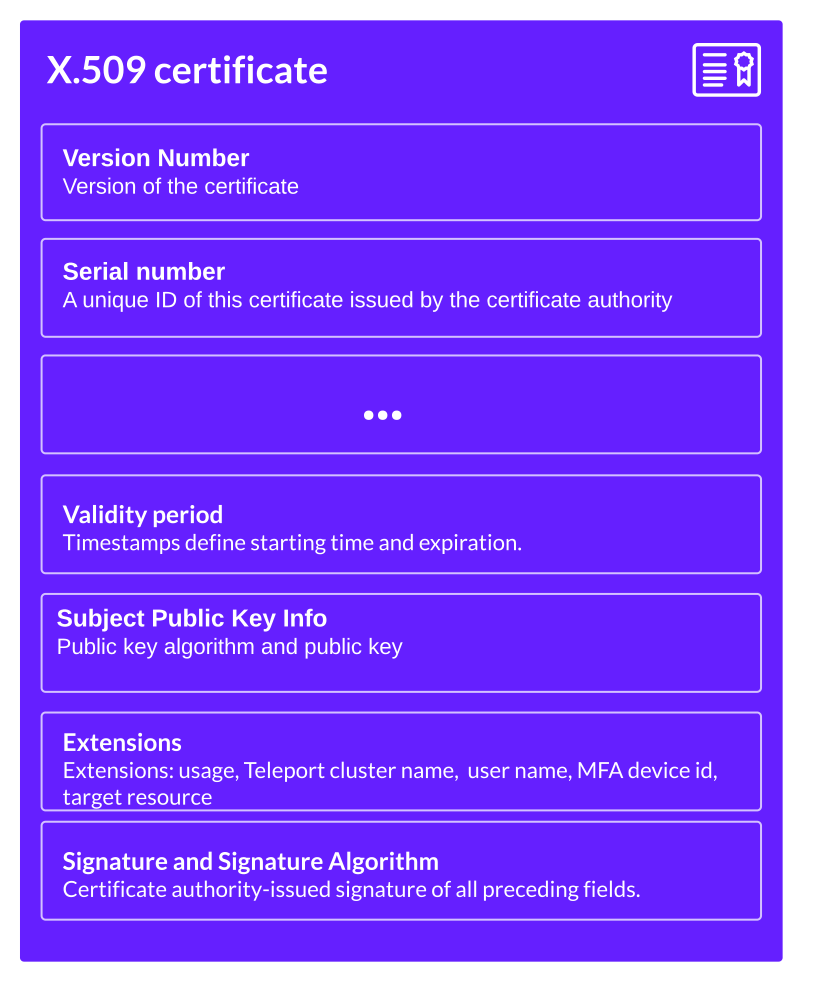
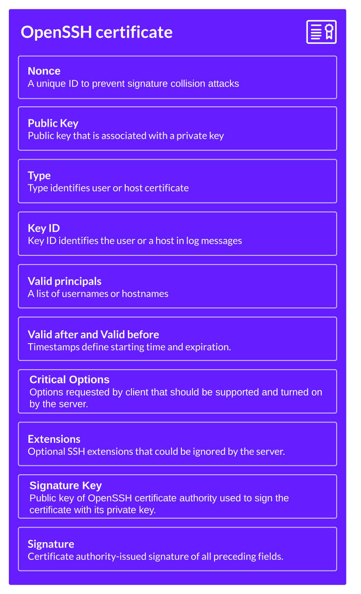
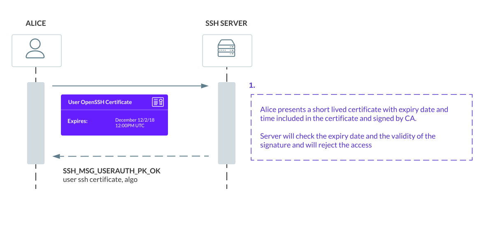
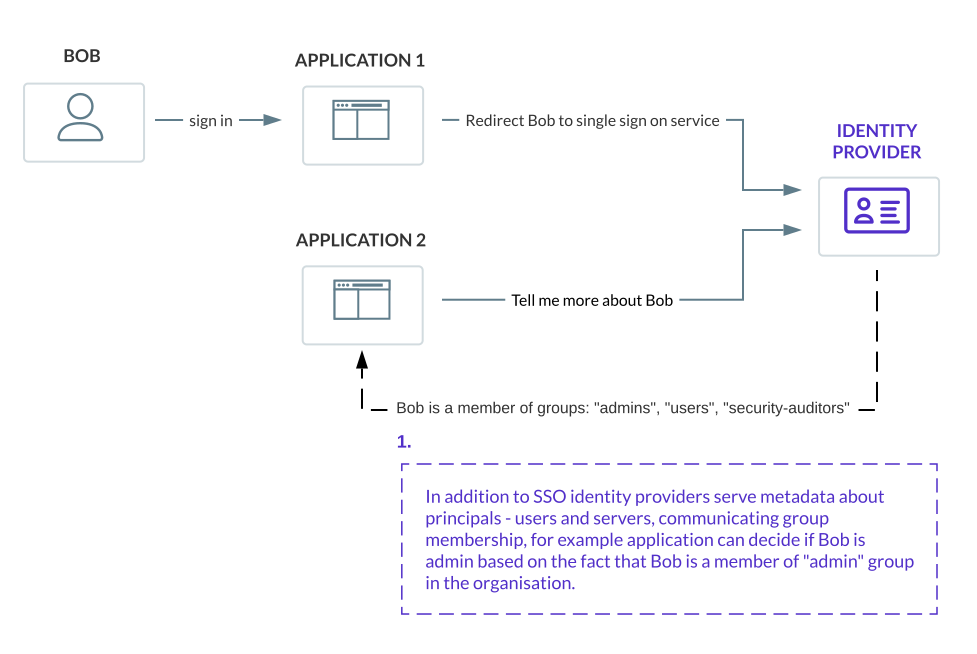

Teleport handles both authentication and authorization.

- Authentication is about proving an identity of a user or a service.
- Authorization is proving access rights to something.

This guide explains how Teleport handles authentication with short-lived
certificates.

## Short-Lived Certificates

Certificate Authorities and short-lived certificates are the core of Teleport authentication.
In Teleport at the start of every connection, a user or a service has to present a valid certificate issued by
a trusted certificate authority. Clients always initiate mutual TLS or mutual SSH connections.

Teleport Certificate Authority issues short-lived x.509 certificates for web services, databases, kubernetes clusters,
desktops and SSH certificates for OpenSSH-compatible servers.

### Why certificates?

- Certificates are tied to user or service identity. Any connection and action can be traced back to a user
or a service.
- Short-lived certificates automatically expire, there is no need to revoke them.
- Certificates solve trust on first use (TOFU) problems. In a Teleport cluster, all servers have
identities and certificates of their own. They will not allow a connection if a client certificate is signed by an
untrusted certificate authority.
- Certificates enable mutually authenticated channel - mTLS, mTLS mitigates a wide range of attacks - spoofing, on-path attacks, credential stuffing and others.
- Certificates work better for large-scale deployments. Each server or service just needs to validate
if the certificate has been signed with a valid certificate authority, and does not need to copy user
credentials over to every service.

<Notice type="tip">
Teleport issues certificates that are good from a few hours to minutes before they auto-expire without any action.
The shorter the duration for these certificates, the better.
Ideally, certs should be issued only for the duration of a session.
In practice, several hours or the duration of the workday are OK too.
The expiry date in certificates can not be forged
without invalidating the certificates, so any system can validate the certificate.
</Notice>

### X.509 certificates

X.509 certificates are the same certificates you use when accessing websites with a browser. They bind
identity to the public key with a certificate authority's signature.

<Figure
  align="center"
  caption="Example of x.509 short-lived certs"
>

</Figure>

Teleport uses x.509 certificates for Kubernetes clusters, databases, web
services and its own internal components, such as the Proxy Service and Auth
Service, to establish mutually authenticated TLS connections (mTLS).

### OpenSSH certificates

OpenSSH certificates are similar to X.509 (web) certificates and also bind identity of the user or a server
to the public key with a certificate authority's signature.

<Figure
  align="center"
  caption="Example of SSH short-lived certs"
>

</Figure>

OpenSSH certificate contain metadata used to authenticate users and hosts:

- List of principals (identities) this certificate belongs to.
- Signature of the certificate authority who issued it.
- The expiration date, also known as "time-to-live" or simply TTL.
- Additional data, such as the node role, is stored as a certificate extension.

### Making Time Work For You

Expiry is a feature of certificates that makes time work in favor of security.
SSH and X.509 certificates include an optional expiry date that is verified by
servers in addition to a signature.

<Figure
  align="center"
  caption="Example of SSH short-lived certs"
>

</Figure>

In the diagram above, Alice gets a short lived SSH certificate, but the same rules apply to
X.509 certificates issued by Teleport and used for Kubernetes, Databases, Web Apps and Desktops.

Teleport issues certificates that are good from a few hours to minutes before they auto-expire without any action.
Instead of distributing revocation lists, Teleport relies on time to do the job for us.

<Notice type="tip">
In some cases, certificate expiration is not fast enough, and all sessions have to be terminated immediately,
for example during active security incident.
For those cases, Teleport Proxy can terminate live connections using [session and identity locking](../../admin-guides/access-controls/guides/locking.mdx).
</Notice>

### Short-lived Certs For Users

To issue a certificate to a user, Teleport opens login screen, issues a cert and delivers it back to a user's computer:

We recommend using SSO with GitHub, Okta or any other identity provider and get a cert.

<Figure
  align="center"
  bordered="true"
  caption="SSO exchange with short-lived certs"
  >
  

</Figure>

### Short-lived Certs for Services

Deployment automation services, such as Jenkins, can use Teleport's Machine ID
service to receive and renew certificates. Teleport Machine ID's bot runs alongside
services and rotates SSH and X.509 certificates.

<Figure
  align="center"
  bordered="true"
  caption="Machine-ID certs"
  >
  

</Figure>

### Internal certificates

Teleport internal services - the Auth Service, Proxy Service, Agents, and Machine ID Bots - use certificates to identify themselves
within a cluster. To join services to the cluster and receive certificates, admins should use
[short-lived tokens or cloud identity services](../../enroll-resources/agents/join-services-to-your-cluster/join-token.mdx).

Unlike users and services, internal services receive long-lived certificates.

To renew these certificates, admins should use certificate authority rotation, the process of invalidating all
previously-issued certificates for nodes or users regardless of expiry and issuing a new ones,
using a new certificate authority.

Take a look at the [Certificate Rotation Guide](../../admin-guides/management/operations/ca-rotation.mdx) to
learn how to do certificate rotation in practice.

<Notice type="tip">
To quickly lock out a potentially compromised Auth Service instance, Proxy
Service instance, or Teleport Agent without rotating the entire cluster
certificates, use [session and identity
locking](../../admin-guides/access-controls/guides/locking.mdx).
</Notice>

## More concepts

- [Architecture Overview](../../core-concepts.mdx)
- [Authorization](authorization.mdx)
- [Teleport Agents](agents.mdx)
- [Teleport Proxy](proxy.mdx)
