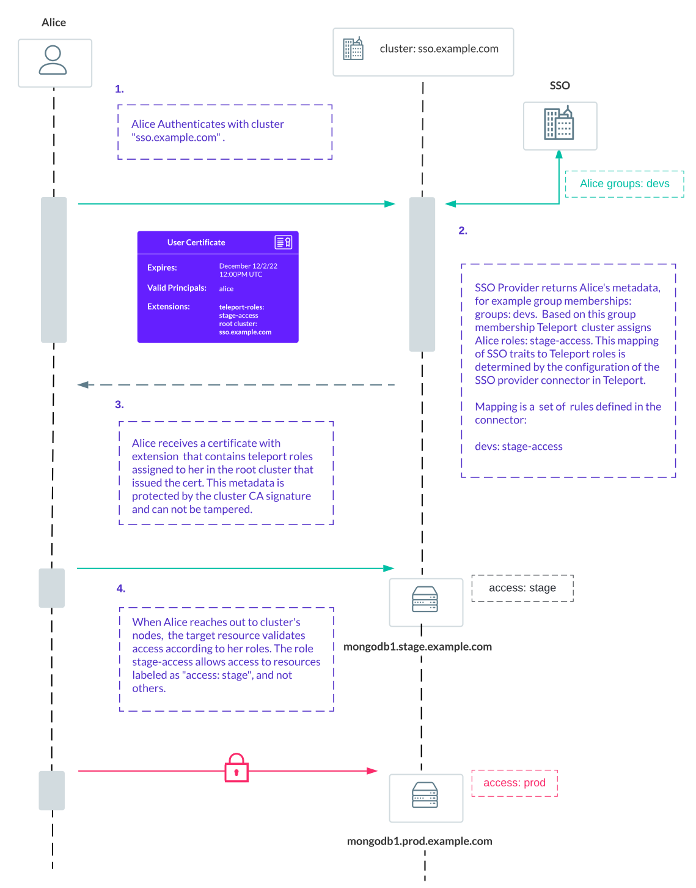
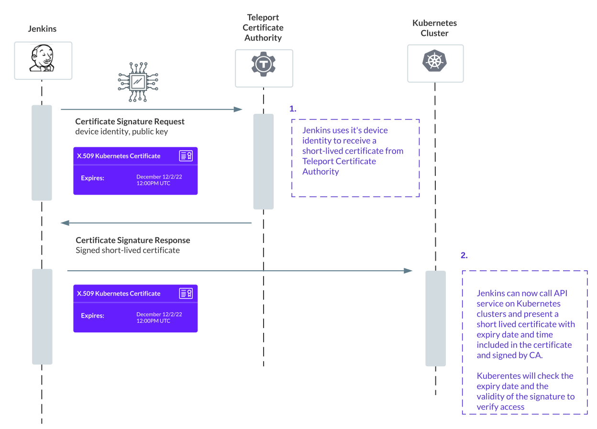

Teleport handles both authentication and authorization.

- Authentication is about proving an identity of a user or a service.
- Authorization is proving access rights to something.

This article explains authorization of users and services with RBAC.

## Users and Roles

Teleport supports several types of user accounts:

- Interactive and non-interactive.
- Local and external.

Each user is associated with one or several roles after successful authentication.

### Interactive users

Interactive users can be local or external.
Local user accounts store login credentials - password hash and MFA device data in Teleport's backend.
External user accounts authenticate with a third-party identity provider using SSO protocols - OAuth 2.0, OIDC or SAML.

#### External users from SSO providers

Let's review the example Alice who is authenticating using SSO provider of her organization
with Teleport:



<Notice type="tip">
Every time SSO user logs in, Teleport creates a temporary user account record
that automatically expires with SSO session and logs audit log entries.

Teleport creates this record to avoid name collisions with local users.
</Notice>

#### External users from other clusters

A user could be external to the Teleport cluster, if another cluster or certificate authority issues a certificate
that this cluster trusts. In this case, Teleport activates [trusted cluster mapping logic](./trustedclusters.mdx#role-mapping).

#### Local interactive users

Local interactive users have a record in Teleport's backend with credentials.

A cluster administrator have to create account entries for every Teleport user with
[`tctl users add`](../cli/cli.mdx) or API call.

Every local Teleport User must be associated with a list of one or more roles.
This list is called "role mappings".

### Non-interactive users

Teleport supports non-interactive users for automation services, e.g. Jenkins or micro-services
running in your organization.

#### Local non-interactive users

Local non-interactive users also have a user entry that maps their name to roles,
but they do not have credentials stored in the database.
Non-interactive users have to use Teleport's machine ID product to receive and renew certificates.
Teleport Machine ID's bot runs alongside services and rotates SSH and X.509 certificates on behalf
of non-interactive users:

<Figure
  align="center"
  bordered="true"
  caption="Machine-ID certs"
  >


</Figure>

#### External non-interactive users

External non-interactive users behave just like local ones, but it is another
cluster or certificate authority that issues certificates for them.

They do not have local user records in Teleport backend. Teleport activates
[trusted cluster mapping logic](./trustedclusters.mdx#role-mapping) to support this use case.

## Role Based Access Control

Every Teleport user is assigned one or several roles that govern access to resources and Teleport's API.

### Allow and Deny Rules

Each Teleport role works by having two lists of rules: `allow` rules and `deny` rules:

- Everything is denied by default.
- Deny rules get evaluated first and take priority.
- A rule consists of two parts: the resources and verbs.

Here's an example of an allow rule describing a list verb applied to the sessions resource.
It means "allow users of this role to see a list of recorded SSH or Kubernetes sessions".

```yaml
allow:
  - resources: [session]
    verbs: [list]
```

### Principals

Roles define what principals (e.g. Linux OS users or Kubernetes group) users assigned
to the role are allowed to assume:

```yaml
spec:
  allow:
    # The logins array defines the OS/UNIX logins a user is allowed to use.
    logins: [ubuntu]
    # Kubernetes groups defines what kubernetes groups a user is allowed to assume.
    kubernetes_groups: [viewer]
```

In case if a user has many roles, the list of principals is merged in one set.

### Labels

Role labels define what resources rules in the role apply to. For example, let's
review a role that specifies access for SSH nodes and kubernetes clusters:

```yaml
spec:
  allow:
    # List of node labels a user will be allowed to connect to:
    node_labels:
      # Regular expressions are also supported, for example, the equivalent
      # of the list example above can be expressed as:
      'environment': '^test|staging$'

    kubernetes_labels:
      # User can access any region in us-west, e.g us-west-1, us-west-2
      'region': 'us-west-*'
      'cluster_name': '^us.*\.example\.com$'
```

Here is how labels, allow rules and principals are applied:

- For `allow` rule to match, all labels in the rule should match,
for example, in the Kubernetes rule above, both `region` and `cluster_name` should match.
- For `deny` rule to match, any label in the rule could match.

**Principals and labels**

Let's assume Alice is assigned two roles: `dev` and `prod`:

Dev role allows SSH access as `root` and unrestricted access to kubernetes as `system:masters` for
any kubernetes cluster or node with labels matching 'test' or 'stage'.

```yaml
metadata:
  name: dev
spec:
  allow:
    logins: [root]
    kubernetes_groups: ['system:masters']
    # List of node labels a user will be allowed to connect to:
    node_labels:
       'environment': ['test', 'stage']
    kubernetes_labels:
       'environment': ['test', 'stage']
    # Allow access to any Kubernetes resources in a cluster with the labels specified
    # above.
    kubernetes_resources:
      - kind: '*'
        namespace: '*'
        name: '*'
        verbs: ['*']
```

Prod role allows SSH access as `ubuntu` and `view` access to kubernetes for
any kubernetes cluster or node with labels matching 'prod'

```yaml
metadata:
  name: prod
spec:
  allow:
    logins: [ubuntu]
    kubernetes_groups: ['view']
    node_labels:
       'environment': ['prod']
    kubernetes_labels:
       'environment': ['prod']
    kubernetes_resources:
      - kind: '*'
        namespace: '*'
        name: '*'
        verbs: ['*']
```

Here is how Teleport will evaluate Alice's access:

- Alice can SSH as root to server labeled as `test` or `stage`
- Alice can not SSH as root to server labeled as `prod`, because prod role
only allows access as `ubuntu` to `prod`-labeled servers.

The same applies to Kubernetes:

- Alice can access kubernetes cluster as `system:masters` if it's labeled as `test` or `stage`.
- Alice can access kubernetes clusters only as a `view` role if it's labeled as `prod`.

### Role templates

Roles support template variables. Here is a role snippet that explains
how variables are interpolated.

```yaml
spec:
  # The allow section declares a list of resource/verb combinations that are
  # allowed for the users of this role. By default, nothing is allowed.
  allow:
    # internal.logins - will be interpolated from local user's traits -
    # properties you can assign when creating a user.
    logins: ['{{internal.logins}}']

    # kubernetes_groups specifies Kubernetes groups a user with this role will assume.
    # You can refer to a SAML/OIDC trait via the "external" property bag.
    # This allows you to specify Kubernetes group membership in an identity manager:
    kubernetes_groups: ['{{external.groups}}']
```

<Notice type="tip">
Any role that uses variable interpolation is treated as a role template.
You can add interpolation to any role spec.
</Notice>

**Variable interpolation rules*

- If `external.groups` is a list that contains `["dev", "prod"]` the expression `["{{external.groups}}"]`
will interpolate to list `["dev", "prod"]`.
- If `external.groups` is a variable that equals `"dev"` the expression `["{{external.groups}}"]`
will interpolate to `["dev"]`.
- If `external.groups` is missing, the expression `"{{external.groups}}"` will evaluate into empty string `""`.
You can use predicate language function calls in templates, e.g. `{{email.local(external.foo)}}`.
- You can combine string prefixes and values, for example: `"IAM#{{regexp.replace(external.foo, "^bar-(.*)$", "$1")}};"`.
- Invalid expressions will be ignored, e.g. `external.foo}}` will be skipped, just as invalid function calls.
- Invalid values will be omitted, for example `-foo` is not a valid Unix login, so if variable `external.foo` equals
`"-foo"`, it will be omitted in `logins: ["{{external.foo}}"]`.

For full details on how variable expansion works in Teleport roles, see the
[Teleport Access Controls
Reference](../access-controls/roles.mdx).

**How role templates are evaluated**

Every Teleport component - whether a Proxy Service instance, Auth Service
instance, or Agent -has up to date copy of all roles.  Teleport components
evaluate role templates at the time of access to any resource. 

Let's review a case with the following role template:

```yaml
metadata:
  name: devs
spec:
  allow:
    kubernetes_groups: ["{{external.k8s_groups}}"]
    kubernetes_labels:
       "env": ["{{external.env}}"]
    kubernetes_resources:
      - kind: pod
        namespace: "*"
        name: "*"
```

User Alice authenticates with Teleport and receives the following variables from
the identity provider:

```
k8s_groups: ["view", "edit"]
env: ["stage"]
```

These variables get encoded in the X.509 certificate as extensions.

When proxy authorizes the attempt to connect to the Kubernetes cluster it interpolates
the role template and the variables, and gets:

```yaml
metadata:
  name: devs
spec:
  allow:
    kubernetes_groups: ["view", "edit"]
    kubernetes_labels:
       "env": ["stage"]
    kubernetes_resources:
      - kind: pod
        namespace: "*"
        name: "*"
```

Finally, the proxy applies the resulting role to the kubernetes cluster Alice tries to
access and checks it against cluster. If the cluster has labels  `"env": "stage"`
the attempt succeeds, otherwise it fails.

### Role conditions

The example below illustrate how to restrict session access only for the user who created the session
using role conditions:

```yaml
kind: role
metadata:
  name: only-own-sessions
spec:
  allow:
    rules:
    # Users can only view session recordings for sessions in which they
    # participated.
    - resources: [session]
      verbs: [list, read]
      where: contains(session.participants, user.metadata.name)
```

<Notice type="tip">
You can use `where` fields in all resource rules. Check out [the full role reference](../access-controls/roles.mdx) contains full role spec for details.
</Notice>

### Role options

Alongside `allow` and `deny` rules, roles control a variety of options, for example:

```
kind: role
version: v5
metadata:
  name: relaxed
spec:
  # options specify connection, in case if user has multiple non-default
  # conflicting options, teleport chooses the least permissive value.
  options:
    # max_session_ttl defines the TTL (time to live) of certificates
    # issued to the users with this role.
    max_session_ttl: 8h
    # lock sets locking mode for user of this role,
    # valid values are "strict" or "best_effort"
    lock: strict
```

In case if user has multiple roles that specify conflicting options, for example,
role `relaxed` sets the `max_session_ttl` to `8h` and `restricted` that sets `max_session_ttl`
to `4h`, most secure value will be used, in this case Teleport will choose to limit sessions to 4 hours.

Teleport applies the same logic to other values, for example if two roles specify both `strict` and `best_effort`
options, Teleport will choose `strict` option.

### Just in Time Access Requests

<Notice type="tip">

  The full version of Just In Time Access Requests is available only in Teleport
  Enterprise (including Enterprise Cloud).

</Notice>

Roles allow requesting elevated privileges - other roles or individual resources.

Roles control who can review requests for privileges and define how many approvals
or rejections are required:

```yaml
spec:
  allow:
    # review_requests allows a user holding this role
    # to approve or deny Access Requests
    review_requests:
      roles: ['dbadmin']

    # request allows a user user request roles matching
    # expressions below
    request:
      # the `roles` list can be a mixture of literals and wildcard matchers
      roles: ['common', 'dev-*']
      # thresholds specifies minimum amount of approvers and deniers,
      # defaults to 1 for both
      thresholds:
        # requires at least two qualifying approvers and at least one denier.
        - approve: 2
          deny: 1
```

## Next steps

- [Access Control Reference](../access-controls/roles.mdx).
- [Teleport Predicate Language](../predicate-language.mdx).
- [Access Requests Guides](../../admin-guides/access-controls/access-requests/access-requests.mdx)
- [Architecture Overview](../../core-concepts.mdx)
- [Teleport Auth](authentication.mdx)
- [Teleport Agents](agents.mdx)
- [Teleport Proxy](proxy.mdx)

