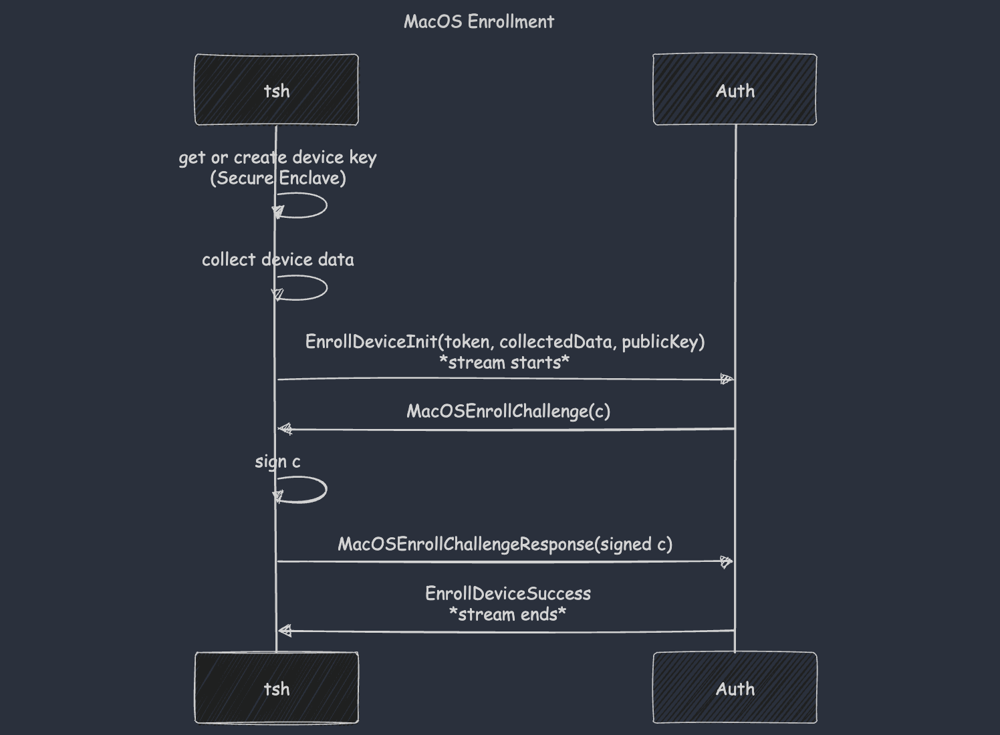
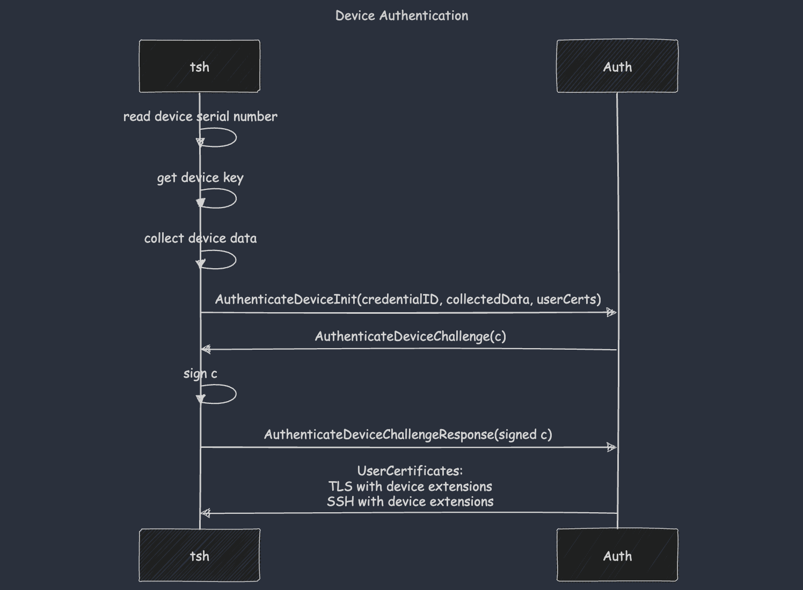

Device Trust leverages the macOS Secure Enclave, or TPM 2.0 on Linux and Windows
devices, to establish and validate device identity.

There are three main steps in a device's lifecycle: registration, enrollment and
authentication.

**Registration** informs Teleport about a known device. At this stage the device
is not yet trusted, but is part of the **device inventory**. For example, a
device created using `tctl devices add` or synced via Jamf is registered.

**Enrollment** transforms a registered device into a trusted device by creating
and verifying a secure private key.

The collected device data above includes the serial number, model, OS
information, etc. (You can inspect it by running `tsh device collect`).

A safe enrollment ceremony is paramount, as the identity established here
(through the device's key) is the basis for future authentications. Options
range from [auto-enrollment][] to manually distributed [device enrollment
tokens][].

**Authentication** follows a similar pattern. It challenges the device to prove
itself using the previously established device key and, if successful, issues
new user certificates augmented with device extensions. The presence of device
extensions is what unlocks [device enforcement][]

Device authentication happens after the initial user authentication, requiring
the user to be authenticated beforehand.

These are the basics of device trust. TPM ceremonies are slightly different in
implementation but equivalent in functionality and security properties
(enrollment attests the EKCert, EK and AK; authentication verifies possession of
the AK).

Web UI support is underpinned by the same ceremonies described above, which are
delegated to Teleport Connect for technical reasons. Our [device trust for the
web][] blog post describes the implementation challenges in detail.

For practical use see the [device trust section][].

[auto-enrollment]: ../../admin-guides/access-controls/device-trust/device-management.mdx#auto-enrollment
[device enrollment tokens]: ../../admin-guides/access-controls/device-trust/device-management.mdx#create-a-device-enrollment-token
[device enforcement]: ../../admin-guides/access-controls/device-trust/enforcing-device-trust.mdx
[device trust for the web]: https://goteleport.com/blog/device-trust-for-web-challenges-and-solutions/
[device trust section]: ../../admin-guides/access-controls/device-trust/device-trust.mdx
