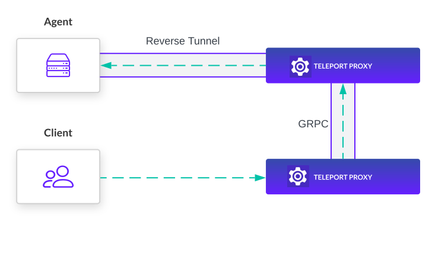

Proxy Peering enables Teleport Agents to be reachable without connecting to
every Teleport Proxy Service. This allows Teleport Proxy instances to scale
horizontally without increasing the number of connections created by agents.

<Admonition title="Note" type="tip">
  A Teleport Agent is a Teleport instance that provides access to resources in your infrastructure, i.e., by running the SSH,
  Kubernetes, Database, Application, or Desktop Services.
</Admonition>

By default, Teleport Agents need to create a reverse tunnel to every Teleport Proxy
to ensure a client is able to reach every agent. With Proxy Peering this is no
longer a requirement. When Proxy Peering is enabled agents will automatically
change their behavior to connect to the configured number of Teleport Proxy
instances.

## How it works

### Proxy Service

A gRPC service on each Teleport Proxy Service instance provides an API for establishing a
bi-directional connection to the agents connected to that Teleport Proxy. Teleport
Proxy instances manage a gRPC client to all other Teleport Proxy instances in the
cluster.

Routing information on which Teleport Proxy instances each agent is connected to
is stored in Teleport's backend and propagated to each Teleport Proxy instance.

The routing information and gRPC service allow a Teleport Proxy to identify which
Proxy Service instance an agent is connected to and create an end-to-end connection
from a client to that agent. This allows for access to the agent without connecting
to the same Teleport Proxy instance initially.

### Reverse tunnel agents

Agents will check whether you have enabled Proxy Peering before
attempting to create a reverse tunnel to a Teleport Proxy instance.

By default, in Proxy Peering mode, agents are configured to connect to a single
Teleport Proxy instance. For high availability a cluster administrator may
configure agents to connect to 2 or more Teleport Proxy instances.

## Next Steps
- See the [migration guide](../../admin-guides/management/operations/proxy-peering.mdx) to learn how to upgrade an existing cluster to use
Proxy Peering
