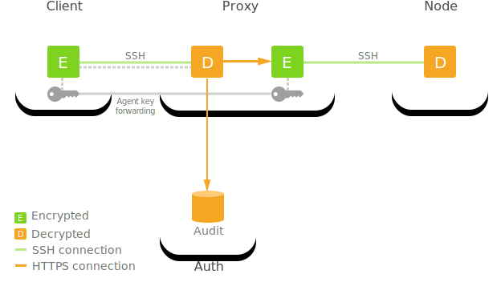

This page provides an overview of how Teleport records sessions and the various
configuration options that apply to session recordings.

## What session recordings capture

The content that is captured depends on the type of the session.

### SSH sessions

Teleport captures the entire pseudo-terminal (PTY) output of the session. The
intention is for session recording to document what a user saw when they ran a
session.

Note that the design of session recording carries some security risks. Namely,
users can conceal terminal commands by encoding them (e.g., using `base64`),
running scripts from disk or the internet, or changing the terminal settings. If
this presents an issue for your environment, consider using the BPF-based
[Enhanced Session Recording](../../enroll-resources/server-access/guides/bpf-session-recording.mdx)
instead.

### Kubernetes sessions

Teleport captures the entire PTY output for `kubectl exec` invocations.

Kubernetes session recording carries the same security risks as SSH session
recording.

### Desktop sessions

Teleport captures the contents of the desktop screen and any mouse input.
Teleport does not capture keystrokes in the remote desktop.

### App sessions

Teleport captures a stream of `app.session.request` audit events related to
application access. The audit events are bucketed into 5-minute time intervals
informally referred to as "chunks."

### Database sessions

Teleport captures database queries and a stream of audit events 
related to the database being accessed.

## Session recording configurations

Teleport supports two different recording configurations: synchronous and
asynchronous recording. Additionally, Teleport administrators can configure
where the recording takes place: at the node or at the proxy.

This results in 4 possible session recording configurations:

- `node-sync`: synchronous recording performed by an SSH Service instance
- `node`: asynchronous recording performed by an SSH Service instance
- `proxy-sync`: synchronous recording performed on a Proxy Service instance
- `proxy`: asynchronous recording performed on a Proxy Service instance

This is a cluster-wide configuration option and applies to the entire
Teleport cluster. It can be configured by setting `session_recording`
in the `auth_service` section of your `teleport.yaml`, or dynamically using
the `session_recording_config` resource. If you need to apply different
recording configurations to different sets of resources, you can set up
[trusted clusters](../../admin-guides/management/admin/trustedclusters.mdx) with their own
recording configurations.

<Admonition type="note">
Windows, database, and Kubernetes sessions are always recorded at the host running
the Teleport service for this session type, since there is no Teleport software
running on the "node" (desktop, database, or Kubernetes cluster).

For this reason, the Teleport Windows, Database, and Kubernetes Services treat
`node` and `proxy` identically (perform asynchronous recording) and `node-sync`
and `proxy-sync` identically (perform synchronous recording).

</Admonition>

### Record at the SSH node

By default, Teleport performs recording at the SSH node. This is because Teleport's
Proxy Server cannot see the SSH traffic to the node. It is encrypted end-to-end
(from the SSH client to the SSH server):

### Record at the Proxy Service

In **Recording Proxy Mode**, the Proxy Service terminates (decrypts) the SSH
connection using the certificate supplied by the client via SSH agent forwarding
and then establishes its own SSH connection to the final destination server.
This allows the Proxy Service to forward SSH session data to the Auth Service to
be recorded, as shown below:

Recording Proxy Mode allows Teleport users to enable session recording for
OpenSSH's servers running `sshd`, which is helpful when gradually transitioning
large server fleets to Teleport.

We consider Recording Proxy Mode to be less secure, as it grants additional
privileges to the Proxy Service. Since the Proxy Service needs credentials to
decrypt the SSH connection, it must be properly secured and is a higher value
target for an attacker than a Proxy Service instance that cannot decrypt the
data flowing through it.

Additionally, the credentials that the Proxy Service uses to decrypt the SSH
connection are provided via SSH Agent Forwarding, so Agent Forwarding must be
enabled to record at the Proxy Service.

However, there are advantages of proxy-based session recording too. When
sessions are recorded at the SSH nodes, a root user can add iptables rules to
prevent sessions logs from reaching the Auth Service. With sessions recorded at
the Proxy Service, users with root privileges on nodes have no way of disabling
the audit.

See the [reference](../monitoring/audit.mdx) to learn how to
turn on Recording Proxy Mode. Note that the recording mode is configured on the
Auth Service.

### Synchronous recording

When synchronous recording is enabled, the Teleport component doing the recording
(which may be the Teleport SSH Service or the Proxy Service instance depending on your configuration)
submits each recording event to Teleport's Auth Service as it occurs. In this mode,
failure to emit a recording event is considered fatal - the session will be terminated
if an event cannot be recorded. This makes synchronous recording best suited for highly
regulated environments where you need to be confident that all data is recorded.
This also means that you need a reliable and low-latency connection to the Auth
Server for the duration of the session to ensure that the session isn't interrupted
or terminated due to temporary connection loss.

In synchronous recording modes, the Auth Service receives a stream of recording
events and is responsible for assembling them into the final artifact and uploading
it to the storage backend. Since data is streamed directly to the Auth Service,
Teleport administrators don't need to be concerned with disk space on their
Teleport SSH Service and Proxy Service instances, as no recording data is
written to those disks.

### Asynchronous recording

When asynchronous, recording events are written to the local filesystem
during the session. When the session completes, Teleport assembles the parts into a
complete recording and submits the entire recording to the Auth Service for storage.

Since recording data is flushed to disk, administrators should be careful to ensure
that the system has enough disk space to accommodate the expected number of Teleport
sessions. Additionally, since recording data is temporarily stored on disk, there
is a greater chance that it can be tampered with, deleted, or otherwise corrupted
before the upload completes.

The advantage of asynchronous recording is that it doesn't require a persistent
connection to the Auth Service. For example, an SSH session can continue to operate
even if Teleport's Auth Service goes down. When the session completes Teleport will
attempt to upload the recording to the Auth Service. If the Auth Service is still
unavailable, Teleport has built-in retry and backoff mechanisms that will upload
the artifact when the Auth Service comes back online. Additionally, asynchronous
recording is well-suited towards recording sessions that are extra chatty or in
environments where the connection to the Auth Service is unreliable or
high-latency.

## Storage

Session recordings are stored in Teleport's audit sessions backend, which is
specified by the `audit_sessions_uri` field in the `teleport.yaml` [configuration file](../config.mdx).
Teleport current supports the following session storage backends:

- File: stores recordings on the local filesystem. Suitable for dev environments, demos,
  and small home environments.
- S3: stores recordings in an AWS S3 bucket, or S3-compatible storage.
  Suitable for production deployments.
- GCS: stores recordings in Google Cloud Storage. Suitable for production deployments.

The Teleport Auth Service is the only component that writes directly to the storage backend.

Note that the session storage backend is distinct from Teleport's cluster state or
audit log storage, which supports a different set of services (SQLite, DynamoDB, Firestore, etc).

## Format

A Teleport session recording is an ordered sequence of structured events associated
with a session. Each event is an encoded [Protocol Buffer](https://developers.google.com/protocol-buffers)
and the complete session is compressed with gzip before being written to the storage backend.

These recordings have a `.tar` extension for backwards compatibility reasons, but it
should be noted that they are not TAR archives and cannot be read using the `tar` utility.

## Playback

SSH and Kubernetes sessions can be played in Teleport's Web UI or by using
the [`tsh play`](../cli/tsh.mdx) command. Desktop session
recordings can only be played back in the Web UI.

In the Web UI, the session recordings page is populated by querying Teleport's
audit log for session end events, which contain metadata about the recording.
This is sometimes surprising to Teleport users, because even though the recordings
and audit log are stored in separate backends, both need to be operational in
order to play recordings.

## Upload completer

Every Teleport process runs a service called the *upload completer* which periodically
checks for abandoned uploads and completes them if there is not an active session tracker
for the session associated with the recording. By default, the upload completer runs
every 5 minutes, and session trackers have a 30 minute expiration period. This means it
can take up to ~35 minutes after the service comes back online for an abandoned upload
to be completed.

In asynchronous recording modes, if the node goes down during the session, the partially
completed recording will sit on the node's disk. The node's upload completer will eventually
detect the abandoned upload and stream it to the Teleport Auth Service where it will be
written to the storage backend.

In synchronous recording modes, Teleport's Auth Service is streaming the recording directly
to storage. If the Auth Service goes down during a session, the uncompleted upload will sit
as a series of parts (in cloud storage or on an Auth Service instance's disk) and it is the
responsibility of the Auth Service's upload completer to detect the abandoned upload and
complete it.

## Related reading

- [Recording Proxy Mode](../../enroll-resources/server-access/guides/recording-proxy-mode.mdx)
- [SSH recording modes](../monitoring/audit.mdx)
- [Session recording for desktops](../agent-services/desktop-access-reference/sessions.mdx)
