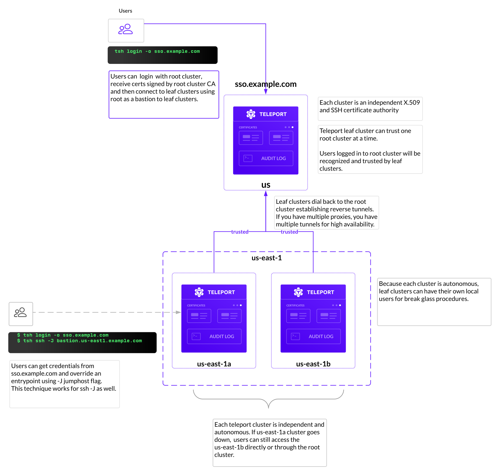
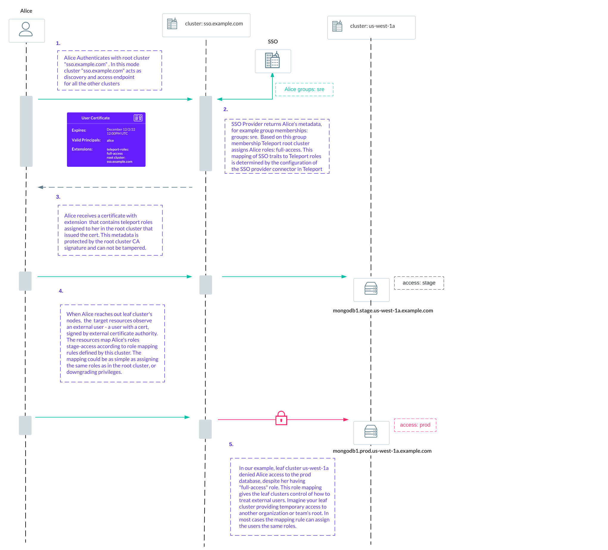

Teleport can partition compute infrastructure into multiple clusters. A cluster
is a group of Teleport connected resources. Each cluster
manages a set of certificate authorities (CAs) for its users and resources.

Trusted Clusters allow the users of one cluster, the **root cluster**, to
access resources registered with another cluster, the **leaf cluster**, while
remaining authenticated with only a single Auth Service. The leaf cluster can
be running behind a firewall without any ingress ports open.

Uses for Trusted Clusters include:

- Managed service providers (MSP) remotely managing the infrastructure of their clients.
- Device manufacturers remotely maintaining computing appliances deployed on premises.
- Large cloud software vendors managing multiple data centers.

<Notice type="tip">
Individual nodes and proxies can create reverse tunnels to proxy services without creating a new cluster.
You don't need to set up a trusted cluster just to connect a couple of servers, Kubernetes clusters or
databases behind a firewall.
</Notice>

## Multi-Data-center Clusters

In the example below, there are three independent clusters:

- Cluster `sso.example.com` is a root cluster. This cluster can be used as a single-sign-on entry point
for your organization. It can have its own independent resources connected to it, or be used just for audit
logs collection and single-sign-on.
- Clusters `us-east-1a` and `us-east-1b` are two independent clusters in different availability zones.



## Role Mapping

In Teleport, leaf clusters are autonomous - they have their own state, roles and even local users.
Leaf clusters have autonomy to decide how to map identity of the external users to their local roles.
We call this process role mapping. Take a look at the flow below to understand how it works:



### Role mapping and cluster-level labels

You should note that you can use a certificate issued for a root cluster to connect directly 
to a leaf cluster because the leaf cluster inherently trusts the root cluster. In most cases, 
the trust relationship between the root and leaf clusters provides the desired behavior. 

However, this trust relationship can also be exploited if you use cluster labels to enforce authorization 
restrictions. Because the leaf cluster trusts the certificate authority of the root cluster, that certificate 
can be used to bypass any leaf-specific `cluster_labels` settings that might be intended to restrict access to 
the leaf cluster. For example, assume you assign the leaf cluster a label using the following command:

```text
tctl update rc/leaf --set-labels=env=prod
```

This label can't prevent direct access to the leaf cluster if a user has a certificate signed by the root cluster.
You should use role mapping as the primary way to restrict access to leaf clusters and use `cluster_labels` for 
filtering and limiting the visibility of leaf cluster resources.

## Next steps

Read the rest of the Architecture Guides:

- See how Teleport uses [Certificates](authentication.mdx) for authentication.
- Reduce your surface of attack using [TLS routing](./tls-routing.mdx).
- Follow our [guide](../../admin-guides/management/admin/trustedclusters.mdx) to set up trusted clusters.

