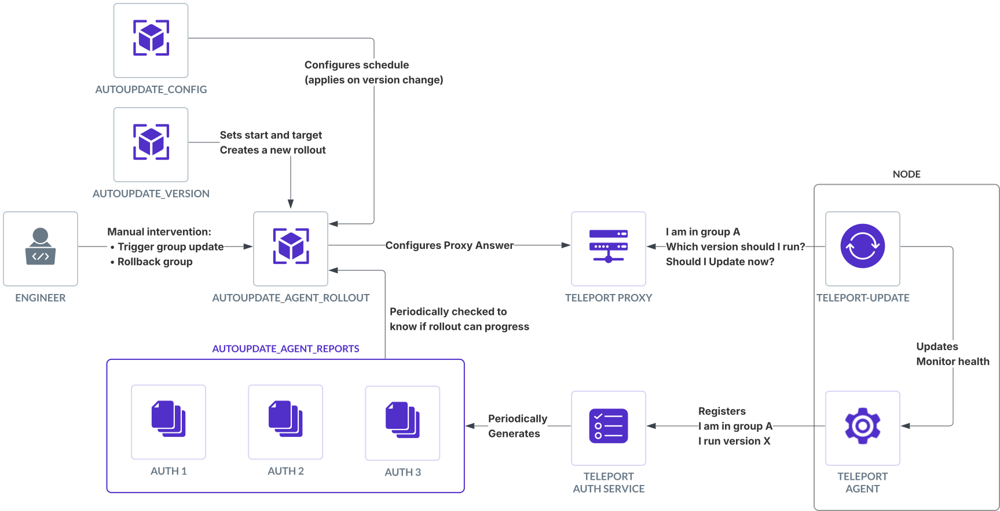

This document provides detailed reference information about the Managed Updates v2 resources.
See also:
- the [Managed Updates Architecture](./architecture/agent-update-management.mdx) describing the agent update
  architecture and security invariants.
- the [Managed Updates Guide](../upgrading/agent-managed-updates.mdx) for more details on how to
  set up Managed updates.

## Managed Updates v2 resources

### User facing

Managed Updates are configured via two user-facing resources:

#### `autoupdate_config`

This describes how and when updates are applied. Configuration changes take effect during the next rollout.

(!docs/pages/includes/reference/resources/autoupdate_config.mdx!)

#### `autoupdate_version`

This specifies which version agents should update to.
Changing the start or target version creates a new rollout.

<Admonition type="note">
This resource is not editable for cloud-managed Teleport Enterprise to ensure that all of
your clients receive security patches and remain compatible with your cluster.
</Admonition>

(!docs/pages/includes/reference/resources/autoupdate_version.mdx!)

### System resources

Those resources are generated automatically by Teleport. Users should not edit them, reading them can be helpful to
track the autoupdate state and understand Teleport's update decisions.

#### `autoupdate_agent_rollout`

`autoupdate_agent_rollout` describes the rollout of the version across agent groups.
A single rollout is active at a time. Each Auth Service updates the rollout every minute.

(!docs/pages/includes/reference/resources/autoupdate_agent_rollout.mdx!)

#### `autoupdate_agent_report`

Reports how many agents are connected to each auth, and which version they are running.
This is used to track update progress and automatically progress the rollout.

(!docs/pages/includes/reference/resources/autoupdate_agent_report.mdx!)

Reports can be individually seen using `tctl get autoupdate_agent_reports`.
To aggregate every report into a single one, run `tctl autoupdate agents report`.

### Agent Update Overview

Here's a schema describing the interactions between the different Managed Updates v2 components when updating agents:



## Update Strategies

The `autoupdate_config` resource supports two different strategies for managing how updates propagate across your agent groups:

### `halt-on-error` Strategy

The `halt-on-error` strategy provides predictable, sequential updates across environments. It's ideal for traditional development pipelines where you want to ensure that development environments are successfully updated before proceeding to staging and production.

**Key characteristics:**

- Updates proceed sequentially through groups in the order they are defined
- If an earlier group fails to update, later groups will not be updated
- Provides a controlled, predictable update path
- Groups with a `wait_hours` parameter will wait the specified duration after the previous group's successful update

**Example configuration:**

```yaml
kind: autoupdate_config
metadata:
  name: autoupdate-config
spec:
  agents:
    mode: enabled
    strategy: halt-on-error
    schedules:
      regular:
        - name: dev
          days: ["Mon", "Tue", "Wed", "Thu"]
          start_hour: 16
        - name: stage
          days: ["Mon", "Tue", "Wed", "Thu"]
          start_hour: 18
        - name: prod
          days: ["Mon", "Tue", "Wed", "Thu"]
          start_hour: 20
          wait_hours: 24
```

In this example, the `dev` group updates first, followed by `stage`, and finally `prod`. The `prod` group will only update if both `dev` and `stage` have updated successfully, and will wait 24 hours after `stage` has completed.

### `time-based` Strategy

The `time-based` strategy is designed for environments where update groups are independent of each other, such as geographical regions or different teams. It allows updates to occur whenever the specified maintenance window is active for a group, regardless of the status of other groups.

**Key characteristics:**

- Groups update independently during their configured maintenance windows
- No dependency between groups - if prod's window occurs before dev's, prod will update first
- Maintenance windows are strictly enforced - updates only occur during the specified window duration
- Does not support the `wait_hours` parameter

**Example configuration:**

```yaml
kind: autoupdate_config
metadata:
  name: autoupdate-config
spec:
  agents:
    mode: enabled
    strategy: time-based
    maintenance_window_duration: 2h
    schedules:
      regular:
        - name: us-east
          days: ["Mon", "Tue", "Wed", "Thu"]
          start_hour: 4
        - name: us-west
          days: ["Mon", "Tue", "Wed", "Thu"]
          start_hour: 6
        - name: europe
          days: ["Mon", "Tue", "Wed", "Thu"]
          start_hour: 12
```

In this example, each region will update during its own 2-hour maintenance window,
regardless of the status of other regions. If a new version becomes available
when Europe's window is active but before US East's window, Europe will update first.

## Version Behavior During Rollout

Depending on which strategy is selected, the system behaves differently regarding which versions are installed at
different points in the rollout. Consider a scenario where `start_version` is A and `target_version` is B:

### `halt-on-error` Strategy Version Behavior

This table summarizes which version an agent will install based on its group's maintenance window:

| Timing                    | New Agent Installations | Existing Agent Updates |
|---------------------------|-------------------------|------------------------|
| Before maintenance window | Install version A       | No updates occur       |
| During maintenance window | Install version B       | Update to version B    |
| After maintenance window  | Install version B       | Update to version B    |

In halt-on-error strategy, if the previous group is not done updating, the next one will not start.
For example, if you have 2 groups:
- `dev` updating everyday at 13:00
- `prod` updating on weekdays at 15:00

If `dev` finishes updating Friday at 16:30, `prod` will not start updating immediately as update windows are
1-hour-long and `prod`'s update window is over. `prod` update will start on Monday at 15:00.


### `time-based` Strategy Version Behavior

This table summarizes which version an agent will install based on its group's maintenance window:

| Timing                    | New Agent Installations | Existing Agent Updates             |
|---------------------------|-------------------------|------------------------------------|
| Before maintenance window | Install version A       | No updates occur                   |
| During maintenance window | Install version B       | Update to version B                |
| After maintenance window  | Install version B       | No updates occur until next window |

The key difference is what happens after the maintenance window closes:

- With `halt-on-error`, agents update even if they missed the window to run the
  same version as the other agents in their group.
- With `time-based`, updates are strictly limited to the maintenance window duration.

In time-based strategy, the group will start updating as soon as it enters its maintenance window,
even if the previous group is not done updating yet.

## Mode Precedence

The `mode` field can be set in both `autoupdate_config` and `autoupdate_version` resources. The most restrictive mode takes precedence:

1. `disabled` (most restrictive)
2. `suspended`
3. `enabled` (least restrictive)

This allows different teams to manage the configuration and version resources independently while maintaining safety controls.

## Cloud-specific Constraints

For cloud-hosted Teleport Enterprise:

- The `autoupdate_version` resource is managed automatically and cannot be edited
- The `days` field in schedules is often not configurable 
- The `start_hour` defaults to your selected maintenance window
- A maximum of 5 update groups is allowed by default
- A full update schedule cannot be longer than 4 days

These constraints ensure that all agents are updated weekly and remain compatible with the Teleport cluster's version.
