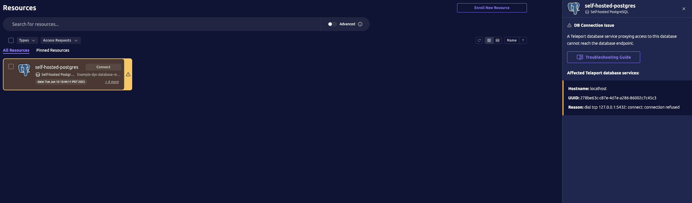

Teleport resource health checks are used to monitor connectivity between your Teleport cluster and resources enrolled in your cluster.

Currently only TCP health checks are supported and only for enrolled databases.

## How it works

Teleport's `health_check_config` cluster resource determines which resources will have health checks enabled and what settings will be used for those checks.
Starting in Teleport 18, a preset default `health_check_config` will be created that enables TCP health checks for all enrolled databases.
When health checks are enabled for a resource, Teleport services that proxy access to that resource will perform regular health checks against that resource's endpoint(s).
The interval between health checks and timeout duration of each health check is configurable.

Every supported resource has a health status: "healthy", "unhealthy", or "unknown".
Resources without health checks enabled will have "unknown" health status.
Additionally, Teleport services running on versions that do not support health checks will not report health status for resources they proxy.

Each health checked resource will have an "unknown" health status until its initial health check result is available.
The initial health check for a resource will determine its health status, healthy or unhealthy, regardless of configured healthy or unhealthy threshold.
After the initial health check, health status will only change after consecutive passing or failing health checks reach the configured healthy or unhealthy threshold.

<Admonition type="tip">
Teleport proxies will use service-to-resource health status to make connection routing decisions when multiple services proxy access to the same enrolled resource.
For example, if multiple Teleport database services proxy access to the same database, but only one of them can reach the database endpoint, then only one database service will report a "healthy" status.
Teleport proxies will route all database user connections to that database through the service that reports healthy status instead of the services reporting unhealthy status.
Proxies will prioritize routes to services with health status in the order: healthy > unknown > unhealthy.
</Admonition>

## Configuration

Health check configuration specifies how Teleport should verify the health of connectivity between Teleport services and enrolled resources.
It includes settings for the health check interval duration, timeout duration, healthy and unhealthy thresholds, and label matchers that determine which resources should be health checked.

`tctl [create | get | edit | rm]` supports `health_check_config` resources (and its alias: `hcc`).
For example, you can view the default health check configuration using `tctl get`:

```code
$ tctl get hcc/default
kind: health_check_config
metadata:
  description: Enables all health checks by default
  labels:
    teleport.internal/resource-type: preset
  name: default
  namespace: default
  revision: 5f601039-fb5d-4fb8-ba0b-a1f4f9100c84
spec:
  match:
    db_labels:
    - name: '*'
      values:
      - '*'
version: v1
```

Settings with default values may be left unset.
| Setting | Description | Default |
| --- | --- | --- |
| spec.interval | The interval between each health check | 30s |
| spec.timeout | The timeout for each health check connection attempt | 5s |
| spec.healthy_threshold | The number of consecutive passing health checks for an "unhealthy" resource to become "healthy" | 2 |
| spec.unhealthy_threshold | The number of consecutive failing health checks for a "healthy" resource to become "unhealthy" | 1 |

## View health status

The Teleport web UI will highlight unhealthy resources and provide details about health check failures:



Teleport services report the health status of each health checked resource that they proxy.
The health status is contained in the resource heartbeat object.
For example, `db_server` is the heartbeat object for databases and you can view the health status for a database using `tctl get db_server`:

```code
$ tctl get db_server/self-hosted-postgres --format json | jq '.[].status.target_health'
{
  "address": "localhost:5432",
  "protocol": "TCP",
  "status": "unhealthy",
  "transition_timestamp": "2025-06-09T22:40:24.147753Z",
  "transition_reason": "threshold_reached",
  "transition_error": "dial tcp 127.0.0.1:5432: connect: connection refused",
  "message": "1 health check failed"
}
```

You can also use the `health.status` predicate expression field to filter resource by health status, for example:

```code
$ tctl db ls --query 'health.status == "unhealthy"'
Host      Name                 Protocol URI            Labels  Version
--------- -------------------- -------- -------------- ------- -------
localhost self-hosted-postgres postgres localhost:5432 env=dev 18.0.0
```
