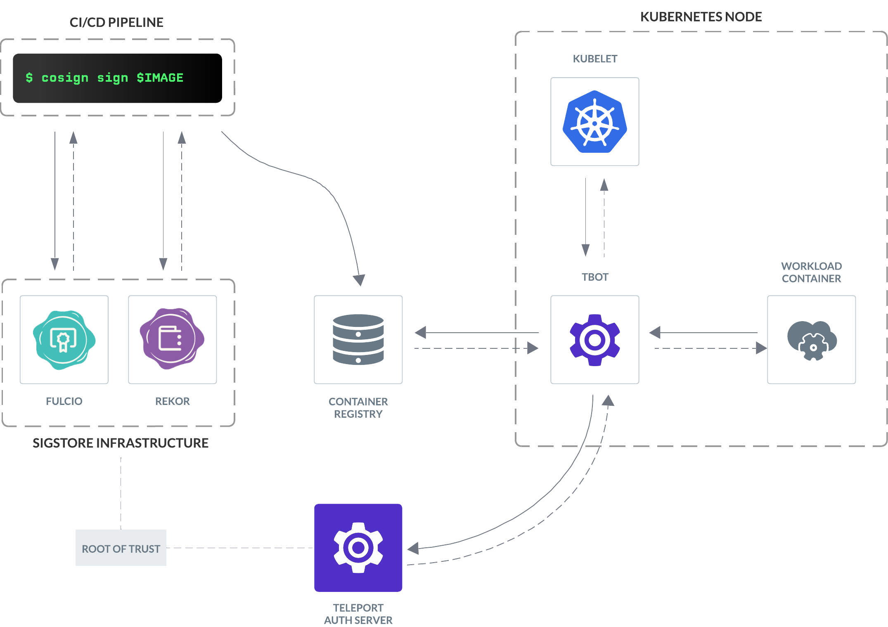

By using Teleport's integration with [Sigstore](https://sigstore.dev), you can
lock down access to a workload identity and the resources it protects to only
signed container images, reducing the scope for
[supply chain attacks](https://www.ncsc.gov.uk/collection/supply-chain-security/supply-chain-attack-examples).

<Admonition type="warning" title="Teleport Enterprise Required">
    A valid Teleport Enterprise license is required to use the Sigstore
    attestation feature of Teleport Workload Identity.
</Admonition>

## How it works



### Signing

Artifact signatures and attestations are generated using [`cosign`](https://github.com/sigstore/cosign)
or another Sigstore-compatible tool such as GitHub's [`attest-build-provenance`](https://github.com/actions/attest-build-provenance)
action.

In keyless mode, these signatures are signed with a single-use X.509 certificate
issued by [Fulcio](https://github.com/sigstore/fulcio), which encodes
the signer's OIDC identity, for example: a user's Google account or a GitHub
Actions token.

Users can alternatively opt to sign with a traditional long-lived private/public
keypair and distribute the public key to consumers themselves.

Signatures and their associated metadata are recorded in the [Rekor](https://github.com/sigstore/rekor)
transparency log for auditability, non-repudiation, and to timestamp the
signature because, due to the short-lived nature of keyless signing certificates,
the certificate's validity period (not before, not after) cannot be used.

Users may opt to use an [RFC 3161](https://www.ietf.org/rfc/rfc3161.txt)
timestamp authority as well as Rekor, or instead of it if they do not need the
other features of a transparency log.

The signature, certificate, proof of transparency log inclusion, and RFC 3161
timestamps are uploaded to the container image registry.

### Verification

When a container-based workload connects to `tbot`'s SPIFFE Workload API, `tbot`
will discover which container image the workload is running using the platform
specific attestor (i.e. Kubernetes, Docker, or Podman). It will then query the
relevant container registry for signatures relating to that specific image digest.
These signatures will be sent to the Teleport Auth Service when requesting a SVID.

If your `WorkloadIdentity` rules contain a call to `sigstore.policy_satisfied`,
the Auth Service will load and evaluate the named `SigstorePolicy` objects.

These policies will be used to determine the "trusted roots" that will be used
to verify the signature's authenticity. For keyless signing, this will include
the Fulcio and Rekor certificate chains. For traditional key-based signing this
will be the signer's public key.

Policies also include a set of requirements about the signatures, for example:
which in-toto attestation predicate types are required or whether a `cosign`
[simple signing-based](https://github.com/sigstore/cosign/blob/b438935ad3b7ecf83b9b652c22cb03c45723cf61/specs/SIGNATURE_SPEC.md)
artifact signature is required.

## SigstorePolicy Resource

```yaml
kind: sigstore_policy
version: v1
metadata:
  # The name of the SigstorePolicy resource, used as a parameter to the
  # `sigstore.policy_satisfied` rule expression function.
  name: github-provenance
spec:
  # Configuration for Sigstore's keyless mode.
  #
  # Mutually exclusive with `key`.
  keyless:
    # Trusted signing identities. If multiple identities are given, at least one
    # must match in order for the policy to be satisfied.
    identities:
    -
      # Matches the OIDC issuer exactly.
      issuer: https://accounts.google.com
      # Matches the OIDC identity exactly.
      subject: security@example.com
    -
      # Matches the OIDC issuer using a regular expression.
      issuer_regex: ^https://token.actions.githubusercontent.com(/asteroid-earth)?$
      # Matches the OIDC identity using a regular expression.
      subject_regex: ^https://github.com/asteroid-earth/(.*)/\.github/workflows/(.*)@refs/heads/main$

  # List of custom trusted roots that can be supplied when using private Sigstore
  # infrastructure rather than the "Public Good" instance. Roots will be combined
  # such that certificates issued by any of the certificate authorities are trusted.
  #
  # Formatted as `application/vnd.dev.sigstore.trustedroot+json;version=0.1`
  # JSON strings.
  trusted_roots:
    - |
      {
        "mediaType": "application/vnd.dev.sigstore.trustedroot+json;version=0.1",
        "certificateAuthorities": [
        ...

  # Configuration for traditional key-based signature verification.
  #
  # Mutually exclusive with `keyless`.
  key:
    # Public key in PEM-encoded DER format. Must be an RSA, ECDSA or Ed25519 key.
    public: |
      -----BEGIN PUBLIC KEY-----
      MCowBQYDK2VwAyEAA6h8OgaAX0htOLNP5hwaENfcivylMa8yBuOqD7k6kYE=
      -----END PUBLIC KEY-----

  # Which signatures and attestations must be present in order for the policy to
  # be satisfied.
  requirements:
    # Whether there must be a cosign simple-signing based artifact signature.
    #
    # Mutually exclusive with `attestations`.
    artifact_signature: false

    # Which attestations must (all) be present.
    #
    # Mutually exclusive with `artifact_signature`.
    attestations:
    -
      # The in-toto predicate type of the required attestation.
      predicate_type: https://slsa.dev/provenance/v1
```

<Admonition type="note" title="RSA Padding">
    When verifying signatures signed with a static RSA keypair, Teleport
    currently only supports the PKCS#v1.5 padding scheme (used by cosign).

    RSA-PSS is currently unsupported.
</Admonition>

### Example: GitHub Artifact Attestation

When using the `attest-build-provenance` action from a public repository, GitHub
will use Sigstore's Public Good instance of Fulcio and Rekor, so all that must
be configured are the trusted identity and required attestations.

```yaml
kind: sigstore_policy
version: v1
metadata:
  name: github-provenance
spec:
  keyless:
    identities:
      - issuer: https://token.actions.githubusercontent.com
        subject_regex: ^https://github.com/asteroid-earth/(.*)/\.github/workflows/(.*)@refs/heads/main$
  requirements:
    attestations:
      - predicate_type: https://slsa.dev/provenance/v1
```

GitHub Enterprise customers can use artifact attestation from their private
repositories which uses GitHub's internal instance of Fulcio and GitHub's own
timestamp authority in place of Rekor.

To support signatures from private repositories, export the trusted roots using
the [GitHub CLI](https://cli.github.com/manual/gh_attestation_trusted-root):

```shell
$ gh attestation trusted-root
```

This will return a newline-delimited list of JSON trusted root objects, which
you can use in the `keyless` section of your policy.

When using GitHub's internal instance of Fulcio, the OIDC issuer in signing
certificates will be suffixed with your organization name.

```yaml
kind: sigstore_policy
version: v1
metadata:
  name: github-provenance
spec:
  keyless:
    identities:
      - issuer_regex: ^https://token.actions.githubusercontent.com(/asteroid-earth)?$
        subject_regex: ^https://github.com/asteroid-earth/(.*)/\.github/workflows/(.*)@refs/heads/main$
    trusted_roots:
      -  |
        {"mediaType":"application/vnd.dev.sigstore.trustedroot+json;version=0.1" ...
      -  |
        {"mediaType":"application/vnd.dev.sigstore.trustedroot+json;version=0.1" ...
  requirements:
    attestations:
      - predicate_type: https://slsa.dev/provenance/v1
```

### Timestamp and transparency log requirements

When using keyless mode, either proof of inclusion in a transparency log or an
RFC 3161 timestamp is required in order to trust the keyless certificate.

Therefore, when specifying custom `trusted_roots`, there must be at least one
entry in either the `tlogs` or `timestamp_authorities` list. If there are *many*
entries, signatures only need to match one of them, for example: if there are
multiple transparency logs configured, a signature only needs to be included in
one of them to be validated.

## WorkloadIdentity Rules

In order to apply a policy when Teleport is deciding whether to issue a SVID,
call the `sigstore.policy_satisfied` function from your `WorkloadIdentity` rule
expressions.

This function accepts multiple policy names and returns a boolean value
indicating whether all of the given policies were satisfied by the signatures
presented by `tbot`.

```yaml
kind: workload_identity
version: v1
metadata:
  labels:
    application: k8s-service
  name: k8s-workload-identity
spec:
  spiffe:
    id: /k8s/{{ workload.kubernetes.labels["app"] }}
  rules:
    allow:
      - expression: |
          sigstore.policy_satisfied("github-provenance", "security-scan") || sigstore.policy_satisfied("security-team-signoff")
```

## tbot configuration

```yaml
services:
  - type: workload-identity-api
    listen: unix:///run/tbot/sockets/workload.sock
    selector:
      name: k8s-workload-identity
    attestors:
      sigstore:
        enabled: true
        additional_registries:
          - host: ghcr.io
        credentials_path: /path/to/docker/config.json
        allowed_private_network_prefixes:
          - "192.168.1.42/32"
          - "fd12:3456:789a:1::1/128"
```

In order for `tbot` to discover signatures for a workload's container image, you
must enable the Sigstore attestor as well as the attestor for your container
platform (i.e. Kubernetes, Docker, or Podman).

By default, the Sigstore attestor will look for signatures in the image's source
registry, but if you're distributing signatures through another registry you can
set `additional_registries`.

### Private registries

If your registry requires authentication, you can use `credentials_path` to
provide a Docker or Podman configuration file where the `auths` section contains
per-registry credentials.

If you don't specify `credentials_path`, `tbot` will look in the following
places by default:

* `$HOME/.docker/config.json`
* `$DOCKER_CONFIG`
* `$REGISTRY_AUTH_FILE`
* `$XDG_RUNTIME_DIR/containers/auth.json`

Because `tbot` uses Docker's `cli` package, it also supports credential helpers
such as [`docker-credential-gcr`](https://github.com/GoogleCloudPlatform/docker-credential-gcr).

Often, the most straightforward way to create a credentials file for `tbot` is
to use `docker login` and copy the `auths` and `credHelpers` sections out of
`$HOME/.docker/config.json`.

By default, `tbot` will refuse to connect to registries hosted at private network
addresses (e.g. in IP ranges designated for private use by [RFC 1918](https://datatracker.ietf.org/doc/html/rfc1918))
to reduce the surface area for SSRF attacks. If your registry is on a private
network, you can add its IP to the `allowed_private_network_prefixes` list using
CIDR notation.


### Using Kubernetes registry credentials

If you're running `tbot` in Kubernetes, you likely already have credentials for
your registry [configured](https://kubernetes.io/docs/tasks/configure-pod-container/pull-image-private-registry/)
in order for the `kubelet` to pull images.

```shell
$ kubectl create secret docker-registry docker-credentials \
  --docker-server=<your-registry-server> \
  --docker-username=<your-name> \
  --docker-password=<your-password> \
  --docker-email=<your-email>
```

To configure the Sigstore attestor to use these credentials, you can mount the
secret as a volume in your `tbot` DaemonSet, and point `credentials_path` or
`$DOCKER_CONFIG` to it:

```yaml
spec:
  template:
    spec:
      containers:
        - name: tbot
          volumeMounts:
            - mountPath: /var/run/secrets/docker
              name: docker-credentials
          env:
            - name: DOCKER_CONFIG
              value: /var/run/secrets/docker/.dockerconfigjson
      volumes:
        - name: docker-credentials
          secret:
            secretName: docker-credentials
```
