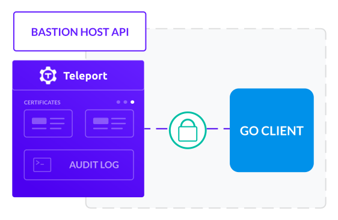

Many administrators will consider several factors when configuring Teleport for their specific stack, architecture, and resources.

This document surveys key concepts and architectural concerns when using Teleport Server Access.

## Server Access security

Security is a natural and paramount concern for any admin. And, Teleport was built to empower admins by simplifying the configuration of the often byzantine network of resources required for modern operations.

Teleport supports many security best practices out-of-the-box through its many features:

- Role-Based Access Control (RBAC) and *The Principle of Least Privilege* (POLP) through [Role Templates](../access-controls/guides/role-templates.mdx) and [Access Request workflows](../enterprise/workflow/index.mdx).
- Enhanced auditing and logging through [Session Recording](../features/enhanced-session-recording.mdx), [Events](../admin-guide.mdx#events), and [Audit Logging](../admin-guide.mdx#audit-log).
- Multifactor authentication through [Single Sign-On (SSO)](../enterprise/sso/ssh-sso.mdx), One Time Pass codes, and [Security Assertion Markup Language (SAML)](https://goteleport.com/blog/how-saml-authentication-works/).

This section describes additional security best practices Teleport can be easily configured to support or implement.

### Secure Administrator Workstations

A common practice at many companies is to restrict access to critical resources not only by role but also by physical (or virtual) machines as well.

According to this best practice, even if a role or credential is compromised, a breach is mitigated since only one machine can be used by that role or credential to access production resources.

Teleport supports Secure Administrator Workstations (SAW) in the following ways:

1. Access through Teleport is Teleport-to-Teleport. User access is limited to the lifespan of a valid certificate granted by the Teleport Certificate Authority. While this is a powerful security feature in its own right, it also lends itself to SAW configurations since the connection from the SAW is further restricted and mediated beyond SSH alone.
2. Teleport brings user roles and user certificates into one tool: `tctl`. This makes it easier to restrict or remove user access in the prevention or the event of a security event.
3. Teleport requires Two-Factor Authentication (TFA/2FA) with the option to use a physical keyfob or SSO increasing security at the SAW access point.

### Zero Admin

The Zero Admin security best practice is becoming increasingly popular. It encourages the absence of any "superuser" (or administrator with "all the permissions"). The Zero Admin approach can be seen as a stricter evolution of RBAC and POLP.

Our [Getting Started](./getting-started.mdx) guide demonstrates an example where a Teleport admin has temporary root access to a Linux cloud instance (through SSH port `22`) which is then removed. Further access is only possible through the Teleport Web Interface or `tsh`.

For example, consider the user `tele-admin` below:

```
# Add a user
sudo tctl users add tele-admin --roles=editor,access --logins=root,ubuntu,ec2-user
```

Note that the `--role` flag above does not give `tele-admin` the actual `admin` role. 

Note further that the `--logins` flag defines what `tele-admin` can do or perform once they've connected to a resource through `tsh`.

### SSH Bastion Pattern

Jump Hosts and Bastion Hosts are common in use since they allow access to resources without requiring those resources to be publicly available.

A common approach involves restricting the open ports to only the most minimal ones required. Our [Getting Started](./getting-started.mdx) guide demonstrates how to close *all* ports for a protected resource while still granting access through Teleport.

<Figure
  align="center"
  bordered
  caption="Teleport Bastion Pattern"
>
  
</Figure>

Teleport Nodes can easily be configured into the SSH Bastion Host pattern as described in the [Getting Started](./getting-started.mdx) guide.

Generally, one begins by creating or provisioning resources with the minimal necessary open ports. One such resource will serve as the designated public-facing *Bastion Host* through which all traffic into the cluster will be received. The other resources will only be accessible through the *Bastion Host*.

Once Teleport has been installed, Nodes connected, and initial users and permission created any remaining ports can be closed on both the *Bastion Host* and the protected, private, resources.

### Divided topology

Many architectures are now being designed to mitigate security events or disasters by splitting up resources and permissions into minimal groupings.

Divided topologies involve deliberately restricting traffic, filtering IP addresses, regulating permissions, and grouping resources to mitigate loss or access in the advent of a disaster or security event.

Teleport divides and groups access across resources through [Labels](../admin-guide.mdx#labeling-nodes-and-applications) and Node-based clustering. 

- Admins can dynamically modify which Nodes join or are a part of which cluster.
- Labels provide convenient groupings when querying, introspecting, or visualizing resources without modifying underlying clusters or access.

## Cluster introspection

Teleport has several features for managing and introspecting your cluster.

### Unified Resource Catalog

Resource admins will likely use the Teleport Unified Resource Catalog to manage resources by cluster and [Label](../admin-guide.mdx#labeling-nodes-and-applications).

The following `tctl` command:

```bash
# Display the Unified Resource Catalog
sudo tctl nodes ls
``` 

will display the Unified Resource Catalog with all queried resources in one view:
   
```bash
Nodename         UUID                                 Address            Labels                               
---------------- ------------------------------------ ------------------ ------------------------------------ 
ip-172-31-40-99  bf840c02-68f4-4fac-a9e6-30141e82d242 127.0.0.1:3022     env=example,hostname=ip-172-31-40-99 
ip-172-31-39-190 d32945f4-6e35-4318-b8f6-198d7c1fbd4c 172.31.39.190:3022                                      
```

Note the "Labels" column on the farthest side.

### Labels

Labels are permanent or temporary taxonomic handles for grouping resources. They can be used to group resources temporarily, across multiple clusters, or to define a grouping useful for querying without modifying the underlying access permissions or cluster membership:

- `tsh ssh root@env=example` returns the list of all resources with the `env=example` label specified in their `teleport.yaml` (`'env': 'example'`).
- Suppose an IP address changes, an admin can quickly find the current Node with that label since it remains unchanged.
- Suppose you need to query the SSH Node of each cluster. Give each SSH Node the same label so a single query will allow you to introspect those specific resources across all of your clusters.

This was designed in tandem with the Unified Resource Catalog to make it easier to manage mass-scale deployments (common to many industries like IoT and manufacturing).

### Multi-querying

`tsh` supports [multi-querying](../cli-docs.mdx#tsh): the ability to execute sequential (or simultaneous) commands on multiple resources at once. 

Multi-querying allows the same command to be executed on multiple machines but typed once. This is convenient for scenarios where an operation is a short command executed routinely (`apt-get update`). Admins need not access each machine individually, key-by-key. 

Instead, all resources within a query will execute the supplied command.

For example:

```bash
# Execute ls on each resource having the designated label
# with the specified the login identity on the remote hosts
tsh ssh root@env=example ls
tsh ssh ubuntu@env=example ls
tsh ssh env=example ls
```

will execute the `ls` command on each Node with the `env=example` label.

## Defining access request workflows

<Admonition title="tip" type="tip">
  Access Requests and Access Request workflows are now available in both the Teleport Open Source and Enterprise Editions.
</Admonition>

Granting and revoking permissions is a natural part of any system for managing identities, information, and access to resources.

Teleport provides built-in support for [requesting, renewing, granting, revoking, and denying permissions](../enterprise/workflow/index.mdx) through the same Web Interface and CLI used to access permitted resources.

## Auditing and events

Teleport provides powerful [Session Recording](../features/enhanced-session-recording.mdx) and [Audit Logging](../admin-guide.mdx#audit-log) that can be added to your existing SSH solution:

- User sessions are recorded and can be replayed. 
- They can also be shared, stored, and organized by query and triggered Events.

### Defining Events

Teleport admins can further define [Events](../admin-guide.mdx#events) to organize and trigger sending session recordings to customizable storage back-ends:

1. All `session.start` events could be stored on AWS S3.
2. All `exec` events could be stored in a subdirectory on AWS S3 specific to remote commands.

This makes it easier to manage, group, and analyze sessions.

We recommend reading through the [Architecture documentation](../architecture/authentication.mdx#audit-log) to plan out how to best implement sessions and events for your needs.

## Teleport API

In some circumstances, admins will likely find programmatic interaction and control to be more helpful than executing commands manually or through the Command Line Interface (CLI).

<Figure
  align="center"
  bordered
  caption="Teleport API and Client"
>
  
</Figure>

Teleport exposes an API through gRPC that can be connected to through a client written in [your favorite language](../reference/api/getting-started.mdx).

<Admonition title="warning" type="warning">
  We encourage the use of customized API-specific roles and users in production environments (rather than using the default user roles). 
</Admonition>

## Graceful restarts

Administrators will likely want to configure Teleport Nodes so that they gracefully restart. Doing so gives your Teleport Nodes a degree of fault tolerance since Nodes will reboot automatically.

Configuration for this ability is set through `systemd` and is described in detail within the [Admin Guide](../admin-guide.mdx#graceful-restarts).

## Resources

- Read about [Trusted Clusters](../trustedclusters.mdx)
- Learn about [Teleport Cloud, High Availability, and Data Retention](../cloud/introduction.mdx)