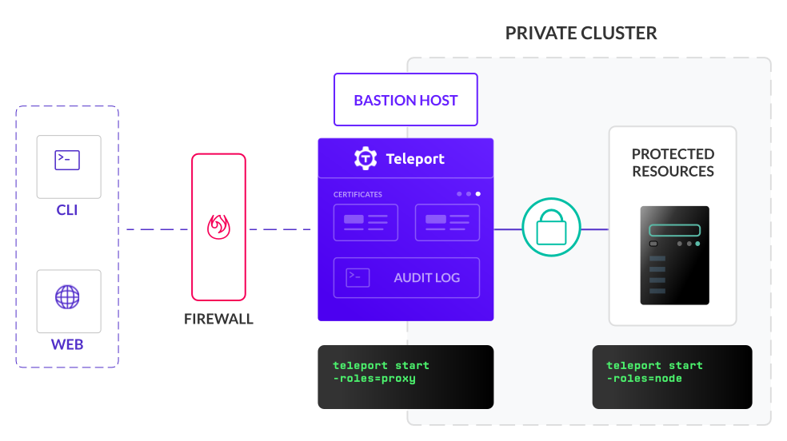
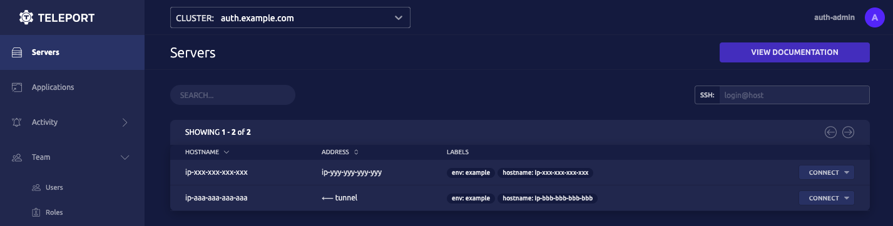

Server access involves managing your resources, configuring new clusters, and
issuing commands through a CLI or programmatically to an API.

This guide introduces some of these common scenarios and how to interact with
Teleport to accomplish them:

1. SSH into a cluster using Teleport.
2. Introspect the cluster using Teleport features.

<Admonition type="tip" title="Tip">
This guide also demonstrates how to configure Teleport Nodes using the **bastion
pattern** so that only a single Node can be accessed publicly.
</Admonition>

<Figure
  align="center"
  bordered
  caption="Teleport Bastion"
>
  
</Figure>

## Prerequisites

(!docs/pages/includes/edition-prereqs-tabs.mdx!)

- One host running a Linux environment (such as Ubuntu 20.04, CentOS 8.0, or
  Debian 10). This will serve as a Teleport Node.
- (!docs/pages/includes/tctl.mdx!)

(!docs/pages/includes/permission-warning.mdx!)

## Step 1/4. Install Teleport on your Linux host

1. Your Linux host will be a private resource. Open port 22 so you can initially
   access, configure, and provision your instance.

   We'll configure and launch our instance, then demonstrate how to use the
   `tsh` tool and Teleport in SSH mode.

2. On the host where you will run the Teleport SSH Service, follow the instructions
   for your environment to install Teleport.

   (!docs/pages/includes/install-linux.mdx!)

   Next, we'll create a **join token** so you can start the Teleport SSH Service
   and add it to your cluster.

## Step 2/4. Add a server to the cluster

### Create a join token

On your local workstation, create a join token so you can add the server to your
Teleport cluster:

<Tabs>
<TabItem label="Linux">

```code
Let's save the token to a file
$ tctl tokens add --type=node --format=text > token.file
```

</TabItem>
<TabItem label="macOS">

```code
Let's save the token to a file
$ tctl tokens add --type=node --format=text > token.file
```

</TabItem>
</Tabs>

`--type=node` specifies that the Teleport process will act and join as an SSH
server.

`> token.file` indicates that you'd like to save the output to a file name `token.file`.

<Admonition type="tip" title="Tip">
This helps to minimize the direct sharing of tokens even when they are dynamically generated.
</Admonition>

### Join your server to the cluster

On your server, save `token.file` to an appropriate, secure, directory you have
the rights and access to read. Next, generate a configuration file enabling
Teleport's SSH Service.

<ScopedBlock scope={["oss", "enterprise"]}>

Change `tele.example.com` to the address of your Teleport Proxy Service. Assign
the `--token` flag to the path where you saved `token.file`.

```code
# Generate config
$ sudo teleport node configure \
   --output=file:///etc/teleport.yaml \
   --token=/path/to/token.file \
   --proxy=tele.example.com:443
```

</ScopedBlock>
<ScopedBlock scope={["cloud"]}>

 Change `mytenant.teleport.sh` to your Teleport Cloud tenant address. Assign the
 `--token` flag to the path where you saved `token.file`.

```code
# Generate config
$ sudo teleport node configure \
   --output=file:///etc/teleport.yaml \
   --token=/path/to/token.file \
   --proxy=mytenant.teleport.sh:443
```

</ScopedBlock>

The `teleport node configure` command above placed a configuration file at
`/etc/teleport.yaml`. The last step is to start Teleport, pointing it at this
configuration:

(!docs/pages/includes/start-teleport.mdx service="the Teleport SSH Service"!)

### Access the Web UI

Run the following command to create a user that can access the Teleport Web UI:

```code
$ sudo tctl users add tele-admin --roles=editor,access,reviewer --logins=root,ubuntu,ec2-user
```

This will generate an initial login link where you can create a password and set
up two-factor authentication for `tele-admin`.

<Admonition type="note" title="Note">
We've only given `tele-admin` the roles `editor` and `access` according to the
Principle of Least Privilege.
</Admonition>

You should now be able to view your server in the Teleport Web UI after
logging in as `tele-admin`:

   <Figure
     align="center"
     bordered
     caption="Both servers in the Web UI"
   >
     
   </Figure>

## Step 3/4. SSH into the server

Now that we've got our cluster up and running, let's see how easy it is to
connect to our server.

We can use `tsh` to SSH into the cluster:

### Log in to the cluster

<ScopedBlock scope={["oss", "enterprise"]}>

On your local machine, log in to your cluster through `tsh`, assigning the
`--proxy` flag to the address of your Teleport Proxy Service:

```code
# Log in through tsh
$ tsh login --proxy=tele.example.com --user=tele-admin
```

</ScopedBlock>
<ScopedBlock scope={["cloud"]}>

On your local machine, log in to your cluster through `tsh`, assigning the
`--proxy` flag to the address of your Teleport Cloud tenant:

```code
# Log in through tsh
$ tsh login --proxy=mytenant.teleport.sh:443 --user=tele-admin
```

</ScopedBlock>

You'll be prompted to supply the password and second factor we set up
previously.

`tele-admin` will now see something similar to:

<ScopedBlock scope={["oss", "enterprise"]}>

```txt
> Profile URL:      https://tele.example.com:443
Logged in as:       tele-admin
Cluster:            tele.example.com
Roles:              access, editor
Logins:             root, ubuntu, ec2-user
Kubernetes:         disabled
Valid until:        2021-04-30 06:39:13 -0500 CDT [valid for 12h0m0s]
Extensions:         permit-agent-forwarding, permit-port-forwarding, permit-pty
```

In this example, `tele-admin` is now logged into the `tele.example.com` cluster
through Teleport SSH.

</ScopedBlock>
<ScopedBlock scope={["cloud"]}>

```txt
> Profile URL:        https://mytenant.teleport.sh:443
Logged in as:       tele-admin
Cluster:            mytenant.teleport.sh
Roles:              access, editor
Logins:             root, ubuntu, ec2-user
Kubernetes:         disabled
Valid until:        2021-04-30 06:39:13 -0500 CDT [valid for 12h0m0s]
Extensions:         permit-agent-forwarding, permit-port-forwarding, permit-pty
```

In this example, `tele-admin` is now logged into the `mytenant.teleport.sh`
cluster through Teleport SSH.

</ScopedBlock>

### Display cluster resources

`tele-admin` can now execute the following to find the cluster's server names,
which are used for establishing SSH connections:

   ```code
   # Display cluster resources
   $ tsh ls
   ```

   In this example, the bastion host is located on the bottom line below:

   ```txt
   Node Name        Address        Labels
   ---------------- -------------- --------------------------------------
   ip-172-31-35-170 ⟵ Tunnel
   ip-172-31-41-144 127.0.0.1:3022 env=example, hostname=ip-172-31-41-144
   ```

### Connect to a server

`tele-admin` can SSH into the bastion host server by running the following command locally:

```code
# Use tsh to ssh into a server
$ tsh ssh root@ip-172-31-41-144
```

Now, they can:

- Connect to other servers in the cluster by using the appropriate IP address in
  the `tsh ssh` command.
- Traverse the Linux file system.
- Execute desired commands.

All commands executed by `tele-admin` are recorded and can be replayed in the
Teleport Web UI.

The `tsh ssh` command allows users to do anything they could if they were to SSH
into a server using a third-party tool. Compare the two equivalent commands:

<Tabs>
  <TabItem label="tsh">

    ```code
    $ tsh ssh root@ip-172-31-41-144
    ```

  </TabItem>
  <TabItem label="ssh">

  <ScopedBlock scope={["oss", "enterprise"]}>

    ```code
    $ ssh -J tele.example.com root@ip-172-31-41-144
    ```

   </ScopedBlock>
  <ScopedBlock scope={["cloud"]}>

    ```code
    $ ssh -J mytenant.teleport.sh root@ip-172-31-41-144
    ```

   </ScopedBlock>

  </TabItem>
</Tabs>

## Step 4/4. Use tsh and the unified resource catalog to introspect the cluster

Now, `tele-admin` has the ability to SSH into other servers within the cluster,
traverse the Linux file system, and execute commands.

- They have visibility into all resources within the cluster due to their
  defined and assigned roles.
- They can also quickly view any server or grouping of servers that have been
  assigned a particular label.

### Display the unified resource catalog

Execute the following command within your bastion host console:

```code
# List servers
$ sudo tctl nodes ls
```

This displays the unified resource catalog with all queried resources in one
view:

```txt
Nodename         UUID                                 Address        Labels
---------------- ------------------------------------ -------------- -------------------------------------
ip-172-31-35-170 4980899c-d260-414f-9aea-874feef71747
ip-172-31-41-144 f3d2a65f-3fa7-451d-b516-68d189ff9ae5 127.0.0.1:3022 env=example,hostname=ip-172-31-41-144
```

Note the "Labels" column on the farthest side. `tele-admin` can query all
resources with a shared label using the command:

```code
# Query all servers with a label
$ tsh ls env=example
```

Customized labels can be defined in your `teleport.yaml` configuration file or
during server creation.

This is a convenient feature that allows for more advanced queries. If an IP
address changes, for example, an admin can quickly find the current server with
that label since it remains unchanged.

### Run commands on all servers with a label

`tele-admin` can also execute commands on all servers that share a label, vastly
simplifying repeated operations. For example, the following command will execute
the `ls` command on each server and display the results in your terminal:

```code
# Run the ls command on all servers with a label
$ tsh ssh root@env=example ls
```

## Optional: Harden your bastion host

We previously configured our Linux instance to leave port `22` open to easily
configure and install Teleport. Feel free to compare Teleport SSH to your usual
`ssh` commands.

If you'd like to further experiment with using Teleport according to the bastion
pattern:

- Close port `22` on your private Linux instance now that your Teleport server is
  configured and running.
- For self-hosted deployments, optionally close port `22` on your bastion host.
- You'll be able to fully connect to the private instance and, for self-hosted
  deployments, the bastion host, using `tsh ssh`.

## Conclusion

To recap, this guide described:

1. How to set up and add an SSH server to a cluster.
2. Connect to the cluster using `tsh` to manage and introspect resources.

Feel free to shut down, clean up, and delete your resources, or use them in
further Getting Started exercises.

## Next steps

- Learn more about Teleport `tsh` through the [reference documentation](../reference/cli.mdx#tsh-ssh).
- Learn more about [Teleport servers](../architecture/nodes.mdx#connecting-to-nodes)
- For a complete list of ports used by Teleport, read the [Networking Guide](../reference/networking.mdx).

## Resources

- [Setting Up an SSH Bastion Host](https://goteleport.com/blog/ssh-bastion-host/)
- [Announcing Teleport SSH Server](https://goteleport.com/blog/announcing-teleport-ssh-server/)
- [How to SSH properly](https://goteleport.com/blog/how-to-ssh-properly/)
- Consider whether [OpenSSH or Teleport SSH](https://goteleport.com/blog/openssh-vs-teleport/) is right for you.
- [Labels](../management/admin/labels.mdx)
