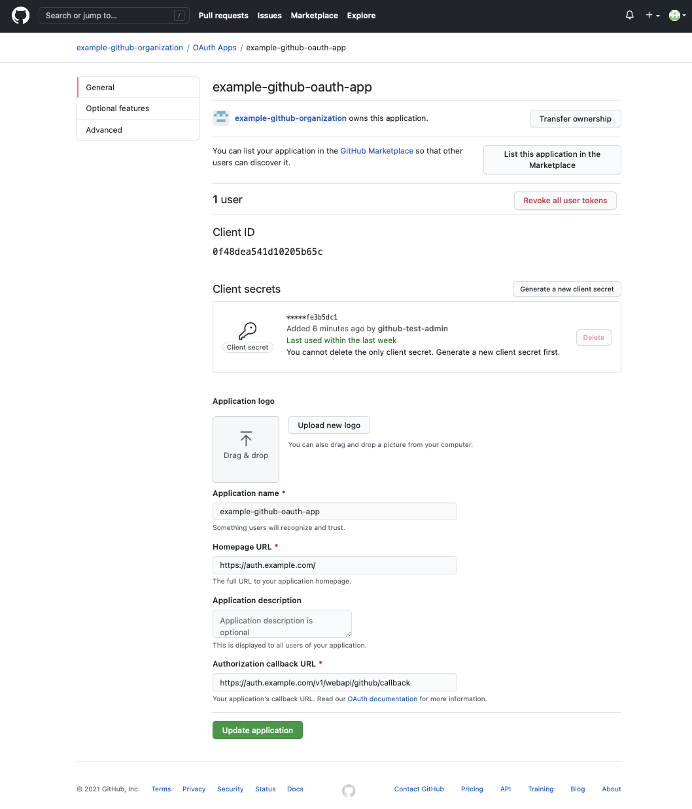
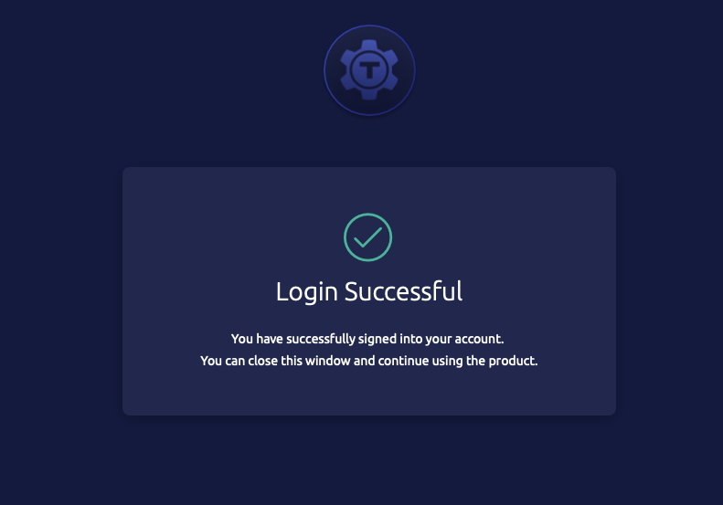

# Getting Started

Teleport Server Access provides full SSH capabilities out-of-the-box:

1. Teleport's `tsh` combines support for SSH and SCP in one convenient local command-line tool.
2. Each Teleport node can be configured into SSH mode (Teleport Node) and run as an enhanced SSH server.

The steps below involve:

1. Create and supplement a Teleport Auth node cluster with a Teleport SSH Node.
2. Using `tsh` to SSH into the cluster without external SSH dependencies.
3. Introspect the cluster using advanced `tsh` features.

## Prerequisites

- A Linux environment (such as Digital Ocean droplets, Azure Linux VM's, or AWS EC2) within which we'll create multiple instances.
- A registered Doman Name.
- A Two-Factor Authentication app (such as Authy or Google Authenticator).
- Teleport installed locally (for `tsh`).
- A GitHub user belonging to an organization and a team within that organization.

## Step 1a. Create a cluster

1. Verify you have a registered domain name. 

   i. We'll create two subdomains, one for each Linux instance: `auth.example.com` and `ssh.example.com`.

   

   ii. Then, we'll associate TLS (SSL) certificates from Let's Encrypt with them below.

   iii. Make sure ports: `9090`, `443`, `3023-3025`, and `3080` are all open.

2. Create two new instances of your desired Linux distribution (such as CentOS, Debian, Ubuntu).

   <Admonition type="tip">
     Multiple Teleport Nodes can be run on the same Linux instance. This Guide details how to launch and connect two Nodes on different devices.
   </Admonition>

   i. Add an `A` record in your domain registrar entry for each Linux instance. 

   ii. Map the first IP address to the `auth` subdomain and the second IP address to the `ssh` subdomain.  

   iii. Create the necessary SSH keys and connect from your local machine to each using the following `ssh` command format:

   - `aws % ssh -i "example.pem" ubuntu@ecX-X-XX-XXX-XX.us-north-2.compute.amazonaws.com`  
  
   Most cloud providers require SSH to initially access, configure, and provision your cloud instances. We'll configure and launch our instances then demonstrate how to use the `tsh` tool and Teleport in SSH mode thereafter.

3. Install certbot and acquire TLS (SSL) certificates from Let's Encrypt:

   <Admonition type="note">
     certbot is the official ACME client from Let's Encrypt. It allows you to easily acquire and renew TLS certificates for registered domains.
   </Admonition>

   i.  Update your Linux distro and install certbot:

   ```bash
   # Install certbot
   sudo apt-get update
   sudo apt-get install certbot
   ```

   ii. Acquire a certificate for the instance.

   ```bash
   # Acquire SSL
   sudo certbot certonly --standalone \
     -d auth.example.com \
     -n \
     --agree-tos \
     --email=your_email@example.com
   ```
       
4. Install Teleport on each instance.

   ```bash
   # Install Teleport
   curl https://deb.releases.teleport.dev/teleport-pubkey.asc | sudo apt-key add -
   sudo add-apt-repository 'deb https://deb.releases.teleport.dev/ stable main'
   sudo apt-get update
   sudo apt-get install teleport
   ```

5. Since we're using Let's Encrypt certbot, configure Teleport to use ACME:

   <Admonition type="tip">
    Teleport supports any ACME provider. We'll stick with Let's Encrypt for this Guide but feel free to use whichever you prefer.
   </Admonition>

   ```bash
   # Configure Teleport
   sudo teleport configure \
     --acme --acme-email=your_email@example.com \
     --cluster-name=auth.example.com \
     -o file
   ```

6. Launch Teleport on `auth.example.com`: `sudo teleport start`. 

## Step 1b. Add a Node to the cluster

<iframe width="560" height="315" src="https://www.youtube.com/embed/2I6bPdXrMAk" title="YouTube video player" frameborder="0" allow="accelerometer; autoplay; clipboard-write; encrypted-media; gyroscope; picture-in-picture" allowfullscreen></iframe>

1. Now, create a third terminal and connect to `auth.example.com`:

   i. Create a user to access the `auth.example.com` Web UI: 

   - `sudo tctl users add auth-admin --roles=editor,access,admin --logins=root,ubuntu,ec2-user`  

   ii. This will generate an initial login link where you can set a password and set up Two-Factor Authentication for `auth-admin`.

   iii. Create a *join token* to link `ssh.example.com` with the `auth.example.com` cluster:

   - `sudo tctl tokens add --type=node`  
   - "Node" mode specifies that the Teleport Node that will join will act as an SSH server.  

   iv. You should see:

   ```bash
   # Join cluster
   sudo teleport start \
     --roles=node \
     --token=d62629ea83e181644e0778af22ec3a8e \
     --ca-pin=sha256:c75f8be5b21a5cc1b6f91a71200f30a9a083dfea4fc47ec1c55143ccce8882e4 \
     --auth-server=172.31.17.124:3025
   ```

   <Admonition type="warning">
     Remember to replace the IP address supplied by default above with the `auth.example.com` proxy address: `auth.example.com:443`.
   </Admonition>

2. On your second terminal, `ssh.example.com`:

   i. Run the command above with the correct `auth.example.com` public proxy address on the machine you wish to connect.

   ii. You should now be able to view both Nodes at: `https://auth.example.com/web/cluster/auth.example.com/nodes` in the Web Interface after logging in with your the user `auth-admin`.

   

## Step 2a. Use tsh to connect to the cluster

Now, we've got our cluster up and running. Let's see how easy it is to connect to our two nodes:

1. On your local machine, log in through `tsh`: 

   i. `tsh login --proxy=auth.example.com:443 --user=auth-admin`  
   ii. You'll be prompted to supply the password and One Time Pass code we set up previously.

2. `auth-admin` will now see:

   ```bash
   Profile URL:        https://auth.example.com:443
     Logged in as:       auth-admin
     Cluster:            auth.example.com
     Roles:              access, admin, editor
     Logins:             root, ubuntu, ec2-user
     Kubernetes:         disabled
     Valid until:        2021-04-30 06:39:13 -0500 CDT [valid for 12h0m0s]
     Extensions:         permit-agent-forwarding, permit-port-forwarding, permit-pty
   ```

  - `auth-admin` is now logged into the `auth.example.com` cluster and `auth` Node via Teleport SSH - no third-party tool required.

3. `auth-admin` can now execute the following to find the cluster's `nodenames` which are used for direct SSH connections:

   i. `tctl nodes ls`  
   ii. The `auth` node is located on the bottom line below:

   ```bash
   Nodename         UUID                                 Address        Labels                                
   ---------------- ------------------------------------ -------------- ------------------------------------- 
   ip-172-31-30-155 8f1e2719-3161-400f-b664-3279cf046511                env=example,hostname=ip-172-31-30-155 
   ip-172-31-17-124 e7719967-b6eb-4fc0-8e53-00fac6d896d4 127.0.0.1:3022 env=example,hostname=ip-172-31-17-124 
   ```

4. Using the command `tsh ssh root@ip-172-31-17-124` locally, `auth-admin` can SSH into the `auth` Node and do the following:

   i. Connect to other Nodes in the cluster by repeating the steps above.  
   ii. Traverse the Linux file system.  
   iii. Execute desired commands.  

   - The `tsh ssh` command allows one to do anything they would if they were to SSH into a server using a third-party tool. 
   - All commands executed by `auth-admin` are recorded and can be replayed in the Teleport Web interface.

<iframe width="560" height="315" src="https://www.youtube.com/embed/u6wDLg0WvL8" title="YouTube video player" frameborder="0" allow="accelerometer; autoplay; clipboard-write; encrypted-media; gyroscope; picture-in-picture" allowfullscreen></iframe>

## Step 2b. Use tsh to introspect cluster

1. Now, `auth-admin` has the ability to SSH into other Nodes within the cluster, traverse the Linux file system, and execute the command.

   They can also quickly survey any Node that's been assigned a `label`.

2. Executing `tctl nodes ls` displays:
   
   ```bash
   Nodename         UUID                                 Address        Labels                                
   ---------------- ------------------------------------ -------------- ------------------------------------- 
   ip-172-31-30-155 8f1e2719-3161-400f-b664-3279cf046511                env=example,hostname=ip-172-31-30-155 
   ip-172-31-17-124 e7719967-b6eb-4fc0-8e53-00fac6d896d4 127.0.0.1:3022 env=example,hostname=ip-172-31-17-124 
   ```

3. As a result, `auth-admin` can execute `tsh ssh root@env=example` since each Node has [label](../admin-guide.mdx#labeling-nodes-and-applications) by default. 

   - Customized labels can be defined in your `teleport.yaml` configuration file or during Node creation.
   - This is a convenient feature that allows for more advanced queries. Suppose an IP address changes. An admin can quickly find the current Node with that label since it remains unchanged.

4. `auth-admin` can also execute commands on all Nodes that share a label vastly simplifying repeated operations:

   - `tsh ssh root@env=example ls` will execute the `ls` command on each Node displaying the contents of each to the screen.
  
   We'll review configuring and managing short-lived certificates for programmatic API access below.

## Step 3a. Set up GitHub SSO

<iframe width="560" height="315" src="https://www.youtube.com/embed/QX7w1F3B_OM" title="YouTube video player" frameborder="0" allow="accelerometer; autoplay; clipboard-write; encrypted-media; gyroscope; picture-in-picture" allowfullscreen></iframe>

Teleport Server Access also supports using SSO for authentication. Let's add a new user through GitHub SSO:

1. Make sure the user you'll add to Teleport is a GitHub administrator within your GitHub organization.

   i. As your GitHub administrator, go to your organization's **"Settings"** > **"Developer settings"** > **"OAuth Apps"** page.

   ii. Add an OAuth App to your organization's page taking care to create a Client Secret.

   

2. Within your `auth` terminal:

   - Execute `sudo nano /etc/teleport.yaml` and add the following entry to the `auth_service` section:

   ```yaml
   authentication:
     type: "saml"
   ```

3. Within your `auth` terminal:

   i. Execute `sudo touch connector.yaml`.  
   ii. Then, `sudo nano connector.yaml` and paste in:

   ```yaml
   kind: github
   version: v3
   metadata:
     name: github
   spec:
     # GitHub OAuth app client ID
     client_id: APP_CLIENT_ID
     # GitHub OAuth app client secret
     client_secret: APP_CLIENT_SECRET
     # GitHub will make a callback to this URL after successful authentication
     # cluster-url is the address the cluster UI is reachable at
     redirect_url: "https://auth.example.com/v1/webapi/github/callback"
     # connector display name that will be appended to the title of "Login with"
     # button on the cluster login screen so it will say "Login with Github"
     display: Github
     # mapping of GitHub team memberships to Teleport cluster roles
     teams_to_logins:
     - logins:
       -  admin
       organization: "EXAMPLE_GITHUB_OAUTH_APP"
       team: TEAM
   ```

4. `sudo tctl create connector.yaml` (use the `-f` flag to override an existing connector).

   - Display all connectors with: `tctl get connectors`.

5. Your GitHub admin user (`github-test-admin`) can now use:

   - `tsh --proxy=auth.example.com login --auth=github --user=github-test-admin` to authenticate via GitHub SSO.

   

   - The user will automatically appear in the "Team" > "Users" panel of the Teleport Web Interface after the first sign in.

   

## Step 3b. Create short-lived certificates

Teleport Server Access provides the ability to manage short-lived certificates and give users API and resource access for specified durations of time:

1. Users can define a role to programmatically interact with the Teleport API per the [Teleport API Getting Started](../reference/api/introduction.mdx).

   - This is designed to be convenient for mass deployments or operations that must be repeated (daily jobs, frequent operations, etc.).

2. Admins also create short-lived certificates for resources users must connect to directly:

   - Execute: `tctl auth sign --ttl=87600h --user=jenkins --out=jenkins.pem` to generate a certificate valid for a specified *Time To Live* (TTL).
   - Team members can access private resources securely using certificates and SSH tunnels.
   - No sharing of resource secrets, passwords, or credentials only certificates that are unique to that user and specified period of time.

## Conclusion

This Getting Started Guide walked through:

1. How to set up and add an SSH Node to a cluster.
2. Connect to the cluster using `tsh` to manage and introspect resources.
3. Set up GitHub SSO and authenticate through `tsh` using SAML.
4. Describe use scenarios for short-lived certificates and `tctl auth` roles.

## Resources

- [Announcing Teleport SSH Server](https://goteleport.com/blog/announcing-teleport-ssh-server/)  
- [How to SSH Properly](https://goteleport.com/blog/how-to-ssh-properly/)  
- Consider whether [OpenSSH or Teleport SSH](https://goteleport.com/blog/openssh-vs-teleport/) is right for you.  
- Learn about [Teleconsole](https://goteleport.com/blog/instant-ssh-github/) built on Teleport SSH  

## Next steps

- Learn more about Teleport `tsh` through the [reference documentation](../cli-docs.mdx#tsh-ssh).  
- Learn more about [Teleport Nodes](../architecture/nodes.mdx#connecting-to-nodes)  