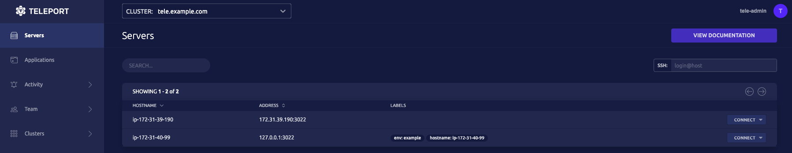

# Getting Started

Server Access often involves managing your resources, configuring new clusters, and issuing commands through a CLI or programmatically to an API.

This guide introduces some of these common scenarios and how to interact with Teleport to accomplish them:

1. Creating a Teleport Auth Node cluster we'll add a Teleport SSH Node to.
2. SSH into the cluster using Teleport.
3. Introspecting the cluster using Teleport features.

<Admonition type="tip" title="Tip">
  This guide also demonstrates how to configure Teleport Nodes into the *Bastion* pattern so that [only a single Node can be accessed publicly](https://goteleport.com/blog/ssh-bastion-host/).
</Admonition>

<Figure
  align="center"
  bordered
  caption="Teleport Bastion"
>
  
</Figure>

## Prerequisites

- Two instances of your favorite Linux environment (such as Ubuntu 20.05, CentOS 8.0-1905, or Debian 10).
- A registered Domain Name with an available subdomain like `tele.example.com`.
- A Two-Factor Authentication app (such as Authy or Google Authenticator).
- Teleport (=teleport.version=) installed locally.

(!docs/pages/includes/permission-warning.mdx!)

## Step 1/4. Create a cluster

1. Create two new instances of your desired Linux distribution (such as Ubuntu 20.05, CentOS 8.0-1905, or Debian 10).

   The first instance will host a public-facing Auth Node `tele.example.com` that will serve as the *Bastion Host* (following the recommended *Bastion*-pattern). As such, leave the following ports open:

   | Port | Service | Description |
   | - | - | - |
   | 3023 | Proxy | SSH port clients connect to. A proxy will forward this connection to port `#3022` on the destination Node. |
   | 3024 | Proxy	SSH port used to create "reverse SSH tunnels" from behind-firewall environments into a trusted proxy server. |
   | 443 | Browser | Used to access the Teleport Web UI through a browser with HTTPS. Also used to obtain an ACME TLS (SSL) certificate. |
   | 22 | Cloud Provider | Used to initially access, configure, and provision your cloud instances. We'll configure and launch our instances then demonstrate how to use the `tsh` tool and Teleport in SSH mode thereafter. |

   Add an `A` record in your domain registrar entry for the `tele` subdomain and map the first IP address to the `tele` subdomain.

   <Figure
     align="center"
     bordered
     caption="Subdomain and IP mapping"
   >
     
   </Figure>

   Your second instance will be a private resource. These are the ports you'll want to initially open:

   | Port | Service | Description |
   | - | - | - |
   | 22 | Cloud Provider | Used to initially access, configure, and provision your cloud instances. We'll configure and launch our instances then demonstrate how to use the `tsh` tool and Teleport in SSH mode thereafter. |

2. Install Teleport on each instance.

   <Tabs>
     <TabItem label="Amazon Linux 2/RHEL (RPM)">
      ```code
      $ sudo yum-config-manager --add-repo https://rpm.releases.teleport.dev/teleport.repo
      $ sudo yum install teleport

      # Optional:  Using DNF on newer distributions
      # $ sudo dnf config-manager --add-repo https://rpm.releases.teleport.dev/teleport.repo
      # $ sudo dnf install teleport
      ```
     </TabItem>

     <TabItem label="Debian/Ubuntu (DEB)">
      ```code
      $ curl https://deb.releases.teleport.dev/teleport-pubkey.asc | sudo apt-key add -
      $ sudo add-apt-repository 'deb https://deb.releases.teleport.dev/ stable main'
      $ sudo apt-get update
      $ sudo apt-get install teleport
      ```
     </TabItem>

     <TabItem label="Linux">
      ```code
      $ curl -O https://get.gravitational.com/teleport-v(=teleport.version=)-linux-amd64-bin.tar.gz
      $ tar -xzf teleport-v(=teleport.version=)-linux-amd64-bin.tar.gz
      $ cd teleport
      $ sudo ./install
      ```
     </TabItem>

     <TabItem label="ARMv7 (32-bit)">
      ```code
      $ curl -O https://get.gravitational.com/teleport-v(=teleport.version=)-linux-arm-bin.tar.gz
      $ tar -xzf teleport-v(=teleport.version=)-linux-arm-bin.tar.gz
      $ cd teleport
      $ sudo ./install
      ```
     </TabItem>

     <TabItem label="ARMv8 (64-bit)">
      ```code
      $ curl -O https://get.gravitational.com/teleport-v(=teleport.version=)-linux-arm64-bin.tar.gz
      $ tar -xzf teleport-v(=teleport.version=)-linux-arm64-bin.tar.gz
      $ cd teleport
      $ sudo ./install
      ```
     </TabItem>
   </Tabs>

3. Configure Teleport on the *Bastion Host*.

   Teleport will now automatically acquire an X.509 certificate using the ACME protocol.

   ```code
   # Configure Teleport with TLS certs
   $ sudo teleport configure \
     --acme --acme-email=your_email@example.com \
     --cluster-name=tele.example.com \
     -o file
   ```

   Run the command above on `tele.example.com`.

4. Launch your *Bastion Host* by running:

   ```code
   # Launch Teleport
   $ sudo teleport start
   ```

   Next, we'll create a *join token* to add and start the second Node.

## Step 2/4. Add a Node to the cluster

1. Create a *join token* to add the second Node to the `tele.example.com` cluster. In a *Bastion Host* terminal run the following command:

   ```code
   # Let's save the token to a file
   $ sudo tctl tokens add --type=node | grep -oP '(?<=token:\s).*' > token.file
   ```

   Each Teleport Node can be configured into SSH mode (Teleport Node) and run as an enhanced SSH server. "Node" mode specifies that the Teleport Node will act and join as an SSH server.

   `> token.file` indicates that you'd like to save the output to a file name `token.file`.

   <Admonition type="tip" title="Tip">
     This helps to minimize the direct sharing of tokens even when they are *dynamically* generated.
   </Admonition>

2. Now, create a third terminal and connect to `tele.example.com`.

   - Save `token.file` to an appropriate, secure, directory you have the rights and access to read on the second instance.

   ```code
   # Join cluster
   $ sudo teleport start \
     --roles=node \
     --token=/path/to/token.file \
     --auth-server=tele.example.com:443
   ```

   - Replace the `auth-server` value with the public proxy address of the machine you wish to connect to. By default, the subdomain `tele.example.com` will be available on port `443`.
   - Supply the secured path to the new Node's `token.file`.

3. Create a user to access the `tele.example.com` Web UI through the following command:

   ```code
   $ sudo tctl users add tele-admin --roles=editor,access --logins=root,ubuntu,ec2-user
   ```

   This will generate an initial login link where you can set a password and set up Two-Factor Authentication for `tele-admin`.

   <Admonition type="note" title="Note">
     We've only given `tele-admin` the roles `editor` and `access` according to the *Principle of Least Privilege* (POLP).
   </Admonition>

4. You should now be able to view both Nodes in the Teleport Web interface after logging in as `tele-admin`:

   <Figure
     align="center"
     bordered
     caption="Both Nodes in the Web UI"
   >
     
   </Figure>

## Step 3/4. SSH into the server

Now, that we've got our cluster up and running, let's see how easy it is to connect to our two Nodes.

We can use `tsh` to SSH into the cluster:

1. On your local machine, log in through `tsh`:

   ```code
   # Log in through tsh
   $ tsh login --proxy=tele.example.com --user=tele-admin
   ```

   You'll be prompted to supply the password and One Time Passcode we set up previously.

2. `tele-admin` will now see:

   ```txt
   Profile URL:        https://tele.example.com:443
     Logged in as:       tele-admin
     Cluster:            tele.example.com
     Roles:              access, editor
     Logins:             root, ubuntu, ec2-user
     Kubernetes:         disabled
     Valid until:        2021-04-30 06:39:13 -0500 CDT [valid for 12h0m0s]
     Extensions:         permit-agent-forwarding, permit-port-forwarding, permit-pty
   ```

   `tele-admin` is now logged into the `tele.example.com` cluster and *Bastion Host* Node through Teleport SSH.

3. `tele-admin` can now execute the following to find the cluster's `nodenames`. `nodenames` are used for establishing SSH connections:

   ```code
   # Display cluster resources
   $ tsh ls
   ```

   The *Bastion Host* Node is located on the bottom line below:

   ```txt
   Node Name        Address        Labels                                 
   ---------------- -------------- -------------------------------------- 
   ip-172-31-35-170 ⟵ Tunnel                                              
   ip-172-31-41-144 127.0.0.1:3022 env=example, hostname=ip-172-31-41-144 
   ```

4. `tele-admin` can SSH into the *Bastion Host* Node by running the following command locally:

   ```code
   # Use tsh to ssh into a Node
   $ tsh ssh root@ip-172-31-41-144
   ```

   Now, they can:

   - Connect to other Nodes in the cluster by using the appropriate IP address in the `tsh ssh` command.
   - Traverse the Linux file system.
   - Execute desired commands.

   All commands executed by `tele-admin` are recorded and can be replayed in the Teleport Web interface.

   The `tsh ssh` command allows one to do anything they would if they were to SSH into a server using a third-party tool. Compare the two equivalent commands:

<Tabs>
  <TabItem label="tsh">
    ```code
    $ tsh ssh root@ip-172-31-41-144
    ```
  </TabItem>
  <TabItem label="ssh">
    ```code
    $ ssh -J tele.example.com root@ip-172-31-41-144
    ```
  </TabItem>
</Tabs>

## Step 4/4. Use tsh and the unified resource catalog to introspect the cluster

1. Now, `tele-admin` has the ability to SSH into other Nodes within the cluster, traverse the Linux file system, and execute commands.

   - They have visibility into all resources within the cluster due to their defined and assigned roles.
   - They can also quickly view any Node or grouping of Nodes that've been assigned a `label`.

2. Execute the following command within your *Bastion Host* console:

   ```code
   # List Nodes
   $ sudo tctl nodes ls
   ```

   It displays the unified resource catalog with all queried resources in one view: 
   
   ```txt
   Nodename         UUID                                 Address        Labels                                
   ---------------- ------------------------------------ -------------- ------------------------------------- 
   ip-172-31-35-170 4980899c-d260-414f-9aea-874feef71747                                                      
   ip-172-31-41-144 f3d2a65f-3fa7-451d-b516-68d189ff9ae5 127.0.0.1:3022 env=example,hostname=ip-172-31-41-144                            
   ```

3. Note the "Labels" column on the farthest side. `tele-admin` can query all resources with a shared [label](../admin-guide.mdx#labeling-nodes-and-applications) using the command:

   ```code
   # Query all Nodes with a label
   $ tsh ls env=example
   ```

   - Customized labels can be defined in your `teleport.yaml` configuration file or during Node creation.
   - This is a convenient feature that allows for more advanced queries.
   - Suppose an IP address changes, an admin can quickly find the current Node with that label since it remains unchanged.

4. `tele-admin` can also execute commands on all Nodes that share a label vastly simplifying repeated operations. For example, the command:

   ```code
   # Run the ls command on all Nodes with a label
   $ tsh ssh root@env=example ls
   ``` 

   will execute the `ls` command on each Node displaying the contents of each to the screen.

## Conclusion

<Admonition type="tip" title="Note">
   We previously configured our Linux instances to leave port `22` open to easily configure and install Teleport. Feel free to compare Teleport SSH to your usual `ssh` commands.

   If you'd like to further experiment with using Teleport according to the *Bastion* pattern:

   - Close port `22` on your second, private, Linux instance now that your Node is configured and running.
   - Optionally close port `22` on your *Bastion Host*.
   - You'll be able to fully connect to both the *Bastion Host* and the private instance using `tsh ssh`.
</Admonition>

To recap, this Getting Started Guide described:

1. How to set up and add an SSH Node to a cluster.
2. Connect to the cluster using `tsh` to manage and introspect resources.

Feel free to shut down, clean up, and delete your resources or use them in further Getting Started exercises.

## Next steps

- Learn more about Teleport `tsh` through the [reference documentation](../setup/reference/cli.mdx#tsh-ssh).
- Learn more about [Teleport Nodes](../architecture/nodes.mdx#connecting-to-nodes)
- For a complete list of ports used by Teleport, read [The Admin Guide](../admin-guide.mdx#ports).

## Resources

- [Announcing Teleport SSH Server](https://goteleport.com/blog/announcing-teleport-ssh-server/)
- [How to SSH properly](https://goteleport.com/blog/how-to-ssh-properly/)
- Consider whether [OpenSSH or Teleport SSH](https://goteleport.com/blog/openssh-vs-teleport/) is right for you.
