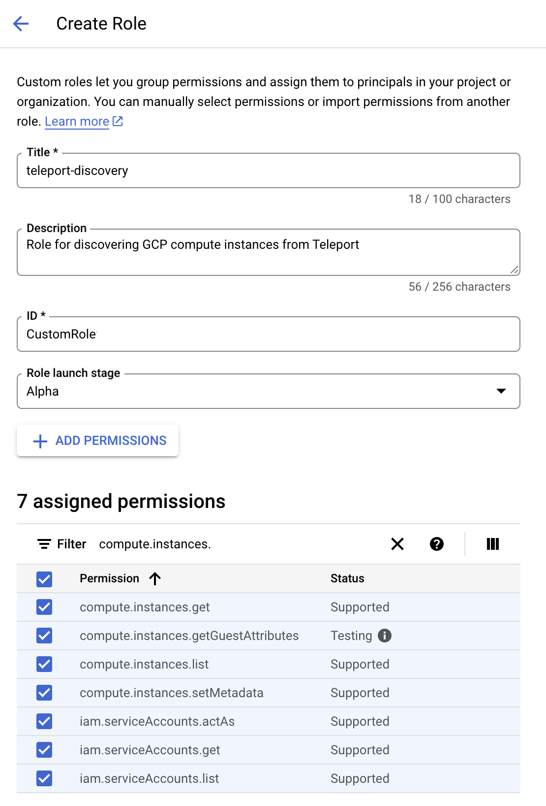

The Teleport Discovery Service can connect to GCP and automatically
discover and enroll compute matching configured labels. It will then
execute a script on these discovered instances that will install Teleport,
start it and join the cluster.

## Prerequisites

(!docs/pages/includes/edition-prereqs-tabs.mdx!)

- GCP compute instances to join the Teleport cluster, running
Ubuntu/Debian/RHEL if making use of the default Teleport install script. (For
other Linux distributions, you can install Teleport manually.)
- (!docs/pages/includes/tctl.mdx!)

## Step 1/6. Create a GCP invite token

When discovering GCP compute instances, Teleport makes use of GCP invite tokens for
authenticating joining SSH Service instances.

Create a file called `token.yaml`:

```yaml
# token.yaml
kind: token
version: v2
metadata:
  # the token name is not a secret because instances must prove that they are
  # running in your GCP project to use this token
  name: gcp-token
spec:
  # use the minimal set of roles required (e.g. Node, Proxy, App, Kube, DB, WindowsDesktop)
  roles: [Node]

  # set the join method allowed for this token
  join_method: gcp

  gcp:
    allow:
      # The GCP project ID(s) that VMs can join from.
      - project_ids: []
        # (Optional) The locations that VMs can join from. Note: both regions and
        # zones are accepted.
        locations: []
        # (Optional) The email addresses of service accounts that VMs can join
        # with.
        service_accounts: []
```

Add your instance's project ID(s) to the `project_ids` field.
Add the token to the Teleport cluster with:

```code
$ tctl create -f token.yaml
```

## Step 2/6. Configure IAM permissions for Teleport

<Tabs>
<TabItem label="Console">
  Go to [IAM > Roles](https://console.cloud.google.com/iam-admin/roles)
  in the GCP console and click *+ CREATE ROLE*.
  Pick a name for the role (e.g. `teleport-discovery`) and give it the following permissions:
  - `compute.instances.get`
  - `compute.instances.getGuestAttributes`
  - `compute.instances.list`
  - `compute.instances.setMetadata`

  

  Click *CREATE*.

  Go to [IAM > Service accounts](https://console.cloud.google.com/iam-admin/serviceaccounts)
  and click *+ CREATE SERVICE ACCOUNT*. Pick a name for the service account
  (e.g. `teleport-discovery`) and copy its email address to your clipboard.
  Click *CREATE AND CONTINUE*.

  

  Go to [IAM](https://console.cloud.google.com/iam-admin/iam) and click *Grant Access*.
  Paste the service account's email into the *New principals* field and select
  your custom role. Click *Save*.

  

  Go to [Compute](https://console.cloud.google.com/compute/instances). For each
  instance that should be discovered, set its service account to the one you created.

  
</TabItem>
<TabItem label="gcloud">
  Copy the following and paste it into a file called `teleport-discover-role.yaml`:
  ```yaml
  title: "teleport-discovery"
  description: "A role to enable Teleport to discover GCP compute instances"
  stage: "ALPHA"
  includedPermissions:
  - compute.instances.get
  - compute.instances.getGuestAttributes
  - compute.instances.list
  - compute.instances.setMetadata
  ```

  Then run the following command to create the role:

  ```code
  $ gcloud iam roles create teleport-discovery \
  > --project=<> \
  > --file=teleport-discovery-role.yaml
  $ gcloud iam service-accounts create teleport-discovery \
  > --description="A service account to enable Teleport to discover GCP compute instances" \
  > --display-name="teleport-discovery"
  $ gcloud projects add-iam-policy-binding <PROJECT-ID> \
  > --member="serviceAccount:teleport-discovery@<PROJECT-ID>.iam.gserviceaccount.com" \
  > --role="teleport-discovery"
  ```
</TabItem>
</Tabs>

The Teleport Discovery Service uses Application Default Credentials to (authenticate).
Refer to [Set Up Application Default Credentials](https://cloud.google.com/docs/authentication/provide-credentials-adc)
to pick a method suitable for your use-case. (example)

## Step 3/6. (configure instances)

Ensure that each instance to be discovered has a service account assigned to
it. No permissions are required on the service account.

### Enable guest attributes on instances

To give Teleport access to instances' SSH host keys,
[guest attributes must be enabled on the instances](https://cloud.google.com/compute/docs/metadata/manage-guest-attributes#enable_attributes).
If guest attributes are enabled during instance creation, the guest attributes
will automatically be populated with the instance's host keys. If guest
attributes were enabled after the instance was created, you can manually add
the host keys to the guest attributes by running the following script on the instance:

```code
#!/usr/bin/env bash
for file in /etc/ssh/ssh_host_*_key.pub
  do
  KEY_TYPE=$(awk '{print $1}' $file)
  KEY=$(awk '{print $2}'  $file)
  curl -X PUT --data "$KEY" "http://metadata.google.internal/computeMetadata/v1/instance/guest-attributes/hostkeys/$KEY_TYPE" -H "Metadata-Flavor: Google"
done
```

## Step 4/6. Install the Teleport Discovery Service

<Admonition type="tip">

If you plan on running the Discovery Service on a host that is already running
another Teleport service (Auth or Proxy, for example), you can skip this step.

</Admonition>

Install Teleport on the virtual machine that will run the Discovery Service:

(!docs/pages/includes/install-linux.mdx!)

## Step 5/6. Configure Teleport to discover GCP compute instances

If you are running the Discovery Service on its own host, the service requires a
valid invite token to connect to the cluster. Generate one by running the
following command against your Teleport Auth Service:

```code
$ tctl tokens add --type=discovery
```

Save the generated token in `/tmp/token` on the virtual machine that will run
the Discovery Service.

In order to enable GCP instance discovery the `discovery_service.gcp` section
of `teleport.yaml` must include at least one entry:

```yaml
version: v2
teleport:
  join_params:
    token_name: "/tmp/token"
    method: token
  proxy_server: "teleport.example.com:443"
auth_service:
  enabled: off
proxy_service:
  enabled: off
ssh_service:
  enabled: off
discovery_service:
  enabled: "yes"
  gcp:
    - types: ["gce"]
      project_ids: []
      locations: []
      service_accounts: []
      tags:
        "env": "prod" # Match virtual machines where tag:env=prod
```

- Edit the `teleport.auth_server` or `teleport.proxy_server` key to match your Auth Service or Proxy Service's URI
  and port, respectively.
- Adjust the keys under `discovery_service.gcp` to match your GCO environment,
  specifically the projects, locations, service accounts, and tags you want to associate with the Discovery
  Service.

## Step 6/6. [Optional] Customize the default installer script

(!docs/pages/includes/server-access/custom-installer.mdx cloud="GCP" matcher="gcp" matchTypes="[\"gce\"]"!)

## Next steps

- Read [Joining Nodes via GCP](../../agents/join-services-to-your-cluster/gcp.mdx)
  for more information on GCP tokens.
- Full documentation on GCP discovery configuration can be found through the [
  config file reference documentation](../../reference/config.mdx).
- The complete default installer can be found [with the Teleport source
](https://github.com/gravitational/teleport/blob/master/api/types/installers/installer.sh.tmpl).