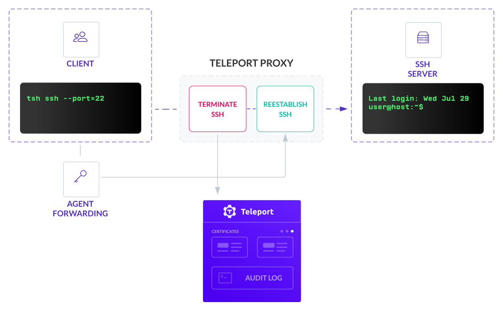

Teleport is fully compatible with OpenSSH and can be quickly set up to record and
audit all SSH activity. Using Teleport and OpenSSH has the advantage of getting you up
and running, but in the long run, we would recommend replacing `sshd` with `teleport`.
We've outlined these reasons in [OpenSSH vs Teleport SSH for Servers?](https://gravitational.com/blog/openssh-vs-teleport/)

Teleport is a standards-compliant SSH proxy and it can work in environments with
existing SSH implementations, such as OpenSSH. This section will cover:

- Configuring OpenSSH server `sshd` to join a Teleport cluster. Existing fleets of
  OpenSSH servers can be configured to accept SSH certificates dynamically issued by a Teleport CA.
- Configuring OpenSSH client `ssh` to login into nodes inside a Teleport
  cluster.

<Admonition
  type="note"
  title="Note"
>
  OpenSSH 6.9 is the minimum OpenSSH version compatible with Teleport. View your OpenSSH version with the command: 
  
  ```bash
  ssh -V
  ```
</Admonition>

<Admonition type="warning" title="Warning">
  The examples below may include the use of the `sudo` keyword to make following each step easier when creating resources from scratch. However, we generally discourage the use of `sudo` in customer-facing production environments per the *Principle of Least Privilege* (POLP). 
</Admonition>

### Follow along with our video guide

<iframe
  width="712"
  height="400"
  src="https://www.youtube-nocookie.com/embed/x0eYFUEIOrM?rel=0&modestbranding=1"
  frameBorder="0"
  allow="accelerometer; autoplay; encrypted-media; gyroscope; picture-in-picture"
  allowFullScreen
/>

## Overview

<Figure
  align="center"
  bordered
  caption="Teleport OpenSSH Recording Proxy"
>
  
</Figure>

The recording proxy mode, although less secure, was added to allow Teleport users
to enable session recording for OpenSSH's servers running `sshd`, which is helpful
when gradually transitioning large server fleets to Teleport.

We consider the "recording proxy mode" to be less secure for two reasons:

- It grants additional privileges to the Teleport proxy. In the default "node recording" mode, the proxy stores no secrets and cannot "see" the decrypted data. This makes a proxy less critical to the security of the overall cluster. But if an attacker gains physical access to a proxy node running in the "recording" mode, they will be able to see the decrypted traffic and client keys stored in the proxy's process memory.
- Recording proxy mode requires the use of SSH agent forwarding. Agent forwarding is required because without it, a proxy will not be able to establish the 2nd connection to the destination node.

Teleport proxy should be available to clients and be set up with TLS.

Teleport OpenSSH supports:

- FQDN `ec2-user@ip-172-31-14-137.us-west-2.compute.internal`
- IPv4 `ubuntu@184.45.45.30`
- IPv6 `root@2001:db8::2`

## Set up OpenSSH recording proxy mode

The first step is install and setup Teleport, we recommend starting with our [Getting Started Guide](../../getting-started.mdx) and [Admin Manual](../../admin-guide.mdx).

To enable session recording for `sshd` nodes, the cluster must be switched to
["recording proxy" mode](../../architecture/proxy.mdx#recording-proxy-mode).

In this mode, the recording will be done on the proxy level:

```yaml
# snippet from /etc/teleport.yaml
auth_service:
   # Session Recording must be set to Proxy to work with OpenSSH
   session_recording: "proxy"  # can also be "off" and "node" (default)
```

Next, `sshd` must be told to allow users to log in with certificates generated
by the Teleport User CA. Start by exporting the Teleport CA public key:

Export the Teleport CA certificate into a file:

```bash
# tctl needs to be run on the auth server.
sudo tctl auth export --type=user > teleport_user_ca.pub
```

To allow access for all users:

1. Edit `teleport_user_ca.pub` and remove `cert-authority` from the start of the line.
2. Copy `teleport_user_ca.pub` to `/etc/ssh/teleport_user_ca.pub`
3. Update `sshd` configuration (usually `/etc/ssh/sshd_config` ) to point to
  this file:
  ```
  TrustedUserCAKeys /etc/ssh/teleport_user_ca.pub
  ```

Now, `sshd` will trust users who present a Teleport-issued certificate. The next step is to configure host authentication.

When in recording mode, Teleport will check that the host certificate of any
node a user connects to is signed by a Teleport CA. By default, this is a strict
check. If the node presents just a key or a certificate signed by a different
CA, Teleport will reject this connection with the error message saying *"ssh:
handshake failed: remote host presented a public key, expected a host
certificate"*

You can disable strict host checks as shown below. However, this opens the
possibility for Man-in-the-Middle (MITM) attacks and is not recommended.

```yaml
# snippet from /etc/teleport.yaml
auth_service:
  proxy_checks_host_keys: no
```

The recommended solution is to ask Teleport to issue valid host certificates for
all OpenSSH nodes. To generate a host certificate, run this on your Teleport auth server:

```bash
# Creating host certs, with an array of every host to be accessed.
# Wildcard certs aren't supported by OpenSSH, must be full FQDN.
# Management of the host certificates can become complex, this is another
# reason we recommend using Teleport SSH on nodes.
sudo tctl auth sign \
      --host=api.example.com,ssh.example.com,64.225.88.175,64.225.88.178 \
      --format=openssh \
      --out=api.example.com

The credentials have been written to api.example.com, api.example.com-cert.pub

# You can use ssh-keygen to verify the contents.
sudo ssh-keygen -L -f api.example.com-cert.pub
#api.example.com-cert.pub:
#        Type: ssh-rsa-cert-v01@openssh.com host certificate
#        Public key: RSA-CERT SHA256:ireEc5HWFjhYPUhmztaFud7EgsopO8l+GpxNMd3wMSk
#        Signing CA: RSA SHA256:/6HSHsoU5u+r85M26Ut+M9gl+HventwSwrbTvP/cmvo
#        Key ID: ""
#        Serial: 0
#        Valid: after 2020-07-29T20:26:24
#        Principals:
#               api.example.com
#               ssh.example.com
#               64.225.88.175
#               64.225.88.178
#        Critical Options: (none)
#        Extensions:
#                x-teleport-authority UNKNOWN OPTION (len 47)
#                x-teleport-role UNKNOWN OPTION (len 8)
```

Then add the following lines to `/etc/ssh/sshd_config` on all OpenSSH nodes, and restart `sshd`.

```yaml
HostKey /etc/ssh/api.example.com
HostCertificate /etc/ssh/api.example.com-cert.pub
```

Now you can use [`tsh ssh --port=22 user@api.example.com`](../../cli-docs.mdx#tsh) to login
into any `sshd` node in the cluster and the session will be recorded.

```bash
# tsh ssh to use default ssh port:22
tsh ssh --port=22 user@host.example.com
# Example for a Amazon EC2 Host
# tsh ssh --port=22 ec2-user@ec2-54-EXAMPLE.us-west-2.compute.amazonaws.com
```

If you want to use OpenSSH `ssh` client for logging into `sshd` servers behind a proxy
in "recording mode", you have to tell the `ssh` client to use the jump host and
enable SSH agent forwarding, otherwise, a recording proxy will not be able to
terminate the SSH connection to record it:

```bash
# Note that agent forwarding is enabled twice: one from a client to a proxy
# (mandatory if using a recording proxy), and then optionally from a proxy
# to the end server if you want your agent running on the end server or not
sudo ssh -o "ForwardAgent yes" \
    -o "ProxyCommand ssh -o 'ForwardAgent yes' -p 3023 %r@p.example.com -s proxy:%h:%p" \
    user@host.example.com
```

<Admonition
  type="tip"
  title="Tip"
>
  To avoid typing all this and use the usual `ssh user@host.example.com`, users can update their `~/.ssh/config` file.
</Admonition>

### Setup SSH agent forwarding

It's important to remember that SSH agent forwarding must be enabled on the
client. Verify that a Teleport certificate is loaded into the agent after
logging in:

```bsh
# Login as Joe
tsh login --proxy=proxy.example.com --user=joe
# see if the certificate is present (look for "teleport:joe") at the end of the cert
sudo ssh-add -L
```

<Admonition
  type="warning"
  title="GNOME Keyring SSH Agent and GPG Agent"
>
  It is well-known that the Gnome Keyring SSH agent, used by many popular Linux desktops like Ubuntu, and `gpg-agent` from GnuPG do not support SSH
  certificates. We recommend using the `ssh-agent` from OpenSSH.
  Alternatively, you can disable SSH agent integration entirely using the
  `--no-use-local-ssh-agent` flag or `TELEPORT_USE_LOCAL_SSH_AGENT=false`
  environment variable with `tsh`.
</Admonition>

## Use OpenSSH client

It is possible to use the OpenSSH client `ssh` to connect to nodes within a
Teleport cluster. Teleport supports SSH subsystems and includes a `proxy` subsystem that can be used like `netcat` is with `ProxyCommand` to connect
through a jump host.

On your client machine, you need to import the public key of Teleport's host
certificate. This will allow your OpenSSH client to verify that host certificates
are signed by Teleport's trusted host CA:

```yaml
# on the Teleport auth server
sudo tctl auth export --type=host > teleport_host_ca.pub

# on the machine where you want to run the ssh client
sudo cat teleport_host_ca.pub >> ~/.ssh/known_hosts
```

If you have multiple Teleport clusters, you have to export and set up these
certificate authorities for each cluster individually.

<Admonition
  type="tip"
  title="OpenSSH and Trusted Clusters"
>
  If you use [recording proxy mode](../../architecture/proxy.mdx) and [trusted clusters](../../trustedclusters.mdx),
  you need to set up the certificate authority from
  the *root* cluster to match **all** nodes, even those that belong to *leaf*
  clusters. For example, if your node naming scheme is `*.root.example.com`,
  `*.leaf1.example.com`, `*.leaf2.example.com`, then the
  `@certificate-authority` entry should match `*.example.com` and use the CA
  from the root auth server only.
</Admonition>

Make sure you are running OpenSSH's `ssh-agent`, and have logged in to the
Teleport proxy:

```bash
sudo eval `ssh-agent`
tsh --proxy=root.example.com login
```

`ssh-agent` will print environment variables into the console. Either `eval` the
output as in the example above, or copy and paste the output into the shell you
will be using to connect to a Teleport node. The output exports the
`SSH_AUTH_SOCK` and `SSH_AGENT_PID` environment variables that allow OpenSSH
clients to find the SSH agent.

Lastly, configure the OpenSSH client to use the Teleport proxy when connecting
to nodes with matching names. Edit `~/.ssh/config` for your user or
`/etc/ssh/ssh_config` for global changes:

```bash
# root.example.com is the jump host (proxy). credentials will be obtained from the
# openssh agent.
Host root.example.com
    HostName 192.168.1.2
    Port 3023

# connect to nodes in the root.example.com cluster through the jump
# host (proxy) using the same. credentials will be obtained from the
# openssh agent.
Host *.root.example.com
    HostName %h
    Port 3022
    ProxyCommand ssh -p 3023 %r@root.example.com -s proxy:%h:%p

# when connecting to a node within a trusted cluster with the name "leaf1.example.com",
# add the name of the cluster to the invocation of the proxy subsystem.
Host *.leaf1.example.com
   HostName %h
   Port 3022
   ProxyCommand ssh -p 3023 %r@root.example.com -s proxy:%h:%p@leaf1.example.com
```

When everything is configured properly, you can use ssh to connect to any node
behind `root.example.com` :

```bash
sudo ssh root@database.root.example.com
```

<Admonition
  type="tip"
  title="Note"
>
  Teleport uses OpenSSH certificates instead of keys which means you cannot ordinarily connect to a Teleport node by IP address. You have to connect by
  DNS name. This is because OpenSSH ensures the DNS name of the node you are connecting to is listed under the `Principals` section of the OpenSSH certificate to verify you are connecting to the correct node.
</Admonition>

To connect to the OpenSSH server via `tsh`, add `--port=<ssh port>` with the `tsh ssh` command:

Example ssh to `database.work.example.com` as `root` with an OpenSSH server on port 22 via `tsh`:

```bash
tsh ssh --port=22 dev@database.root.example.com
```

<Admonition
  type="warning"
  title="Warning"
>
  The principal/username (`dev@` in the example above) being used to connect must be listed in the Teleport user/role configuration.
</Admonition>

## OpenSSH rate limiting

When using a Teleport proxy in "recording mode", be aware of OpenSSH built-in
rate-limiting. On large numbers of proxy connections, you may encounter errors
like:

```bash
channel 0: open failed: connect failed: ssh: handshake failed: EOF
```

See `MaxStartups` setting in `man sshd_config`. This setting means that by
default OpenSSH only allows 10 unauthenticated connections at a time and starts
dropping connections 30% of the time when the number of connections goes over 10.
When it hits 100 authentication connections, all new connections are
dropped.

To increase the concurrency level, increase the value to something like
`MaxStartups 50:30:100`. This allows 50 concurrent connections and a max of 100.

## Revoke an SSH certificate

To revoke the current Teleport CA and generate a new one, run `tctl auth rotate`. Unless you've highly automated your
infrastructure, we would suggest you proceed with caution as this will invalidate the user
and host CAs, meaning that the new CAs will need to be exported to every OpenSSH-based machine again using `tctl auth export` as above.
