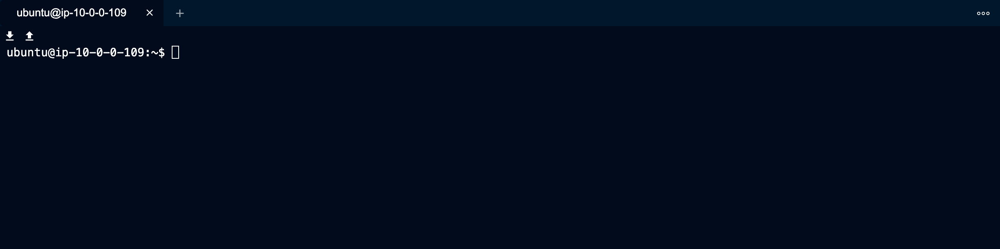
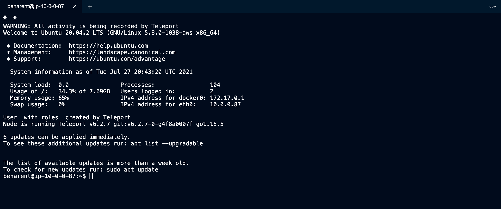

Teleport's node service can be configured to integrate with [PAM](https://en.wikipedia.org/wiki/Linux_PAM). 

Teleport currently supports the `auth`, `account`, and `session` PAM modules. The `auth`
stack is optional and not used by default. 

These are a few things leverage PAM for:

- Create a custom Message of the Day (MOTD)
- Create local (UNIX) users on login
- Add additional authentication steps using PAM

## Introduction to Pluggable Authentication Modules

Pluggable Authentication Modules (PAM) date back to 1995 when Sun Microsystems
implemented a generic authentication framework for Solaris. Since then most GNU/Linux
distributions have adopted PAM.

```code
$ man pam
```

The Pluggable Authentication Modules (PAM) library abstracts several common
authentication-related operations and provides a framework for dynamically loaded
modules that implement these operations in various ways.

**Terminology**

In PAM parlance, the application that uses PAM to authenticate a user is the server,
and is identified for configuration purposes by a service name, which is often (but
not necessarily) the program name.

The user requesting authentication is called the applicant, while the user (usually, root)
charged with verifying their identity and granting them the requested credentials is
called the arbitrator.

The sequence of operations the server goes through to authenticate a user and perform
whatever task they requested is a PAM transaction; the context within which the server
performs the requested task is called a session.

The functionality embodied by PAM is divided into six primitives grouped into four
facilities: authentication, account management, session management, and password
management.

Teleport currently supports account management and session management.

## Set up PAM on a Linux Machine running Teleport

(!docs/pages/includes/permission-warning.mdx!)

(!docs/pages/includes/backup-warning.mdx!)

To enable PAM on a given Linux machine, update `/etc/teleport.yaml` with:

```yaml
ssh_service:
  # Enabled SSH Service
  enabled: true
  # Enable PAM integration
  pam:
    # "no" by default
    enabled: true
    # use /etc/pam.d/sshd configuration (the default)
    service_name: "sshd"
    # use the "auth" modules in the PAM config
    # "false" by default
    # use_pam_auth: false
```

Please note that most Linux distributions come with several PAM services in
`/etc/pam.d` and Teleport will try to use `sshd` by default, which will be
removed if you uninstall the `openssh-server` package. We recommend creating your
own PAM service file like `/etc/pam.d/teleport` and specifying it as
`service_name` above.

## Set Message of the Day (motd) with Teleport

A cluster-wide Message of the Day can be set in the `auth_service` configuration.

```yaml
auth_service:
    message_of_the_day: "Welcome to the cluster. All activity will be logged."
```

This will be shown during the `tsh login` process, and must be positively acknowledged 
before the user is allowed to log into the cluster.

```code
$ tsh login --proxy teleport.example.com
# Welcome to the cluster. All activity will be logged. 
# Press [ENTER] to continue.
```

Alternatively, a per-node Message of the Day can be set using the traditional unix 
`/etc/motd` file. The `/etc/motd` file is normally displayed by login(1) after a user 
has logged in but before the shell is run. It is generally used for important system-wide
announcements.

This feature can help you inform users that activity on the node is being audited
and recorded.

## Custom environment variables

Teleport supports setting arbitrary environment variables for PAM modules as of version 6.1.
These variables can also be role-style SSO claims in the form `{{ external.email }}`
where `email` is a claim made by the configured SSO IdP.

To set custom environment variables, update `/etc/teleport.yaml` with:

```yaml
ssh_service:
  enabled: true
  pam:
    # disabled by default
    enabled: true
    # use /etc/pam.d/sshd configuration (the default)
    service_name: "sshd"
    # use the "auth" modules in the PAM config
    # "false" by default
    use_pam_auth: true
    # sets custom environment variables for PAM modules
    # no environment variables except the standard `TELEPORT_USERNAME`, `TELEPORT_LOGIN`, and `TELEPORT_ROLES`
    environment:
      FOO: "bar"
      EMAIL: "{{ external.email }}"
```

### Example node with PAM turned off

```yaml
teleport:
  nodename: graviton-node-1
  auth_token: hello
  auth_servers:
  - 10.2.1.230:5070
  data_dir: /var/lib/teleport
proxy_service:
  enabled: false
auth_service:
  enabled: false
ssh_service:
  enabled: true
  # configures PAM integration. see below for more details.
  pam:
     enabled: false
```

<Figure
  align="center"
  bordered
  caption="Teleport SSH without MOTD"
>
  
</Figure>

### Example node with PAM enabled

```yaml
teleport:
  nodename: graviton-node-1
  auth_token: hello
  auth_servers:
  - 10.2.1.230:5070
  data_dir: /var/lib/teleport
proxy_service:
  enabled: false
auth_service:
  enabled: false
ssh_service:
  enabled: true
  # configures PAM integration. see below for more details.
  pam:
     enabled: true
```

<Figure
  align="center"
  bordered
  caption="Teleport SSH with MOTD"
>
  
</Figure>

When PAM is enabled it will use the default `sshd` config file. This can differ per
distro.

```code
$ cat /etc/pam.d/sshd
```

The default `sshd` will call two `pam_motd` files, one dynamic MOTD that prints the machine
info, and a static MOTD that can be set by an admin.

```txt
session    optional     pam_motd.so  motd=/run/motd.dynamic
session    optional     pam_motd.so noupdate
```

By updating `/etc/motd` you can provide a message to users accessing nodes via Teleport. 

```code
$ cat /etc/motd
# WARNING: All activity on this node is being recorded by Teleport
```

<Figure
  align="center"
  bordered
  caption="Teleport SSH with updated MOTD"
>
  
</Figure>

## Create local (UNIX) users on login

Teleport has the ability to create local (UNIX) users on login. This is
very helpful if you're a large organization and want to provision local users and home
directories on the fly.

Teleport added the ability to read in PAM environment variables from PAM handle and pass
environment variables to PAM modules: `TELEPORT_USERNAME`, `TELEPORT_LOGIN`, and `TELEPORT_ROLES`.

Here are some details on the contents of these environment variables which will be set by Teleport:

- `TELEPORT_USERNAME`: The Teleport username of the user who is logging into the node. This is usually an email address (such as `user@example.com`) if using SAML/OIDC identities with Teleport Enterprise, or a more standard `exampleuser` if using local Teleport users.
- `TELEPORT_LOGIN`: The name of the Linux/UNIX principal which the Teleport user is logging into the Teleport node as - for example, `root`, `developer`, `ubuntu`, `ec2-user` or similar.
- `TELEPORT_ROLES`: A space-separated list of Teleport roles which the Teleport user has - for example: `developer tester admin`.

This PAM module creates the user and home directory before attempting to launch
a shell for said user.

### Examples

**Using pam_exec.so**

Using `pam_exec.so` is the easiest way to use the PAM stack to create a user if
the user does not already exist. `pam_exec.so` usually ships with the operating
system.

You can either add `pam_exec.so` to the existing PAM stack for your application or
write a new one for Teleport. In this example, we'll write a new one to simplify how
to use `pam_exec.so` with Teleport.

Start by creating a file `/etc/pam.d/teleport` with the following contents:

```txt
account   required   pam_exec.so /etc/pam-exec.d/teleport_acct
session   required   pam_motd.so
session   required   pam_permit.so
```

<Admonition type="note">
  Pay attention to the inclusion of `pam_motd.so` under the `session` facility. While `pam_motd.so` is not required for user creation, Teleport requires at least one module to be set under both the `account` and `session` facilities for it to work.
</Admonition>

Next, create the script that will be run by `pam_exec.so` like below. This
script will check if the user passed in `TELEPORT_LOGIN` exists and if it does
not, it will create it. Any error from `useradd` will be written to
`/tmp/pam.error`. Note the additional environment variables
`TELEPORT_USERNAME`, `TELEPORT_ROLES`, and `TELEPORT_LOGIN`.  These can be used
to write richer scripts that may change the system in other ways based on
identity information.

<Admonition type="note">
  The `useradd` location can have a different path than the example below depending on your linux flavor.  Adjust to your particular system as needed from `which useradd` (Ex: `/usr/sbin/useradd` instead of the below example).
</Admonition>

```bash
mkdir -p /etc/pam-exec.d
cat > /etc/pam-exec.d/teleport_acct <<EOF
#!/bin/sh
COMMENT="User \${TELEPORT_USERNAME} with roles \${TELEPORT_ROLES} created by Teleport."
id -u "\${TELEPORT_LOGIN}" &>/dev/null  || /sbin/useradd -m -c "\${COMMENT}" "\${TELEPORT_LOGIN}" 2> /tmp/pam.error
exit 0
EOF
chmod +x /etc/pam-exec.d/teleport_acct
```

Next, update `/etc/teleport.yaml` to call the above PAM stack by both enabling PAM and
setting the service_name.

```yaml
ssh_service:
  enabled: true
  pam:
    enabled: true
    service_name: "teleport"
```

Now attempting to log in as an existing user should result in the creation of the
user and a successful login.

The `/etc/pam-exec.d/teleport_acct` script can set the user's groups as an option to auto-populate
the user's permissions.  The user's roles are populated as space-delimited `TELEPORT_ROLES` variables. 
These could be used to map to a particular `sudo` group with additional scripting.

## Add additional authentication steps

By using the PAM `auth` modules, it is possible to add additional authentication
steps during user login. These can include passwords, 2nd factor, or even
biometrics.

Note that Teleport enables strong SSH authentication out of the box using
certificates. For most users, hardening [the initial Teleport
authentication](../../admin-guide.mdx#authentication) (e.g. `tsh login`) is preferred.

By default, `auth` modules are not used to avoid the default system behavior
(usually using local Unix passwords). You can enable them by setting
`use_pam_auth` in the `pam` section of your `teleport.yaml`.

```yaml
ssh_service:
  enabled: true
  pam:
    enabled: true
    # use /etc/pam.d/sshd configuration (the default)
    service_name: "sshd"
    # use the "auth" modules in the PAM config
    use_pam_auth: true
```
