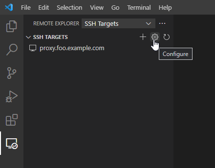

This guide explains how to use Teleport and Visual Studio Code's remote SSH extension.

## Prerequisites

- [tsh client tool](https://goteleport.com/teleport/download) >= (=teleport.version=).
- OpenSSH client.
- Visual Studio Code with the [Remote - SSH extension](https://code.visualstudio.com/docs/remote/ssh#_system-requirements)
for the Remote - SSH extension.
- The Teleport Auth Service and Proxy Service, deployed on your own infrastructure or managed via Teleport Cloud.
- One or more Teleport Nodes with Server Access enabled. If you have not yet done this, read the [Server Access Getting Started Guide](../getting-started.mdx) to learn how.

<Details 
scopeOnly={true}
scope={["oss", "enterprise"]}
opened={false}
title="Haven't deployed the Auth and Proxy Services?" >
Follow one of our [getting started](../getting-started.mdx) guides to learn how to deploy the Teleport Auth Service and Proxy Service in your environment.
</Details>

<Details 
scopeOnly={true}
scope={["cloud"]}
opened={false}
title="Not yet a Teleport customer?" >
Sign up for a [free trial](https://goteleport.com/signup/) of Teleport Cloud to get started.
</Details>

<Admonition type="note">
Linux and MacOS clients should rely on their operating system-provided OpenSSH
packages. Windows 10 clients should refer to Microsoft's [OpenSSH guide][win10];
older clients can use `ssh.exe` from either [Git for Windows][git] or
Microsoft's [Win32-OpenSSH project][win32-openssh].
</Admonition>


## Step 1/3. First-time setup

Configure your local SSH client to access Teleport Nodes, assigning the `--proxy` flag to the address of your Teleport Proxy Service (e.g., `mytenant.teleport.sh` for Teleport Cloud users).

```code
# log in to your proxy:
$ tsh login --proxy proxy.foo.example.com --user alice

# generate the OpenSSH config for the proxy:
$ tsh config --proxy proxy.foo.example.com
```


Append the resulting configuration snippet into your SSH config file located
in the path below:

<Tabs>
  <TabItem label="Linux/MacOS">
    `$HOME/.ssh/config`
  </TabItem>
  <TabItem label="Windows">
    `%UserProfile%\.ssh\config`

    <Admonition type="warning">
      If using PowerShell on Windows to write your SSH config, note that normal
      shell redirection may write the file with the incorrect encoding. To
      ensure it's written properly, try the following:

      ```code
      $ tsh.exe config | out-file .ssh\config -encoding utf8 -append
      ```
    </Admonition>
  </TabItem>
</Tabs>

You should be able to connect to the desired node using following command, replacing `user` with the username you would like to assume on the node.

```code
$ ssh user@[node name].[cluster name]
```

<Details scopeOnly={true} scope={["cloud"]} title="Teleport Cloud">
The SSH config you generated earlier instructs your SSH client to run `tsh proxy ssh` to access a Node in your Teleport cluster. However, running an `ssh` command against the Teleport Proxy Service at `yourtenant.teleport.sh` will result in an error.
</Details>

<Admonition type="note">
Teleport's certificates expire fairly quickly, after which SSH
attempts will fail with an error like the following:

```txt
alice@proxy.foo.example.com: Permission denied (publickey).
ERROR: exit status 255

kex_exchange_identification: Connection closed by remote host
```

When you see this error, re-run `tsh login` to refresh your local certificate.
</Admonition>

## Step 2/3. Configure Visual Studio Code

<Admonition
  type="warning"
  title="Warning"
>
  Due to [a VS Code bug](https://github.com/microsoft/vscode-remote-release/issues/5562),
  you can not use Remote - SSH UI to add SSH hosts. It will improperly rewrite the quoting in
  `tsh config`'s generated configuration.
  If your SSH configuration becomes corrupted, re-run `tsh config`.
</Admonition>

Install the [Remote - SSH extension][remote-ssh] in your local VS Code
instance. A new "Remote Explorer" sidebar entry should appear.

Select it, ensure "SSH Targets" is selected in the drop-down menu, and select the "Configure"
gear icon:

<Figure align="left" bordered caption="VS Code sidebar">
  
</Figure>

VS code will prompt you for your SSH config file.

Select the one we generated during Step 1 and open it in the editor.

<Admonition type="warning">
Do not use VS Code's SSH config helper. If prompted for an SSH command,
close the dialog and select the "Configure" icon instead.
</Admonition>

For each host you wish to remotely develop on, add an entry like the following:

```txt
Host node000.foo.example.com
    User alice
```

When finished, save the file. If the added host doesn't automatically appear in
the list, select the Refresh button.

## Step 3/3. Start a Remote Development session

Start a Remote Development session by right-clicking on any host added above and selecting either "Connect to..." option:

<Figure align="left" bordered caption="Connect to a Node">

</Figure>

On first connect, you'll be prompted to configure the remote OS. Select the
proper platform and VS Code will install its server-side component. When it
completes, you should be left with a working editor:

<Figure align="left" bordered caption="Connected VS Code">

</Figure>

The status indicator in the bottom left highlights the currently connected remote host.

## Next Steps

### Connecting to OpenSSH Hosts

It's possible to remotely develop on any OpenSSH host joined to a Teleport
cluster so long as its host OS is supported by VS Code. Refer to the
[OpenSSH guide](./openssh.mdx) to configure the remote host to authenticate via
Teleport certificates, after which the procedure outlined above can be used to
connect to the host in VS Code.

### Using OpenSSH clients

This guide makes use of `tsh config`, added in Teleport 7.0; refer to the
[dedicated guide](./openssh.mdx#automatic-setup) for additional information.

[Manually configure an OpenSSH client](./openssh.mdx#manual-setup)
to use the VS Code's remote SSH extension with older Teleport clients.

## Further reading
- [VS Code Remote Development](https://code.visualstudio.com/docs/remote/remote-overview)

[remote-ssh]: https://marketplace.visualstudio.com/items?itemName=ms-vscode-remote.remote-ssh
[win10]: https://docs.microsoft.com/en-us/windows-server/administration/openssh/openssh_install_firstuse
[git]: https://git-scm.com/downloads
[remote-ssh-docs]: https://code.visualstudio.com/docs/remote/ssh
[win32-openssh]: https://github.com/powershell/Win32-OpenSSH